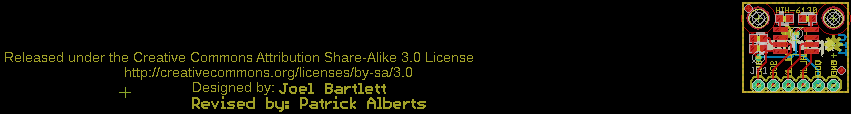
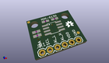
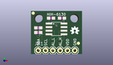
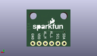
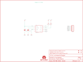

Contents
========

* [PRS11295 > HIH6130 Breakout](#prs11295--hih6130-breakout)
	* [Schematic](#schematic)
	* [PCB](#pcb)
	* [Interactive BOM](#interactive-bom)
	* [OOMP Parts](#oomp-parts)
	* [Images](#images)
	* [Tags](#tags)
  
![][im]
# PRS11295 > HIH6130 Breakout

- ID: PROJ-SPAR-11295-STAN-01
- Hex ID: PRS11295
- Name: Sparkfun
- Description: Sparkfun
- Long Link: [http://oom.lt/PROJ-SPAR-11295-STAN-01](http://oom.lt/PROJ-SPAR-11295-STAN-01)
- Short Link: [http://oom.lt/PRS11295](http://oom.lt/PRS11295)

## Schematic
  

## PCB
  

## Interactive BOM

- Interactive BOM page: [ibom.html](https://htmlpreview.github.io/?https://github.com/oomlout/oomlout_OOMP_projects/blob/main/PROJ-SPAR-11295-STAN-01/kicad/bom/ibom.html)

## OOMP Parts
  

|OOMP Parts|
| :---: |
|C1 C1,CAPC-0603-X-UF1D-01|
|C2 C2,CAPC-0603-X-NF220-01|
|[JP1 HEAD-I01-X-PI06-01 2.54 mm 6 Pin Header](https://github.com/oomlout/oomlout_OOMP_parts/tree/main/HEAD-I01-X-PI06-01/)|
|[R1 RESE-0603-X-O222-01 SMD (0603) 2.2k Ohm Resistor](https://github.com/oomlout/oomlout_OOMP_parts/tree/main/RESE-0603-X-O222-01/)|
|[R2 RESE-0603-X-O222-01 SMD (0603) 2.2k Ohm Resistor](https://github.com/oomlout/oomlout_OOMP_parts/tree/main/RESE-0603-X-O222-01/)|
|U1 U1,UNMATCHED-UNMATCHED-X-UNMATCHED-01|

## Images
  
  

|kicadPcb3d|kicadPcb3dFront|kicadPcb3dBack|eagleImage|eagleSchemImage|
| :---: | :---: | :---: | :---: | :---: |
||||||

## Tags

- hexID: PRS11295
- oompType: PROJ
- oompSize: SPAR
- oompColor: 11295
- oompDesc: STAN
- oompIndex: 01
- oompName: HIH6130 Breakout
- sources: All source files from https://github.com/sparkfun/HIH6130_Breakout (source licence details in srcLicense.md)
- linkBuyPage: https://www.sparkfun.com/products/11295
- oompID: PROJ-SPAR-11295-STAN-01
- oompParts: C1,CAPC-0603-X-UF1D-01
- oompParts: C2,CAPC-0603-X-NF220-01
- oompParts: JP1,HEAD-I01-X-PI06-01
- oompParts: R1,RESE-0603-X-O222-01
- oompParts: R2,RESE-0603-X-O222-01
- oompParts: U1,UNMATCHED-UNMATCHED-X-UNMATCHED-01
- rawParts: C1,0.1uF,0.1UF-25V(+80/-20%)(0603),0603-CAP,CAP-00810,CAP-00810,0.1uF,
- rawParts: C2,0.22uF,0.22UF-25V-10%(0603),0603-CAP,CAP-07822,CAP-07822,0.22uF,
- rawParts: FID1,FIDUCIAL1X2,FIDUCIAL1X2,FIDUCIAL-1X2,Fiducial Alignment Points,,,
- rawParts: FID2,FIDUCIAL1X2,FIDUCIAL1X2,FIDUCIAL-1X2,Fiducial Alignment Points,,,
- rawParts: FRAME1,FRAME-LETTER,FRAME-LETTER,CREATIVE_COMMONS,Schematic Frame,,,
- rawParts: JP1,,M06SIP,1X06,Header 6,,,
- rawParts: JP3,STAND-OFFTIGHT,STAND-OFFTIGHT,STAND-OFF-TIGHT,Stand Off,,,
- rawParts: JP4,STAND-OFFTIGHT,STAND-OFFTIGHT,STAND-OFF-TIGHT,Stand Off,,,
- rawParts: R1,2.2k,2.2KOHM1/10W1%(0603),0603-RES,RES-08272,RES-08272,2.2k,
- rawParts: R2,2.2k,2.2KOHM1/10W1%(0603),0603-RES,RES-08272,RES-08272,2.2k,
- rawParts: U$2,OSHW-LOGOS,OSHW-LOGOS,OSHW-LOGO-S,Open Source Hardware Logo This logo indicates the piece of hardware it is found on incorporates a OSHW license and/or adheres to the definition of open source hardware found here: http://freedomdefined.org/OSHW,,,
- rawParts: U1,HIH6131,HIH6131,SOIC8,,,,

[im]: kicadPcb3d_450.png
