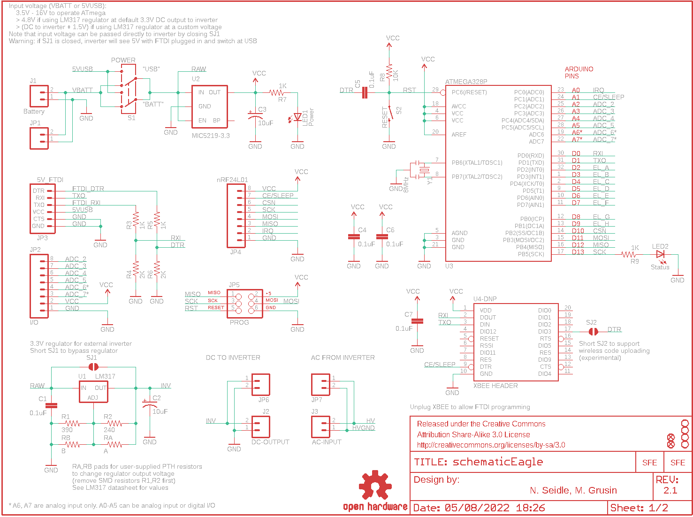

Contents
========

* [PRS11323 > EL Sequencer](#prs11323--el-sequencer)
	* [Schematic](#schematic)
	* [PCB](#pcb)
	* [Interactive BOM](#interactive-bom)
	* [OOMP Parts](#oomp-parts)
	* [Images](#images)
	* [Tags](#tags)
  
![][im]
# PRS11323 > EL Sequencer

- ID: PROJ-SPAR-11323-STAN-01
- Hex ID: PRS11323
- Name: Sparkfun
- Description: Sparkfun
- Long Link: [http://oom.lt/PROJ-SPAR-11323-STAN-01](http://oom.lt/PROJ-SPAR-11323-STAN-01)
- Short Link: [http://oom.lt/PRS11323](http://oom.lt/PRS11323)

## Schematic
  

## PCB
  

## Interactive BOM

- Interactive BOM page: [ibom.html](https://htmlpreview.github.io/?https://github.com/oomlout/oomlout_OOMP_projects/blob/main/PROJ-SPAR-11323-STAN-01/kicad/bom/ibom.html)

## OOMP Parts
  

|OOMP Parts|
| :---: |
|C1 C1,CAPC-0402-X-UF1D-01|
|C2 C2,CAPX-UNMATCHED-X-UF10-01|
|C3 C3,CAPX-UNMATCHED-X-UF10-01|
|C4 C4,CAPC-0402-X-UF1D-01|
|C5 C5,CAPC-0402-X-UF1D-01|
|C6 C6,CAPC-0402-X-UF1D-01|
|C7 C7,CAPC-0402-X-UF1D-01|
|J1 J1,UNMATCHED-UNMATCHED-X-UNMATCHED-01|
|J2 J2,UNMATCHED-UNMATCHED-X-UNMATCHED-01|
|J3 J3,UNMATCHED-UNMATCHED-X-UNMATCHED-01|
|J4 J4,UNMATCHED-UNMATCHED-X-UNMATCHED-01|
|J5 J5,UNMATCHED-UNMATCHED-X-UNMATCHED-01|
|J6 J6,UNMATCHED-UNMATCHED-X-UNMATCHED-01|
|J7 J7,UNMATCHED-UNMATCHED-X-UNMATCHED-01|
|J8 J8,UNMATCHED-UNMATCHED-X-UNMATCHED-01|
|J9 J9,UNMATCHED-UNMATCHED-X-UNMATCHED-01|
|J10 J10,UNMATCHED-UNMATCHED-X-UNMATCHED-01|
|J11 J11,UNMATCHED-UNMATCHED-X-UNMATCHED-01|
|[JP1 HEAD-I01-X-PI02-01 2.54 mm 2 Pin Header](https://github.com/oomlout/oomlout_OOMP_parts/tree/main/HEAD-I01-X-PI02-01/)|
|[JP2 HEAD-I01-X-PI08-01 2.54 mm 8 Pin Header](https://github.com/oomlout/oomlout_OOMP_parts/tree/main/HEAD-I01-X-PI08-01/)|
|[JP3 HEAD-I01-X-PI06-01 2.54 mm 6 Pin Header](https://github.com/oomlout/oomlout_OOMP_parts/tree/main/HEAD-I01-X-PI06-01/)|
|[JP4 HEAD-I01-X-PI08-01 2.54 mm 8 Pin Header](https://github.com/oomlout/oomlout_OOMP_parts/tree/main/HEAD-I01-X-PI08-01/)|
|JP5 JP5,UNMATCHED-UNMATCHED-X-UNMATCHED-01|
|[JP6 HEAD-I01-X-PI02-01 2.54 mm 2 Pin Header](https://github.com/oomlout/oomlout_OOMP_parts/tree/main/HEAD-I01-X-PI02-01/)|
|[JP7 HEAD-I01-X-PI02-01 2.54 mm 2 Pin Header](https://github.com/oomlout/oomlout_OOMP_parts/tree/main/HEAD-I01-X-PI02-01/)|
|[JP9 HEAD-I01-X-PI02-01 2.54 mm 2 Pin Header](https://github.com/oomlout/oomlout_OOMP_parts/tree/main/HEAD-I01-X-PI02-01/)|
|[JP10 HEAD-I01-X-PI02-01 2.54 mm 2 Pin Header](https://github.com/oomlout/oomlout_OOMP_parts/tree/main/HEAD-I01-X-PI02-01/)|
|[JP11 HEAD-I01-X-PI02-01 2.54 mm 2 Pin Header](https://github.com/oomlout/oomlout_OOMP_parts/tree/main/HEAD-I01-X-PI02-01/)|
|[JP12 HEAD-I01-X-PI02-01 2.54 mm 2 Pin Header](https://github.com/oomlout/oomlout_OOMP_parts/tree/main/HEAD-I01-X-PI02-01/)|
|[JP13 HEAD-I01-X-PI02-01 2.54 mm 2 Pin Header](https://github.com/oomlout/oomlout_OOMP_parts/tree/main/HEAD-I01-X-PI02-01/)|
|[JP14 HEAD-I01-X-PI02-01 2.54 mm 2 Pin Header](https://github.com/oomlout/oomlout_OOMP_parts/tree/main/HEAD-I01-X-PI02-01/)|
|[JP15 HEAD-I01-X-PI02-01 2.54 mm 2 Pin Header](https://github.com/oomlout/oomlout_OOMP_parts/tree/main/HEAD-I01-X-PI02-01/)|
|[JP16 HEAD-I01-X-PI02-01 2.54 mm 2 Pin Header](https://github.com/oomlout/oomlout_OOMP_parts/tree/main/HEAD-I01-X-PI02-01/)|
|[LED1 LEDS-0603-G-STAN-01 SMD (0603) Green LED](https://github.com/oomlout/oomlout_OOMP_parts/tree/main/LEDS-0603-G-STAN-01/)|
|[LED2 LEDS-0603-G-STAN-01 SMD (0603) Green LED](https://github.com/oomlout/oomlout_OOMP_parts/tree/main/LEDS-0603-G-STAN-01/)|
|[R1 RESE-0603-X-O391-01 SMD (0603) 390 Ohm Resistor](https://github.com/oomlout/oomlout_OOMP_parts/tree/main/RESE-0603-X-O391-01/)|
|[R2 RESE-0603-X-O241-01 SMD (0603) 240 Ohm Resistor](https://github.com/oomlout/oomlout_OOMP_parts/tree/main/RESE-0603-X-O241-01/)|
|[R3 RESE-0402-X-O102-01 SMD (0402) 1k Ohm Resistor](https://github.com/oomlout/oomlout_OOMP_parts/tree/main/RESE-0402-X-O102-01/)|
|R4 R4,RESE-0402-X-O202-01|
|[R5 RESE-0402-X-O102-01 SMD (0402) 1k Ohm Resistor](https://github.com/oomlout/oomlout_OOMP_parts/tree/main/RESE-0402-X-O102-01/)|
|R6 R6,RESE-0402-X-O202-01|
|[R7 RESE-0402-X-O102-01 SMD (0402) 1k Ohm Resistor](https://github.com/oomlout/oomlout_OOMP_parts/tree/main/RESE-0402-X-O102-01/)|
|[R8 RESE-0402-X-O103-01 SMD (0402) 10k Ohm Resistor](https://github.com/oomlout/oomlout_OOMP_parts/tree/main/RESE-0402-X-O103-01/)|
|[R9 RESE-0402-X-O102-01 SMD (0402) 1k Ohm Resistor](https://github.com/oomlout/oomlout_OOMP_parts/tree/main/RESE-0402-X-O102-01/)|
|R10 R10,RESE-0402-X-O391-01|
|R11 R11,RESE-0402-X-O391-01|
|R12 R12,RESE-0402-X-O391-01|
|R13 R13,RESE-0402-X-O391-01|
|[R14 RESE-0603-X-O331-01 SMD (0603) 330 Ohm Resistor](https://github.com/oomlout/oomlout_OOMP_parts/tree/main/RESE-0603-X-O331-01/)|
|[R15 RESE-0603-X-O331-01 SMD (0603) 330 Ohm Resistor](https://github.com/oomlout/oomlout_OOMP_parts/tree/main/RESE-0603-X-O331-01/)|
|[R16 RESE-0603-X-O331-01 SMD (0603) 330 Ohm Resistor](https://github.com/oomlout/oomlout_OOMP_parts/tree/main/RESE-0603-X-O331-01/)|
|[R17 RESE-0603-X-O331-01 SMD (0603) 330 Ohm Resistor](https://github.com/oomlout/oomlout_OOMP_parts/tree/main/RESE-0603-X-O331-01/)|
|[R18 RESE-0603-X-O331-01 SMD (0603) 330 Ohm Resistor](https://github.com/oomlout/oomlout_OOMP_parts/tree/main/RESE-0603-X-O331-01/)|
|[R19 RESE-0603-X-O331-01 SMD (0603) 330 Ohm Resistor](https://github.com/oomlout/oomlout_OOMP_parts/tree/main/RESE-0603-X-O331-01/)|
|[R20 RESE-0603-X-O331-01 SMD (0603) 330 Ohm Resistor](https://github.com/oomlout/oomlout_OOMP_parts/tree/main/RESE-0603-X-O331-01/)|
|[R21 RESE-0603-X-O331-01 SMD (0603) 330 Ohm Resistor](https://github.com/oomlout/oomlout_OOMP_parts/tree/main/RESE-0603-X-O331-01/)|
|R22 R22,RESE-0402-X-O391-01|
|R23 R23,RESE-0402-X-O391-01|
|R24 R24,RESE-0402-X-O391-01|
|R25 R25,RESE-0402-X-O391-01|
|[R26 RESE-0603-X-O331-01 SMD (0603) 330 Ohm Resistor](https://github.com/oomlout/oomlout_OOMP_parts/tree/main/RESE-0603-X-O331-01/)|
|[R27 RESE-0603-X-O331-01 SMD (0603) 330 Ohm Resistor](https://github.com/oomlout/oomlout_OOMP_parts/tree/main/RESE-0603-X-O331-01/)|
|[R28 RESE-0603-X-O331-01 SMD (0603) 330 Ohm Resistor](https://github.com/oomlout/oomlout_OOMP_parts/tree/main/RESE-0603-X-O331-01/)|
|[R29 RESE-0603-X-O331-01 SMD (0603) 330 Ohm Resistor](https://github.com/oomlout/oomlout_OOMP_parts/tree/main/RESE-0603-X-O331-01/)|
|[R30 RESE-0603-X-O331-01 SMD (0603) 330 Ohm Resistor](https://github.com/oomlout/oomlout_OOMP_parts/tree/main/RESE-0603-X-O331-01/)|
|[R31 RESE-0603-X-O331-01 SMD (0603) 330 Ohm Resistor](https://github.com/oomlout/oomlout_OOMP_parts/tree/main/RESE-0603-X-O331-01/)|
|[R32 RESE-0603-X-O331-01 SMD (0603) 330 Ohm Resistor](https://github.com/oomlout/oomlout_OOMP_parts/tree/main/RESE-0603-X-O331-01/)|
|[R33 RESE-0603-X-O331-01 SMD (0603) 330 Ohm Resistor](https://github.com/oomlout/oomlout_OOMP_parts/tree/main/RESE-0603-X-O331-01/)|
|RA RA,UNMATCHED-UNMATCHED-X-UNMATCHED-01|
|RB RB,UNMATCHED-UNMATCHED-X-UNMATCHED-01|
|S1 S1,UNMATCHED-UNMATCHED-X-UNMATCHED-01|
|S2 S2,UNMATCHED-UNMATCHED-X-UNMATCHED-01|
|U1 U1,UNMATCHED-UNMATCHED-X-UNMATCHED-01|
|U2 U2,UNMATCHED-SO235-X-UNMATCHED-01|
|U3 U3,UNMATCHED-UNMATCHED-X-UNMATCHED-01|
|U4-DNP U4-DNP,UNMATCHED-UNMATCHED-X-UNMATCHED-01|
|U5 U5,UNMATCHED-UNMATCHED-X-UNMATCHED-01|
|U6 U6,UNMATCHED-UNMATCHED-X-UNMATCHED-01|
|U7 U7,UNMATCHED-UNMATCHED-X-UNMATCHED-01|
|U8 U8,UNMATCHED-UNMATCHED-X-UNMATCHED-01|
|U9 U9,UNMATCHED-UNMATCHED-X-UNMATCHED-01|
|U10 U10,UNMATCHED-UNMATCHED-X-UNMATCHED-01|
|U11 U11,UNMATCHED-UNMATCHED-X-UNMATCHED-01|
|U12 U12,UNMATCHED-UNMATCHED-X-UNMATCHED-01|
|U13 U13,UNMATCHED-UNMATCHED-X-UNMATCHED-01|
|U14 U14,UNMATCHED-UNMATCHED-X-UNMATCHED-01|
|U15 U15,UNMATCHED-UNMATCHED-X-UNMATCHED-01|
|U16 U16,UNMATCHED-UNMATCHED-X-UNMATCHED-01|
|U17 U17,UNMATCHED-UNMATCHED-X-UNMATCHED-01|
|U18 U18,UNMATCHED-UNMATCHED-X-UNMATCHED-01|
|U19 U19,UNMATCHED-UNMATCHED-X-UNMATCHED-01|
|U20 U20,UNMATCHED-UNMATCHED-X-UNMATCHED-01|
|Y1 Y1,UNMATCHED-UNMATCHED-X-UNMATCHED-01|

## Images
  
  

|kicadPcb3d|kicadPcb3dFront|kicadPcb3dBack|eagleImage|eagleSchemImage|
| :---: | :---: | :---: | :---: | :---: |
||||||

## Tags

- hexID: PRS11323
- oompType: PROJ
- oompSize: SPAR
- oompColor: 11323
- oompDesc: STAN
- oompIndex: 01
- oompName: EL Sequencer
- sources: All source files from https://github.com/sparkfun/EL_Sequencer (source licence details in srcLicense.md)
- linkBuyPage: https://www.sparkfun.com/products/11323
- oompID: PROJ-SPAR-11323-STAN-01
- oompParts: C1,CAPC-0402-X-UF1D-01
- oompParts: C2,CAPX-UNMATCHED-X-UF10-01
- oompParts: C3,CAPX-UNMATCHED-X-UF10-01
- oompParts: C4,CAPC-0402-X-UF1D-01
- oompParts: C5,CAPC-0402-X-UF1D-01
- oompParts: C6,CAPC-0402-X-UF1D-01
- oompParts: C7,CAPC-0402-X-UF1D-01
- oompParts: J1,UNMATCHED-UNMATCHED-X-UNMATCHED-01
- oompParts: J2,UNMATCHED-UNMATCHED-X-UNMATCHED-01
- oompParts: J3,UNMATCHED-UNMATCHED-X-UNMATCHED-01
- oompParts: J4,UNMATCHED-UNMATCHED-X-UNMATCHED-01
- oompParts: J5,UNMATCHED-UNMATCHED-X-UNMATCHED-01
- oompParts: J6,UNMATCHED-UNMATCHED-X-UNMATCHED-01
- oompParts: J7,UNMATCHED-UNMATCHED-X-UNMATCHED-01
- oompParts: J8,UNMATCHED-UNMATCHED-X-UNMATCHED-01
- oompParts: J9,UNMATCHED-UNMATCHED-X-UNMATCHED-01
- oompParts: J10,UNMATCHED-UNMATCHED-X-UNMATCHED-01
- oompParts: J11,UNMATCHED-UNMATCHED-X-UNMATCHED-01
- oompParts: JP1,HEAD-I01-X-PI02-01
- oompParts: JP2,HEAD-I01-X-PI08-01
- oompParts: JP3,HEAD-I01-X-PI06-01
- oompParts: JP4,HEAD-I01-X-PI08-01
- oompParts: JP5,UNMATCHED-UNMATCHED-X-UNMATCHED-01
- oompParts: JP6,HEAD-I01-X-PI02-01
- oompParts: JP7,HEAD-I01-X-PI02-01
- oompParts: JP9,HEAD-I01-X-PI02-01
- oompParts: JP10,HEAD-I01-X-PI02-01
- oompParts: JP11,HEAD-I01-X-PI02-01
- oompParts: JP12,HEAD-I01-X-PI02-01
- oompParts: JP13,HEAD-I01-X-PI02-01
- oompParts: JP14,HEAD-I01-X-PI02-01
- oompParts: JP15,HEAD-I01-X-PI02-01
- oompParts: JP16,HEAD-I01-X-PI02-01
- oompParts: LED1,LEDS-0603-G-STAN-01
- oompParts: LED2,LEDS-0603-G-STAN-01
- oompParts: R1,RESE-0603-X-O391-01
- oompParts: R2,RESE-0603-X-O241-01
- oompParts: R3,RESE-0402-X-O102-01
- oompParts: R4,RESE-0402-X-O202-01
- oompParts: R5,RESE-0402-X-O102-01
- oompParts: R6,RESE-0402-X-O202-01
- oompParts: R7,RESE-0402-X-O102-01
- oompParts: R8,RESE-0402-X-O103-01
- oompParts: R9,RESE-0402-X-O102-01
- oompParts: R10,RESE-0402-X-O391-01
- oompParts: R11,RESE-0402-X-O391-01
- oompParts: R12,RESE-0402-X-O391-01
- oompParts: R13,RESE-0402-X-O391-01
- oompParts: R14,RESE-0603-X-O331-01
- oompParts: R15,RESE-0603-X-O331-01
- oompParts: R16,RESE-0603-X-O331-01
- oompParts: R17,RESE-0603-X-O331-01
- oompParts: R18,RESE-0603-X-O331-01
- oompParts: R19,RESE-0603-X-O331-01
- oompParts: R20,RESE-0603-X-O331-01
- oompParts: R21,RESE-0603-X-O331-01
- oompParts: R22,RESE-0402-X-O391-01
- oompParts: R23,RESE-0402-X-O391-01
- oompParts: R24,RESE-0402-X-O391-01
- oompParts: R25,RESE-0402-X-O391-01
- oompParts: R26,RESE-0603-X-O331-01
- oompParts: R27,RESE-0603-X-O331-01
- oompParts: R28,RESE-0603-X-O331-01
- oompParts: R29,RESE-0603-X-O331-01
- oompParts: R30,RESE-0603-X-O331-01
- oompParts: R31,RESE-0603-X-O331-01
- oompParts: R32,RESE-0603-X-O331-01
- oompParts: R33,RESE-0603-X-O331-01
- oompParts: RA,UNMATCHED-UNMATCHED-X-UNMATCHED-01
- oompParts: RB,UNMATCHED-UNMATCHED-X-UNMATCHED-01
- oompParts: S1,UNMATCHED-UNMATCHED-X-UNMATCHED-01
- oompParts: S2,UNMATCHED-UNMATCHED-X-UNMATCHED-01
- oompParts: U1,UNMATCHED-UNMATCHED-X-UNMATCHED-01
- oompParts: U2,UNMATCHED-SO235-X-UNMATCHED-01
- oompParts: U3,UNMATCHED-UNMATCHED-X-UNMATCHED-01
- oompParts: U4-DNP,UNMATCHED-UNMATCHED-X-UNMATCHED-01
- oompParts: U5,UNMATCHED-UNMATCHED-X-UNMATCHED-01
- oompParts: U6,UNMATCHED-UNMATCHED-X-UNMATCHED-01
- oompParts: U7,UNMATCHED-UNMATCHED-X-UNMATCHED-01
- oompParts: U8,UNMATCHED-UNMATCHED-X-UNMATCHED-01
- oompParts: U9,UNMATCHED-UNMATCHED-X-UNMATCHED-01
- oompParts: U10,UNMATCHED-UNMATCHED-X-UNMATCHED-01
- oompParts: U11,UNMATCHED-UNMATCHED-X-UNMATCHED-01
- oompParts: U12,UNMATCHED-UNMATCHED-X-UNMATCHED-01
- oompParts: U13,UNMATCHED-UNMATCHED-X-UNMATCHED-01
- oompParts: U14,UNMATCHED-UNMATCHED-X-UNMATCHED-01
- oompParts: U15,UNMATCHED-UNMATCHED-X-UNMATCHED-01
- oompParts: U16,UNMATCHED-UNMATCHED-X-UNMATCHED-01
- oompParts: U17,UNMATCHED-UNMATCHED-X-UNMATCHED-01
- oompParts: U18,UNMATCHED-UNMATCHED-X-UNMATCHED-01
- oompParts: U19,UNMATCHED-UNMATCHED-X-UNMATCHED-01
- oompParts: U20,UNMATCHED-UNMATCHED-X-UNMATCHED-01
- oompParts: Y1,UNMATCHED-UNMATCHED-X-UNMATCHED-01
- rawParts: C1,0.1uF,CAP0402-CAP,0402-CAP,Capacitor,,
- rawParts: C2,10uF,CAP_POL1206,EIA3216,Capacitor Polarized,,
- rawParts: C3,10uF,CAP_POL1206,EIA3216,Capacitor Polarized,,
- rawParts: C4,0.1uF,CAP0402-CAP,0402-CAP,Capacitor,,
- rawParts: C5,0.1uF,CAP0402-CAP,0402-CAP,Capacitor,,
- rawParts: C6,0.1uF,CAP0402-CAP,0402-CAP,Capacitor,,
- rawParts: C7,0.1uF,CAP0402-CAP,0402-CAP,Capacitor,,
- rawParts: FRAME1,FRAME-LETTER,FRAME-LETTER,CREATIVE_COMMONS,Schematic Frame,,
- rawParts: FRAME2,FRAME-LETTER,FRAME-LETTER,CREATIVE_COMMONS,Schematic Frame,,
- rawParts: J1,Battery,M02-JST-2MM-SMT,JST-2-SMD,Header 2,,
- rawParts: J2,DC-OUTPUT,M02-JST-2MM-SMT,JST-2-SMD,Header 2,,
- rawParts: J3,AC-INPUT,M02-JST-2MM-SMT,JST-2-SMD,Header 2,,
- rawParts: J4,,M02-JST-2MM-SMT,JST-2-SMD,Header 2,,
- rawParts: J5,,M02-JST-2MM-SMT,JST-2-SMD,Header 2,,
- rawParts: J6,,M02-JST-2MM-SMT,JST-2-SMD,Header 2,,
- rawParts: J7,,M02-JST-2MM-SMT,JST-2-SMD,Header 2,,
- rawParts: J8,,M02-JST-2MM-SMT,JST-2-SMD,Header 2,,
- rawParts: J9,,M02-JST-2MM-SMT,JST-2-SMD,Header 2,,
- rawParts: J10,,M02-JST-2MM-SMT,JST-2-SMD,Header 2,,
- rawParts: J11,,M02-JST-2MM-SMT,JST-2-SMD,Header 2,,
- rawParts: JP1,,M02PTH,1X02,Header 2,,
- rawParts: JP2,I/O,M08_ROUND,1X08_ROUND,Header 8,,
- rawParts: JP3,5V_FTDI,ARDUINO_SERIAL_PROGRAMPTH,1X06,,,
- rawParts: JP4,nRF24L01,M081X08,1X08,Header 8,,
- rawParts: JP5,PROG,AVR_SPI_PRG_6PTH,2X3,AVR ISP 6 Pin,,
- rawParts: JP6,,M02PTH,1X02,Header 2,,
- rawParts: JP7,,M02PTH,1X02,Header 2,,
- rawParts: JP8,LOGO-SFESK,LOGO-SFESK,SFE-LOGO-FLAME,Spark Fun Electronics PCB Logo,,
- rawParts: JP9,,M02PTH,1X02,Header 2,,
- rawParts: JP10,,M02PTH,1X02,Header 2,,
- rawParts: JP11,,M02PTH,1X02,Header 2,,
- rawParts: JP12,,M02PTH,1X02,Header 2,,
- rawParts: JP13,,M02PTH,1X02,Header 2,,
- rawParts: JP14,,M02PTH,1X02,Header 2,,
- rawParts: JP15,,M02PTH,1X02,Header 2,,
- rawParts: JP16,,M02PTH,1X02,Header 2,,
- rawParts: LED1,Power,LED0603,LED-0603,LEDs,,
- rawParts: LED2,Status,LED0603,LED-0603,LEDs,,
- rawParts: R1,390,RESISTOR0603-RES,0603-RES,Resistor,,
- rawParts: R2,240,RESISTOR0603-RES,0603-RES,Resistor,,
- rawParts: R3,1K,RESISTOR0402-RES,0402-RES,Resistor,,
- rawParts: R4,2K,RESISTOR0402-RES,0402-RES,Resistor,,
- rawParts: R5,1K,RESISTOR0402-RES,0402-RES,Resistor,,
- rawParts: R6,2K,RESISTOR0402-RES,0402-RES,Resistor,,
- rawParts: R7,1K,RESISTOR0402-RES,0402-RES,Resistor,,
- rawParts: R8,10K,RESISTOR0402-RES,0402-RES,Resistor,,
- rawParts: R9,1K,RESISTOR0402-RES,0402-RES,Resistor,,
- rawParts: R10,390,RESISTOR0402-RES,0402-RES,Resistor,,
- rawParts: R11,390,RESISTOR0402-RES,0402-RES,Resistor,,
- rawParts: R12,390,RESISTOR0402-RES,0402-RES,Resistor,,
- rawParts: R13,390,RESISTOR0402-RES,0402-RES,Resistor,,
- rawParts: R14,330,RESISTOR0603-RES,0603-RES,Resistor,,
- rawParts: R15,330,RESISTOR0603-RES,0603-RES,Resistor,,
- rawParts: R16,330,RESISTOR0603-RES,0603-RES,Resistor,,
- rawParts: R17,330,RESISTOR0603-RES,0603-RES,Resistor,,
- rawParts: R18,330,RESISTOR0603-RES,0603-RES,Resistor,,
- rawParts: R19,330,RESISTOR0603-RES,0603-RES,Resistor,,
- rawParts: R20,330,RESISTOR0603-RES,0603-RES,Resistor,,
- rawParts: R21,330,RESISTOR0603-RES,0603-RES,Resistor,,
- rawParts: R22,390,RESISTOR0402-RES,0402-RES,Resistor,,
- rawParts: R23,390,RESISTOR0402-RES,0402-RES,Resistor,,
- rawParts: R24,390,RESISTOR0402-RES,0402-RES,Resistor,,
- rawParts: R25,390,RESISTOR0402-RES,0402-RES,Resistor,,
- rawParts: R26,330,RESISTOR0603-RES,0603-RES,Resistor,,
- rawParts: R27,330,RESISTOR0603-RES,0603-RES,Resistor,,
- rawParts: R28,330,RESISTOR0603-RES,0603-RES,Resistor,,
- rawParts: R29,330,RESISTOR0603-RES,0603-RES,Resistor,,
- rawParts: R30,330,RESISTOR0603-RES,0603-RES,Resistor,,
- rawParts: R31,330,RESISTOR0603-RES,0603-RES,Resistor,,
- rawParts: R32,330,RESISTOR0603-RES,0603-RES,Resistor,,
- rawParts: R33,330,RESISTOR0603-RES,0603-RES,Resistor,,
- rawParts: RA,A,RESISTORPTH-1/4W,AXIAL-0.4,Resistor,,
- rawParts: RB,B,RESISTORPTH-1/4W,AXIAL-0.4,Resistor,,
- rawParts: S1,POWER,SWITCH-DPDTSMD,AYZ0202,DPDT Version of the COM-00597,,
- rawParts: S2,RESET,SWITCH-MOMENTARY-2SMD,TACTILE_SWITCH_SMD,,,
- rawParts: SJ1,,SOLDERJUMPERROUND,SJ_ROUND,Solder Jumper,,
- rawParts: SJ2,,SOLDERJUMPERNO,SJ_2S-NO,Solder Jumper,,
- rawParts: U$1,OSHW-LOGOS,OSHW-LOGOS,OSHW-LOGO-S,Open Source Hardware Logo This logo indicates the piece of hardware it is found on incorporates a OSHW license and/or adheres to the definition of open source hardware found here: http://freedomdefined.org/OSHW,,
- rawParts: U$2,LOGO-SFENEW,LOGO-SFENEW,SFE-NEW-WEBLOGO,Spark Fun Electronics PCB Logo,,
- rawParts: U$3,FIDUCIALUFIDUCIAL,FIDUCIALUFIDUCIAL,MICRO-FIDUCIAL,Fiducial Alignment Points,,
- rawParts: U$4,FIDUCIALUFIDUCIAL,FIDUCIALUFIDUCIAL,MICRO-FIDUCIAL,Fiducial Alignment Points,,
- rawParts: U$5,STAND-OFF,STAND-OFF,STAND-OFF,Stand Off,,
- rawParts: U$6,STAND-OFF,STAND-OFF,STAND-OFF,Stand Off,,
- rawParts: U$7,STAND-OFF,STAND-OFF,STAND-OFF,Stand Off,,
- rawParts: U$8,STAND-OFF,STAND-OFF,STAND-OFF,Stand Off,,
- rawParts: U1,LM317,V_REG_317DPACK,V-REG_DPACK,Voltage Regulator,,
- rawParts: U2,MIC5219-3.3,V_REG_LDOSMD,SOT23-5,Voltage Regulator LDO,,
- rawParts: U3,ATMEGA328P,ATMEGA168,TQFP32-08,,,
- rawParts: U4-DNP,XBEE HEADER,XBEE-1LONGPAD,XBEE-LONGPAD,Xbee module footprints,,
- rawParts: U5,MOC3063S,MOC3063S,DIP8SMD,Optotriac in DIP and SMD,,
- rawParts: U6,MOC3063S,MOC3063S,DIP8SMD,Optotriac in DIP and SMD,,
- rawParts: U7,MOC3063S,MOC3063S,DIP8SMD,Optotriac in DIP and SMD,,
- rawParts: U8,MOC3063S,MOC3063S,DIP8SMD,Optotriac in DIP and SMD,,
- rawParts: U9,Z0103MN,TRIACSMD,SOT223,,,
- rawParts: U10,Z0103MN,TRIACSMD,SOT223,,,
- rawParts: U11,Z0103MN,TRIACSMD,SOT223,,,
- rawParts: U12,Z0103MN,TRIACSMD,SOT223,,,
- rawParts: U13,MOC3063S,MOC3063S,DIP8SMD,Optotriac in DIP and SMD,,
- rawParts: U14,MOC3063S,MOC3063S,DIP8SMD,Optotriac in DIP and SMD,,
- rawParts: U15,MOC3063S,MOC3063S,DIP8SMD,Optotriac in DIP and SMD,,
- rawParts: U16,MOC3063S,MOC3063S,DIP8SMD,Optotriac in DIP and SMD,,
- rawParts: U17,Z0103MN,TRIACSMD,SOT223,,,
- rawParts: U18,Z0103MN,TRIACSMD,SOT223,,,
- rawParts: U19,Z0103MN,TRIACSMD,SOT223,,,
- rawParts: U20,Z0103MN,TRIACSMD,SOT223,,,
- rawParts: Y1,8MHz,RESONATORSMD,RESONATOR-SMD,Resonator,,

[im]: kicadPcb3d_450.png
