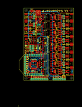
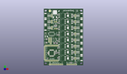
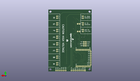
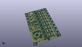

Contents
========

* [PROJ-SPAR-11323-STAN-01>EL Sequencer](#proj-spar-11323-stan-01el-sequencer)
	* [Images](#images)
	* [Interactive BOM](#interactive-bom)
	* [OOMP Parts](#oomp-parts)
	* [Tags](#tags)
  
![][im]
# PROJ-SPAR-11323-STAN-01>EL Sequencer

- ID: PROJ-SPAR-11323-STAN-01
- Hex ID: PRS11323
- Name: EL Sequencer
- Description: 

## Images
  
  

|eagleImage|kicadPcb3dFront|kicadPcb3dBack|kicadPcb3d|
| :---: | :---: | :---: | :---: |
|||||

## Interactive BOM

- Interactive BOM page: [ibom.html](kicad/bom/ibom.html)

## OOMP Parts
  

|OOMP Parts|
| :---: |
|CAPC-0402-X-NF100-V50, C1, 20.32, 68.58, 270,C1, 0.1uF, 0402-CAP, SparkFun, (0.8, 2.7), R270|
|CAPC-UNMATCHED-X-UNMATCHED-01, C2, 17.145, 66.35749999999999, 0,C2, 10uF, EIA3216, SparkFun, (0.675, 2.6125), R0|
|CAPC-UNMATCHED-X-UNMATCHED-01, C3, 3.8099999999999996, 41.91, 0,C3, 10uF, EIA3216, SparkFun, (0.15, 1.65), R0|
|CAPC-0402-X-NF100-V50, C4, 18.0975, 17.380000038, 0,C4, 0.1uF, 0402-CAP, SparkFun, (0.7125, 0.68425197), R0|
|CAPC-0402-X-NF100-V50, C5, 15.875, 32.385, 270,C5, 0.1uF, 0402-CAP, SparkFun, (0.625, 1.275), R270|
|CAPC-0402-X-NF100-V50, C6, 5.715, 17.779999999999998, 270,C6, 0.1uF, 0402-CAP, SparkFun, (0.225, 0.7), R270|
|CAPC-0402-X-NF100-V50, C7, 5.715, 10.16, 0,C7, 0.1uF, 0402-CAP, SparkFun, (0.225, 0.4), R0|
|UNMATCHED-UNMATCHED-X-UNMATCHED-01, J1, 3.8099999999999996, 54.60999999999999, 90,J1, Battery, JST-2-SMD, SparkFun, (0.15, 2.15), R90|
|UNMATCHED-UNMATCHED-X-UNMATCHED-01, J2, 3.8099999999999996, 63.5, 90,J2, DC-OUTPUT, JST-2-SMD, SparkFun, (0.15, 2.5), R90|
|UNMATCHED-UNMATCHED-X-UNMATCHED-01, J3, 3.8099999999999996, 72.39, 90,J3, AC-INPUT, JST-2-SMD, SparkFun, (0.15, 2.85), R90|
|UNMATCHED-UNMATCHED-X-UNMATCHED-01, J4, 53.339999999999996, 10.16, 270,J4, JST-2-SMD, SparkFun, (2.1, 0.4), R270|
|UNMATCHED-UNMATCHED-X-UNMATCHED-01, J5, 53.339999999999996, 19.049999999999997, 270,J5, JST-2-SMD, SparkFun, (2.1, 0.75), R270|
|UNMATCHED-UNMATCHED-X-UNMATCHED-01, J6, 53.339999999999996, 27.94, 270,J6, JST-2-SMD, SparkFun, (2.1, 1.1), R270|
|UNMATCHED-UNMATCHED-X-UNMATCHED-01, J7, 53.339999999999996, 36.83, 270,J7, JST-2-SMD, SparkFun, (2.1, 1.45), R270|
|UNMATCHED-UNMATCHED-X-UNMATCHED-01, J8, 53.339999999999996, 45.72, 270,J8, JST-2-SMD, SparkFun, (2.1, 1.8), R270|
|UNMATCHED-UNMATCHED-X-UNMATCHED-01, J9, 53.339999999999996, 54.60999999999999, 270,J9, JST-2-SMD, SparkFun, (2.1, 2.15), R270|
|UNMATCHED-UNMATCHED-X-UNMATCHED-01, J10, 53.339999999999996, 63.5, 270,J10, JST-2-SMD, SparkFun, (2.1, 2.5), R270|
|UNMATCHED-UNMATCHED-X-UNMATCHED-01, J11, 53.339999999999996, 72.39, 270,J11, JST-2-SMD, SparkFun, (2.1, 2.85), R270|
|<table><tr><td></td><td> JP1</td><td>[HEAD-I01-X-PI02-01 2.54 mm 2 Pin Header](https://github.com/oomlout/oomlout_OOMP_parts/tree/main/HEAD-I01-X-PI02-01/)</td><td>[H02](https://github.com/oomlout/oomlout_OOMP_parts/tree/main/HEAD-I01-X-PI02-01/)</td></tr></table>|
|<table><tr><td></td><td> JP2</td><td>[HEAD-I01-X-PI08-01 2.54 mm 8 Pin Header](https://github.com/oomlout/oomlout_OOMP_parts/tree/main/HEAD-I01-X-PI08-01/)</td><td>[H08](https://github.com/oomlout/oomlout_OOMP_parts/tree/main/HEAD-I01-X-PI08-01/)</td></tr></table>|
|<table><tr><td></td><td> JP3</td><td>[HEAD-I01-X-PI06-01 2.54 mm 6 Pin Header](https://github.com/oomlout/oomlout_OOMP_parts/tree/main/HEAD-I01-X-PI06-01/)</td><td>[H06](https://github.com/oomlout/oomlout_OOMP_parts/tree/main/HEAD-I01-X-PI06-01/)</td></tr></table>|
|<table><tr><td></td><td> JP4</td><td>[HEAD-I01-X-PI08-01 2.54 mm 8 Pin Header](https://github.com/oomlout/oomlout_OOMP_parts/tree/main/HEAD-I01-X-PI08-01/)</td><td>[H08](https://github.com/oomlout/oomlout_OOMP_parts/tree/main/HEAD-I01-X-PI08-01/)</td></tr></table>|
|UNMATCHED-UNMATCHED-X-UNMATCHED-01, JP5, 7.619999999999999, 39.37, 270,JP5, PROG, 2X3, SparkFun, (0.3, 1.55), R270|
|<table><tr><td></td><td> JP6</td><td>[HEAD-I01-X-PI02-01 2.54 mm 2 Pin Header](https://github.com/oomlout/oomlout_OOMP_parts/tree/main/HEAD-I01-X-PI02-01/)</td><td>[H02](https://github.com/oomlout/oomlout_OOMP_parts/tree/main/HEAD-I01-X-PI02-01/)</td></tr></table>|
|<table><tr><td></td><td> JP7</td><td>[HEAD-I01-X-PI02-01 2.54 mm 2 Pin Header](https://github.com/oomlout/oomlout_OOMP_parts/tree/main/HEAD-I01-X-PI02-01/)</td><td>[H02](https://github.com/oomlout/oomlout_OOMP_parts/tree/main/HEAD-I01-X-PI02-01/)</td></tr></table>|
|<table><tr><td></td><td> JP9</td><td>[HEAD-I01-X-PI02-01 2.54 mm 2 Pin Header](https://github.com/oomlout/oomlout_OOMP_parts/tree/main/HEAD-I01-X-PI02-01/)</td><td>[H02](https://github.com/oomlout/oomlout_OOMP_parts/tree/main/HEAD-I01-X-PI02-01/)</td></tr></table>|
|<table><tr><td></td><td> JP10</td><td>[HEAD-I01-X-PI02-01 2.54 mm 2 Pin Header](https://github.com/oomlout/oomlout_OOMP_parts/tree/main/HEAD-I01-X-PI02-01/)</td><td>[H02](https://github.com/oomlout/oomlout_OOMP_parts/tree/main/HEAD-I01-X-PI02-01/)</td></tr></table>|
|<table><tr><td></td><td> JP11</td><td>[HEAD-I01-X-PI02-01 2.54 mm 2 Pin Header](https://github.com/oomlout/oomlout_OOMP_parts/tree/main/HEAD-I01-X-PI02-01/)</td><td>[H02](https://github.com/oomlout/oomlout_OOMP_parts/tree/main/HEAD-I01-X-PI02-01/)</td></tr></table>|
|<table><tr><td></td><td> JP12</td><td>[HEAD-I01-X-PI02-01 2.54 mm 2 Pin Header](https://github.com/oomlout/oomlout_OOMP_parts/tree/main/HEAD-I01-X-PI02-01/)</td><td>[H02](https://github.com/oomlout/oomlout_OOMP_parts/tree/main/HEAD-I01-X-PI02-01/)</td></tr></table>|
|<table><tr><td></td><td> JP13</td><td>[HEAD-I01-X-PI02-01 2.54 mm 2 Pin Header](https://github.com/oomlout/oomlout_OOMP_parts/tree/main/HEAD-I01-X-PI02-01/)</td><td>[H02](https://github.com/oomlout/oomlout_OOMP_parts/tree/main/HEAD-I01-X-PI02-01/)</td></tr></table>|
|<table><tr><td></td><td> JP14</td><td>[HEAD-I01-X-PI02-01 2.54 mm 2 Pin Header](https://github.com/oomlout/oomlout_OOMP_parts/tree/main/HEAD-I01-X-PI02-01/)</td><td>[H02](https://github.com/oomlout/oomlout_OOMP_parts/tree/main/HEAD-I01-X-PI02-01/)</td></tr></table>|
|<table><tr><td></td><td> JP15</td><td>[HEAD-I01-X-PI02-01 2.54 mm 2 Pin Header](https://github.com/oomlout/oomlout_OOMP_parts/tree/main/HEAD-I01-X-PI02-01/)</td><td>[H02](https://github.com/oomlout/oomlout_OOMP_parts/tree/main/HEAD-I01-X-PI02-01/)</td></tr></table>|
|<table><tr><td></td><td> JP16</td><td>[HEAD-I01-X-PI02-01 2.54 mm 2 Pin Header](https://github.com/oomlout/oomlout_OOMP_parts/tree/main/HEAD-I01-X-PI02-01/)</td><td>[H02](https://github.com/oomlout/oomlout_OOMP_parts/tree/main/HEAD-I01-X-PI02-01/)</td></tr></table>|
|UNMATCHED-0603-X-UNMATCHED-01, LED1, 3.4925, 38.099999999999994, 0,LED1, Power, LED-0603, SparkFun, (0.1375, 1.5), R0|
|UNMATCHED-0603-X-UNMATCHED-01, LED2, 3.4925, 33.019999999999996, 0,LED2, Status, LED-0603, SparkFun, (0.1375, 1.3), R0|
|RESE-0603-X-UNMATCHED-01, R1, 15.875, 57.785, 270,R1, 390, 0603-RES, SparkFun, (0.625, 2.275), R270|
|RESE-0603-X-UNMATCHED-01, R2, 18.415, 57.785, 90,R2, 240, 0603-RES, SparkFun, (0.725, 2.275), R90|
|RESE-0402-X-UNMATCHED-01, R3, 39.37, 3.8099999999999996, 270,R3, 1K, 0402-RES, SparkFun, (1.55, 0.15), R270|
|RESE-0402-X-UNMATCHED-01, R4, 45.72, 3.8099999999999996, 90,R4, 2K, 0402-RES, SparkFun, (1.8, 0.15), R90|
|RESE-0402-X-UNMATCHED-01, R5, 19.685, 32.385, 270,R5, 1K, 0402-RES, SparkFun, (0.775, 1.275), R270|
|RESE-0402-X-UNMATCHED-01, R6, 18.415, 32.385, 90,R6, 2K, 0402-RES, SparkFun, (0.725, 1.275), R90|
|RESE-0402-X-UNMATCHED-01, R7, 4.762499999999999, 38.099999999999994, 90,R7, 1K, 0402-RES, SparkFun, (0.1875, 1.5), R90|
|<table><tr><td></td><td> R8</td><td>[RESE-0402-X-O103-01 SMD (0402) 10k Ohm Resistor](https://github.com/oomlout/oomlout_OOMP_parts/tree/main/RESE-0402-X-O103-01/)</td><td>[R42103](https://github.com/oomlout/oomlout_OOMP_parts/tree/main/RESE-0402-X-O103-01/)</td></tr></table>|
|RESE-0402-X-UNMATCHED-01, R9, 4.762499999999999, 33.019999999999996, 90,R9, 1K, 0402-RES, SparkFun, (0.1875, 1.3), R90|
|RESE-0402-X-UNMATCHED-01, R10, 20.32, 10.795, 270,R10, 390, 0402-RES, SparkFun, (0.8, 0.425), R270|
|RESE-0402-X-UNMATCHED-01, R11, 20.32, 18.415, 90,R11, 390, 0402-RES, SparkFun, (0.8, 0.725), R90|
|RESE-0402-X-UNMATCHED-01, R12, 20.32, 25.4, 90,R12, 390, 0402-RES, SparkFun, (0.8, 1), R90|
|RESE-0402-X-UNMATCHED-01, R13, 20.32, 35.559999999999995, 90,R13, 390, 0402-RES, SparkFun, (0.8, 1.4), R90|
|<table><tr><td></td><td> R14</td><td>[RESE-0603-X-O331-01 SMD (0603) 330 Ohm Resistor](https://github.com/oomlout/oomlout_OOMP_parts/tree/main/RESE-0603-X-O331-01/)</td><td>[R6331](https://github.com/oomlout/oomlout_OOMP_parts/tree/main/RESE-0603-X-O331-01/)</td></tr></table>|
|<table><tr><td></td><td> R15</td><td>[RESE-0603-X-O331-01 SMD (0603) 330 Ohm Resistor](https://github.com/oomlout/oomlout_OOMP_parts/tree/main/RESE-0603-X-O331-01/)</td><td>[R6331](https://github.com/oomlout/oomlout_OOMP_parts/tree/main/RESE-0603-X-O331-01/)</td></tr></table>|
|<table><tr><td></td><td> R16</td><td>[RESE-0603-X-O331-01 SMD (0603) 330 Ohm Resistor](https://github.com/oomlout/oomlout_OOMP_parts/tree/main/RESE-0603-X-O331-01/)</td><td>[R6331](https://github.com/oomlout/oomlout_OOMP_parts/tree/main/RESE-0603-X-O331-01/)</td></tr></table>|
|<table><tr><td></td><td> R17</td><td>[RESE-0603-X-O331-01 SMD (0603) 330 Ohm Resistor](https://github.com/oomlout/oomlout_OOMP_parts/tree/main/RESE-0603-X-O331-01/)</td><td>[R6331](https://github.com/oomlout/oomlout_OOMP_parts/tree/main/RESE-0603-X-O331-01/)</td></tr></table>|
|<table><tr><td></td><td> R18</td><td>[RESE-0603-X-O331-01 SMD (0603) 330 Ohm Resistor](https://github.com/oomlout/oomlout_OOMP_parts/tree/main/RESE-0603-X-O331-01/)</td><td>[R6331](https://github.com/oomlout/oomlout_OOMP_parts/tree/main/RESE-0603-X-O331-01/)</td></tr></table>|
|<table><tr><td></td><td> R19</td><td>[RESE-0603-X-O331-01 SMD (0603) 330 Ohm Resistor](https://github.com/oomlout/oomlout_OOMP_parts/tree/main/RESE-0603-X-O331-01/)</td><td>[R6331](https://github.com/oomlout/oomlout_OOMP_parts/tree/main/RESE-0603-X-O331-01/)</td></tr></table>|
|<table><tr><td></td><td> R20</td><td>[RESE-0603-X-O331-01 SMD (0603) 330 Ohm Resistor](https://github.com/oomlout/oomlout_OOMP_parts/tree/main/RESE-0603-X-O331-01/)</td><td>[R6331](https://github.com/oomlout/oomlout_OOMP_parts/tree/main/RESE-0603-X-O331-01/)</td></tr></table>|
|<table><tr><td></td><td> R21</td><td>[RESE-0603-X-O331-01 SMD (0603) 330 Ohm Resistor](https://github.com/oomlout/oomlout_OOMP_parts/tree/main/RESE-0603-X-O331-01/)</td><td>[R6331](https://github.com/oomlout/oomlout_OOMP_parts/tree/main/RESE-0603-X-O331-01/)</td></tr></table>|
|RESE-0402-X-UNMATCHED-01, R22, 20.32, 44.449999999999996, 90,R22, 390, 0402-RES, SparkFun, (0.8, 1.75), R90|
|RESE-0402-X-UNMATCHED-01, R23, 20.32, 53.339999999999996, 90,R23, 390, 0402-RES, SparkFun, (0.8, 2.1), R90|
|RESE-0402-X-UNMATCHED-01, R24, 20.32, 62.230000000000004, 90,R24, 390, 0402-RES, SparkFun, (0.8, 2.45), R90|
|RESE-0402-X-UNMATCHED-01, R25, 20.32, 73.66, 270,R25, 390, 0402-RES, SparkFun, (0.8, 2.9), R270|
|<table><tr><td></td><td> R26</td><td>[RESE-0603-X-O331-01 SMD (0603) 330 Ohm Resistor](https://github.com/oomlout/oomlout_OOMP_parts/tree/main/RESE-0603-X-O331-01/)</td><td>[R6331](https://github.com/oomlout/oomlout_OOMP_parts/tree/main/RESE-0603-X-O331-01/)</td></tr></table>|
|<table><tr><td></td><td> R27</td><td>[RESE-0603-X-O331-01 SMD (0603) 330 Ohm Resistor](https://github.com/oomlout/oomlout_OOMP_parts/tree/main/RESE-0603-X-O331-01/)</td><td>[R6331](https://github.com/oomlout/oomlout_OOMP_parts/tree/main/RESE-0603-X-O331-01/)</td></tr></table>|
|<table><tr><td></td><td> R28</td><td>[RESE-0603-X-O331-01 SMD (0603) 330 Ohm Resistor](https://github.com/oomlout/oomlout_OOMP_parts/tree/main/RESE-0603-X-O331-01/)</td><td>[R6331](https://github.com/oomlout/oomlout_OOMP_parts/tree/main/RESE-0603-X-O331-01/)</td></tr></table>|
|<table><tr><td></td><td> R29</td><td>[RESE-0603-X-O331-01 SMD (0603) 330 Ohm Resistor](https://github.com/oomlout/oomlout_OOMP_parts/tree/main/RESE-0603-X-O331-01/)</td><td>[R6331](https://github.com/oomlout/oomlout_OOMP_parts/tree/main/RESE-0603-X-O331-01/)</td></tr></table>|
|<table><tr><td></td><td> R30</td><td>[RESE-0603-X-O331-01 SMD (0603) 330 Ohm Resistor](https://github.com/oomlout/oomlout_OOMP_parts/tree/main/RESE-0603-X-O331-01/)</td><td>[R6331](https://github.com/oomlout/oomlout_OOMP_parts/tree/main/RESE-0603-X-O331-01/)</td></tr></table>|
|<table><tr><td></td><td> R31</td><td>[RESE-0603-X-O331-01 SMD (0603) 330 Ohm Resistor](https://github.com/oomlout/oomlout_OOMP_parts/tree/main/RESE-0603-X-O331-01/)</td><td>[R6331](https://github.com/oomlout/oomlout_OOMP_parts/tree/main/RESE-0603-X-O331-01/)</td></tr></table>|
|<table><tr><td></td><td> R32</td><td>[RESE-0603-X-O331-01 SMD (0603) 330 Ohm Resistor](https://github.com/oomlout/oomlout_OOMP_parts/tree/main/RESE-0603-X-O331-01/)</td><td>[R6331](https://github.com/oomlout/oomlout_OOMP_parts/tree/main/RESE-0603-X-O331-01/)</td></tr></table>|
|<table><tr><td></td><td> R33</td><td>[RESE-0603-X-O331-01 SMD (0603) 330 Ohm Resistor](https://github.com/oomlout/oomlout_OOMP_parts/tree/main/RESE-0603-X-O331-01/)</td><td>[R6331](https://github.com/oomlout/oomlout_OOMP_parts/tree/main/RESE-0603-X-O331-01/)</td></tr></table>|
|UNMATCHED-UNMATCHED-X-UNMATCHED-01, RA, 18.415, 58.419999999999995, 90,RA, A, AXIAL-0.4, SparkFun, (0.725, 2.3), R90|
|UNMATCHED-UNMATCHED-X-UNMATCHED-01, RB, 15.875, 58.419999999999995, 270,RB, B, AXIAL-0.4, SparkFun, (0.625, 2.3), R270|
|UNMATCHED-UNMATCHED-X-UNMATCHED-01, S1, 11.43, 45.72, 0,S1, POWER, AYZ0202, SparkFun, (0.45, 1.8), R0|
|UNMATCHED-UNMATCHED-X-UNMATCHED-01, S2, 15.239999999999998, 36.83, 90,S2, RESET, TACTILE_SWITCH_SMD, SparkFun, (0.6, 1.45), R90|
|UNMATCHED-UNMATCHED-X-UNMATCHED-01, U1, 16.1925, 74.93, 0,U1, LM317, V-REG_DPACK, SparkFun, (0.6375, 2.95), R0|
|UNMATCHED-UNMATCHED-X-UNMATCHED-01, U2, 2.54, 45.72, 180,U2, MIC5219-3.3, SOT23-5, SparkFun, (0.1, 1.8), R180|
|UNMATCHED-UNMATCHED-X-UNMATCHED-01, U3, 11.43, 17.779999999999998, 180,U3, ATMEGA328P, TQFP32-08, SparkFun, (0.45, 0.7), R180|
|ERROR, U4-DNP XBEE HEADER, 0, 0, 0,U4-DNP, XBEE, HEADER, XBEE-LONGPAD, mike-temp, (0.87598425, 0.6988189), R90|
|UNMATCHED-UNMATCHED-X-UNMATCHED-01, U5, 26.669999999999998, 10.16, 270,U5, MOC3063S, DIP8SMD, mike-temp, (1.05, 0.4), R270|
|UNMATCHED-UNMATCHED-X-UNMATCHED-01, U6, 26.669999999999998, 19.049999999999997, 270,U6, MOC3063S, DIP8SMD, mike-temp, (1.05, 0.75), R270|
|UNMATCHED-UNMATCHED-X-UNMATCHED-01, U7, 26.669999999999998, 27.94, 270,U7, MOC3063S, DIP8SMD, mike-temp, (1.05, 1.1), R270|
|UNMATCHED-UNMATCHED-X-UNMATCHED-01, U8, 26.669999999999998, 36.83, 270,U8, MOC3063S, DIP8SMD, mike-temp, (1.05, 1.45), R270|
|UNMATCHED-UNMATCHED-X-UNMATCHED-01, U9, 38.099999999999994, 10.16, 90,U9, Z0103MN, SOT223, mike-temp, (1.5, 0.4), R90|
|UNMATCHED-UNMATCHED-X-UNMATCHED-01, U10, 38.099999999999994, 19.049999999999997, 90,U10, Z0103MN, SOT223, mike-temp, (1.5, 0.75), R90|
|UNMATCHED-UNMATCHED-X-UNMATCHED-01, U11, 38.099999999999994, 27.94, 90,U11, Z0103MN, SOT223, mike-temp, (1.5, 1.1), R90|
|UNMATCHED-UNMATCHED-X-UNMATCHED-01, U12, 38.099999999999994, 36.83, 90,U12, Z0103MN, SOT223, mike-temp, (1.5, 1.45), R90|
|UNMATCHED-UNMATCHED-X-UNMATCHED-01, U13, 26.669999999999998, 45.72, 270,U13, MOC3063S, DIP8SMD, mike-temp, (1.05, 1.8), R270|
|UNMATCHED-UNMATCHED-X-UNMATCHED-01, U14, 26.669999999999998, 54.60999999999999, 270,U14, MOC3063S, DIP8SMD, mike-temp, (1.05, 2.15), R270|
|UNMATCHED-UNMATCHED-X-UNMATCHED-01, U15, 26.669999999999998, 63.5, 270,U15, MOC3063S, DIP8SMD, mike-temp, (1.05, 2.5), R270|
|UNMATCHED-UNMATCHED-X-UNMATCHED-01, U16, 26.669999999999998, 72.39, 270,U16, MOC3063S, DIP8SMD, mike-temp, (1.05, 2.85), R270|
|UNMATCHED-UNMATCHED-X-UNMATCHED-01, U17, 38.099999999999994, 45.72, 90,U17, Z0103MN, SOT223, mike-temp, (1.5, 1.8), R90|
|UNMATCHED-UNMATCHED-X-UNMATCHED-01, U18, 38.099999999999994, 54.60999999999999, 90,U18, Z0103MN, SOT223, mike-temp, (1.5, 2.15), R90|
|UNMATCHED-UNMATCHED-X-UNMATCHED-01, U19, 38.099999999999994, 63.5, 90,U19, Z0103MN, SOT223, mike-temp, (1.5, 2.5), R90|
|UNMATCHED-UNMATCHED-X-UNMATCHED-01, U20, 38.099999999999994, 72.39, 90,U20, Z0103MN, SOT223, mike-temp, (1.5, 2.85), R90|
|UNMATCHED-UNMATCHED-X-UNMATCHED-01, Y1, 18.0975, 20.497500025999997, 90,Y1, 8MHz, RESONATOR-SMD, SparkFun, (0.7125, 0.80698819), R90|

## Tags

- hexID: PRS11323
- oompType: PROJ
- oompSize: SPAR
- oompColor: 11323
- oompDesc: STAN
- oompIndex: 01
- oompName: EL Sequencer
- sources: All source files from https://github.com/sparkfun/EL_Sequencer (source licence details in srcLicense.md)
- linkBuyPage: https://www.sparkfun.com/products/11323
- oompPart: CAPC-0402-X-NF100-V50, C1, 20.32, 68.58, 270
- oompPart: CAPC-UNMATCHED-X-UNMATCHED-01, C2, 17.145, 66.35749999999999, 0
- oompPart: CAPC-UNMATCHED-X-UNMATCHED-01, C3, 3.8099999999999996, 41.91, 0
- oompPart: CAPC-0402-X-NF100-V50, C4, 18.0975, 17.380000038, 0
- oompPart: CAPC-0402-X-NF100-V50, C5, 15.875, 32.385, 270
- oompPart: CAPC-0402-X-NF100-V50, C6, 5.715, 17.779999999999998, 270
- oompPart: CAPC-0402-X-NF100-V50, C7, 5.715, 10.16, 0
- oompPart: UNMATCHED-UNMATCHED-X-UNMATCHED-01, J1, 3.8099999999999996, 54.60999999999999, 90
- oompPart: UNMATCHED-UNMATCHED-X-UNMATCHED-01, J2, 3.8099999999999996, 63.5, 90
- oompPart: UNMATCHED-UNMATCHED-X-UNMATCHED-01, J3, 3.8099999999999996, 72.39, 90
- oompPart: UNMATCHED-UNMATCHED-X-UNMATCHED-01, J4, 53.339999999999996, 10.16, 270
- oompPart: UNMATCHED-UNMATCHED-X-UNMATCHED-01, J5, 53.339999999999996, 19.049999999999997, 270
- oompPart: UNMATCHED-UNMATCHED-X-UNMATCHED-01, J6, 53.339999999999996, 27.94, 270
- oompPart: UNMATCHED-UNMATCHED-X-UNMATCHED-01, J7, 53.339999999999996, 36.83, 270
- oompPart: UNMATCHED-UNMATCHED-X-UNMATCHED-01, J8, 53.339999999999996, 45.72, 270
- oompPart: UNMATCHED-UNMATCHED-X-UNMATCHED-01, J9, 53.339999999999996, 54.60999999999999, 270
- oompPart: UNMATCHED-UNMATCHED-X-UNMATCHED-01, J10, 53.339999999999996, 63.5, 270
- oompPart: UNMATCHED-UNMATCHED-X-UNMATCHED-01, J11, 53.339999999999996, 72.39, 270
- oompPart: HEAD-I01-X-PI02-01, JP1, 11.43, 53.339999999999996, 90
- oompPart: HEAD-I01-X-PI08-01, JP2, 1.27, 8.889999999999999, 90
- oompPart: HEAD-I01-X-PI06-01, JP3, 34.29, 1.27, 0
- oompPart: HEAD-I01-X-PI08-01, JP4, 8.889999999999999, 1.27, 0
- oompPart: UNMATCHED-UNMATCHED-X-UNMATCHED-01, JP5, 7.619999999999999, 39.37, 270
- oompPart: HEAD-I01-X-PI02-01, JP6, 11.43, 64.77, 270
- oompPart: HEAD-I01-X-PI02-01, JP7, 11.43, 73.66, 270
- oompPart: HEAD-I01-X-PI02-01, JP9, 45.72, 11.43, 270
- oompPart: HEAD-I01-X-PI02-01, JP10, 45.72, 20.32, 270
- oompPart: HEAD-I01-X-PI02-01, JP11, 45.72, 29.209999999999997, 270
- oompPart: HEAD-I01-X-PI02-01, JP12, 45.72, 38.099999999999994, 270
- oompPart: HEAD-I01-X-PI02-01, JP13, 45.72, 46.99, 270
- oompPart: HEAD-I01-X-PI02-01, JP14, 45.72, 55.88, 270
- oompPart: HEAD-I01-X-PI02-01, JP15, 45.72, 64.77, 270
- oompPart: HEAD-I01-X-PI02-01, JP16, 45.72, 73.66, 270
- oompPart: UNMATCHED-0603-X-UNMATCHED-01, LED1, 3.4925, 38.099999999999994, 0
- oompPart: UNMATCHED-0603-X-UNMATCHED-01, LED2, 3.4925, 33.019999999999996, 0
- oompPart: RESE-0603-X-UNMATCHED-01, R1, 15.875, 57.785, 270
- oompPart: RESE-0603-X-UNMATCHED-01, R2, 18.415, 57.785, 90
- oompPart: RESE-0402-X-UNMATCHED-01, R3, 39.37, 3.8099999999999996, 270
- oompPart: RESE-0402-X-UNMATCHED-01, R4, 45.72, 3.8099999999999996, 90
- oompPart: RESE-0402-X-UNMATCHED-01, R5, 19.685, 32.385, 270
- oompPart: RESE-0402-X-UNMATCHED-01, R6, 18.415, 32.385, 90
- oompPart: RESE-0402-X-UNMATCHED-01, R7, 4.762499999999999, 38.099999999999994, 90
- oompPart: RESE-0402-X-O103-01, R8, 14.604999999999999, 32.385, 90
- oompPart: RESE-0402-X-UNMATCHED-01, R9, 4.762499999999999, 33.019999999999996, 90
- oompPart: RESE-0402-X-UNMATCHED-01, R10, 20.32, 10.795, 270
- oompPart: RESE-0402-X-UNMATCHED-01, R11, 20.32, 18.415, 90
- oompPart: RESE-0402-X-UNMATCHED-01, R12, 20.32, 25.4, 90
- oompPart: RESE-0402-X-UNMATCHED-01, R13, 20.32, 35.559999999999995, 90
- oompPart: RESE-0603-X-O331-01, R14, 34.29, 13.97, 0
- oompPart: RESE-0603-X-O331-01, R15, 43.497499999999995, 10.16, 270
- oompPart: RESE-0603-X-O331-01, R16, 34.29, 22.86, 0
- oompPart: RESE-0603-X-O331-01, R17, 43.497499999999995, 19.049999999999997, 270
- oompPart: RESE-0603-X-O331-01, R18, 34.29, 31.75, 0
- oompPart: RESE-0603-X-O331-01, R19, 43.497499999999995, 27.94, 270
- oompPart: RESE-0603-X-O331-01, R20, 34.29, 40.64, 0
- oompPart: RESE-0603-X-O331-01, R21, 43.497499999999995, 36.83, 270
- oompPart: RESE-0402-X-UNMATCHED-01, R22, 20.32, 44.449999999999996, 90
- oompPart: RESE-0402-X-UNMATCHED-01, R23, 20.32, 53.339999999999996, 90
- oompPart: RESE-0402-X-UNMATCHED-01, R24, 20.32, 62.230000000000004, 90
- oompPart: RESE-0402-X-UNMATCHED-01, R25, 20.32, 73.66, 270
- oompPart: RESE-0603-X-O331-01, R26, 34.29, 49.529999999999994, 0
- oompPart: RESE-0603-X-O331-01, R27, 43.497499999999995, 45.72, 270
- oompPart: RESE-0603-X-O331-01, R28, 34.29, 58.419999999999995, 0
- oompPart: RESE-0603-X-O331-01, R29, 43.497499999999995, 54.60999999999999, 270
- oompPart: RESE-0603-X-O331-01, R30, 34.29, 67.30999999999999, 0
- oompPart: RESE-0603-X-O331-01, R31, 43.497499999999995, 63.5, 270
- oompPart: RESE-0603-X-O331-01, R32, 34.29, 76.19999999999999, 0
- oompPart: RESE-0603-X-O331-01, R33, 43.497499999999995, 72.39, 270
- oompPart: UNMATCHED-UNMATCHED-X-UNMATCHED-01, RA, 18.415, 58.419999999999995, 90
- oompPart: UNMATCHED-UNMATCHED-X-UNMATCHED-01, RB, 15.875, 58.419999999999995, 270
- oompPart: UNMATCHED-UNMATCHED-X-UNMATCHED-01, S1, 11.43, 45.72, 0
- oompPart: UNMATCHED-UNMATCHED-X-UNMATCHED-01, S2, 15.239999999999998, 36.83, 90
- oompPart: SKIP-UNMATCHED-X-UNMATCHED-01, SJ1, 8.728099892, 79.375, 0
- oompPart: SKIP-UNMATCHED-X-UNMATCHED-01, SJ2, 10.16, 31.75, 0
- oompPart: SKIP-UNMATCHED-X-UNMATCHED-01, U$3, 52.06999999999999, 80.00999999999999, 0
- oompPart: SKIP-UNMATCHED-X-UNMATCHED-01, U$4, 6.35, 1.27, 0
- oompPart: UNMATCHED-UNMATCHED-X-UNMATCHED-01, U1, 16.1925, 74.93, 0
- oompPart: UNMATCHED-UNMATCHED-X-UNMATCHED-01, U2, 2.54, 45.72, 180
- oompPart: UNMATCHED-UNMATCHED-X-UNMATCHED-01, U3, 11.43, 17.779999999999998, 180
- oompPart: ERROR, U4-DNP XBEE HEADER, 0, 0, 0
- oompPart: UNMATCHED-UNMATCHED-X-UNMATCHED-01, U5, 26.669999999999998, 10.16, 270
- oompPart: UNMATCHED-UNMATCHED-X-UNMATCHED-01, U6, 26.669999999999998, 19.049999999999997, 270
- oompPart: UNMATCHED-UNMATCHED-X-UNMATCHED-01, U7, 26.669999999999998, 27.94, 270
- oompPart: UNMATCHED-UNMATCHED-X-UNMATCHED-01, U8, 26.669999999999998, 36.83, 270
- oompPart: UNMATCHED-UNMATCHED-X-UNMATCHED-01, U9, 38.099999999999994, 10.16, 90
- oompPart: UNMATCHED-UNMATCHED-X-UNMATCHED-01, U10, 38.099999999999994, 19.049999999999997, 90
- oompPart: UNMATCHED-UNMATCHED-X-UNMATCHED-01, U11, 38.099999999999994, 27.94, 90
- oompPart: UNMATCHED-UNMATCHED-X-UNMATCHED-01, U12, 38.099999999999994, 36.83, 90
- oompPart: UNMATCHED-UNMATCHED-X-UNMATCHED-01, U13, 26.669999999999998, 45.72, 270
- oompPart: UNMATCHED-UNMATCHED-X-UNMATCHED-01, U14, 26.669999999999998, 54.60999999999999, 270
- oompPart: UNMATCHED-UNMATCHED-X-UNMATCHED-01, U15, 26.669999999999998, 63.5, 270
- oompPart: UNMATCHED-UNMATCHED-X-UNMATCHED-01, U16, 26.669999999999998, 72.39, 270
- oompPart: UNMATCHED-UNMATCHED-X-UNMATCHED-01, U17, 38.099999999999994, 45.72, 90
- oompPart: UNMATCHED-UNMATCHED-X-UNMATCHED-01, U18, 38.099999999999994, 54.60999999999999, 90
- oompPart: UNMATCHED-UNMATCHED-X-UNMATCHED-01, U19, 38.099999999999994, 63.5, 90
- oompPart: UNMATCHED-UNMATCHED-X-UNMATCHED-01, U20, 38.099999999999994, 72.39, 90
- oompPart: UNMATCHED-UNMATCHED-X-UNMATCHED-01, Y1, 18.0975, 20.497500025999997, 90
- rawPart: C1, 0.1uF, 0402-CAP, SparkFun, (0.8, 2.7), R270
- rawPart: C2, 10uF, EIA3216, SparkFun, (0.675, 2.6125), R0
- rawPart: C3, 10uF, EIA3216, SparkFun, (0.15, 1.65), R0
- rawPart: C4, 0.1uF, 0402-CAP, SparkFun, (0.7125, 0.68425197), R0
- rawPart: C5, 0.1uF, 0402-CAP, SparkFun, (0.625, 1.275), R270
- rawPart: C6, 0.1uF, 0402-CAP, SparkFun, (0.225, 0.7), R270
- rawPart: C7, 0.1uF, 0402-CAP, SparkFun, (0.225, 0.4), R0
- rawPart: J1, Battery, JST-2-SMD, SparkFun, (0.15, 2.15), R90
- rawPart: J2, DC-OUTPUT, JST-2-SMD, SparkFun, (0.15, 2.5), R90
- rawPart: J3, AC-INPUT, JST-2-SMD, SparkFun, (0.15, 2.85), R90
- rawPart: J4, JST-2-SMD, SparkFun, (2.1, 0.4), R270
- rawPart: J5, JST-2-SMD, SparkFun, (2.1, 0.75), R270
- rawPart: J6, JST-2-SMD, SparkFun, (2.1, 1.1), R270
- rawPart: J7, JST-2-SMD, SparkFun, (2.1, 1.45), R270
- rawPart: J8, JST-2-SMD, SparkFun, (2.1, 1.8), R270
- rawPart: J9, JST-2-SMD, SparkFun, (2.1, 2.15), R270
- rawPart: J10, JST-2-SMD, SparkFun, (2.1, 2.5), R270
- rawPart: J11, JST-2-SMD, SparkFun, (2.1, 2.85), R270
- rawPart: JP1, 1X02, SparkFun, (0.45, 2.1), R90
- rawPart: JP2, I/O, 1X08_ROUND, mike-temp, (0.05, 0.35), R90
- rawPart: JP3, 5V_FTDI, 1X06, SparkFun, (1.35, 0.05), R0
- rawPart: JP4, nRF24L01, 1X08, SparkFun, (0.35, 0.05), R0
- rawPart: JP5, PROG, 2X3, SparkFun, (0.3, 1.55), R270
- rawPart: JP6, 1X02, SparkFun, (0.45, 2.55), R270
- rawPart: JP7, 1X02, SparkFun, (0.45, 2.9), R270
- rawPart: JP9, 1X02, SparkFun, (1.8, 0.45), R270
- rawPart: JP10, 1X02, SparkFun, (1.8, 0.8), R270
- rawPart: JP11, 1X02, SparkFun, (1.8, 1.15), R270
- rawPart: JP12, 1X02, SparkFun, (1.8, 1.5), R270
- rawPart: JP13, 1X02, SparkFun, (1.8, 1.85), R270
- rawPart: JP14, 1X02, SparkFun, (1.8, 2.2), R270
- rawPart: JP15, 1X02, SparkFun, (1.8, 2.55), R270
- rawPart: JP16, 1X02, SparkFun, (1.8, 2.9), R270
- rawPart: LED1, Power, LED-0603, SparkFun, (0.1375, 1.5), R0
- rawPart: LED2, Status, LED-0603, SparkFun, (0.1375, 1.3), R0
- rawPart: R1, 390, 0603-RES, SparkFun, (0.625, 2.275), R270
- rawPart: R2, 240, 0603-RES, SparkFun, (0.725, 2.275), R90
- rawPart: R3, 1K, 0402-RES, SparkFun, (1.55, 0.15), R270
- rawPart: R4, 2K, 0402-RES, SparkFun, (1.8, 0.15), R90
- rawPart: R5, 1K, 0402-RES, SparkFun, (0.775, 1.275), R270
- rawPart: R6, 2K, 0402-RES, SparkFun, (0.725, 1.275), R90
- rawPart: R7, 1K, 0402-RES, SparkFun, (0.1875, 1.5), R90
- rawPart: R8, 10K, 0402-RES, SparkFun, (0.575, 1.275), R90
- rawPart: R9, 1K, 0402-RES, SparkFun, (0.1875, 1.3), R90
- rawPart: R10, 390, 0402-RES, SparkFun, (0.8, 0.425), R270
- rawPart: R11, 390, 0402-RES, SparkFun, (0.8, 0.725), R90
- rawPart: R12, 390, 0402-RES, SparkFun, (0.8, 1), R90
- rawPart: R13, 390, 0402-RES, SparkFun, (0.8, 1.4), R90
- rawPart: R14, 330, 0603-RES, SparkFun, (1.35, 0.55), R0
- rawPart: R15, 330, 0603-RES, SparkFun, (1.7125, 0.4), R270
- rawPart: R16, 330, 0603-RES, SparkFun, (1.35, 0.9), R0
- rawPart: R17, 330, 0603-RES, SparkFun, (1.7125, 0.75), R270
- rawPart: R18, 330, 0603-RES, SparkFun, (1.35, 1.25), R0
- rawPart: R19, 330, 0603-RES, SparkFun, (1.7125, 1.1), R270
- rawPart: R20, 330, 0603-RES, SparkFun, (1.35, 1.6), R0
- rawPart: R21, 330, 0603-RES, SparkFun, (1.7125, 1.45), R270
- rawPart: R22, 390, 0402-RES, SparkFun, (0.8, 1.75), R90
- rawPart: R23, 390, 0402-RES, SparkFun, (0.8, 2.1), R90
- rawPart: R24, 390, 0402-RES, SparkFun, (0.8, 2.45), R90
- rawPart: R25, 390, 0402-RES, SparkFun, (0.8, 2.9), R270
- rawPart: R26, 330, 0603-RES, SparkFun, (1.35, 1.95), R0
- rawPart: R27, 330, 0603-RES, SparkFun, (1.7125, 1.8), R270
- rawPart: R28, 330, 0603-RES, SparkFun, (1.35, 2.3), R0
- rawPart: R29, 330, 0603-RES, SparkFun, (1.7125, 2.15), R270
- rawPart: R30, 330, 0603-RES, SparkFun, (1.35, 2.65), R0
- rawPart: R31, 330, 0603-RES, SparkFun, (1.7125, 2.5), R270
- rawPart: R32, 330, 0603-RES, SparkFun, (1.35, 3), R0
- rawPart: R33, 330, 0603-RES, SparkFun, (1.7125, 2.85), R270
- rawPart: RA, A, AXIAL-0.4, SparkFun, (0.725, 2.3), R90
- rawPart: RB, B, AXIAL-0.4, SparkFun, (0.625, 2.3), R270
- rawPart: S1, POWER, AYZ0202, SparkFun, (0.45, 1.8), R0
- rawPart: S2, RESET, TACTILE_SWITCH_SMD, SparkFun, (0.6, 1.45), R90
- rawPart: SJ1, SJ_ROUND, mike-temp, (0.34362598, 3.125), R0
- rawPart: SJ2, SJ_2S-NO, SparkFun-Passives, (0.4, 1.25), R0
- rawPart: U$3, FIDUCIALUFIDUCIAL, MICRO-FIDUCIAL, SparkFun-Aesthetics, (2.05, 3.15), R0
- rawPart: U$4, FIDUCIALUFIDUCIAL, MICRO-FIDUCIAL, SparkFun-Aesthetics, (0.25, 0.05), R0
- rawPart: U1, LM317, V-REG_DPACK, SparkFun, (0.6375, 2.95), R0
- rawPart: U2, MIC5219-3.3, SOT23-5, SparkFun, (0.1, 1.8), R180
- rawPart: U3, ATMEGA328P, TQFP32-08, SparkFun, (0.45, 0.7), R180
- rawPart: U4-DNP, XBEE, HEADER, XBEE-LONGPAD, mike-temp, (0.87598425, 0.6988189), R90
- rawPart: U5, MOC3063S, DIP8SMD, mike-temp, (1.05, 0.4), R270
- rawPart: U6, MOC3063S, DIP8SMD, mike-temp, (1.05, 0.75), R270
- rawPart: U7, MOC3063S, DIP8SMD, mike-temp, (1.05, 1.1), R270
- rawPart: U8, MOC3063S, DIP8SMD, mike-temp, (1.05, 1.45), R270
- rawPart: U9, Z0103MN, SOT223, mike-temp, (1.5, 0.4), R90
- rawPart: U10, Z0103MN, SOT223, mike-temp, (1.5, 0.75), R90
- rawPart: U11, Z0103MN, SOT223, mike-temp, (1.5, 1.1), R90
- rawPart: U12, Z0103MN, SOT223, mike-temp, (1.5, 1.45), R90
- rawPart: U13, MOC3063S, DIP8SMD, mike-temp, (1.05, 1.8), R270
- rawPart: U14, MOC3063S, DIP8SMD, mike-temp, (1.05, 2.15), R270
- rawPart: U15, MOC3063S, DIP8SMD, mike-temp, (1.05, 2.5), R270
- rawPart: U16, MOC3063S, DIP8SMD, mike-temp, (1.05, 2.85), R270
- rawPart: U17, Z0103MN, SOT223, mike-temp, (1.5, 1.8), R90
- rawPart: U18, Z0103MN, SOT223, mike-temp, (1.5, 2.15), R90
- rawPart: U19, Z0103MN, SOT223, mike-temp, (1.5, 2.5), R90
- rawPart: U20, Z0103MN, SOT223, mike-temp, (1.5, 2.85), R90
- rawPart: Y1, 8MHz, RESONATOR-SMD, SparkFun, (0.7125, 0.80698819), R90
- oompID: PROJ-SPAR-11323-STAN-01

[im]: kicadPcb3d_450.png
