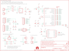

Contents
========

* [PRS11323 > Sparkfun](#prs11323--sparkfun)
	* [Images](#images)
	* [Tags](#tags)
  
![][im]
# PRS11323 > Sparkfun

- ID: PROJ-SPAR-11323-STAN-01
- Hex ID: PRS11323
- Name: Sparkfun
- Description: Sparkfun

## Images
  
  

|kicadPcb3d|kicadPcb3dFront|kicadPcb3dBack|eagleImage|eagleSchemImage|
| :---: | :---: | :---: | :---: | :---: |
||||||

## Tags

- hexID: PRS11323
- oompType: PROJ
- oompSize: SPAR
- oompColor: 11323
- oompDesc: STAN
- oompIndex: 01
- oompName: EL Sequencer
- sources: All source files from https://github.com/sparkfun/EL_Sequencer (source licence details in srcLicense.md)
- linkBuyPage: https://www.sparkfun.com/products/11323
- oompID: PROJ-SPAR-11323-STAN-01
- oompParts: C1,UNMATCHED-UNMATCHED-UNMATCHED-UNMATCHED-UNMATCHED
- oompParts: C2,UNMATCHED-UNMATCHED-UNMATCHED-UNMATCHED-UNMATCHED
- oompParts: C3,UNMATCHED-UNMATCHED-UNMATCHED-UNMATCHED-UNMATCHED
- oompParts: C4,UNMATCHED-UNMATCHED-UNMATCHED-UNMATCHED-UNMATCHED
- oompParts: C5,UNMATCHED-UNMATCHED-UNMATCHED-UNMATCHED-UNMATCHED
- oompParts: C6,UNMATCHED-UNMATCHED-UNMATCHED-UNMATCHED-UNMATCHED
- oompParts: C7,UNMATCHED-UNMATCHED-UNMATCHED-UNMATCHED-UNMATCHED
- oompParts: FRAME1,UNMATCHED-UNMATCHED-UNMATCHED-UNMATCHED-UNMATCHED
- oompParts: FRAME2,UNMATCHED-UNMATCHED-UNMATCHED-UNMATCHED-UNMATCHED
- oompParts: J1,UNMATCHED-UNMATCHED-UNMATCHED-UNMATCHED-UNMATCHED
- oompParts: J2,UNMATCHED-UNMATCHED-UNMATCHED-UNMATCHED-UNMATCHED
- oompParts: J3,UNMATCHED-UNMATCHED-UNMATCHED-UNMATCHED-UNMATCHED
- oompParts: J4,UNMATCHED-UNMATCHED-UNMATCHED-UNMATCHED-UNMATCHED
- oompParts: J5,UNMATCHED-UNMATCHED-UNMATCHED-UNMATCHED-UNMATCHED
- oompParts: J6,UNMATCHED-UNMATCHED-UNMATCHED-UNMATCHED-UNMATCHED
- oompParts: J7,UNMATCHED-UNMATCHED-UNMATCHED-UNMATCHED-UNMATCHED
- oompParts: J8,UNMATCHED-UNMATCHED-UNMATCHED-UNMATCHED-UNMATCHED
- oompParts: J9,UNMATCHED-UNMATCHED-UNMATCHED-UNMATCHED-UNMATCHED
- oompParts: J10,UNMATCHED-UNMATCHED-UNMATCHED-UNMATCHED-UNMATCHED
- oompParts: J11,UNMATCHED-UNMATCHED-UNMATCHED-UNMATCHED-UNMATCHED
- oompParts: JP1,UNMATCHED-UNMATCHED-UNMATCHED-UNMATCHED-UNMATCHED
- oompParts: JP2,UNMATCHED-UNMATCHED-UNMATCHED-UNMATCHED-UNMATCHED
- oompParts: JP3,UNMATCHED-UNMATCHED-UNMATCHED-UNMATCHED-UNMATCHED
- oompParts: JP4,UNMATCHED-UNMATCHED-UNMATCHED-UNMATCHED-UNMATCHED
- oompParts: JP5,UNMATCHED-UNMATCHED-UNMATCHED-UNMATCHED-UNMATCHED
- oompParts: JP6,UNMATCHED-UNMATCHED-UNMATCHED-UNMATCHED-UNMATCHED
- oompParts: JP7,UNMATCHED-UNMATCHED-UNMATCHED-UNMATCHED-UNMATCHED
- oompParts: JP8,UNMATCHED-UNMATCHED-UNMATCHED-UNMATCHED-UNMATCHED
- oompParts: JP9,UNMATCHED-UNMATCHED-UNMATCHED-UNMATCHED-UNMATCHED
- oompParts: JP10,UNMATCHED-UNMATCHED-UNMATCHED-UNMATCHED-UNMATCHED
- oompParts: JP11,UNMATCHED-UNMATCHED-UNMATCHED-UNMATCHED-UNMATCHED
- oompParts: JP12,UNMATCHED-UNMATCHED-UNMATCHED-UNMATCHED-UNMATCHED
- oompParts: JP13,UNMATCHED-UNMATCHED-UNMATCHED-UNMATCHED-UNMATCHED
- oompParts: JP14,UNMATCHED-UNMATCHED-UNMATCHED-UNMATCHED-UNMATCHED
- oompParts: JP15,UNMATCHED-UNMATCHED-UNMATCHED-UNMATCHED-UNMATCHED
- oompParts: JP16,UNMATCHED-UNMATCHED-UNMATCHED-UNMATCHED-UNMATCHED
- oompParts: LED1,UNMATCHED-UNMATCHED-UNMATCHED-UNMATCHED-UNMATCHED
- oompParts: LED2,UNMATCHED-UNMATCHED-UNMATCHED-UNMATCHED-UNMATCHED
- oompParts: R1,UNMATCHED-UNMATCHED-UNMATCHED-UNMATCHED-UNMATCHED
- oompParts: R2,UNMATCHED-UNMATCHED-UNMATCHED-UNMATCHED-UNMATCHED
- oompParts: R3,UNMATCHED-UNMATCHED-UNMATCHED-UNMATCHED-UNMATCHED
- oompParts: R4,UNMATCHED-UNMATCHED-UNMATCHED-UNMATCHED-UNMATCHED
- oompParts: R5,UNMATCHED-UNMATCHED-UNMATCHED-UNMATCHED-UNMATCHED
- oompParts: R6,UNMATCHED-UNMATCHED-UNMATCHED-UNMATCHED-UNMATCHED
- oompParts: R7,UNMATCHED-UNMATCHED-UNMATCHED-UNMATCHED-UNMATCHED
- oompParts: R8,UNMATCHED-UNMATCHED-UNMATCHED-UNMATCHED-UNMATCHED
- oompParts: R9,UNMATCHED-UNMATCHED-UNMATCHED-UNMATCHED-UNMATCHED
- oompParts: R10,UNMATCHED-UNMATCHED-UNMATCHED-UNMATCHED-UNMATCHED
- oompParts: R11,UNMATCHED-UNMATCHED-UNMATCHED-UNMATCHED-UNMATCHED
- oompParts: R12,UNMATCHED-UNMATCHED-UNMATCHED-UNMATCHED-UNMATCHED
- oompParts: R13,UNMATCHED-UNMATCHED-UNMATCHED-UNMATCHED-UNMATCHED
- oompParts: R14,UNMATCHED-UNMATCHED-UNMATCHED-UNMATCHED-UNMATCHED
- oompParts: R15,UNMATCHED-UNMATCHED-UNMATCHED-UNMATCHED-UNMATCHED
- oompParts: R16,UNMATCHED-UNMATCHED-UNMATCHED-UNMATCHED-UNMATCHED
- oompParts: R17,UNMATCHED-UNMATCHED-UNMATCHED-UNMATCHED-UNMATCHED
- oompParts: R18,UNMATCHED-UNMATCHED-UNMATCHED-UNMATCHED-UNMATCHED
- oompParts: R19,UNMATCHED-UNMATCHED-UNMATCHED-UNMATCHED-UNMATCHED
- oompParts: R20,UNMATCHED-UNMATCHED-UNMATCHED-UNMATCHED-UNMATCHED
- oompParts: R21,UNMATCHED-UNMATCHED-UNMATCHED-UNMATCHED-UNMATCHED
- oompParts: R22,UNMATCHED-UNMATCHED-UNMATCHED-UNMATCHED-UNMATCHED
- oompParts: R23,UNMATCHED-UNMATCHED-UNMATCHED-UNMATCHED-UNMATCHED
- oompParts: R24,UNMATCHED-UNMATCHED-UNMATCHED-UNMATCHED-UNMATCHED
- oompParts: R25,UNMATCHED-UNMATCHED-UNMATCHED-UNMATCHED-UNMATCHED
- oompParts: R26,UNMATCHED-UNMATCHED-UNMATCHED-UNMATCHED-UNMATCHED
- oompParts: R27,UNMATCHED-UNMATCHED-UNMATCHED-UNMATCHED-UNMATCHED
- oompParts: R28,UNMATCHED-UNMATCHED-UNMATCHED-UNMATCHED-UNMATCHED
- oompParts: R29,UNMATCHED-UNMATCHED-UNMATCHED-UNMATCHED-UNMATCHED
- oompParts: R30,UNMATCHED-UNMATCHED-UNMATCHED-UNMATCHED-UNMATCHED
- oompParts: R31,UNMATCHED-UNMATCHED-UNMATCHED-UNMATCHED-UNMATCHED
- oompParts: R32,UNMATCHED-UNMATCHED-UNMATCHED-UNMATCHED-UNMATCHED
- oompParts: R33,UNMATCHED-UNMATCHED-UNMATCHED-UNMATCHED-UNMATCHED
- oompParts: RA,UNMATCHED-UNMATCHED-UNMATCHED-UNMATCHED-UNMATCHED
- oompParts: RB,UNMATCHED-UNMATCHED-UNMATCHED-UNMATCHED-UNMATCHED
- oompParts: S1,UNMATCHED-UNMATCHED-UNMATCHED-UNMATCHED-UNMATCHED
- oompParts: S2,UNMATCHED-UNMATCHED-UNMATCHED-UNMATCHED-UNMATCHED
- oompParts: SJ1,UNMATCHED-UNMATCHED-UNMATCHED-UNMATCHED-UNMATCHED
- oompParts: SJ2,UNMATCHED-UNMATCHED-UNMATCHED-UNMATCHED-UNMATCHED
- oompParts: U$1,UNMATCHED-UNMATCHED-UNMATCHED-UNMATCHED-UNMATCHED
- oompParts: U$2,UNMATCHED-UNMATCHED-UNMATCHED-UNMATCHED-UNMATCHED
- oompParts: U$5,UNMATCHED-UNMATCHED-UNMATCHED-UNMATCHED-UNMATCHED
- oompParts: U$6,UNMATCHED-UNMATCHED-UNMATCHED-UNMATCHED-UNMATCHED
- oompParts: U$7,UNMATCHED-UNMATCHED-UNMATCHED-UNMATCHED-UNMATCHED
- oompParts: U$8,UNMATCHED-UNMATCHED-UNMATCHED-UNMATCHED-UNMATCHED
- oompParts: U1,UNMATCHED-UNMATCHED-UNMATCHED-UNMATCHED-UNMATCHED
- oompParts: U2,UNMATCHED-UNMATCHED-UNMATCHED-UNMATCHED-UNMATCHED
- oompParts: U3,UNMATCHED-UNMATCHED-UNMATCHED-UNMATCHED-UNMATCHED
- oompParts: U4-DNP,UNMATCHED-UNMATCHED-UNMATCHED-UNMATCHED-UNMATCHED
- oompParts: U5,UNMATCHED-UNMATCHED-UNMATCHED-UNMATCHED-UNMATCHED
- oompParts: U6,UNMATCHED-UNMATCHED-UNMATCHED-UNMATCHED-UNMATCHED
- oompParts: U7,UNMATCHED-UNMATCHED-UNMATCHED-UNMATCHED-UNMATCHED
- oompParts: U8,UNMATCHED-UNMATCHED-UNMATCHED-UNMATCHED-UNMATCHED
- oompParts: U9,UNMATCHED-UNMATCHED-UNMATCHED-UNMATCHED-UNMATCHED
- oompParts: U10,UNMATCHED-UNMATCHED-UNMATCHED-UNMATCHED-UNMATCHED
- oompParts: U11,UNMATCHED-UNMATCHED-UNMATCHED-UNMATCHED-UNMATCHED
- oompParts: U12,UNMATCHED-UNMATCHED-UNMATCHED-UNMATCHED-UNMATCHED
- oompParts: U13,UNMATCHED-UNMATCHED-UNMATCHED-UNMATCHED-UNMATCHED
- oompParts: U14,UNMATCHED-UNMATCHED-UNMATCHED-UNMATCHED-UNMATCHED
- oompParts: U15,UNMATCHED-UNMATCHED-UNMATCHED-UNMATCHED-UNMATCHED
- oompParts: U16,UNMATCHED-UNMATCHED-UNMATCHED-UNMATCHED-UNMATCHED
- oompParts: U17,UNMATCHED-UNMATCHED-UNMATCHED-UNMATCHED-UNMATCHED
- oompParts: U18,UNMATCHED-UNMATCHED-UNMATCHED-UNMATCHED-UNMATCHED
- oompParts: U19,UNMATCHED-UNMATCHED-UNMATCHED-UNMATCHED-UNMATCHED
- oompParts: U20,UNMATCHED-UNMATCHED-UNMATCHED-UNMATCHED-UNMATCHED
- oompParts: Y1,UNMATCHED-UNMATCHED-UNMATCHED-UNMATCHED-UNMATCHED
- rawParts: C1,0.1uF,CAP0402-CAP,0402-CAP,Capacitor,,
- rawParts: C2,10uF,CAP_POL1206,EIA3216,Capacitor Polarized,,
- rawParts: C3,10uF,CAP_POL1206,EIA3216,Capacitor Polarized,,
- rawParts: C4,0.1uF,CAP0402-CAP,0402-CAP,Capacitor,,
- rawParts: C5,0.1uF,CAP0402-CAP,0402-CAP,Capacitor,,
- rawParts: C6,0.1uF,CAP0402-CAP,0402-CAP,Capacitor,,
- rawParts: C7,0.1uF,CAP0402-CAP,0402-CAP,Capacitor,,
- rawParts: FRAME1,FRAME-LETTER,FRAME-LETTER,CREATIVE_COMMONS,Schematic Frame,,
- rawParts: FRAME2,FRAME-LETTER,FRAME-LETTER,CREATIVE_COMMONS,Schematic Frame,,
- rawParts: J1,Battery,M02-JST-2MM-SMT,JST-2-SMD,Header 2,,
- rawParts: J2,DC-OUTPUT,M02-JST-2MM-SMT,JST-2-SMD,Header 2,,
- rawParts: J3,AC-INPUT,M02-JST-2MM-SMT,JST-2-SMD,Header 2,,
- rawParts: J4,,M02-JST-2MM-SMT,JST-2-SMD,Header 2,,
- rawParts: J5,,M02-JST-2MM-SMT,JST-2-SMD,Header 2,,
- rawParts: J6,,M02-JST-2MM-SMT,JST-2-SMD,Header 2,,
- rawParts: J7,,M02-JST-2MM-SMT,JST-2-SMD,Header 2,,
- rawParts: J8,,M02-JST-2MM-SMT,JST-2-SMD,Header 2,,
- rawParts: J9,,M02-JST-2MM-SMT,JST-2-SMD,Header 2,,
- rawParts: J10,,M02-JST-2MM-SMT,JST-2-SMD,Header 2,,
- rawParts: J11,,M02-JST-2MM-SMT,JST-2-SMD,Header 2,,
- rawParts: JP1,,M02PTH,1X02,Header 2,,
- rawParts: JP2,I/O,M08_ROUND,1X08_ROUND,Header 8,,
- rawParts: JP3,5V_FTDI,ARDUINO_SERIAL_PROGRAMPTH,1X06,,,
- rawParts: JP4,nRF24L01,M081X08,1X08,Header 8,,
- rawParts: JP5,PROG,AVR_SPI_PRG_6PTH,2X3,AVR ISP 6 Pin,,
- rawParts: JP6,,M02PTH,1X02,Header 2,,
- rawParts: JP7,,M02PTH,1X02,Header 2,,
- rawParts: JP8,LOGO-SFESK,LOGO-SFESK,SFE-LOGO-FLAME,Spark Fun Electronics PCB Logo,,
- rawParts: JP9,,M02PTH,1X02,Header 2,,
- rawParts: JP10,,M02PTH,1X02,Header 2,,
- rawParts: JP11,,M02PTH,1X02,Header 2,,
- rawParts: JP12,,M02PTH,1X02,Header 2,,
- rawParts: JP13,,M02PTH,1X02,Header 2,,
- rawParts: JP14,,M02PTH,1X02,Header 2,,
- rawParts: JP15,,M02PTH,1X02,Header 2,,
- rawParts: JP16,,M02PTH,1X02,Header 2,,
- rawParts: LED1,Power,LED0603,LED-0603,LEDs,,
- rawParts: LED2,Status,LED0603,LED-0603,LEDs,,
- rawParts: R1,390,RESISTOR0603-RES,0603-RES,Resistor,,
- rawParts: R2,240,RESISTOR0603-RES,0603-RES,Resistor,,
- rawParts: R3,1K,RESISTOR0402-RES,0402-RES,Resistor,,
- rawParts: R4,2K,RESISTOR0402-RES,0402-RES,Resistor,,
- rawParts: R5,1K,RESISTOR0402-RES,0402-RES,Resistor,,
- rawParts: R6,2K,RESISTOR0402-RES,0402-RES,Resistor,,
- rawParts: R7,1K,RESISTOR0402-RES,0402-RES,Resistor,,
- rawParts: R8,10K,RESISTOR0402-RES,0402-RES,Resistor,,
- rawParts: R9,1K,RESISTOR0402-RES,0402-RES,Resistor,,
- rawParts: R10,390,RESISTOR0402-RES,0402-RES,Resistor,,
- rawParts: R11,390,RESISTOR0402-RES,0402-RES,Resistor,,
- rawParts: R12,390,RESISTOR0402-RES,0402-RES,Resistor,,
- rawParts: R13,390,RESISTOR0402-RES,0402-RES,Resistor,,
- rawParts: R14,330,RESISTOR0603-RES,0603-RES,Resistor,,
- rawParts: R15,330,RESISTOR0603-RES,0603-RES,Resistor,,
- rawParts: R16,330,RESISTOR0603-RES,0603-RES,Resistor,,
- rawParts: R17,330,RESISTOR0603-RES,0603-RES,Resistor,,
- rawParts: R18,330,RESISTOR0603-RES,0603-RES,Resistor,,
- rawParts: R19,330,RESISTOR0603-RES,0603-RES,Resistor,,
- rawParts: R20,330,RESISTOR0603-RES,0603-RES,Resistor,,
- rawParts: R21,330,RESISTOR0603-RES,0603-RES,Resistor,,
- rawParts: R22,390,RESISTOR0402-RES,0402-RES,Resistor,,
- rawParts: R23,390,RESISTOR0402-RES,0402-RES,Resistor,,
- rawParts: R24,390,RESISTOR0402-RES,0402-RES,Resistor,,
- rawParts: R25,390,RESISTOR0402-RES,0402-RES,Resistor,,
- rawParts: R26,330,RESISTOR0603-RES,0603-RES,Resistor,,
- rawParts: R27,330,RESISTOR0603-RES,0603-RES,Resistor,,
- rawParts: R28,330,RESISTOR0603-RES,0603-RES,Resistor,,
- rawParts: R29,330,RESISTOR0603-RES,0603-RES,Resistor,,
- rawParts: R30,330,RESISTOR0603-RES,0603-RES,Resistor,,
- rawParts: R31,330,RESISTOR0603-RES,0603-RES,Resistor,,
- rawParts: R32,330,RESISTOR0603-RES,0603-RES,Resistor,,
- rawParts: R33,330,RESISTOR0603-RES,0603-RES,Resistor,,
- rawParts: RA,A,RESISTORPTH-1/4W,AXIAL-0.4,Resistor,,
- rawParts: RB,B,RESISTORPTH-1/4W,AXIAL-0.4,Resistor,,
- rawParts: S1,POWER,SWITCH-DPDTSMD,AYZ0202,DPDT Version of the COM-00597,,
- rawParts: S2,RESET,SWITCH-MOMENTARY-2SMD,TACTILE_SWITCH_SMD,,,
- rawParts: SJ1,,SOLDERJUMPERROUND,SJ_ROUND,Solder Jumper,,
- rawParts: SJ2,,SOLDERJUMPERNO,SJ_2S-NO,Solder Jumper,,
- rawParts: U$1,OSHW-LOGOS,OSHW-LOGOS,OSHW-LOGO-S,Open Source Hardware Logo This logo indicates the piece of hardware it is found on incorporates a OSHW license and/or adheres to the definition of open source hardware found here: http://freedomdefined.org/OSHW,,
- rawParts: U$2,LOGO-SFENEW,LOGO-SFENEW,SFE-NEW-WEBLOGO,Spark Fun Electronics PCB Logo,,
- rawParts: U$3,FIDUCIALUFIDUCIAL,FIDUCIALUFIDUCIAL,MICRO-FIDUCIAL,Fiducial Alignment Points,,
- rawParts: U$4,FIDUCIALUFIDUCIAL,FIDUCIALUFIDUCIAL,MICRO-FIDUCIAL,Fiducial Alignment Points,,
- rawParts: U$5,STAND-OFF,STAND-OFF,STAND-OFF,Stand Off,,
- rawParts: U$6,STAND-OFF,STAND-OFF,STAND-OFF,Stand Off,,
- rawParts: U$7,STAND-OFF,STAND-OFF,STAND-OFF,Stand Off,,
- rawParts: U$8,STAND-OFF,STAND-OFF,STAND-OFF,Stand Off,,
- rawParts: U1,LM317,V_REG_317DPACK,V-REG_DPACK,Voltage Regulator,,
- rawParts: U2,MIC5219-3.3,V_REG_LDOSMD,SOT23-5,Voltage Regulator LDO,,
- rawParts: U3,ATMEGA328P,ATMEGA168,TQFP32-08,,,
- rawParts: U4-DNP,XBEE HEADER,XBEE-1LONGPAD,XBEE-LONGPAD,Xbee module footprints,,
- rawParts: U5,MOC3063S,MOC3063S,DIP8SMD,Optotriac in DIP and SMD,,
- rawParts: U6,MOC3063S,MOC3063S,DIP8SMD,Optotriac in DIP and SMD,,
- rawParts: U7,MOC3063S,MOC3063S,DIP8SMD,Optotriac in DIP and SMD,,
- rawParts: U8,MOC3063S,MOC3063S,DIP8SMD,Optotriac in DIP and SMD,,
- rawParts: U9,Z0103MN,TRIACSMD,SOT223,,,
- rawParts: U10,Z0103MN,TRIACSMD,SOT223,,,
- rawParts: U11,Z0103MN,TRIACSMD,SOT223,,,
- rawParts: U12,Z0103MN,TRIACSMD,SOT223,,,
- rawParts: U13,MOC3063S,MOC3063S,DIP8SMD,Optotriac in DIP and SMD,,
- rawParts: U14,MOC3063S,MOC3063S,DIP8SMD,Optotriac in DIP and SMD,,
- rawParts: U15,MOC3063S,MOC3063S,DIP8SMD,Optotriac in DIP and SMD,,
- rawParts: U16,MOC3063S,MOC3063S,DIP8SMD,Optotriac in DIP and SMD,,
- rawParts: U17,Z0103MN,TRIACSMD,SOT223,,,
- rawParts: U18,Z0103MN,TRIACSMD,SOT223,,,
- rawParts: U19,Z0103MN,TRIACSMD,SOT223,,,
- rawParts: U20,Z0103MN,TRIACSMD,SOT223,,,
- rawParts: Y1,8MHz,RESONATORSMD,RESONATOR-SMD,Resonator,,

[im]: kicadPcb3d_450.png
