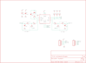

Contents
========

* [PRS11341 > Sparkfun](#prs11341--sparkfun)
	* [Schematic](#schematic)
	* [Interactive BOM](#interactive-bom)
	* [OOMP Parts](#oomp-parts)
	* [Images](#images)
	* [Tags](#tags)
  
![][im]
# PRS11341 > Sparkfun

- ID: PROJ-SPAR-11341-STAN-01
- Hex ID: PRS11341
- Name: Sparkfun
- Description: Sparkfun
- Long Link: [http://oom.lt/PROJ-SPAR-11341-STAN-01](http://oom.lt/PROJ-SPAR-11341-STAN-01)
- Short Link: [http://oom.lt/PRS11341](http://oom.lt/PRS11341)

## Schematic
  

## Interactive BOM

- Interactive BOM page: [ibom.html](https://htmlpreview.github.io/?https://github.com/oomlout/oomlout_OOMP_projects/blob/main/PROJ-SPAR-11341-STAN-01/kicad/bom/ibom.html)

## OOMP Parts
  

|OOMP Parts|
| :---: |
|C3,CAPC-0402-X-NF100-01,C3,0.1uF,CAP0402-CAP,0402-CAP,Capacitor,,|
|C4,CAPX-UNMATCHED-X-UF10-01,C4,10uF,CAP_POL1206,EIA3216,Capacitor Polarized,,|
|C5,CAPC-0402-X-UNMATCHED-01,C5,470nF,CAP0402-CAP,0402-CAP,Capacitor,,|
|C6,CAPC-0402-X-UNMATCHED-01,C6,10nF,CAP0402-CAP,0402-CAP,Capacitor,,|
|C7,CAPC-0402-X-NF100-01,C7,0.1uF,CAP0402-CAP,0402-CAP,Capacitor,,|
|C8,CAPC-0402-X-NF100-01,C8,0.1uF,CAP0402-CAP,0402-CAP,Capacitor,,|
|JP1,HEAD-I01-X-PI05-01,JP1,,M05PTH,1X05,Header 5,,|
|JP2,HEAD-I01-X-PI05-01,JP2,,M05PTH,1X05,Header 5,,|
|R1,RESE-0402-X-O103-01,R1,10K,RESISTOR0402-RES,0402-RES,Resistor,,|
|R2,RESE-0402-X-O103-01,R2,10K,RESISTOR0402-RES,0402-RES,Resistor,,|
|R3,RESE-0402-X-O103-01,R3,10K,RESISTOR0402-RES,0402-RES,Resistor,,|
|R4,RESE-0402-X-O103-01,R4,10K,RESISTOR0402-RES,0402-RES,Resistor,,|
|R5,RESE-0402-X-UNMATCHED-01,R5,DNP,RESISTOR0402-RES,0402-RES,Resistor,,|
|R6,RESE-0402-X-O333-01,R6,33K,RESISTOR0402-RES,0402-RES,Resistor,,|
|R7,RESE-0402-X-O333-01,R7,33K,RESISTOR0402-RES,0402-RES,Resistor,,|
|R8,RESE-0402-X-UNMATCHED-01,R8,DNP,RESISTOR0402-RES,0402-RES,Resistor,,|
|R9,RESE-0402-X-UNMATCHED-01,R9,0 ohm,RESISTOR0402-RES,0402-RES,Resistor,,|
|R10,RESE-0402-X-UNMATCHED-01,R10,0 ohm,RESISTOR0402-RES,0402-RES,Resistor,,|
|U1,UNMATCHED-UNMATCHED-X-UNMATCHED-01,U$1,LOGO-SFESK,LOGO-SFESK,SFE-LOGO-FLAME,Spark Fun Electronics PCB Logo,,|

## Images
  
  

|kicadPcb3d|kicadPcb3dFront|kicadPcb3dBack|eagleImage|eagleSchemImage|
| :---: | :---: | :---: | :---: | :---: |
||||||

## Tags

- hexID: PRS11341
- oompType: PROJ
- oompSize: SPAR
- oompColor: 11341
- oompDesc: STAN
- oompIndex: 01
- oompName: Gyro Breakout-LPY503AL
- sources: All source files from https://github.com/sparkfun/Gyro_Breakout-LPY503AL (source licence details in srcLicense.md)
- linkBuyPage: https://www.sparkfun.com/products/11341
- oompID: PROJ-SPAR-11341-STAN-01
- oompParts: C3,CAPC-0402-X-NF100-01
- oompParts: C4,CAPX-UNMATCHED-X-UF10-01
- oompParts: C5,CAPC-0402-X-UNMATCHED-01
- oompParts: C6,CAPC-0402-X-UNMATCHED-01
- oompParts: C7,CAPC-0402-X-NF100-01
- oompParts: C8,CAPC-0402-X-NF100-01
- oompParts: JP1,HEAD-I01-X-PI05-01
- oompParts: JP2,HEAD-I01-X-PI05-01
- oompParts: R1,RESE-0402-X-O103-01
- oompParts: R2,RESE-0402-X-O103-01
- oompParts: R3,RESE-0402-X-O103-01
- oompParts: R4,RESE-0402-X-O103-01
- oompParts: R5,RESE-0402-X-UNMATCHED-01
- oompParts: R6,RESE-0402-X-O333-01
- oompParts: R7,RESE-0402-X-O333-01
- oompParts: R8,RESE-0402-X-UNMATCHED-01
- oompParts: R9,RESE-0402-X-UNMATCHED-01
- oompParts: R10,RESE-0402-X-UNMATCHED-01
- oompParts: U1,UNMATCHED-UNMATCHED-X-UNMATCHED-01
- rawParts: C3,0.1uF,CAP0402-CAP,0402-CAP,Capacitor,,
- rawParts: C4,10uF,CAP_POL1206,EIA3216,Capacitor Polarized,,
- rawParts: C5,470nF,CAP0402-CAP,0402-CAP,Capacitor,,
- rawParts: C6,10nF,CAP0402-CAP,0402-CAP,Capacitor,,
- rawParts: C7,0.1uF,CAP0402-CAP,0402-CAP,Capacitor,,
- rawParts: C8,0.1uF,CAP0402-CAP,0402-CAP,Capacitor,,
- rawParts: JP1,,M05PTH,1X05,Header 5,,
- rawParts: JP2,,M05PTH,1X05,Header 5,,
- rawParts: R1,10K,RESISTOR0402-RES,0402-RES,Resistor,,
- rawParts: R2,10K,RESISTOR0402-RES,0402-RES,Resistor,,
- rawParts: R3,10K,RESISTOR0402-RES,0402-RES,Resistor,,
- rawParts: R4,10K,RESISTOR0402-RES,0402-RES,Resistor,,
- rawParts: R5,DNP,RESISTOR0402-RES,0402-RES,Resistor,,
- rawParts: R6,33K,RESISTOR0402-RES,0402-RES,Resistor,,
- rawParts: R7,33K,RESISTOR0402-RES,0402-RES,Resistor,,
- rawParts: R8,DNP,RESISTOR0402-RES,0402-RES,Resistor,,
- rawParts: R9,0 ohm,RESISTOR0402-RES,0402-RES,Resistor,,
- rawParts: R10,0 ohm,RESISTOR0402-RES,0402-RES,Resistor,,
- rawParts: U$1,LOGO-SFESK,LOGO-SFESK,SFE-LOGO-FLAME,Spark Fun Electronics PCB Logo,,
- rawParts: U1,LPY5XXX,ST-GYRO-PYSMD,ST-GYRO,,,

[im]: kicadPcb3d_450.png
