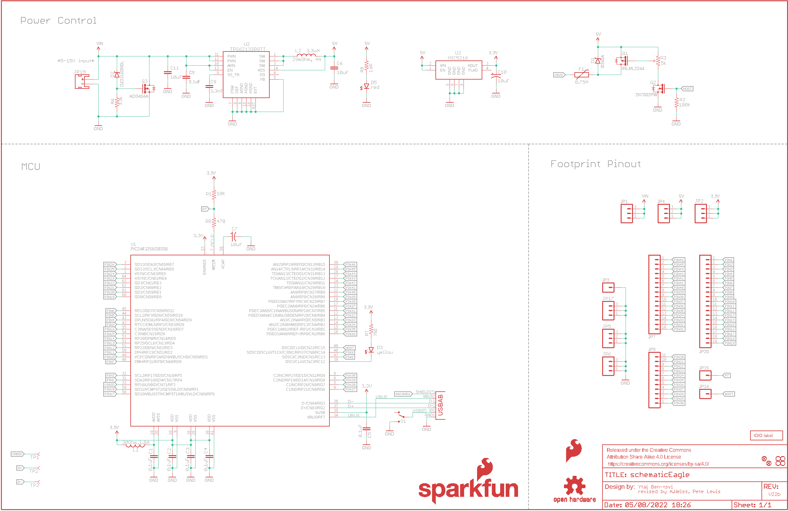
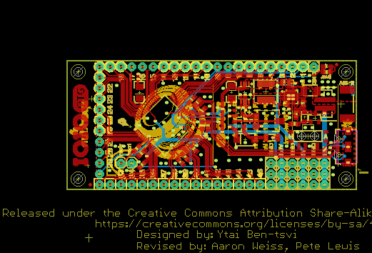

Contents
========

* [PRS11343 > IOIO-OTG](#prs11343--ioio-otg)
	* [Schematic](#schematic)
	* [PCB](#pcb)
	* [Interactive BOM](#interactive-bom)
	* [OOMP Parts](#oomp-parts)
	* [Images](#images)
	* [Tags](#tags)
  
![][im]
# PRS11343 > IOIO-OTG

- ID: PROJ-SPAR-11343-STAN-01
- Hex ID: PRS11343
- Name: Sparkfun
- Description: Sparkfun
- Long Link: [http://oom.lt/PROJ-SPAR-11343-STAN-01](http://oom.lt/PROJ-SPAR-11343-STAN-01)
- Short Link: [http://oom.lt/PRS11343](http://oom.lt/PRS11343)

## Schematic
  

## PCB
  

## Interactive BOM

- Interactive BOM page: [ibom.html](https://htmlpreview.github.io/?https://github.com/oomlout/oomlout_OOMP_projects/blob/main/PROJ-SPAR-11343-STAN-01/kicad/bom/ibom.html)

## OOMP Parts
  

|OOMP Parts|
| :---: |
|C1 C1,CAPC-0603-X-UF1D-01|
|C2 C2,CAPC-0603-X-UF1D-01|
|C3 C3,CAPC-0603-X-UF1D-01|
|C4 C4,CAPC-0603-X-UF1D-01|
|C5 C5,CAPC-0603-X-UF1D-01|
|[C6 CAPC-0805-X-UF10-V10 SMD (0805) 10 uF Capacitor (Ceramic) 10v](https://github.com/oomlout/oomlout_OOMP_parts/tree/main/CAPC-0805-X-UF10-V10/)|
|C7 C7,CAPX-UNMATCHED-X-UF10-01|
|C8 C8,CAPC-0603-X-PF33D-01|
|C9 C9,CAPC-0603-X-UF1D-01|
|C10 C10,CAPX-UNMATCHED-X-UF10-01|
|C11 C11,CAPX-UNMATCHED-X-UF10-01|
|D1 D1,DIOD-UNMATCHED-X-UNMATCHED-01|
|D2 D2,DIOD-UNMATCHED-X-UNMATCHED-01|
|[D3 LEDS-0603-G-STAN-01 SMD (0603) Green LED](https://github.com/oomlout/oomlout_OOMP_parts/tree/main/LEDS-0603-G-STAN-01/)|
|[D5 LEDS-0603-G-STAN-01 SMD (0603) Green LED](https://github.com/oomlout/oomlout_OOMP_parts/tree/main/LEDS-0603-G-STAN-01/)|
|F1 F1,UNMATCHED-1206-X-UNMATCHED-01|
|[JP1 HEAD-I01-X-PI03-01 2.54 mm 3 Pin Header](https://github.com/oomlout/oomlout_OOMP_parts/tree/main/HEAD-I01-X-PI03-01/)|
|[JP2 HEAD-I01-X-PI03-01 2.54 mm 3 Pin Header](https://github.com/oomlout/oomlout_OOMP_parts/tree/main/HEAD-I01-X-PI03-01/)|
|JP3 JP3,HEAD-I01-X-PI01-01|
|[JP4 HEAD-I01-X-PI03-01 2.54 mm 3 Pin Header](https://github.com/oomlout/oomlout_OOMP_parts/tree/main/HEAD-I01-X-PI03-01/)|
|[JP5 HEAD-I01-X-PI03-01 2.54 mm 3 Pin Header](https://github.com/oomlout/oomlout_OOMP_parts/tree/main/HEAD-I01-X-PI03-01/)|
|[JP6 HEAD-I01-X-PI03-01 2.54 mm 3 Pin Header](https://github.com/oomlout/oomlout_OOMP_parts/tree/main/HEAD-I01-X-PI03-01/)|
|[JP7 HEAD-I01-X-PI16-01 2.54 mm 16 Pin Header](https://github.com/oomlout/oomlout_OOMP_parts/tree/main/HEAD-I01-X-PI16-01/)|
|JP9 JP9,HEAD-I01-X-PI11-01|
|JP14 JP14,HEAD-I01-X-PI01-01|
|JP15 JP15,HEAD-I01-X-PI01-01|
|[JP17 HEAD-I01-X-PI03-01 2.54 mm 3 Pin Header](https://github.com/oomlout/oomlout_OOMP_parts/tree/main/HEAD-I01-X-PI03-01/)|
|JP19 JP19,UNMATCHED-UNMATCHED-X-UNMATCHED-01|
|JP20 JP20,HEAD-I01-X-PI19-01|
|JP21 JP21,UNMATCHED-UNMATCHED-X-UNMATCHED-01|
|L1 L1,UNMATCHED-UNMATCHED-X-UNMATCHED-01|
|L2 L2,UNMATCHED-UNMATCHED-X-UNMATCHED-01|
|Q1 Q1,UNMATCHED-SO23-X-UNMATCHED-01|
|Q2 Q2,UNMATCHED-UNMATCHED-X-UNMATCHED-01|
|Q3 Q3,UNMATCHED-SO23-X-UNMATCHED-01|
|[R1 RESE-0603-X-O103-01 SMD (0603) 10k Ohm Resistor](https://github.com/oomlout/oomlout_OOMP_parts/tree/main/RESE-0603-X-O103-01/)|
|R2 R2,RESE-0603-X-O1003-01|
|R3 R3,RESE-UNMATCHED-X-UNMATCHED-01|
|R4 R4,RESE-0603-X-UNMATCHED-01|
|[R7 RESE-0603-X-O751-01 SMD (0603) 750 Ohm Resistor](https://github.com/oomlout/oomlout_OOMP_parts/tree/main/RESE-0603-X-O751-01/)|
|[R8 RESE-0603-X-O471-01 SMD (0603) 470 Ohm Resistor](https://github.com/oomlout/oomlout_OOMP_parts/tree/main/RESE-0603-X-O471-01/)|
|R9 R9,RESE-0603-X-UNMATCHED-01|
|S1 S1,UNMATCHED-UNMATCHED-X-UNMATCHED-01|
|U$6 U$6,UNMATCHED-UNMATCHED-X-UNMATCHED-01|
|U1 U1,UNMATCHED-UNMATCHED-X-UNMATCHED-01|
|U2 U2,UNMATCHED-UNMATCHED-X-UNMATCHED-01|
|U3 U3,UNMATCHED-UNMATCHED-X-UNMATCHED-01|

## Images
  
  

|kicadPcb3d|kicadPcb3dFront|kicadPcb3dBack|eagleImage|eagleSchemImage|
| :---: | :---: | :---: | :---: | :---: |
||||||

## Tags

- hexID: PRS11343
- oompType: PROJ
- oompSize: SPAR
- oompColor: 11343
- oompDesc: STAN
- oompIndex: 01
- oompName: IOIO-OTG
- sources: All source files from https://github.com/sparkfun/IOIO-OTG (source licence details in srcLicense.md)
- linkBuyPage: https://www.sparkfun.com/products/11343
- oompID: PROJ-SPAR-11343-STAN-01
- oompParts: C1,CAPC-0603-X-UF1D-01
- oompParts: C2,CAPC-0603-X-UF1D-01
- oompParts: C3,CAPC-0603-X-UF1D-01
- oompParts: C4,CAPC-0603-X-UF1D-01
- oompParts: C5,CAPC-0603-X-UF1D-01
- oompParts: C6,CAPC-0805-X-UF10-V10
- oompParts: C7,CAPX-UNMATCHED-X-UF10-01
- oompParts: C8,CAPC-0603-X-PF33D-01
- oompParts: C9,CAPC-0603-X-UF1D-01
- oompParts: C10,CAPX-UNMATCHED-X-UF10-01
- oompParts: C11,CAPX-UNMATCHED-X-UF10-01
- oompParts: D1,DIOD-UNMATCHED-X-UNMATCHED-01
- oompParts: D2,DIOD-UNMATCHED-X-UNMATCHED-01
- oompParts: D3,LEDS-0603-G-STAN-01
- oompParts: D5,LEDS-0603-G-STAN-01
- oompParts: F1,UNMATCHED-1206-X-UNMATCHED-01
- oompParts: JP1,HEAD-I01-X-PI03-01
- oompParts: JP2,HEAD-I01-X-PI03-01
- oompParts: JP3,HEAD-I01-X-PI01-01
- oompParts: JP4,HEAD-I01-X-PI03-01
- oompParts: JP5,HEAD-I01-X-PI03-01
- oompParts: JP6,HEAD-I01-X-PI03-01
- oompParts: JP7,HEAD-I01-X-PI16-01
- oompParts: JP9,HEAD-I01-X-PI11-01
- oompParts: JP14,HEAD-I01-X-PI01-01
- oompParts: JP15,HEAD-I01-X-PI01-01
- oompParts: JP17,HEAD-I01-X-PI03-01
- oompParts: JP19,UNMATCHED-UNMATCHED-X-UNMATCHED-01
- oompParts: JP20,HEAD-I01-X-PI19-01
- oompParts: JP21,UNMATCHED-UNMATCHED-X-UNMATCHED-01
- oompParts: L1,UNMATCHED-UNMATCHED-X-UNMATCHED-01
- oompParts: L2,UNMATCHED-UNMATCHED-X-UNMATCHED-01
- oompParts: Q1,UNMATCHED-SO23-X-UNMATCHED-01
- oompParts: Q2,UNMATCHED-UNMATCHED-X-UNMATCHED-01
- oompParts: Q3,UNMATCHED-SO23-X-UNMATCHED-01
- oompParts: R1,RESE-0603-X-O103-01
- oompParts: R2,RESE-0603-X-O1003-01
- oompParts: R3,RESE-UNMATCHED-X-UNMATCHED-01
- oompParts: R4,RESE-0603-X-UNMATCHED-01
- oompParts: R7,RESE-0603-X-O751-01
- oompParts: R8,RESE-0603-X-O471-01
- oompParts: R9,RESE-0603-X-UNMATCHED-01
- oompParts: S1,UNMATCHED-UNMATCHED-X-UNMATCHED-01
- oompParts: U$6,UNMATCHED-UNMATCHED-X-UNMATCHED-01
- oompParts: U1,UNMATCHED-UNMATCHED-X-UNMATCHED-01
- oompParts: U2,UNMATCHED-UNMATCHED-X-UNMATCHED-01
- oompParts: U3,UNMATCHED-UNMATCHED-X-UNMATCHED-01
- rawParts: C1,0.1uF,0.1UF-25V(+80/-20%)(0603),0603-CAP,CAP-00810,,,,,CAP-00810,,,0.1uF,
- rawParts: C2,0.1uF,0.1UF-25V(+80/-20%)(0603),0603-CAP,CAP-00810,,,,,CAP-00810,,,0.1uF,
- rawParts: C3,0.1uF,0.1UF-25V(+80/-20%)(0603),0603-CAP,CAP-00810,,,,,CAP-00810,,,0.1uF,
- rawParts: C4,0.1uF,0.1UF-25V(+80/-20%)(0603),0603-CAP,CAP-00810,,,,,CAP-00810,,,0.1uF,
- rawParts: C5,0.1uF,0.1UF-25V(+80/-20%)(0603),0603-CAP,CAP-00810,,,,,CAP-00810,,,0.1uF,
- rawParts: C6,10uF,10UF10V10%(0805),0805-CAP,CAP-11330,,,,LMK212BJ106KG-T,CAP-11330,,,,
- rawParts: C7,10uF,10UF-16V-10%(TANT),EIA3216,CAP-00811,,,,,CAP-00811,,,10uF,
- rawParts: C8,3.3nF,3.3NF-100V-10%(0603),0603-CAP,CAP-09633,,,,,CAP-09633,,,3.3nF,
- rawParts: C9,0.1uF,0.1UF-25V(+80/-20%)(0603),0603-CAP,CAP-00810,,,,,CAP-00810,,,0.1uF,
- rawParts: C10,10uF,10UF-16V-10%(TANT),EIA3216,CAP-00811,,,,TAJA106K016RNJ,CAP-00811,,,10uF,
- rawParts: C11,10uF,10UF50V20%(1210),1210,CAP-09824,,,,UMK325C7106MM-T,CAP-09824,,,10uF,
- rawParts: D1,B340A,DIODE-SCHOTTKY-B340A,SMA-DIODE,Schottky diodes in SFEs production catalog,,,,B340A,DIO-09886,,,B340A,
- rawParts: D2,DZ2J160M0L,DIODE-ZENERDZ2J150M0L,PANASONIC_SMINI2-F5-B,Zener Diode,,,,DZ2J150M0L,DIO-12989,,,,
- rawParts: D3,Yellow,LED-YELLOW0603-SMART,LED-0603,Yellow SMD LEDs,,,,,DIO-11230,,,Yellow,
- rawParts: D5,Red,LED-RED0603-SMART,LED-0603,Assorted Red LEDs,,,,,DIO-11154,,,Red,
- rawParts: F1,0.75A,PTCSMD,PTC-1206,Resettable Fuse PTC,,,,0ZCA0075FF2G,RES-11150,,,,
- rawParts: FRAME2,FRAME-LEDGER,FRAME-LEDGER,CREATIVE_COMMONS,Schematic Frame,,,,,,,,,
- rawParts: JP1,,M03PTH,1X03,Header 3,,,,,,,,,
- rawParts: JP2,,M03PTH,1X03,Header 3,,,,,,,,,
- rawParts: JP3,,M01PTH,1X01,Header 1,,,,,,,,,
- rawParts: JP4,,M03PTH,1X03,Header 3,,,,,,,,,
- rawParts: JP5,,M03PTH,1X03,Header 3,,,,,,,,,
- rawParts: JP6,,M03PTH,1X03,Header 3,,,,,,,,,
- rawParts: JP7,,M161X16_NO_SILK,1X16_NO_SILK,1x16 .1 header,,,,,,,,,
- rawParts: JP8,FIDUCIALUFIDUCIAL,FIDUCIALUFIDUCIAL,MICRO-FIDUCIAL,Fiducial Alignment Points,,,,,,,,,
- rawParts: JP9,,M111X11_NO_SILK,1X11_NO_SILK,Header 11,,,,,,,,,
- rawParts: JP10,STAND-OFF,STAND-OFF,STAND-OFF,Stand Off,,,,,,,,,
- rawParts: JP11,STAND-OFF,STAND-OFF,STAND-OFF,Stand Off,,,,,,,,,
- rawParts: JP12,STAND-OFF,STAND-OFF,STAND-OFF,Stand Off,,,,,,,,,
- rawParts: JP13,STAND-OFF,STAND-OFF,STAND-OFF,Stand Off,,,,,,,,,
- rawParts: JP14,,M01PTH,1X01,Header 1,,,,,,,,,
- rawParts: JP15,,M01PTH,1X01,Header 1,,,,,,,,,
- rawParts: JP16,FIDUCIALUFIDUCIAL,FIDUCIALUFIDUCIAL,MICRO-FIDUCIAL,Fiducial Alignment Points,,,,,,,,,
- rawParts: JP17,,M03PTH,1X03,Header 3,,,,,,,,,
- rawParts: JP19,JST,JST_2MM_MALE,JST-2-SMD,Mates to single-cell LiPo batteries.,,-,+,,CONN-11443,-,+,,
- rawParts: JP20,,M191X19_NO_SILK,1X19_NO_SILK,1x19 .1 header,,,,,,,,,
- rawParts: JP21,AB MICRO USB,USB-ABCONN-11794,USB-AB-MICRO-SMD_V03,This is a USB AB connector that is compatible with USB OTG. i.e. this connector can serve as a host or device,,,,,CONN-11794,,,,
- rawParts: L1,30Ohm,1.8A,INDUCTOR30OHM,1.8A,0603,Inductors,,,,,RES-07859,,,,
- rawParts: L2,VLC5045T-3R3N,INDUCTORCR54-3.3UH,CR54,Inductors,3.3uH,,,,NDUC-11157,,,,
- rawParts: LOGO1,OSHW-LOGOS,OSHW-LOGOS,OSHW-LOGO-S,Open Source Hardware Logo,,,,,,,,,
- rawParts: LOGO2,SFE_LOGO_NAME_FLAME.1_INCH,SFE_LOGO_NAME_FLAME.1_INCH,SFE_LOGO_NAME_FLAME_.1,SFE Logo, name and flame,,,,,,,,,
- rawParts: LOGO3,SFE_LOGO_FLAME.1_INCH,SFE_LOGO_FLAME.1_INCH,SFE_LOGO_FLAME_.1,SFE Logo, flame only,,,,,,,,,
- rawParts: Q1,IRLML2244,MOSFET-PCHANNELIRLML2244,SOT23-3,Generic PMOSFET,,,,,TRANS-11153,,,,
- rawParts: Q2,2N7002PW,MOSFET-NCHANNEL2N7002PW,SOT323,Common NMOSFET Parts,,,,2N7002PW,TRANS-11151,,,,
- rawParts: Q3,MOSFET-NCHANNELAO3404A,MOSFET-NCHANNELAO3404A,SOT23-3,Common NMOSFET Parts,,,,AO3404A,TRAN-12988,,,,
- rawParts: R1,10K,10KOHM-1/10W-1%(0603)0603,0603-RES,RES-00824,,,,,RES-00824,,,10K,
- rawParts: R2,100k,100KOHM-1/10W-1%(0603),0603-RES,RES-07828,,,,,RES-07828,,,100k,
- rawParts: R3,TS53YL502MR10,TRIMPOTRES-11156,TRIMPOT_5MM,Various small potentiometers for set-and-forget applications,,,,TS53YL502MR10,RES-11156,,,,
- rawParts: R4,3.3k,3.3KOHM1/10W1%(0603),0603-RES,RES-07851,,,,,RES-07851,,,,
- rawParts: R7,750,750OHM1/10W1%(0603)0603,0603-RES,RES-07824,,,,,RES-07824,,,750,
- rawParts: R8,470,470OHM1/10W1%(0603),0603-RES,RES-07869,,,,,RES-07869,,,470,
- rawParts: R9,1.6K,1.6KOHM-1/10W-1%(0603)0603,0603-RES,RES-08361,,,,,RES-08361,,,1.6K,
- rawParts: S1,SWITCH_SPDT,SWITCH_SPDT,KPS-1290,SWCH-10651,,,,,SWCH-10651,,,,
- rawParts: TP1,TEST-POINT3,TEST-POINT3,PAD.03X.03,Bare copper test points for troubleshooting or ICT,,,,,,,,,
- rawParts: TP2,TEST-POINT3,TEST-POINT3,PAD.03X.03,Bare copper test points for troubleshooting or ICT,,,,,,,,,
- rawParts: TP3,TEST-POINT3,TEST-POINT3,PAD.03X.03,Bare copper test points for troubleshooting or ICT,,,,,,,,,
- rawParts: U$6,IOIO-OTG,IOIO-OTG,IOIO-OTG-COPPER-EXPOSED,Labels for the IOIO-OTG,,,,,,,,,
- rawParts: U1,PIC24FJ256GB206,PIC24FXXXGPX06,PIC24FXXX_TQFP64,PIC24FXXXGPX06,,,,,IC-11312,,,,
- rawParts: U2,TPS62133RGTT,TPS62133RGTT,QFN16-3X3MM_1:1_V03,3-17V, 2A Step Down Converter,,,,,IC-11155,,,,
- rawParts: U3,MIC5216,V_REG_MIC5216,MSOP8,500mA LDO, MSOP8 for better dissipation,,,,,IC-09527,,,,

[im]: kicadPcb3d_450.png
