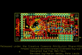
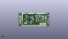
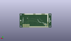
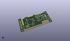

Contents
========

* [PROJ-SPAR-11343-STAN-01>IOIO-OTG](#proj-spar-11343-stan-01ioio-otg)
	* [Images](#images)
	* [Interactive BOM](#interactive-bom)
	* [OOMP Parts](#oomp-parts)
	* [Tags](#tags)
  
![][im]
# PROJ-SPAR-11343-STAN-01>IOIO-OTG

- ID: PROJ-SPAR-11343-STAN-01
- Hex ID: PRS11343
- Name: IOIO-OTG
- Description: 

## Images
  
  

|eagleImage|kicadPcb3dFront|kicadPcb3dBack|kicadPcb3d|
| :---: | :---: | :---: | :---: |
|||||

## Interactive BOM

- Interactive BOM page: [ibom.html](kicad/bom/ibom.html)

## OOMP Parts
  

|OOMP Parts|
| :---: |
|<table><tr><td></td><td> C1</td><td>[CAPC-0603-X-NF100-V50 SMD (0603) 100 nF Capacitor (Ceramic) 50v](https://github.com/oomlout/oomlout_OOMP_parts/tree/main/CAPC-0603-X-NF100-V50/)</td><td>[C6N100](https://github.com/oomlout/oomlout_OOMP_parts/tree/main/CAPC-0603-X-NF100-V50/)</td></tr></table>|
|<table><tr><td></td><td> C2</td><td>[CAPC-0603-X-NF100-V50 SMD (0603) 100 nF Capacitor (Ceramic) 50v](https://github.com/oomlout/oomlout_OOMP_parts/tree/main/CAPC-0603-X-NF100-V50/)</td><td>[C6N100](https://github.com/oomlout/oomlout_OOMP_parts/tree/main/CAPC-0603-X-NF100-V50/)</td></tr></table>|
|<table><tr><td></td><td> C3</td><td>[CAPC-0603-X-NF100-V50 SMD (0603) 100 nF Capacitor (Ceramic) 50v](https://github.com/oomlout/oomlout_OOMP_parts/tree/main/CAPC-0603-X-NF100-V50/)</td><td>[C6N100](https://github.com/oomlout/oomlout_OOMP_parts/tree/main/CAPC-0603-X-NF100-V50/)</td></tr></table>|
|<table><tr><td></td><td> C4</td><td>[CAPC-0603-X-NF100-V50 SMD (0603) 100 nF Capacitor (Ceramic) 50v](https://github.com/oomlout/oomlout_OOMP_parts/tree/main/CAPC-0603-X-NF100-V50/)</td><td>[C6N100](https://github.com/oomlout/oomlout_OOMP_parts/tree/main/CAPC-0603-X-NF100-V50/)</td></tr></table>|
|<table><tr><td></td><td> C5</td><td>[CAPC-0603-X-NF100-V50 SMD (0603) 100 nF Capacitor (Ceramic) 50v](https://github.com/oomlout/oomlout_OOMP_parts/tree/main/CAPC-0603-X-NF100-V50/)</td><td>[C6N100](https://github.com/oomlout/oomlout_OOMP_parts/tree/main/CAPC-0603-X-NF100-V50/)</td></tr></table>|
|CAPC-0805-X-UNMATCHED-01, C6, 51.6255, 25.506681269999994, 0,C6, 10uF, 0805-CAP, SparkFun-Capacitors, (2.0325, 1.00420005), R0|
|CAPC-UNMATCHED-X-UNMATCHED-01, C7, 17.1196, 23.0886, 270,C7, 10uF, EIA3216, SparkFun-Capacitors, (0.674, 0.909), R270|
|CAPC-0603-X-UNMATCHED-01, C8, 54.101996952, 17.912081269999998, 270,C8, 3.3nF, 0603-CAP, SparkFun-Capacitors, (2.12999988, 0.70520005), R270|
|<table><tr><td></td><td> C9</td><td>[CAPC-0603-X-NF100-V50 SMD (0603) 100 nF Capacitor (Ceramic) 50v](https://github.com/oomlout/oomlout_OOMP_parts/tree/main/CAPC-0603-X-NF100-V50/)</td><td>[C6N100](https://github.com/oomlout/oomlout_OOMP_parts/tree/main/CAPC-0603-X-NF100-V50/)</td></tr></table>|
|CAPC-UNMATCHED-X-UNMATCHED-01, C10, 38.862, 23.114, 90,C10, 10uF, EIA3216, SparkFun-Capacitors, (1.53, 0.91), R90|
|CAPC-1210-X-UNMATCHED-01, C11, 57.597040508, 23.426421777999998, 0,C11, 10uF, 1210, SparkFun-Capacitors, (2.26760002, 0.92230007), R0|
|UNMATCHED-UNMATCHED-X-UNMATCHED-01, D1, 42.163999999999994, 11.811, 180,D1, B340A, SMA-DIODE, SparkFun-DiscreteSemi, (1.66, 0.465), R180|
|UNMATCHED-UNMATCHED-X-UNMATCHED-01, D2, 56.2102, 17.2212, 270,D2, DZ2J160M0L, PANASONIC_SMINI2-F5-B, SparkFun-DiscreteSemi, (2.213, 0.678), R270|
|UNMATCHED-0603-X-UNMATCHED-01, D3, 32.004, 15.239999999999998, 180,D3, Yellow, LED-0603, SparkFun-LED, (1.26, 0.6), R180|
|UNMATCHED-0603-X-UNMATCHED-01, D5, 61.467999999999996, 29.209999999999997, 90,D5, Red, LED-0603, SparkFun-LED, (2.42, 1.15), R90|
|UNMATCHED-UNMATCHED-X-UNMATCHED-01, F1, 48.513999999999996, 12.318999999999999, 180,F1, 0.75A, PTC-1206, SparkFun-PowerIC, (1.91, 0.485), R180|
|<table><tr><td></td><td> JP1</td><td>[HEAD-I01-X-PI03-01 2.54 mm 3 Pin Header](https://github.com/oomlout/oomlout_OOMP_parts/tree/main/HEAD-I01-X-PI03-01/)</td><td>[H03](https://github.com/oomlout/oomlout_OOMP_parts/tree/main/HEAD-I01-X-PI03-01/)</td></tr></table>|
|<table><tr><td></td><td> JP2</td><td>[HEAD-I01-X-PI03-01 2.54 mm 3 Pin Header](https://github.com/oomlout/oomlout_OOMP_parts/tree/main/HEAD-I01-X-PI03-01/)</td><td>[H03](https://github.com/oomlout/oomlout_OOMP_parts/tree/main/HEAD-I01-X-PI03-01/)</td></tr></table>|
|HEAD-I01-X-PI01-01, JP3, 58.419999999999995, 29.209999999999997, 0,JP3, 1X01, SparkFun, (2.3, 1.15), R0|
|<table><tr><td></td><td> JP4</td><td>[HEAD-I01-X-PI03-01 2.54 mm 3 Pin Header](https://github.com/oomlout/oomlout_OOMP_parts/tree/main/HEAD-I01-X-PI03-01/)</td><td>[H03](https://github.com/oomlout/oomlout_OOMP_parts/tree/main/HEAD-I01-X-PI03-01/)</td></tr></table>|
|<table><tr><td></td><td> JP5</td><td>[HEAD-I01-X-PI03-01 2.54 mm 3 Pin Header](https://github.com/oomlout/oomlout_OOMP_parts/tree/main/HEAD-I01-X-PI03-01/)</td><td>[H03](https://github.com/oomlout/oomlout_OOMP_parts/tree/main/HEAD-I01-X-PI03-01/)</td></tr></table>|
|<table><tr><td></td><td> JP6</td><td>[HEAD-I01-X-PI03-01 2.54 mm 3 Pin Header](https://github.com/oomlout/oomlout_OOMP_parts/tree/main/HEAD-I01-X-PI03-01/)</td><td>[H03](https://github.com/oomlout/oomlout_OOMP_parts/tree/main/HEAD-I01-X-PI03-01/)</td></tr></table>|
|<table><tr><td></td><td> JP7</td><td>[HEAD-I01-X-PI16-01 2.54 mm 16 Pin Header](https://github.com/oomlout/oomlout_OOMP_parts/tree/main/HEAD-I01-X-PI16-01/)</td><td>[H16](https://github.com/oomlout/oomlout_OOMP_parts/tree/main/HEAD-I01-X-PI16-01/)</td></tr></table>|
|HEAD-I01-X-PI11-01, JP9, 7.619999999999999, 3.8099999999999996, 90,JP9, 1X11_NO_SILK, SparkFun-Connectors, (0.3, 0.15), R90|
|HEAD-I01-X-PI01-01, JP14, 15.239999999999998, 6.35, 0,JP14, 1X01, SparkFun, (0.6, 0.25), R0|
|HEAD-I01-X-PI01-01, JP15, 12.7, 6.35, 0,JP15, 1X01, SparkFun, (0.5, 0.25), R0|
|<table><tr><td></td><td> JP17</td><td>[HEAD-I01-X-PI03-01 2.54 mm 3 Pin Header](https://github.com/oomlout/oomlout_OOMP_parts/tree/main/HEAD-I01-X-PI03-01/)</td><td>[H03](https://github.com/oomlout/oomlout_OOMP_parts/tree/main/HEAD-I01-X-PI03-01/)</td></tr></table>|
|UNMATCHED-UNMATCHED-X-UNMATCHED-01, JP19, 64.77, 20.32, 270,JP19, JST, JST-2-SMD, SparkFun-Connectors, (2.55, 0.8), R270|
|HEAD-I01-X-PI19-01, JP20, 55.88, 29.209999999999997, 180,JP20, 1X19_NO_SILK, SparkFun-Connectors, (2.2, 1.15), R180|
|ERROR, JP21 AB MICRO, 0, 0, 0,JP21, AB, MICRO, USB, USB-AB-MICRO-SMD_V03, SparkFun-Connectors, (2.62, 0.4), R180|
|UNMATCHED-0603-X-UNMATCHED-01, L1, 27.872515502, 7.768040598, 315,L1, 30Ohm,1.8A, 0603, SparkFun-Passives, (1.09734313, 0.30582837), R315|
|UNMATCHED-UNMATCHED-X-UNMATCHED-01, L2, 47.00524050799999, 23.27656254, 180,L2, VLC5045T-3R3N, CR54, SparkFun-Passives, (1.85060002, 0.9164001), R180|
|UNMATCHED-UNMATCHED-X-UNMATCHED-01, Q1, 40.64, 15.112999999999998, 270,Q1, IRLML2244, SOT23-3, SparkFun-DiscreteSemi, (1.6, 0.595), R270|
|UNMATCHED-UNMATCHED-X-UNMATCHED-01, Q2, 40.513, 18.160999999999998, 270,Q2, 2N7002PW, SOT323, SparkFun-DiscreteSemi, (1.595, 0.715), R270|
|UNMATCHED-UNMATCHED-X-UNMATCHED-01, Q3, 58.62574050799999, 17.018, 0,Q3, MOSFET-NCHANNELAO3404A, SOT23-3, SparkFun-DiscreteSemi, (2.30810002, 0.67), R0|
|<table><tr><td></td><td> R1</td><td>[RESE-0603-X-O103-01 SMD (0603) 10k Ohm Resistor](https://github.com/oomlout/oomlout_OOMP_parts/tree/main/RESE-0603-X-O103-01/)</td><td>[R6103](https://github.com/oomlout/oomlout_OOMP_parts/tree/main/RESE-0603-X-O103-01/)</td></tr></table>|
|<table><tr><td></td><td> R2</td><td>[RESE-0603-X-O104-01 SMD (0603) 100k Ohm Resistor](https://github.com/oomlout/oomlout_OOMP_parts/tree/main/RESE-0603-X-O104-01/)</td><td>[R6104](https://github.com/oomlout/oomlout_OOMP_parts/tree/main/RESE-0603-X-O104-01/)</td></tr></table>|
|RESE-UNMATCHED-X-UNMATCHED-01, R3, 47.244, 16.256, 270,R3, TS53YL502MR10, TRIMPOT_5MM, SparkFun-Electromechanical, (1.86, 0.64), R270|
|RESE-0603-X-UNMATCHED-01, R4, 53.736240507999995, 15.613378222, 180,R4, 3.3k, 0603-RES, SparkFun-Resistors, (2.11560002, 0.61469993), R180|
|RESE-0603-X-UNMATCHED-01, R7, 33.274, 15.239999999999998, 270,R7, 750, 0603-RES, SparkFun-Resistors, (1.31, 0.6), R270|
|RESE-0603-X-UNMATCHED-01, R8, 16.433799999999998, 9.7282, 225,R8, 470, 0603-RES, SparkFun-Resistors, (0.647, 0.383), R225|
|RESE-0603-X-UNMATCHED-01, R9, 61.467999999999996, 27.94, 180,R9, 1.6K, 0603-RES, SparkFun-Resistors, (2.42, 1.1), R180|
|UNMATCHED-UNMATCHED-X-UNMATCHED-01, S1, 57.022999999999996, 12.6365, 180,S1, SWITCH_SPDT, KPS-1290, SparkFun-Electromechanical, (2.245, 0.4975), R180|
|UNMATCHED-UNMATCHED-X-UNMATCHED-01, U1, 23.114, 15.239999999999998, 315,U1, PIC24FJ256GB206, PIC24FXXX_TQFP64, SparkFun-DigitalIC, (0.91, 0.6), R315|
|UNMATCHED-UNMATCHED-X-UNMATCHED-01, U2, 52.958999999999996, 21.95068127, 0,U2, TPS62133RGTT, QFN16-3X3MM_1:1_V03, SparkFun-PowerIC, (2.085, 0.86420005), R0|
|UNMATCHED-UNMATCHED-X-UNMATCHED-01, U3, 42.037, 22.987, 180,U3, MIC5216, MSOP8, SparkFun-PowerIC, (1.655, 0.905), R180|

## Tags

- hexID: PRS11343
- oompType: PROJ
- oompSize: SPAR
- oompColor: 11343
- oompDesc: STAN
- oompIndex: 01
- oompName: IOIO-OTG
- sources: All source files from https://github.com/sparkfun/IOIO-OTG (source licence details in srcLicense.md)
- linkBuyPage: https://www.sparkfun.com/products/11343
- oompID: PROJ-SPAR-11343-STAN-01
- oompPart: CAPC-0603-X-NF100-V50, C1, 26.768515677999996, 6.630671778, 315
- oompPart: CAPC-0603-X-NF100-V50, C2, 30.810200000000002, 20.726399999999998, 45
- oompPart: CAPC-0603-X-NF100-V50, C3, 29.921199999999995, 9.7536, 315
- oompPart: CAPC-0603-X-NF100-V50, C4, 17.713784486, 5.849450074, 225
- oompPart: CAPC-0603-X-NF100-V50, C5, 31.927799999999994, 18.694399999999998, 45
- oompPart: CAPC-0805-X-UNMATCHED-01, C6, 51.6255, 25.506681269999994, 0
- oompPart: CAPC-UNMATCHED-X-UNMATCHED-01, C7, 17.1196, 23.0886, 270
- oompPart: CAPC-0603-X-UNMATCHED-01, C8, 54.101996952, 17.912081269999998, 270
- oompPart: CAPC-0603-X-NF100-V50, C9, 55.75045619, 20.500340508, 270
- oompPart: CAPC-UNMATCHED-X-UNMATCHED-01, C10, 38.862, 23.114, 90
- oompPart: CAPC-1210-X-UNMATCHED-01, C11, 57.597040508, 23.426421777999998, 0
- oompPart: UNMATCHED-UNMATCHED-X-UNMATCHED-01, D1, 42.163999999999994, 11.811, 180
- oompPart: UNMATCHED-UNMATCHED-X-UNMATCHED-01, D2, 56.2102, 17.2212, 270
- oompPart: UNMATCHED-0603-X-UNMATCHED-01, D3, 32.004, 15.239999999999998, 180
- oompPart: UNMATCHED-0603-X-UNMATCHED-01, D5, 61.467999999999996, 29.209999999999997, 90
- oompPart: UNMATCHED-UNMATCHED-X-UNMATCHED-01, F1, 48.513999999999996, 12.318999999999999, 180
- oompPart: HEAD-I01-X-PI03-01, JP1, 60.959999999999994, 1.27, 90
- oompPart: HEAD-I01-X-PI03-01, JP2, 50.8, 6.35, 270
- oompPart: HEAD-I01-X-PI01-01, JP3, 58.419999999999995, 29.209999999999997, 0
- oompPart: HEAD-I01-X-PI03-01, JP4, 55.88, 6.35, 270
- oompPart: HEAD-I01-X-PI03-01, JP5, 58.419999999999995, 6.35, 270
- oompPart: HEAD-I01-X-PI03-01, JP6, 53.339999999999996, 6.35, 270
- oompPart: HEAD-I01-X-PI16-01, JP7, 45.72, 1.27, 180
- oompPart: SKIP-UNMATCHED-X-UNMATCHED-01, JP8, 5.334, 1.27, 0
- oompPart: HEAD-I01-X-PI11-01, JP9, 7.619999999999999, 3.8099999999999996, 90
- oompPart: HEAD-I01-X-PI01-01, JP14, 15.239999999999998, 6.35, 0
- oompPart: HEAD-I01-X-PI01-01, JP15, 12.7, 6.35, 0
- oompPart: SKIP-UNMATCHED-X-UNMATCHED-01, JP16, 63.75399999999999, 29.717999999999996, 0
- oompPart: HEAD-I01-X-PI03-01, JP17, 48.26, 1.27, 90
- oompPart: UNMATCHED-UNMATCHED-X-UNMATCHED-01, JP19, 64.77, 20.32, 270
- oompPart: HEAD-I01-X-PI19-01, JP20, 55.88, 29.209999999999997, 180
- oompPart: ERROR, JP21 AB MICRO, 0, 0, 0
- oompPart: UNMATCHED-0603-X-UNMATCHED-01, L1, 27.872515502, 7.768040598, 315
- oompPart: UNMATCHED-UNMATCHED-X-UNMATCHED-01, L2, 47.00524050799999, 23.27656254, 180
- oompPart: UNMATCHED-UNMATCHED-X-UNMATCHED-01, Q1, 40.64, 15.112999999999998, 270
- oompPart: UNMATCHED-UNMATCHED-X-UNMATCHED-01, Q2, 40.513, 18.160999999999998, 270
- oompPart: UNMATCHED-UNMATCHED-X-UNMATCHED-01, Q3, 58.62574050799999, 17.018, 0
- oompPart: RESE-0603-X-O103-01, R1, 17.551399999999997, 8.6106, 45
- oompPart: RESE-0603-X-O104-01, R2, 29.413199999999996, 21.3614, 45
- oompPart: RESE-UNMATCHED-X-UNMATCHED-01, R3, 47.244, 16.256, 270
- oompPart: RESE-0603-X-UNMATCHED-01, R4, 53.736240507999995, 15.613378222, 180
- oompPart: RESE-0603-X-UNMATCHED-01, R7, 33.274, 15.239999999999998, 270
- oompPart: RESE-0603-X-UNMATCHED-01, R8, 16.433799999999998, 9.7282, 225
- oompPart: RESE-0603-X-UNMATCHED-01, R9, 61.467999999999996, 27.94, 180
- oompPart: UNMATCHED-UNMATCHED-X-UNMATCHED-01, S1, 57.022999999999996, 12.6365, 180
- oompPart: SKIP-UNMATCHED-X-UNMATCHED-01, TP1, 65.65899999999999, 12.572999999999999, M0
- oompPart: SKIP-UNMATCHED-X-UNMATCHED-01, TP2, 65.405, 10.287, M0
- oompPart: SKIP-UNMATCHED-X-UNMATCHED-01, TP3, 65.65899999999999, 8.001, M0
- oompPart: UNMATCHED-UNMATCHED-X-UNMATCHED-01, U1, 23.114, 15.239999999999998, 315
- oompPart: UNMATCHED-UNMATCHED-X-UNMATCHED-01, U2, 52.958999999999996, 21.95068127, 0
- oompPart: UNMATCHED-UNMATCHED-X-UNMATCHED-01, U3, 42.037, 22.987, 180
- rawPart: C1, 0.1uF, 0603-CAP, SparkFun-Capacitors, (1.05387857, 0.26105007), R315
- rawPart: C2, 0.1uF, 0603-CAP, SparkFun-Capacitors, (1.213, 0.816), R45
- rawPart: C3, 0.1uF, 0603-CAP, SparkFun-Capacitors, (1.178, 0.384), R315
- rawPart: C4, 0.1uF, 0603-CAP, SparkFun-Capacitors, (0.69739309, 0.23029331), R225
- rawPart: C5, 0.1uF, 0603-CAP, SparkFun-Capacitors, (1.257, 0.736), R45
- rawPart: C6, 10uF, 0805-CAP, SparkFun-Capacitors, (2.0325, 1.00420005), R0
- rawPart: C7, 10uF, EIA3216, SparkFun-Capacitors, (0.674, 0.909), R270
- rawPart: C8, 3.3nF, 0603-CAP, SparkFun-Capacitors, (2.12999988, 0.70520005), R270
- rawPart: C9, 0.1uF, 0603-CAP, SparkFun-Capacitors, (2.19489985, 0.80710002), R270
- rawPart: C10, 10uF, EIA3216, SparkFun-Capacitors, (1.53, 0.91), R90
- rawPart: C11, 10uF, 1210, SparkFun-Capacitors, (2.26760002, 0.92230007), R0
- rawPart: D1, B340A, SMA-DIODE, SparkFun-DiscreteSemi, (1.66, 0.465), R180
- rawPart: D2, DZ2J160M0L, PANASONIC_SMINI2-F5-B, SparkFun-DiscreteSemi, (2.213, 0.678), R270
- rawPart: D3, Yellow, LED-0603, SparkFun-LED, (1.26, 0.6), R180
- rawPart: D5, Red, LED-0603, SparkFun-LED, (2.42, 1.15), R90
- rawPart: F1, 0.75A, PTC-1206, SparkFun-PowerIC, (1.91, 0.485), R180
- rawPart: JP1, 1X03, SparkFun, (2.4, 0.05), R90
- rawPart: JP2, 1X03, SparkFun, (2, 0.25), R270
- rawPart: JP3, 1X01, SparkFun, (2.3, 1.15), R0
- rawPart: JP4, 1X03, SparkFun, (2.2, 0.25), R270
- rawPart: JP5, 1X03, SparkFun, (2.3, 0.25), R270
- rawPart: JP6, 1X03, SparkFun, (2.1, 0.25), R270
- rawPart: JP7, 1X16_NO_SILK, SparkFun-Connectors, (1.8, 0.05), R180
- rawPart: JP8, FIDUCIALUFIDUCIAL, MICRO-FIDUCIAL, SparkFun, (0.21, 0.05), R0
- rawPart: JP9, 1X11_NO_SILK, SparkFun-Connectors, (0.3, 0.15), R90
- rawPart: JP14, 1X01, SparkFun, (0.6, 0.25), R0
- rawPart: JP15, 1X01, SparkFun, (0.5, 0.25), R0
- rawPart: JP16, FIDUCIALUFIDUCIAL, MICRO-FIDUCIAL, SparkFun, (2.51, 1.17), R0
- rawPart: JP17, 1X03, SparkFun, (1.9, 0.05), R90
- rawPart: JP19, JST, JST-2-SMD, SparkFun-Connectors, (2.55, 0.8), R270
- rawPart: JP20, 1X19_NO_SILK, SparkFun-Connectors, (2.2, 1.15), R180
- rawPart: JP21, AB, MICRO, USB, USB-AB-MICRO-SMD_V03, SparkFun-Connectors, (2.62, 0.4), R180
- rawPart: L1, 30Ohm,1.8A, 0603, SparkFun-Passives, (1.09734313, 0.30582837), R315
- rawPart: L2, VLC5045T-3R3N, CR54, SparkFun-Passives, (1.85060002, 0.9164001), R180
- rawPart: Q1, IRLML2244, SOT23-3, SparkFun-DiscreteSemi, (1.6, 0.595), R270
- rawPart: Q2, 2N7002PW, SOT323, SparkFun-DiscreteSemi, (1.595, 0.715), R270
- rawPart: Q3, MOSFET-NCHANNELAO3404A, SOT23-3, SparkFun-DiscreteSemi, (2.30810002, 0.67), R0
- rawPart: R1, 10K, 0603-RES, SparkFun-Resistors, (0.691, 0.339), R45
- rawPart: R2, 100k, 0603-RES, SparkFun-Resistors, (1.158, 0.841), R45
- rawPart: R3, TS53YL502MR10, TRIMPOT_5MM, SparkFun-Electromechanical, (1.86, 0.64), R270
- rawPart: R4, 3.3k, 0603-RES, SparkFun-Resistors, (2.11560002, 0.61469993), R180
- rawPart: R7, 750, 0603-RES, SparkFun-Resistors, (1.31, 0.6), R270
- rawPart: R8, 470, 0603-RES, SparkFun-Resistors, (0.647, 0.383), R225
- rawPart: R9, 1.6K, 0603-RES, SparkFun-Resistors, (2.42, 1.1), R180
- rawPart: S1, SWITCH_SPDT, KPS-1290, SparkFun-Electromechanical, (2.245, 0.4975), R180
- rawPart: TP1, TEST-POINT3, PAD.03X.03, SparkFun-Passives, (2.585, 0.495), MR0
- rawPart: TP2, TEST-POINT3, PAD.03X.03, SparkFun-Passives, (2.575, 0.405), MR0
- rawPart: TP3, TEST-POINT3, PAD.03X.03, SparkFun-Passives, (2.585, 0.315), MR0
- rawPart: U1, PIC24FJ256GB206, PIC24FXXX_TQFP64, SparkFun-DigitalIC, (0.91, 0.6), R315
- rawPart: U2, TPS62133RGTT, QFN16-3X3MM_1:1_V03, SparkFun-PowerIC, (2.085, 0.86420005), R0
- rawPart: U3, MIC5216, MSOP8, SparkFun-PowerIC, (1.655, 0.905), R180

[im]: kicadPcb3d_450.png
