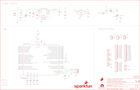

Contents
========

* [PRS11343 > Sparkfun](#prs11343--sparkfun)
	* [Images](#images)
	* [Tags](#tags)
  
![][im]
# PRS11343 > Sparkfun

- ID: PROJ-SPAR-11343-STAN-01
- Hex ID: PRS11343
- Name: Sparkfun
- Description: Sparkfun

## Images
  
  

|kicadPcb3d|kicadPcb3dFront|kicadPcb3dBack|eagleImage|eagleSchemImage|
| :---: | :---: | :---: | :---: | :---: |
||||||

## Tags

- hexID: PRS11343
- oompType: PROJ
- oompSize: SPAR
- oompColor: 11343
- oompDesc: STAN
- oompIndex: 01
- oompName: IOIO-OTG
- sources: All source files from https://github.com/sparkfun/IOIO-OTG (source licence details in srcLicense.md)
- linkBuyPage: https://www.sparkfun.com/products/11343
- oompID: PROJ-SPAR-11343-STAN-01
- oompParts: C1,UNMATCHED-UNMATCHED-UNMATCHED-UNMATCHED-UNMATCHED
- oompParts: C2,UNMATCHED-UNMATCHED-UNMATCHED-UNMATCHED-UNMATCHED
- oompParts: C3,UNMATCHED-UNMATCHED-UNMATCHED-UNMATCHED-UNMATCHED
- oompParts: C4,UNMATCHED-UNMATCHED-UNMATCHED-UNMATCHED-UNMATCHED
- oompParts: C5,UNMATCHED-UNMATCHED-UNMATCHED-UNMATCHED-UNMATCHED
- oompParts: C6,UNMATCHED-UNMATCHED-UNMATCHED-UNMATCHED-UNMATCHED
- oompParts: C7,UNMATCHED-UNMATCHED-UNMATCHED-UNMATCHED-UNMATCHED
- oompParts: C8,UNMATCHED-UNMATCHED-UNMATCHED-UNMATCHED-UNMATCHED
- oompParts: C9,UNMATCHED-UNMATCHED-UNMATCHED-UNMATCHED-UNMATCHED
- oompParts: C10,UNMATCHED-UNMATCHED-UNMATCHED-UNMATCHED-UNMATCHED
- oompParts: C11,UNMATCHED-UNMATCHED-UNMATCHED-UNMATCHED-UNMATCHED
- oompParts: D1,UNMATCHED-UNMATCHED-UNMATCHED-UNMATCHED-UNMATCHED
- oompParts: D2,UNMATCHED-UNMATCHED-UNMATCHED-UNMATCHED-UNMATCHED
- oompParts: D3,UNMATCHED-UNMATCHED-UNMATCHED-UNMATCHED-UNMATCHED
- oompParts: D5,UNMATCHED-UNMATCHED-UNMATCHED-UNMATCHED-UNMATCHED
- oompParts: F1,UNMATCHED-UNMATCHED-UNMATCHED-UNMATCHED-UNMATCHED
- oompParts: FRAME2,UNMATCHED-UNMATCHED-UNMATCHED-UNMATCHED-UNMATCHED
- oompParts: JP1,UNMATCHED-UNMATCHED-UNMATCHED-UNMATCHED-UNMATCHED
- oompParts: JP2,UNMATCHED-UNMATCHED-UNMATCHED-UNMATCHED-UNMATCHED
- oompParts: JP3,UNMATCHED-UNMATCHED-UNMATCHED-UNMATCHED-UNMATCHED
- oompParts: JP4,UNMATCHED-UNMATCHED-UNMATCHED-UNMATCHED-UNMATCHED
- oompParts: JP5,UNMATCHED-UNMATCHED-UNMATCHED-UNMATCHED-UNMATCHED
- oompParts: JP6,UNMATCHED-UNMATCHED-UNMATCHED-UNMATCHED-UNMATCHED
- oompParts: JP7,UNMATCHED-UNMATCHED-UNMATCHED-UNMATCHED-UNMATCHED
- oompParts: JP9,UNMATCHED-UNMATCHED-UNMATCHED-UNMATCHED-UNMATCHED
- oompParts: JP10,UNMATCHED-UNMATCHED-UNMATCHED-UNMATCHED-UNMATCHED
- oompParts: JP11,UNMATCHED-UNMATCHED-UNMATCHED-UNMATCHED-UNMATCHED
- oompParts: JP12,UNMATCHED-UNMATCHED-UNMATCHED-UNMATCHED-UNMATCHED
- oompParts: JP13,UNMATCHED-UNMATCHED-UNMATCHED-UNMATCHED-UNMATCHED
- oompParts: JP14,UNMATCHED-UNMATCHED-UNMATCHED-UNMATCHED-UNMATCHED
- oompParts: JP15,UNMATCHED-UNMATCHED-UNMATCHED-UNMATCHED-UNMATCHED
- oompParts: JP17,UNMATCHED-UNMATCHED-UNMATCHED-UNMATCHED-UNMATCHED
- oompParts: JP19,UNMATCHED-UNMATCHED-UNMATCHED-UNMATCHED-UNMATCHED
- oompParts: JP20,UNMATCHED-UNMATCHED-UNMATCHED-UNMATCHED-UNMATCHED
- oompParts: JP21,UNMATCHED-UNMATCHED-UNMATCHED-UNMATCHED-UNMATCHED
- oompParts: L1,UNMATCHED-UNMATCHED-UNMATCHED-UNMATCHED-UNMATCHED
- oompParts: L2,UNMATCHED-UNMATCHED-UNMATCHED-UNMATCHED-UNMATCHED
- oompParts: LOGO1,UNMATCHED-UNMATCHED-UNMATCHED-UNMATCHED-UNMATCHED
- oompParts: LOGO2,UNMATCHED-UNMATCHED-UNMATCHED-UNMATCHED-UNMATCHED
- oompParts: LOGO3,UNMATCHED-UNMATCHED-UNMATCHED-UNMATCHED-UNMATCHED
- oompParts: Q1,UNMATCHED-UNMATCHED-UNMATCHED-UNMATCHED-UNMATCHED
- oompParts: Q2,UNMATCHED-UNMATCHED-UNMATCHED-UNMATCHED-UNMATCHED
- oompParts: Q3,UNMATCHED-UNMATCHED-UNMATCHED-UNMATCHED-UNMATCHED
- oompParts: R1,UNMATCHED-UNMATCHED-UNMATCHED-UNMATCHED-UNMATCHED
- oompParts: R2,UNMATCHED-UNMATCHED-UNMATCHED-UNMATCHED-UNMATCHED
- oompParts: R3,UNMATCHED-UNMATCHED-UNMATCHED-UNMATCHED-UNMATCHED
- oompParts: R4,UNMATCHED-UNMATCHED-UNMATCHED-UNMATCHED-UNMATCHED
- oompParts: R7,UNMATCHED-UNMATCHED-UNMATCHED-UNMATCHED-UNMATCHED
- oompParts: R8,UNMATCHED-UNMATCHED-UNMATCHED-UNMATCHED-UNMATCHED
- oompParts: R9,UNMATCHED-UNMATCHED-UNMATCHED-UNMATCHED-UNMATCHED
- oompParts: S1,UNMATCHED-UNMATCHED-UNMATCHED-UNMATCHED-UNMATCHED
- oompParts: TP1,UNMATCHED-UNMATCHED-UNMATCHED-UNMATCHED-UNMATCHED
- oompParts: TP2,UNMATCHED-UNMATCHED-UNMATCHED-UNMATCHED-UNMATCHED
- oompParts: TP3,UNMATCHED-UNMATCHED-UNMATCHED-UNMATCHED-UNMATCHED
- oompParts: U$6,UNMATCHED-UNMATCHED-UNMATCHED-UNMATCHED-UNMATCHED
- oompParts: U1,UNMATCHED-UNMATCHED-UNMATCHED-UNMATCHED-UNMATCHED
- oompParts: U2,UNMATCHED-UNMATCHED-UNMATCHED-UNMATCHED-UNMATCHED
- oompParts: U3,UNMATCHED-UNMATCHED-UNMATCHED-UNMATCHED-UNMATCHED
- rawParts: C1,0.1uF,0.1UF-25V(+80/-20%)(0603),0603-CAP,CAP-00810,,,,,CAP-00810,,,0.1uF,
- rawParts: C2,0.1uF,0.1UF-25V(+80/-20%)(0603),0603-CAP,CAP-00810,,,,,CAP-00810,,,0.1uF,
- rawParts: C3,0.1uF,0.1UF-25V(+80/-20%)(0603),0603-CAP,CAP-00810,,,,,CAP-00810,,,0.1uF,
- rawParts: C4,0.1uF,0.1UF-25V(+80/-20%)(0603),0603-CAP,CAP-00810,,,,,CAP-00810,,,0.1uF,
- rawParts: C5,0.1uF,0.1UF-25V(+80/-20%)(0603),0603-CAP,CAP-00810,,,,,CAP-00810,,,0.1uF,
- rawParts: C6,10uF,10UF10V10%(0805),0805-CAP,CAP-11330,,,,LMK212BJ106KG-T,CAP-11330,,,,
- rawParts: C7,10uF,10UF-16V-10%(TANT),EIA3216,CAP-00811,,,,,CAP-00811,,,10uF,
- rawParts: C8,3.3nF,3.3NF-100V-10%(0603),0603-CAP,CAP-09633,,,,,CAP-09633,,,3.3nF,
- rawParts: C9,0.1uF,0.1UF-25V(+80/-20%)(0603),0603-CAP,CAP-00810,,,,,CAP-00810,,,0.1uF,
- rawParts: C10,10uF,10UF-16V-10%(TANT),EIA3216,CAP-00811,,,,TAJA106K016RNJ,CAP-00811,,,10uF,
- rawParts: C11,10uF,10UF50V20%(1210),1210,CAP-09824,,,,UMK325C7106MM-T,CAP-09824,,,10uF,
- rawParts: D1,B340A,DIODE-SCHOTTKY-B340A,SMA-DIODE,Schottky diodes in SFEs production catalog,,,,B340A,DIO-09886,,,B340A,
- rawParts: D2,DZ2J160M0L,DIODE-ZENERDZ2J150M0L,PANASONIC_SMINI2-F5-B,Zener Diode,,,,DZ2J150M0L,DIO-12989,,,,
- rawParts: D3,Yellow,LED-YELLOW0603-SMART,LED-0603,Yellow SMD LEDs,,,,,DIO-11230,,,Yellow,
- rawParts: D5,Red,LED-RED0603-SMART,LED-0603,Assorted Red LEDs,,,,,DIO-11154,,,Red,
- rawParts: F1,0.75A,PTCSMD,PTC-1206,Resettable Fuse PTC,,,,0ZCA0075FF2G,RES-11150,,,,
- rawParts: FRAME2,FRAME-LEDGER,FRAME-LEDGER,CREATIVE_COMMONS,Schematic Frame,,,,,,,,,
- rawParts: JP1,,M03PTH,1X03,Header 3,,,,,,,,,
- rawParts: JP2,,M03PTH,1X03,Header 3,,,,,,,,,
- rawParts: JP3,,M01PTH,1X01,Header 1,,,,,,,,,
- rawParts: JP4,,M03PTH,1X03,Header 3,,,,,,,,,
- rawParts: JP5,,M03PTH,1X03,Header 3,,,,,,,,,
- rawParts: JP6,,M03PTH,1X03,Header 3,,,,,,,,,
- rawParts: JP7,,M161X16_NO_SILK,1X16_NO_SILK,1x16 .1 header,,,,,,,,,
- rawParts: JP8,FIDUCIALUFIDUCIAL,FIDUCIALUFIDUCIAL,MICRO-FIDUCIAL,Fiducial Alignment Points,,,,,,,,,
- rawParts: JP9,,M111X11_NO_SILK,1X11_NO_SILK,Header 11,,,,,,,,,
- rawParts: JP10,STAND-OFF,STAND-OFF,STAND-OFF,Stand Off,,,,,,,,,
- rawParts: JP11,STAND-OFF,STAND-OFF,STAND-OFF,Stand Off,,,,,,,,,
- rawParts: JP12,STAND-OFF,STAND-OFF,STAND-OFF,Stand Off,,,,,,,,,
- rawParts: JP13,STAND-OFF,STAND-OFF,STAND-OFF,Stand Off,,,,,,,,,
- rawParts: JP14,,M01PTH,1X01,Header 1,,,,,,,,,
- rawParts: JP15,,M01PTH,1X01,Header 1,,,,,,,,,
- rawParts: JP16,FIDUCIALUFIDUCIAL,FIDUCIALUFIDUCIAL,MICRO-FIDUCIAL,Fiducial Alignment Points,,,,,,,,,
- rawParts: JP17,,M03PTH,1X03,Header 3,,,,,,,,,
- rawParts: JP19,JST,JST_2MM_MALE,JST-2-SMD,Mates to single-cell LiPo batteries.,,-,+,,CONN-11443,-,+,,
- rawParts: JP20,,M191X19_NO_SILK,1X19_NO_SILK,1x19 .1 header,,,,,,,,,
- rawParts: JP21,AB MICRO USB,USB-ABCONN-11794,USB-AB-MICRO-SMD_V03,This is a USB AB connector that is compatible with USB OTG. i.e. this connector can serve as a host or device,,,,,CONN-11794,,,,
- rawParts: L1,30Ohm,1.8A,INDUCTOR30OHM,1.8A,0603,Inductors,,,,,RES-07859,,,,
- rawParts: L2,VLC5045T-3R3N,INDUCTORCR54-3.3UH,CR54,Inductors,3.3uH,,,,NDUC-11157,,,,
- rawParts: LOGO1,OSHW-LOGOS,OSHW-LOGOS,OSHW-LOGO-S,Open Source Hardware Logo,,,,,,,,,
- rawParts: LOGO2,SFE_LOGO_NAME_FLAME.1_INCH,SFE_LOGO_NAME_FLAME.1_INCH,SFE_LOGO_NAME_FLAME_.1,SFE Logo, name and flame,,,,,,,,,
- rawParts: LOGO3,SFE_LOGO_FLAME.1_INCH,SFE_LOGO_FLAME.1_INCH,SFE_LOGO_FLAME_.1,SFE Logo, flame only,,,,,,,,,
- rawParts: Q1,IRLML2244,MOSFET-PCHANNELIRLML2244,SOT23-3,Generic PMOSFET,,,,,TRANS-11153,,,,
- rawParts: Q2,2N7002PW,MOSFET-NCHANNEL2N7002PW,SOT323,Common NMOSFET Parts,,,,2N7002PW,TRANS-11151,,,,
- rawParts: Q3,MOSFET-NCHANNELAO3404A,MOSFET-NCHANNELAO3404A,SOT23-3,Common NMOSFET Parts,,,,AO3404A,TRAN-12988,,,,
- rawParts: R1,10K,10KOHM-1/10W-1%(0603)0603,0603-RES,RES-00824,,,,,RES-00824,,,10K,
- rawParts: R2,100k,100KOHM-1/10W-1%(0603),0603-RES,RES-07828,,,,,RES-07828,,,100k,
- rawParts: R3,TS53YL502MR10,TRIMPOTRES-11156,TRIMPOT_5MM,Various small potentiometers for set-and-forget applications,,,,TS53YL502MR10,RES-11156,,,,
- rawParts: R4,3.3k,3.3KOHM1/10W1%(0603),0603-RES,RES-07851,,,,,RES-07851,,,,
- rawParts: R7,750,750OHM1/10W1%(0603)0603,0603-RES,RES-07824,,,,,RES-07824,,,750,
- rawParts: R8,470,470OHM1/10W1%(0603),0603-RES,RES-07869,,,,,RES-07869,,,470,
- rawParts: R9,1.6K,1.6KOHM-1/10W-1%(0603)0603,0603-RES,RES-08361,,,,,RES-08361,,,1.6K,
- rawParts: S1,SWITCH_SPDT,SWITCH_SPDT,KPS-1290,SWCH-10651,,,,,SWCH-10651,,,,
- rawParts: TP1,TEST-POINT3,TEST-POINT3,PAD.03X.03,Bare copper test points for troubleshooting or ICT,,,,,,,,,
- rawParts: TP2,TEST-POINT3,TEST-POINT3,PAD.03X.03,Bare copper test points for troubleshooting or ICT,,,,,,,,,
- rawParts: TP3,TEST-POINT3,TEST-POINT3,PAD.03X.03,Bare copper test points for troubleshooting or ICT,,,,,,,,,
- rawParts: U$6,IOIO-OTG,IOIO-OTG,IOIO-OTG-COPPER-EXPOSED,Labels for the IOIO-OTG,,,,,,,,,
- rawParts: U1,PIC24FJ256GB206,PIC24FXXXGPX06,PIC24FXXX_TQFP64,PIC24FXXXGPX06,,,,,IC-11312,,,,
- rawParts: U2,TPS62133RGTT,TPS62133RGTT,QFN16-3X3MM_1:1_V03,3-17V, 2A Step Down Converter,,,,,IC-11155,,,,
- rawParts: U3,MIC5216,V_REG_MIC5216,MSOP8,500mA LDO, MSOP8 for better dissipation,,,,,IC-09527,,,,

[im]: kicadPcb3d_450.png
