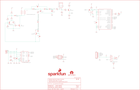
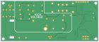

Contents
========

* [PRS11345 > Geiger Counter](#prs11345--geiger-counter)
	* [Schematic](#schematic)
	* [PCB](#pcb)
	* [Interactive BOM](#interactive-bom)
	* [OOMP Parts](#oomp-parts)
	* [Images](#images)
	* [Tags](#tags)
  
![][im]
# PRS11345 > Geiger Counter

- ID: PROJ-SPAR-11345-STAN-01
- Hex ID: PRS11345
- Name: Sparkfun
- Description: Sparkfun
- Long Link: [http://oom.lt/PROJ-SPAR-11345-STAN-01](http://oom.lt/PROJ-SPAR-11345-STAN-01)
- Short Link: [http://oom.lt/PRS11345](http://oom.lt/PRS11345)

## Schematic
  

## PCB
  

## Interactive BOM

- Interactive BOM page: [ibom.html](https://htmlpreview.github.io/?https://github.com/oomlout/oomlout_OOMP_projects/blob/main/PROJ-SPAR-11345-STAN-01/kicad/bom/ibom.html)

## OOMP Parts
  

|OOMP Parts|
| :---: |
|[CAPC-0603-X-NF100-V50  SMD (0603) 100 nF Capacitor (Ceramic) 50v  C1, C3, C7, C11](https://github.com/oomlout/oomlout_OOMP_parts/tree/main/CAPC-0603-X-NF100-V50/)|
|CAPT-3216-X-UF10-01 C2, C10|
|CAPX-UNMATCHED-X-UNMATCHED-01 C4, C5, C6|
|DIOD-UNMATCHED-X-UNMATCHED-01 D1, D2, D3, D4|
|REFU-1206-X-UNMATCHED-01 F1|
|[HEAD-I01-X-PI06-01  2.54 mm 6 Pin Header  JP2](https://github.com/oomlout/oomlout_OOMP_parts/tree/main/HEAD-I01-X-PI06-01/)|
|LEDS-1206-R-STAN-01 LED1|
|LEDS-1206-G-STAN-01 LED2|
|UNMATCHED-SO23-X-UNMATCHED-01 Q1, Q3|
|UNMATCHED-UNMATCHED-X-UNMATCHED-01 Q2, Q4, S1, S2, U$6, U$7, U$8, U7, U8, U10, U17, X1|
|[RESE-0603-X-O102-01  SMD (0603) 1k Ohm Resistor  R1, R2](https://github.com/oomlout/oomlout_OOMP_parts/tree/main/RESE-0603-X-O102-01/)|
|RESE-0603-X-O1003-01 R3|
|RESE-0603-X-O1503-01 R4|
|RESE-0603-X-UNMATCHED-01 R5|
|RESE-UNMATCHED-X-O103-01 R6|
|RESE-UNMATCHED-X-O106-01 R8, R9, R15|
|[RESE-0603-X-O103-01  SMD (0603) 10k Ohm Resistor  R11](https://github.com/oomlout/oomlout_OOMP_parts/tree/main/RESE-0603-X-O103-01/)|
|[RESE-0603-X-O331-01  SMD (0603) 330 Ohm Resistor  R12, R13](https://github.com/oomlout/oomlout_OOMP_parts/tree/main/RESE-0603-X-O331-01/)|
|RESE-UNMATCHED-X-O105-01 R14, R17|
|RESE-UNMATCHED-X-O153-01 R16|

## Images
  
  

|bominteractivefront|bominteractiveback|kicadPcb3d|kicadPcb3dFront|kicadPcb3dBack|eagleImage|eagleSchemImage|pcbdraw|pcbdrawback|
| :---: | :---: | :---: | :---: | :---: | :---: | :---: | :---: | :---: |
||||||||||

## Tags

- hexID: PRS11345
- oompType: PROJ
- oompSize: SPAR
- oompColor: 11345
- oompDesc: STAN
- oompIndex: 01
- oompName: Geiger Counter
- sources: All source files from https://github.com/sparkfun/Geiger_Counter (source licence details in srcLicense.md)
- linkBuyPage: https://www.sparkfun.com/products/11345
- oompID: PROJ-SPAR-11345-STAN-01
- oompParts: C1,CAPC-0603-X-NF100-V50
- oompParts: C2,CAPT-3216-X-UF10-01
- oompParts: C3,CAPC-0603-X-NF100-V50
- oompParts: C4,CAPX-UNMATCHED-X-UNMATCHED-01
- oompParts: C5,CAPX-UNMATCHED-X-UNMATCHED-01
- oompParts: C6,CAPX-UNMATCHED-X-UNMATCHED-01
- oompParts: C7,CAPC-0603-X-NF100-V50
- oompParts: C10,CAPT-3216-X-UF10-01
- oompParts: C11,CAPC-0603-X-NF100-V50
- oompParts: D1,DIOD-UNMATCHED-X-UNMATCHED-01
- oompParts: D2,DIOD-UNMATCHED-X-UNMATCHED-01
- oompParts: D3,DIOD-UNMATCHED-X-UNMATCHED-01
- oompParts: D4,DIOD-UNMATCHED-X-UNMATCHED-01
- oompParts: F1,REFU-1206-X-UNMATCHED-01
- oompParts: JP2,HEAD-I01-X-PI06-01
- oompParts: LED1,LEDS-1206-R-STAN-01
- oompParts: LED2,LEDS-1206-G-STAN-01
- oompParts: Q1,UNMATCHED-SO23-X-UNMATCHED-01
- oompParts: Q2,UNMATCHED-UNMATCHED-X-UNMATCHED-01
- oompParts: Q3,UNMATCHED-SO23-X-UNMATCHED-01
- oompParts: Q4,UNMATCHED-UNMATCHED-X-UNMATCHED-01
- oompParts: R1,RESE-0603-X-O102-01
- oompParts: R2,RESE-0603-X-O102-01
- oompParts: R3,RESE-0603-X-O1003-01
- oompParts: R4,RESE-0603-X-O1503-01
- oompParts: R5,RESE-0603-X-UNMATCHED-01
- oompParts: R6,RESE-UNMATCHED-X-O103-01
- oompParts: R8,RESE-UNMATCHED-X-O106-01
- oompParts: R9,RESE-UNMATCHED-X-O106-01
- oompParts: R11,RESE-0603-X-O103-01
- oompParts: R12,RESE-0603-X-O331-01
- oompParts: R13,RESE-0603-X-O331-01
- oompParts: R14,RESE-UNMATCHED-X-O105-01
- oompParts: R15,RESE-UNMATCHED-X-O106-01
- oompParts: R16,RESE-UNMATCHED-X-O153-01
- oompParts: R17,RESE-UNMATCHED-X-O105-01
- oompParts: S1,UNMATCHED-UNMATCHED-X-UNMATCHED-01
- oompParts: S2,UNMATCHED-UNMATCHED-X-UNMATCHED-01
- oompParts: U$6,UNMATCHED-UNMATCHED-X-UNMATCHED-01
- oompParts: U$7,UNMATCHED-UNMATCHED-X-UNMATCHED-01
- oompParts: U$8,UNMATCHED-UNMATCHED-X-UNMATCHED-01
- oompParts: U7,UNMATCHED-UNMATCHED-X-UNMATCHED-01
- oompParts: U8,UNMATCHED-UNMATCHED-X-UNMATCHED-01
- oompParts: U10,UNMATCHED-UNMATCHED-X-UNMATCHED-01
- oompParts: U17,UNMATCHED-UNMATCHED-X-UNMATCHED-01
- oompParts: X1,UNMATCHED-UNMATCHED-X-UNMATCHED-01
- rawParts: C1,0.1uF,0.1UF-25V(+80/-20%)(0603),0603-CAP,CAP-00810,CAP-00810,0.1uF,
- rawParts: C2,10uF,CAP_POL1206,EIA3216,Capacitor Polarized,,,
- rawParts: C3,0.1uF,0.1UF-25V(+80/-20%)(0603),0603-CAP,CAP-00810,CAP-00810,0.1uF,
- rawParts: C4,0.01uF,CAPPTH3,CAP-PTH-LARGE,Capacitor,,,
- rawParts: C5,0.01uF,CAPPTH3,CAP-PTH-LARGE,Capacitor,,,
- rawParts: C6,0.01uF,CAPPTH3,CAP-PTH-LARGE,Capacitor,,,
- rawParts: C7,0.1uF,0.1UF-25V(+80/-20%)(0603),0603-CAP,CAP-00810,CAP-00810,0.1uF,
- rawParts: C10,10uF,CAP_POL1206,EIA3216,Capacitor Polarized,,,
- rawParts: C11,0.1uF,0.1UF-25V(+80/-20%)(0603),0603-CAP,CAP-00810,CAP-00810,0.1uF,
- rawParts: D1,1N4007,DIODEHV,DIODE-HV,Diode,,,
- rawParts: D2,1N4007,DIODEPTH,DIODE-1N4001,Diode,,,
- rawParts: D3,1N4007,DIODEPTH,DIODE-1N4001,Diode,,,
- rawParts: D4,1N4007,DIODEPTH,DIODE-1N4001,Diode,,,
- rawParts: F1,PTCSMD,PTCSMD,PTC-1206,Resettable Fuse PTC,,,
- rawParts: FID1,FIDUCIAL1X2,FIDUCIAL1X2,FIDUCIAL-1X2,Fiducial Alignment Points,,,
- rawParts: FID2,FIDUCIAL1X2,FIDUCIAL1X2,FIDUCIAL-1X2,Fiducial Alignment Points,,,
- rawParts: FRAME2,FRAME-LEDGER,FRAME-LEDGER,CREATIVE_COMMONS,Schematic Frame,,,
- rawParts: JP2,debug,M06SIP,1X06,Header 6,,,
- rawParts: LED1,Red,LED1206,LED-1206,LEDs,,,
- rawParts: LED2,Green,LED1206,LED-1206,LEDs,,,
- rawParts: LOGO1,OSHW-LOGOM,OSHW-LOGOM,OSHW-LOGO-M,Open Source Hardware Logo This logo indicates the piece of hardware it is found on incorporates a OSHW license and/or adheres to the definition of open source hardware found here: http://freedomdefined.org/OSHW,,,
- rawParts: LOGO2,SFE_LOGO_NAME_FLAME.1_INCH,SFE_LOGO_NAME_FLAME.1_INCH,SFE_LOGO_NAME_FLAME_.1,SFE Logo, name and flame,,,
- rawParts: Q1,MPSA42,TRANSISTOR_NPNSOT23-3,SOT23-3,Transistor NPN,,,
- rawParts: Q2,MPSA18,TRANSISTOR_NPNTO92,TO-92,Transistor NPN,,,
- rawParts: Q3,MMBT4403,TRANSISTOR_PNPSMD,SOT23-3,,,,
- rawParts: Q4,MPSA18,TRANSISTOR_NPNTO92,TO-92,Transistor NPN,,,
- rawParts: R1,1k,1KOHM1/10W1%(0603),0603-RES,RES-07856,RES-07856,1K,
- rawParts: R2,1k,1KOHM1/10W1%(0603),0603-RES,RES-07856,RES-07856,1K,
- rawParts: R3,100k,100KOHM1/10W1%(0603),0603-RES,RES-07828,RES-07828,100k,
- rawParts: R4,150k,150KOHM1/10W1%(0603),0603-RES,RES-09117,RES-09117,,
- rawParts: R5,1.8k,1.8KOHM1/10W1%(0603),0603-RES,RES-09119,RES-09119,1.8k,
- rawParts: R6,10k,RESISTORAXIAL-0.3,AXIAL-0.3,Resistor,,,
- rawParts: R8,10M,RESISTORAXIAL-0.3,AXIAL-0.3,Resistor,,,
- rawParts: R9,10M,RESISTORAXIAL-0.3,AXIAL-0.3,Resistor,,,
- rawParts: R11,10k,10KOHM1/10W1%(0603)0603,0603-RES,RES-00824,RES-00824,10K,
- rawParts: R12,330,33OHM1/10W1%(0603),0603,RES-08270,RES-08270,33OHM,
- rawParts: R13,330,330OHM1/10W1%(0603),0603-RES,RES-00818,RES-00818,330,
- rawParts: R14,1M,RESISTORAXIAL-0.3,AXIAL-0.3,Resistor,,,
- rawParts: R15,10M,RESISTORAXIAL-0.3,AXIAL-0.3,Resistor,,,
- rawParts: R16,15k,RESISTORAXIAL-0.3,AXIAL-0.3,Resistor,,,
- rawParts: R17,1M,RESISTORAXIAL-0.3,AXIAL-0.3,Resistor,,,
- rawParts: S1,SWITCH-DPDTGPI,SWITCH-DPDTGPI,GPI-152-3013,DPDT Version of the COM-00597,,,
- rawParts: S2,Reset,TAC_SWITCHSMD,TACTILE_SWITCH_SMD,Momentary Switch,,,
- rawParts: U$1,STAND-OFF,STAND-OFF,STAND-OFF,Stand Off,,,
- rawParts: U$2,STAND-OFF,STAND-OFF,STAND-OFF,Stand Off,,,
- rawParts: U$3,STAND-OFF,STAND-OFF,STAND-OFF,Stand Off,,,
- rawParts: U$4,STAND-OFF,STAND-OFF,STAND-OFF,Stand Off,,,
- rawParts: U$6,DIODE-ZENERSMB,DIODE-ZENERSMB,SMB-DIODE,Zener Diode,,,
- rawParts: U$7,DIODE-ZENERSMB,DIODE-ZENERSMB,SMB-DIODE,Zener Diode,,,
- rawParts: U$8,GEIGER_TUBELND712,GEIGER_TUBELND712,GEIGER_TUBE,LND712 Geiger Tube,,,
- rawParts: U7,TRANSFORMERAUDIO,TRANSFORMERPTH,TRANSFORMER,,,,
- rawParts: U8,,ATMEGA328_SMT,TQFP32-08,32-Pin Atmega328 part,IC-09069,ATMEGA328P,
- rawParts: U10,FT232RL-BASICSSOP,FT232RL-BASICSSOP,SSOP28DB,USB UART,,,
- rawParts: U17,AVR_SPI_PRG_6PTH,AVR_SPI_PRG_6PTH,2X3,AVR ISP 6 Pin,,,
- rawParts: X1,USBSMD,USBSMD,USB-MINIB,USB Connectors,,,

[im]: kicadPcb3d_450.png
