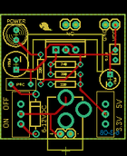
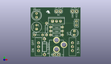
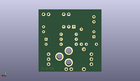
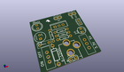

Contents
========

* [PROJ-SPAR-114-STAN-01>Breadboard Power Supply 5V 3.3V](#proj-spar-114-stan-01breadboard-power-supply-5v-33v)
	* [Images](#images)
	* [Interactive BOM](#interactive-bom)
	* [OOMP Parts](#oomp-parts)
	* [Tags](#tags)
  
![][im]
# PROJ-SPAR-114-STAN-01>Breadboard Power Supply 5V 3.3V

- ID: PROJ-SPAR-114-STAN-01
- Hex ID: PRS114
- Name: Breadboard Power Supply 5V 3.3V
- Description: 

## Images
  
  

|eagleImage|kicadPcb3dFront|kicadPcb3dBack|kicadPcb3d|
| :---: | :---: | :---: | :---: |
|||||

## Interactive BOM

- Interactive BOM page: [ibom.html](kicad/bom/ibom.html)

## OOMP Parts
  

|OOMP Parts|
| :---: |
|CAPE-UNMATCHED-X-UNMATCHED-01, C1, 3.8099999999999996, 19.049999999999997, 270,C1, 100uF, CPOL-RADIAL-100UF-25V, SparkFun, (0.15, 0.75), R270|
|CAPE-UNMATCHED-X-UNMATCHED-01, C2, 27.94, 15.239999999999998, 90,C2, 10uF, CPOL-RADIAL-10UF-25V, SparkFun, (1.1, 0.6), R90|
|CAPE-UNMATCHED-X-NF100-01, C3, 29.209999999999997, 22.86, 270,C3, 0.1uF, CAP-PTH-SMALL2, SparkFun, (1.15, 0.9), R270|
|UNMATCHED-UNMATCHED-X-UNMATCHED-01, D1, 8.889999999999999, 1.27, 90,D1, 1N4001, DIODE-0.4, SparkFun, (0.35, 0.05), R90|
|UNMATCHED-UNMATCHED-X-UNMATCHED-01, F1, 5.08, 13.97, 0,F1, 500mA, PTC, SparkFun, (0.2, 0.55), R0|
|UNMATCHED-UNMATCHED-X-UNMATCHED-01, J1, 16.509999999999998, -3.0479999999999996, 0,J1, POWER_JACKPTH, POWER_JACK_PTH, SparkFun, (0.65, -0.12), R0|
|UNMATCHED-UNMATCHED-X-UNMATCHED-01, JP1, 16.509999999999998, 29.209999999999997, 0,JP1, 1X01, SparkFun, (0.65, 1.15), R0|
|UNMATCHED-UNMATCHED-X-UNMATCHED-01, JP2, 19.049999999999997, 29.209999999999997, 0,JP2, 1X01, SparkFun, (0.75, 1.15), R0|
|UNMATCHED-UNMATCHED-X-UNMATCHED-01, JP3, 29.209999999999997, 29.209999999999997, 0,JP3, 1X01, SparkFun, (1.15, 1.15), R0|
|UNMATCHED-UNMATCHED-X-UNMATCHED-01, JP4, 26.669999999999998, 29.209999999999997, 0,JP4, 1X01, SparkFun, (1.05, 1.15), R0|
|UNMATCHED-UNMATCHED-X-UNMATCHED-01, JP5, 15.239999999999998, 1.27, 0,JP5, 1X02, SparkFun, (0.6, 0.05), R0|
|UNMATCHED-UNMATCHED-X-UNMATCHED-01, LED2, 3.8099999999999996, 26.669999999999998, 90,LED2, Power, LED5MM, SparkFun-Nate, (0.15, 1.05), R90|
|RESE-UNMATCHED-X-UNMATCHED-01, R1, 16.509999999999998, 19.049999999999997, 0,R1, 240, AXIAL-0.3, SparkFun, (0.65, 0.75), R0|
|RESE-UNMATCHED-X-UNMATCHED-01, R2, 16.509999999999998, 16.509999999999998, 180,R2, 390, AXIAL-0.3, SparkFun, (0.65, 0.65), R180|
|RESE-UNMATCHED-X-O331-01, R3, 16.509999999999998, 13.97, 0,R3, 330, AXIAL-0.3, SparkFun, (0.65, 0.55), R0|
|RESE-UNMATCHED-X-O331-01, R4, 10.16, 17.779999999999998, 270,R4, 330, AXIAL-0.3, SparkFun, (0.4, 0.7), R270|
|UNMATCHED-UNMATCHED-X-UNMATCHED-01, S1, 5.08, 6.35, 0,S1, On/Off, SWITCH-SPST, SparkFun, (0.2, 0.25), R0|
|UNMATCHED-UNMATCHED-X-UNMATCHED-01, S2, 26.669999999999998, 6.35, 0,S2, Voltage, SWITCH-SPST, SparkFun, (1.05, 0.25), R0|
|UNMATCHED-UNMATCHED-X-UNMATCHED-01, U1, 16.509999999999998, 22.86, 0,U1, LM317, TO220-ADJ, SparkFun, (0.65, 0.9), R0|

## Tags

- hexID: PRS114
- oompType: PROJ
- oompSize: SPAR
- oompColor: 114
- oompDesc: STAN
- oompIndex: 01
- oompName: Breadboard Power Supply 5V 3.3V
- sources: All source files from https://github.com/sparkfun/Breadboard_Power_Supply_5V_3.3V (source licence details in srcLicense.md)
- linkBuyPage: https://www.sparkfun.com/products/114
- oompPart: CAPE-UNMATCHED-X-UNMATCHED-01, C1, 3.8099999999999996, 19.049999999999997, 270
- oompPart: CAPE-UNMATCHED-X-UNMATCHED-01, C2, 27.94, 15.239999999999998, 90
- oompPart: CAPE-UNMATCHED-X-NF100-01, C3, 29.209999999999997, 22.86, 270
- oompPart: UNMATCHED-UNMATCHED-X-UNMATCHED-01, D1, 8.889999999999999, 1.27, 90
- oompPart: UNMATCHED-UNMATCHED-X-UNMATCHED-01, F1, 5.08, 13.97, 0
- oompPart: UNMATCHED-UNMATCHED-X-UNMATCHED-01, J1, 16.509999999999998, -3.0479999999999996, 0
- oompPart: UNMATCHED-UNMATCHED-X-UNMATCHED-01, JP1, 16.509999999999998, 29.209999999999997, 0
- oompPart: UNMATCHED-UNMATCHED-X-UNMATCHED-01, JP2, 19.049999999999997, 29.209999999999997, 0
- oompPart: UNMATCHED-UNMATCHED-X-UNMATCHED-01, JP3, 29.209999999999997, 29.209999999999997, 0
- oompPart: UNMATCHED-UNMATCHED-X-UNMATCHED-01, JP4, 26.669999999999998, 29.209999999999997, 0
- oompPart: UNMATCHED-UNMATCHED-X-UNMATCHED-01, JP5, 15.239999999999998, 1.27, 0
- oompPart: UNMATCHED-UNMATCHED-X-UNMATCHED-01, LED2, 3.8099999999999996, 26.669999999999998, 90
- oompPart: RESE-UNMATCHED-X-UNMATCHED-01, R1, 16.509999999999998, 19.049999999999997, 0
- oompPart: RESE-UNMATCHED-X-UNMATCHED-01, R2, 16.509999999999998, 16.509999999999998, 180
- oompPart: RESE-UNMATCHED-X-O331-01, R3, 16.509999999999998, 13.97, 0
- oompPart: RESE-UNMATCHED-X-O331-01, R4, 10.16, 17.779999999999998, 270
- oompPart: UNMATCHED-UNMATCHED-X-UNMATCHED-01, S1, 5.08, 6.35, 0
- oompPart: UNMATCHED-UNMATCHED-X-UNMATCHED-01, S2, 26.669999999999998, 6.35, 0
- oompPart: UNMATCHED-UNMATCHED-X-UNMATCHED-01, U1, 16.509999999999998, 22.86, 0
- rawPart: C1, 100uF, CPOL-RADIAL-100UF-25V, SparkFun, (0.15, 0.75), R270
- rawPart: C2, 10uF, CPOL-RADIAL-10UF-25V, SparkFun, (1.1, 0.6), R90
- rawPart: C3, 0.1uF, CAP-PTH-SMALL2, SparkFun, (1.15, 0.9), R270
- rawPart: D1, 1N4001, DIODE-0.4, SparkFun, (0.35, 0.05), R90
- rawPart: F1, 500mA, PTC, SparkFun, (0.2, 0.55), R0
- rawPart: J1, POWER_JACKPTH, POWER_JACK_PTH, SparkFun, (0.65, -0.12), R0
- rawPart: JP1, 1X01, SparkFun, (0.65, 1.15), R0
- rawPart: JP2, 1X01, SparkFun, (0.75, 1.15), R0
- rawPart: JP3, 1X01, SparkFun, (1.15, 1.15), R0
- rawPart: JP4, 1X01, SparkFun, (1.05, 1.15), R0
- rawPart: JP5, 1X02, SparkFun, (0.6, 0.05), R0
- rawPart: LED2, Power, LED5MM, SparkFun-Nate, (0.15, 1.05), R90
- rawPart: R1, 240, AXIAL-0.3, SparkFun, (0.65, 0.75), R0
- rawPart: R2, 390, AXIAL-0.3, SparkFun, (0.65, 0.65), R180
- rawPart: R3, 330, AXIAL-0.3, SparkFun, (0.65, 0.55), R0
- rawPart: R4, 330, AXIAL-0.3, SparkFun, (0.4, 0.7), R270
- rawPart: S1, On/Off, SWITCH-SPST, SparkFun, (0.2, 0.25), R0
- rawPart: S2, Voltage, SWITCH-SPST, SparkFun, (1.05, 0.25), R0
- rawPart: U1, LM317, TO220-ADJ, SparkFun, (0.65, 0.9), R0

[im]: kicadPcb3d_450.png
