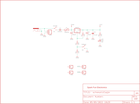

Contents
========

* [PRS114 > Breadboard Power Supply 5V 3.3V](#prs114--breadboard-power-supply-5v-33v)
	* [Schematic](#schematic)
	* [PCB](#pcb)
	* [Interactive BOM](#interactive-bom)
	* [OOMP Parts](#oomp-parts)
	* [Images](#images)
	* [Tags](#tags)
  
![][im]
# PRS114 > Breadboard Power Supply 5V 3.3V

- ID: PROJ-SPAR-114-STAN-01
- Hex ID: PRS114
- Name: Sparkfun
- Description: Sparkfun
- Long Link: [http://oom.lt/PROJ-SPAR-114-STAN-01](http://oom.lt/PROJ-SPAR-114-STAN-01)
- Short Link: [http://oom.lt/PRS114](http://oom.lt/PRS114)

## Schematic
  

## PCB
  

## Interactive BOM

- Interactive BOM page: [ibom.html](https://htmlpreview.github.io/?https://github.com/oomlout/oomlout_OOMP_projects/blob/main/PROJ-SPAR-114-STAN-01/kicad/bom/ibom.html)

## OOMP Parts
  

|OOMP Parts|
| :---: |
|C1 C1,CAPX-UNMATCHED-X-UF100-01|
|C2 C2,CAPX-UNMATCHED-X-UF10-01|
|C3 C3,CAPX-UNMATCHED-X-UF1D-01|
|D1 D1,DIOD-UNMATCHED-X-UNMATCHED-01|
|F1 F1,UNMATCHED-UNMATCHED-X-UNMATCHED-01|
|J1 J1,UNMATCHED-UNMATCHED-X-UNMATCHED-01|
|JP1 JP1,HEAD-I01-X-PI01-01|
|JP2 JP2,HEAD-I01-X-PI01-01|
|JP3 JP3,HEAD-I01-X-PI01-01|
|JP4 JP4,HEAD-I01-X-PI01-01|
|[JP5 HEAD-I01-X-PI02-01 2.54 mm 2 Pin Header](https://github.com/oomlout/oomlout_OOMP_parts/tree/main/HEAD-I01-X-PI02-01/)|
|LED2 LED2,LEDS-UNMATCHED-G-STAN-01|
|R1 R1,RESE-UNMATCHED-X-O241-01|
|R2 R2,RESE-UNMATCHED-X-O391-01|
|R3 R3,RESE-UNMATCHED-X-O331-01|
|R4 R4,RESE-UNMATCHED-X-O331-01|
|S1 S1,UNMATCHED-UNMATCHED-X-UNMATCHED-01|
|S2 S2,UNMATCHED-UNMATCHED-X-UNMATCHED-01|
|U1 U1,UNMATCHED-UNMATCHED-X-UNMATCHED-01|

## Images
  
  

|kicadPcb3d|kicadPcb3dFront|kicadPcb3dBack|eagleImage|eagleSchemImage|
| :---: | :---: | :---: | :---: | :---: |
||||||

## Tags

- hexID: PRS114
- oompType: PROJ
- oompSize: SPAR
- oompColor: 114
- oompDesc: STAN
- oompIndex: 01
- oompName: Breadboard Power Supply 5V 3.3V
- sources: All source files from https://github.com/sparkfun/Breadboard_Power_Supply_5V_3.3V (source licence details in srcLicense.md)
- linkBuyPage: https://www.sparkfun.com/products/114
- oompID: PROJ-SPAR-114-STAN-01
- oompParts: C1,CAPX-UNMATCHED-X-UF100-01
- oompParts: C2,CAPX-UNMATCHED-X-UF10-01
- oompParts: C3,CAPX-UNMATCHED-X-UF1D-01
- oompParts: D1,DIOD-UNMATCHED-X-UNMATCHED-01
- oompParts: F1,UNMATCHED-UNMATCHED-X-UNMATCHED-01
- oompParts: J1,UNMATCHED-UNMATCHED-X-UNMATCHED-01
- oompParts: JP1,HEAD-I01-X-PI01-01
- oompParts: JP2,HEAD-I01-X-PI01-01
- oompParts: JP3,HEAD-I01-X-PI01-01
- oompParts: JP4,HEAD-I01-X-PI01-01
- oompParts: JP5,HEAD-I01-X-PI02-01
- oompParts: LED2,LEDS-UNMATCHED-G-STAN-01
- oompParts: R1,RESE-UNMATCHED-X-O241-01
- oompParts: R2,RESE-UNMATCHED-X-O391-01
- oompParts: R3,RESE-UNMATCHED-X-O331-01
- oompParts: R4,RESE-UNMATCHED-X-O331-01
- oompParts: S1,UNMATCHED-UNMATCHED-X-UNMATCHED-01
- oompParts: S2,UNMATCHED-UNMATCHED-X-UNMATCHED-01
- oompParts: U1,UNMATCHED-UNMATCHED-X-UNMATCHED-01
- rawParts: C1,100uF,CAP_POLPTH1,CPOL-RADIAL-100UF-25V,Capacitor Polarized,,
- rawParts: C2,10uF,CAP_POLPTH2,CPOL-RADIAL-10UF-25V,Capacitor Polarized,,
- rawParts: C3,0.1uF,CAPPTH2,CAP-PTH-SMALL2,Capacitor,,
- rawParts: D1,1N4001,DIODEPTH,DIODE-0.4,Diode,,
- rawParts: F1,500mA,PTCPTH,PTC,Resettable Fuse PTC,,
- rawParts: J1,POWER_JACKPTH,POWER_JACKPTH,POWER_JACK_PTH,Power Jack,,
- rawParts: JP1,,M01PTH,1X01,Header 1,,
- rawParts: JP2,,M01PTH,1X01,Header 1,,
- rawParts: JP3,,M01PTH,1X01,Header 1,,
- rawParts: JP4,,M01PTH,1X01,Header 1,,
- rawParts: JP5,,M02PTH,1X02,Header 2,,
- rawParts: LED2,Power,LED5MM,LED5MM,,,
- rawParts: R1,240,RESISTORPTH1,AXIAL-0.3,Resistor,,
- rawParts: R2,390,RESISTORPTH1,AXIAL-0.3,Resistor,,
- rawParts: R3,330,RESISTORPTH1,AXIAL-0.3,Resistor,,
- rawParts: R4,330,RESISTORPTH1,AXIAL-0.3,Resistor,,
- rawParts: S1,On/Off,SWITCH-SPSTPTH,SWITCH-SPST,SPST Switch,,
- rawParts: S2,Voltage,SWITCH-SPSTPTH,SWITCH-SPST,SPST Switch,,
- rawParts: U$1,LOGO-SFESK,LOGO-SFESK,SFE-LOGO-FLAME,Spark Fun Electronics PCB Logo,,
- rawParts: U1,LM317,V_REG_317SINK,TO220-ADJ,Voltage Regulator,,

[im]: kicadPcb3d_450.png
