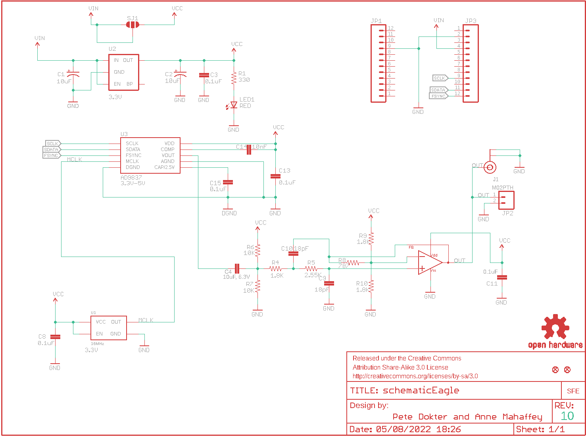
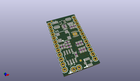
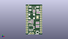
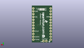
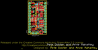
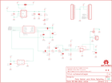

Contents
========

* [PRS11420 > Sparkfun](#prs11420--sparkfun)
	* [Schematic](#schematic)
	* [Interactive BOM](#interactive-bom)
	* [OOMP Parts](#oomp-parts)
	* [Images](#images)
	* [Tags](#tags)
  
![][im]
# PRS11420 > Sparkfun

- ID: PROJ-SPAR-11420-STAN-01
- Hex ID: PRS11420
- Name: Sparkfun
- Description: Sparkfun
- Long Link: [http://oom.lt/PROJ-SPAR-11420-STAN-01](http://oom.lt/PROJ-SPAR-11420-STAN-01)
- Short Link: [http://oom.lt/PRS11420](http://oom.lt/PRS11420)

## Schematic
  

## Interactive BOM

- Interactive BOM page: [ibom.html](https://htmlpreview.github.io/?https://github.com/oomlout/oomlout_OOMP_projects/blob/main/PROJ-SPAR-11420-STAN-01/kicad/bom/ibom.html)

## OOMP Parts
  

|OOMP Parts|
| :---: |
|C1,CAPX-UNMATCHED-X-UF10-01,C1,10uF,10UF-20V-10%(TANT),EIA3528,CAP-08063,CAP-08063,10uF,|
|C2,CAPX-UNMATCHED-X-UF10-01,C2,10uF,10UF-20V-10%(TANT),EIA3528,CAP-08063,CAP-08063,10uF,|
|C3,CAPC-0603-X-NF100-V50,C3,0.1uF,0.1UF-25V(+80/-20%)(0603),0603-CAP,CAP-00810,CAP-00810,0.1uF,|
|C4,CAPC-UNMATCHED-X-UF10-01,C4,10uF, 6.3V,10UF-6.3V-20%(0603),0603-CAP,CAP-11015,CAP-11015,10uF,|
|C8,CAPC-0603-X-NF100-V50,C8,0.1uF,0.1UF-25V(+80/-20%)(0603),0603-CAP,CAP-00810,CAP-00810,0.1uF,|
|C9,CAPC-0603-X-UNMATCHED-01,C9,18pF,18PF-50V-5%(0603),0603-CAP,CAP-08267,CAP-08267,18pF,|
|C10,CAPC-0603-X-UNMATCHED-01,C10,18pF,18PF-50V-5%(0603),0603-CAP,CAP-08267,CAP-08267,18pF,|
|C11,CAPC-0603-X-NF100-V50,C11,0.1uF,0.1UF-25V(+80/-20%)(0603),0603-CAP,CAP-00810,CAP-00810,0.1uF,|
|C13,CAPC-0603-X-NF100-V50,C13,0.1uF,0.1UF-25V(+80/-20%)(0603),0603-CAP,CAP-00810,CAP-00810,0.1uF,|
|C14,CAPC-0603-X-UNMATCHED-01,C14,10nF,10NF/10000PF-50V-10%(0603),0603-CAP,CAP-00867,CAP-00867,10nF,|
|C15,CAPC-0603-X-NF100-V50,C15,0.1uF,0.1UF-25V(+80/-20%)(0603),0603-CAP,CAP-00810,CAP-00810,0.1uF,|
|J1,UNMATCHED-UNMATCHED-X-UNMATCHED-01,FID1,FIDUCIAL1X2,FIDUCIAL1X2,FIDUCIAL-1X2,Fiducial Alignment Points,,,|
|JP1,HEAD-I01-X-PI12-01,FID2,FIDUCIAL1X2,FIDUCIAL1X2,FIDUCIAL-1X2,Fiducial Alignment Points,,,|
|JP2,HEAD-I01-X-PI02-01,FRAME1,FRAME-LETTER,FRAME-LETTER,CREATIVE_COMMONS,Schematic Frame,,,|
|JP3,HEAD-I01-X-PI12-01,J1,,U.FL,U.FL,SMD antenna connector- WRL-09144,CONN-09193,U.FL,|
|LED1,LEDS-0603-G-STAN-01,JP1,M12PTH,M12PTH,1X12,Header 12,,,|
|R1,RESE-0603-X-O331-01,JP2,M02PTH,M02PTH,1X02,Standard 2-pin 0.1 header. Use with,,,|
|R4,RESE-0603-X-UNMATCHED-01,JP3,M12PTH,M12PTH,1X12,Header 12,,,|
|R5,RESE-0603-X-UNMATCHED-01,JP4,LOGO-SFENEW,LOGO-SFENEW,SFE-NEW-WEBLOGO,Spark Fun Electronics PCB Logo,,,|
|R6,RESE-0603-X-O103-01,LED1,RED,LED-RED0603,LED-0603,Assorted Red LEDs,DIO-00819,RED,|
|R7,RESE-0603-X-O103-01,R1,330,330OHM1/10W1%(0603),0603-RES,RES-00818,RES-00818,330,|
|R8,RESE-0603-X-O781-01,R4,1.8K,1.8KOHM1/10W1%(0603),0603-RES,RES-09119,RES-09119,1.8k,|
|R9,RESE-0603-X-UNMATCHED-01,R5,2.55K,2.55KOHM-1/10W-1%(0603),0603-RES,RES-11227,RES-11227,2.55k,|
|R10,RESE-0603-X-UNMATCHED-01,R6,10K,10KOHM1/10W1%(0603)0603,0603-RES,RES-00824,RES-00824,10K,|
|U1,UNMATCHED-UNMATCHED-X-UNMATCHED-01,R7,10K,10KOHM1/10W1%(0603)0603,0603-RES,RES-00824,RES-00824,10K,|
|U2,UNMATCHED-SO235-X-UNMATCHED-01,R8,787,787-1%,0603-RES,787-ohm SMT,RES-11228,787,|
|U3,UNMATCHED-UNMATCHED-X-UNMATCHED-01,R9,1.8K,1.8KOHM1/10W1%(0603),0603-RES,RES-09119,RES-09119,1.8k,|
|U4,UNMATCHED-UNMATCHED-X-UNMATCHED-01,R10,1.8K,1.8KOHM1/10W1%(0603),0603-RES,RES-09119,RES-09119,1.8k,|

## Images
  
  

|kicadPcb3d|kicadPcb3dFront|kicadPcb3dBack|eagleImage|eagleSchemImage|
| :---: | :---: | :---: | :---: | :---: |
||||||

## Tags

- hexID: PRS11420
- oompType: PROJ
- oompSize: SPAR
- oompColor: 11420
- oompDesc: STAN
- oompIndex: 01
- oompName: MiniGen
- sources: All source files from https://github.com/sparkfun/MiniGen (source licence details in srcLicense.md)
- linkBuyPage: https://www.sparkfun.com/products/11420
- oompID: PROJ-SPAR-11420-STAN-01
- oompParts: C1,CAPX-UNMATCHED-X-UF10-01
- oompParts: C2,CAPX-UNMATCHED-X-UF10-01
- oompParts: C3,CAPC-0603-X-NF100-V50
- oompParts: C4,CAPC-UNMATCHED-X-UF10-01
- oompParts: C8,CAPC-0603-X-NF100-V50
- oompParts: C9,CAPC-0603-X-UNMATCHED-01
- oompParts: C10,CAPC-0603-X-UNMATCHED-01
- oompParts: C11,CAPC-0603-X-NF100-V50
- oompParts: C13,CAPC-0603-X-NF100-V50
- oompParts: C14,CAPC-0603-X-UNMATCHED-01
- oompParts: C15,CAPC-0603-X-NF100-V50
- oompParts: J1,UNMATCHED-UNMATCHED-X-UNMATCHED-01
- oompParts: JP1,HEAD-I01-X-PI12-01
- oompParts: JP2,HEAD-I01-X-PI02-01
- oompParts: JP3,HEAD-I01-X-PI12-01
- oompParts: LED1,LEDS-0603-G-STAN-01
- oompParts: R1,RESE-0603-X-O331-01
- oompParts: R4,RESE-0603-X-UNMATCHED-01
- oompParts: R5,RESE-0603-X-UNMATCHED-01
- oompParts: R6,RESE-0603-X-O103-01
- oompParts: R7,RESE-0603-X-O103-01
- oompParts: R8,RESE-0603-X-O781-01
- oompParts: R9,RESE-0603-X-UNMATCHED-01
- oompParts: R10,RESE-0603-X-UNMATCHED-01
- oompParts: U1,UNMATCHED-UNMATCHED-X-UNMATCHED-01
- oompParts: U2,UNMATCHED-SO235-X-UNMATCHED-01
- oompParts: U3,UNMATCHED-UNMATCHED-X-UNMATCHED-01
- oompParts: U4,UNMATCHED-UNMATCHED-X-UNMATCHED-01
- rawParts: C1,10uF,10UF-20V-10%(TANT),EIA3528,CAP-08063,CAP-08063,10uF,
- rawParts: C2,10uF,10UF-20V-10%(TANT),EIA3528,CAP-08063,CAP-08063,10uF,
- rawParts: C3,0.1uF,0.1UF-25V(+80/-20%)(0603),0603-CAP,CAP-00810,CAP-00810,0.1uF,
- rawParts: C4,10uF, 6.3V,10UF-6.3V-20%(0603),0603-CAP,CAP-11015,CAP-11015,10uF,
- rawParts: C8,0.1uF,0.1UF-25V(+80/-20%)(0603),0603-CAP,CAP-00810,CAP-00810,0.1uF,
- rawParts: C9,18pF,18PF-50V-5%(0603),0603-CAP,CAP-08267,CAP-08267,18pF,
- rawParts: C10,18pF,18PF-50V-5%(0603),0603-CAP,CAP-08267,CAP-08267,18pF,
- rawParts: C11,0.1uF,0.1UF-25V(+80/-20%)(0603),0603-CAP,CAP-00810,CAP-00810,0.1uF,
- rawParts: C13,0.1uF,0.1UF-25V(+80/-20%)(0603),0603-CAP,CAP-00810,CAP-00810,0.1uF,
- rawParts: C14,10nF,10NF/10000PF-50V-10%(0603),0603-CAP,CAP-00867,CAP-00867,10nF,
- rawParts: C15,0.1uF,0.1UF-25V(+80/-20%)(0603),0603-CAP,CAP-00810,CAP-00810,0.1uF,
- rawParts: FID1,FIDUCIAL1X2,FIDUCIAL1X2,FIDUCIAL-1X2,Fiducial Alignment Points,,,
- rawParts: FID2,FIDUCIAL1X2,FIDUCIAL1X2,FIDUCIAL-1X2,Fiducial Alignment Points,,,
- rawParts: FRAME1,FRAME-LETTER,FRAME-LETTER,CREATIVE_COMMONS,Schematic Frame,,,
- rawParts: J1,,U.FL,U.FL,SMD antenna connector- WRL-09144,CONN-09193,U.FL,
- rawParts: JP1,M12PTH,M12PTH,1X12,Header 12,,,
- rawParts: JP2,M02PTH,M02PTH,1X02,Standard 2-pin 0.1 header. Use with,,,
- rawParts: JP3,M12PTH,M12PTH,1X12,Header 12,,,
- rawParts: JP4,LOGO-SFENEW,LOGO-SFENEW,SFE-NEW-WEBLOGO,Spark Fun Electronics PCB Logo,,,
- rawParts: LED1,RED,LED-RED0603,LED-0603,Assorted Red LEDs,DIO-00819,RED,
- rawParts: R1,330,330OHM1/10W1%(0603),0603-RES,RES-00818,RES-00818,330,
- rawParts: R4,1.8K,1.8KOHM1/10W1%(0603),0603-RES,RES-09119,RES-09119,1.8k,
- rawParts: R5,2.55K,2.55KOHM-1/10W-1%(0603),0603-RES,RES-11227,RES-11227,2.55k,
- rawParts: R6,10K,10KOHM1/10W1%(0603)0603,0603-RES,RES-00824,RES-00824,10K,
- rawParts: R7,10K,10KOHM1/10W1%(0603)0603,0603-RES,RES-00824,RES-00824,10K,
- rawParts: R8,787,787-1%,0603-RES,787-ohm SMT,RES-11228,787,
- rawParts: R9,1.8K,1.8KOHM1/10W1%(0603),0603-RES,RES-09119,RES-09119,1.8k,
- rawParts: R10,1.8K,1.8KOHM1/10W1%(0603),0603-RES,RES-09119,RES-09119,1.8k,
- rawParts: SJ1,,SOLDERJUMPER_2WAYT,SJ_2,Solder Jumper,,,
- rawParts: U$2,OSHW-LOGOS,OSHW-LOGOS,OSHW-LOGO-S,Open Source Hardware Logo This logo indicates the piece of hardware it is found on incorporates a OSHW license and/or adheres to the definition of open source hardware found here: http://freedomdefined.org/OSHW,,,
- rawParts: U1,16MHz,OSCILLATORXTAL-11225,CRYSTAL-SMD-7X5,Generic 5x3 and 7x5 oscillators,XTAL-11225,16MHz,
- rawParts: U2,3.3V,MIC52053.3V,SOT23-5,MIC5205 150mA vreg,VREG-00822,,
- rawParts: U3,AD9837,AD9837,AD9837,Programmable waveform generator, sine, triangular, and square wave outputs.,IC-11223,AD9837BCPZ,
- rawParts: U4,,ADC8045,SO08,Unity-gain stable feedback amplifier.,IC-11224,ADC8045,

[im]: kicadPcb3d_450.png
