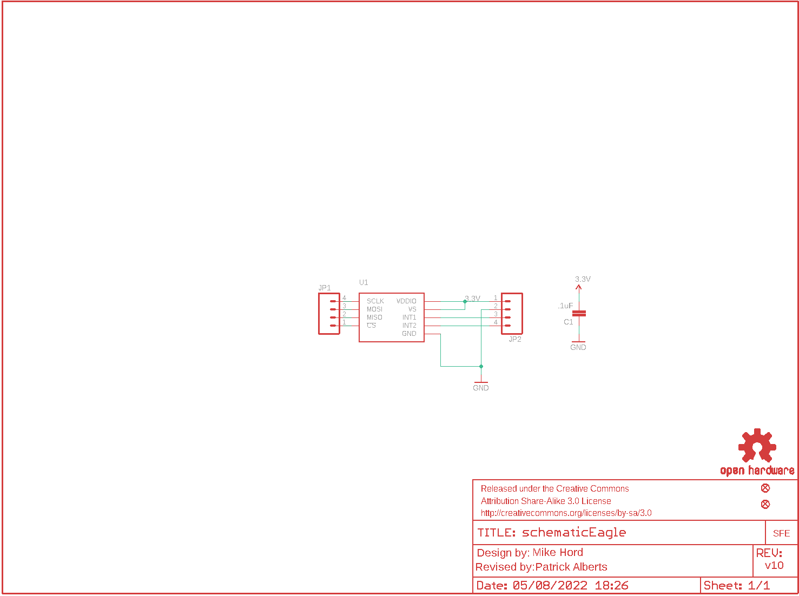
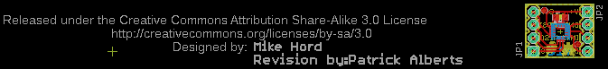
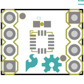
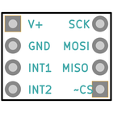
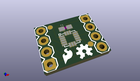
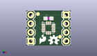
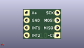

Contents
========

* [PRS11446 > ADXL362 Breakout](#prs11446--adxl362-breakout)
	* [Schematic](#schematic)
	* [PCB](#pcb)
	* [Interactive BOM](#interactive-bom)
	* [OOMP Parts](#oomp-parts)
	* [Images](#images)
	* [Tags](#tags)
  
![][im]
# PRS11446 > ADXL362 Breakout

- ID: PROJ-SPAR-11446-STAN-01
- Hex ID: PRS11446
- Name: Sparkfun
- Description: Sparkfun
- Long Link: [http://oom.lt/PROJ-SPAR-11446-STAN-01](http://oom.lt/PROJ-SPAR-11446-STAN-01)
- Short Link: [http://oom.lt/PRS11446](http://oom.lt/PRS11446)

## Schematic
  

## PCB
  

## Interactive BOM

- Interactive BOM page: [ibom.html](https://htmlpreview.github.io/?https://github.com/oomlout/oomlout_OOMP_projects/blob/main/PROJ-SPAR-11446-STAN-01/kicad/bom/ibom.html)

## OOMP Parts
  

|OOMP Parts|
| :---: |
|[CAPC-0603-X-NF100-V50  SMD (0603) 100 nF Capacitor (Ceramic) 50v  C1](https://github.com/oomlout/oomlout_OOMP_parts/tree/main/CAPC-0603-X-NF100-V50/)|
|[HEAD-I01-X-PI04-01  2.54 mm 4 Pin Header  JP1, JP2](https://github.com/oomlout/oomlout_OOMP_parts/tree/main/HEAD-I01-X-PI04-01/)|
|UNMATCHED-UNMATCHED-X-UNMATCHED-01 U1|

## Images
  
  

|bominteractivefront|bominteractiveback|kicadPcb3d|kicadPcb3dFront|kicadPcb3dBack|eagleImage|eagleSchemImage|
| :---: | :---: | :---: | :---: | :---: | :---: | :---: |
||||||||

## Tags

- hexID: PRS11446
- oompType: PROJ
- oompSize: SPAR
- oompColor: 11446
- oompDesc: STAN
- oompIndex: 01
- oompName: ADXL362 Breakout
- sources: All source files from https://github.com/sparkfun/ADXL362_Breakout (source licence details in srcLicense.md)
- linkBuyPage: https://www.sparkfun.com/products/11446
- oompID: PROJ-SPAR-11446-STAN-01
- oompParts: C1,CAPC-0603-X-NF100-V50
- oompParts: JP1,HEAD-I01-X-PI04-01
- oompParts: JP2,HEAD-I01-X-PI04-01
- oompParts: U1,UNMATCHED-UNMATCHED-X-UNMATCHED-01
- rawParts: C1,.1uF,0.1UF-25V(+80/-20%)(0603),0603-CAP,CAP-00810,CAP-00810,0.1uF,
- rawParts: FID1,FIDUCIAL1X2,FIDUCIAL1X2,FIDUCIAL-1X2,Fiducial Alignment Points,,,
- rawParts: FID2,FIDUCIAL1X2,FIDUCIAL1X2,FIDUCIAL-1X2,Fiducial Alignment Points,,,
- rawParts: FRAME1,FRAME-LETTER,FRAME-LETTER,CREATIVE_COMMONS,Schematic Frame,,,
- rawParts: JP1,,M04PTH,1X04,Header 4,,,
- rawParts: JP2,,M04PTH,1X04,Header 4,,,
- rawParts: JP3,LOGO-SFESK,LOGO-SFESK,SFE-LOGO-FLAME,Spark Fun Electronics PCB Logo,,,
- rawParts: U$1,OSHW-LOGOS,OSHW-LOGOS,OSHW-LOGO-S,Open Source Hardware Logo This logo indicates the piece of hardware it is found on incorporates a OSHW license and/or adheres to the definition of open source hardware found here: http://freedomdefined.org/OSHW,,,
- rawParts: U1,,ADXL362ADXL362-1:1,ADXL362-1:1,Micropower 3-axis accelerometer,,,

[im]: kicadPcb3d_450.png
