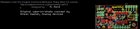
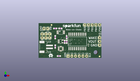
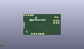
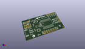

Contents
========

* [PROJ-SPAR-11447-STAN-01>Wake on shake](#proj-spar-11447-stan-01wake-on-shake)
	* [Images](#images)
	* [Interactive BOM](#interactive-bom)
	* [OOMP Parts](#oomp-parts)
	* [Tags](#tags)
  
![][im]
# PROJ-SPAR-11447-STAN-01>Wake on shake

- ID: PROJ-SPAR-11447-STAN-01
- Hex ID: PRS11447
- Name: Wake on shake
- Description: 

## Images
  
  

|eagleImage|kicadPcb3dFront|kicadPcb3dBack|kicadPcb3d|
| :---: | :---: | :---: | :---: |
|||||

## Interactive BOM

- Interactive BOM page: [ibom.html](kicad/bom/ibom.html)

## OOMP Parts
  

|OOMP Parts|
| :---: |
|CAPC-0603-X-UNMATCHED-01, C1, 11.43, 7.874, 270,C1, .1uF, 0603-CAP, SparkFun-Capacitors, (0.45, 0.31), R270|
|CAPC-0603-X-UNMATCHED-01, C2, 11.43, 14.350999999999997, 270,C2, 1uF, 0603-CAP, SparkFun-Capacitors, (0.45, 0.565), R270|
|CAPC-0603-X-UNMATCHED-01, C3, 17.906999999999996, 11.176, 270,C3, 1uF, 0603-CAP, SparkFun-Capacitors, (0.705, 0.44), R270|
|CAPC-0603-X-UNMATCHED-01, C4, 19.304, 11.176, 270,C4, .1uF, 0603-CAP, SparkFun-Capacitors, (0.76, 0.44), R270|
|UNMATCHED-UNMATCHED-X-UNMATCHED-01, D1, 41.91, 16.509999999999998, 90,D1, RB751, SOD-523, SparkFun-DiscreteSemi, (1.65, 0.65), R90|
|UNMATCHED-UNMATCHED-X-UNMATCHED-01, D2, 34.29, 8.889999999999999, 90,D2, RB751, SOD-523, SparkFun-DiscreteSemi, (1.35, 0.35), R90|
|UNMATCHED-UNMATCHED-X-UNMATCHED-01, J1, 2.54, 13.97, 0,J1, PROG_HDR, 2X3, SparkFun-Connectors, (0.1, 0.55), R0|
|UNMATCHED-UNMATCHED-X-UNMATCHED-01, JP1, 26.669999999999998, 1.27, 0,JP1, FTDI_DEVICE, FTDI_DEVICE_SIDE, SparkFun-Connectors, (1.05, 0.05), R0|
|UNMATCHED-UNMATCHED-X-UNMATCHED-01, JP2, 3.8099999999999996, 7.619999999999999, 90,JP2, M02-JST-2MM-SMT, JST-2-SMD, SparkFun-Connectors, (0.15, 0.3), R90|
|<table><tr><td></td><td> JP3</td><td>[HEAD-I01-X-PI03-01 2.54 mm 3 Pin Header](https://github.com/oomlout/oomlout_OOMP_parts/tree/main/HEAD-I01-X-PI03-01/)</td><td>[H03](https://github.com/oomlout/oomlout_OOMP_parts/tree/main/HEAD-I01-X-PI03-01/)</td></tr></table>|
|<table><tr><td></td><td> JP5</td><td>[HEAD-I01-X-PI02-01 2.54 mm 2 Pin Header](https://github.com/oomlout/oomlout_OOMP_parts/tree/main/HEAD-I01-X-PI02-01/)</td><td>[H02](https://github.com/oomlout/oomlout_OOMP_parts/tree/main/HEAD-I01-X-PI02-01/)</td></tr></table>|
|<table><tr><td></td><td> JP7</td><td>[HEAD-I01-X-PI05-01 2.54 mm 5 Pin Header](https://github.com/oomlout/oomlout_OOMP_parts/tree/main/HEAD-I01-X-PI05-01/)</td><td>[H05](https://github.com/oomlout/oomlout_OOMP_parts/tree/main/HEAD-I01-X-PI05-01/)</td></tr></table>|
|UNMATCHED-UNMATCHED-X-UNMATCHED-01, Q1, 15.239999999999998, 17.779999999999998, 270,Q1, MSOP8, SparkFun-DiscreteSemi, (0.6, 0.7), R270|
|RESE-0603-X-UNMATCHED-01, R1, 14.985999999999999, 20.447, 0,R1, 1M, 0603-RES, SparkFun-Resistors, (0.59, 0.805), R0|
|RESE-0603-X-UNMATCHED-01, R2, 11.43, 20.447, 180,R2, 1M, 0603-RES, SparkFun-Resistors, (0.45, 0.805), R180|
|<table><tr><td></td><td> R3</td><td>[RESE-0603-X-O103-01 SMD (0603) 10k Ohm Resistor](https://github.com/oomlout/oomlout_OOMP_parts/tree/main/RESE-0603-X-O103-01/)</td><td>[R6103](https://github.com/oomlout/oomlout_OOMP_parts/tree/main/RESE-0603-X-O103-01/)</td></tr></table>|
|<table><tr><td></td><td> R4</td><td>[RESE-0603-X-O103-01 SMD (0603) 10k Ohm Resistor](https://github.com/oomlout/oomlout_OOMP_parts/tree/main/RESE-0603-X-O103-01/)</td><td>[R6103](https://github.com/oomlout/oomlout_OOMP_parts/tree/main/RESE-0603-X-O103-01/)</td></tr></table>|
|UNMATCHED-UNMATCHED-X-UNMATCHED-01, U1, 15.239999999999998, 6.35, 0,U1, ADXL362, ADXL362-1:1, SparkFun-Sensors, (0.6, 0.25), R0|
|UNMATCHED-UNMATCHED-X-UNMATCHED-01, U2, 26.669999999999998, 11.43, 0,U2, SOP20W, SparkFun-DigitalIC, (1.05, 0.45), R0|
|UNMATCHED-UNMATCHED-X-UNMATCHED-01, U3, 15.112999999999998, 11.43, 270,U3, ADP160-3.3, SOT23-5, SparkFun-PowerIC, (0.595, 0.45), R270|

## Tags

- hexID: PRS11447
- oompType: PROJ
- oompSize: SPAR
- oompColor: 11447
- oompDesc: STAN
- oompIndex: 01
- oompName: Wake on shake
- sources: All source files from https://github.com/sparkfun/Wake_on_shake (source licence details in srcLicense.md)
- linkBuyPage: https://www.sparkfun.com/products/11447
- oompPart: CAPC-0603-X-UNMATCHED-01, C1, 11.43, 7.874, 270
- oompPart: CAPC-0603-X-UNMATCHED-01, C2, 11.43, 14.350999999999997, 270
- oompPart: CAPC-0603-X-UNMATCHED-01, C3, 17.906999999999996, 11.176, 270
- oompPart: CAPC-0603-X-UNMATCHED-01, C4, 19.304, 11.176, 270
- oompPart: UNMATCHED-UNMATCHED-X-UNMATCHED-01, D1, 41.91, 16.509999999999998, 90
- oompPart: UNMATCHED-UNMATCHED-X-UNMATCHED-01, D2, 34.29, 8.889999999999999, 90
- oompPart: SKIP-UNMATCHED-X-UNMATCHED-01, FID1, 41.91, 1.016, 0
- oompPart: SKIP-UNMATCHED-X-UNMATCHED-01, FID2, 8.889999999999999, 22.86, 0
- oompPart: UNMATCHED-UNMATCHED-X-UNMATCHED-01, J1, 2.54, 13.97, 0
- oompPart: UNMATCHED-UNMATCHED-X-UNMATCHED-01, JP1, 26.669999999999998, 1.27, 0
- oompPart: UNMATCHED-UNMATCHED-X-UNMATCHED-01, JP2, 3.8099999999999996, 7.619999999999999, 90
- oompPart: HEAD-I01-X-PI03-01, JP3, 41.91, 13.97, 270
- oompPart: HEAD-I01-X-PI02-01, JP5, 6.35, 20.32, 180
- oompPart: HEAD-I01-X-PI05-01, JP7, 31.75, 22.86, 0
- oompPart: UNMATCHED-UNMATCHED-X-UNMATCHED-01, Q1, 15.239999999999998, 17.779999999999998, 270
- oompPart: RESE-0603-X-UNMATCHED-01, R1, 14.985999999999999, 20.447, 0
- oompPart: RESE-0603-X-UNMATCHED-01, R2, 11.43, 20.447, 180
- oompPart: RESE-0603-X-O103-01, R3, 19.304, 14.350999999999997, 90
- oompPart: RESE-0603-X-O103-01, R4, 13.97, 1.27, 0
- oompPart: UNMATCHED-UNMATCHED-X-UNMATCHED-01, U1, 15.239999999999998, 6.35, 0
- oompPart: UNMATCHED-UNMATCHED-X-UNMATCHED-01, U2, 26.669999999999998, 11.43, 0
- oompPart: UNMATCHED-UNMATCHED-X-UNMATCHED-01, U3, 15.112999999999998, 11.43, 270
- rawPart: C1, .1uF, 0603-CAP, SparkFun-Capacitors, (0.45, 0.31), R270
- rawPart: C2, 1uF, 0603-CAP, SparkFun-Capacitors, (0.45, 0.565), R270
- rawPart: C3, 1uF, 0603-CAP, SparkFun-Capacitors, (0.705, 0.44), R270
- rawPart: C4, .1uF, 0603-CAP, SparkFun-Capacitors, (0.76, 0.44), R270
- rawPart: D1, RB751, SOD-523, SparkFun-DiscreteSemi, (1.65, 0.65), R90
- rawPart: D2, RB751, SOD-523, SparkFun-DiscreteSemi, (1.35, 0.35), R90
- rawPart: FID1, FIDUCIAL1X2, FIDUCIAL-1X2, SparkFun-Aesthetics, (1.65, 0.04), R0
- rawPart: FID2, FIDUCIAL1X2, FIDUCIAL-1X2, SparkFun-Aesthetics, (0.35, 0.9), R0
- rawPart: J1, PROG_HDR, 2X3, SparkFun-Connectors, (0.1, 0.55), R0
- rawPart: JP1, FTDI_DEVICE, FTDI_DEVICE_SIDE, SparkFun-Connectors, (1.05, 0.05), R0
- rawPart: JP2, M02-JST-2MM-SMT, JST-2-SMD, SparkFun-Connectors, (0.15, 0.3), R90
- rawPart: JP3, 1X03, SparkFun-Connectors, (1.65, 0.55), R270
- rawPart: JP5, M02PTH, 1X02, SparkFun-Connectors, (0.25, 0.8), R180
- rawPart: JP7, 1X05, SparkFun-Connectors, (1.25, 0.9), R0
- rawPart: Q1, MSOP8, SparkFun-DiscreteSemi, (0.6, 0.7), R270
- rawPart: R1, 1M, 0603-RES, SparkFun-Resistors, (0.59, 0.805), R0
- rawPart: R2, 1M, 0603-RES, SparkFun-Resistors, (0.45, 0.805), R180
- rawPart: R3, 10k, 0603-RES, SparkFun-Resistors, (0.76, 0.565), R90
- rawPart: R4, 10k, 0603-RES, SparkFun-Resistors, (0.55, 0.05), R0
- rawPart: U1, ADXL362, ADXL362-1:1, SparkFun-Sensors, (0.6, 0.25), R0
- rawPart: U2, SOP20W, SparkFun-DigitalIC, (1.05, 0.45), R0
- rawPart: U3, ADP160-3.3, SOT23-5, SparkFun-PowerIC, (0.595, 0.45), R270
- oompID: PROJ-SPAR-11447-STAN-01

[im]: kicadPcb3d_450.png
