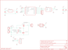

Contents
========

* [PRS11447 > Sparkfun](#prs11447--sparkfun)
	* [Schematic](#schematic)
	* [Interactive BOM](#interactive-bom)
	* [OOMP Parts](#oomp-parts)
	* [Images](#images)
	* [Tags](#tags)
  
![][im]
# PRS11447 > Sparkfun

- ID: PROJ-SPAR-11447-STAN-01
- Hex ID: PRS11447
- Name: Sparkfun
- Description: Sparkfun
- Long Link: [http://oom.lt/PROJ-SPAR-11447-STAN-01](http://oom.lt/PROJ-SPAR-11447-STAN-01)
- Short Link: [http://oom.lt/PRS11447](http://oom.lt/PRS11447)

## Schematic
  

## Interactive BOM

- Interactive BOM page: [ibom.html](https://htmlpreview.github.io/?https://github.com/oomlout/oomlout_OOMP_projects/blob/main/PROJ-SPAR-11447-STAN-01/kicad/bom/ibom.html)

## OOMP Parts
  

|OOMP Parts|
| :---: |
|C1,CAPC-0603-X-UNMATCHED-01,C1,.1uF,0.1UF-25V(+80/-20%)(0603),0603-CAP,CAP-00810,,,CAP-00810,0.1uF,|
|C2,CAPC-0603-X-UF1-01,C2,1uF,1.0UF-16V-10%(0603),0603-CAP,CAP-00868,,,CAP-00868,1.0uF,|
|C3,CAPC-0603-X-UF1-01,C3,1uF,1.0UF-16V-10%(0603),0603-CAP,CAP-00868,,,CAP-00868,1.0uF,|
|C4,CAPC-0603-X-UNMATCHED-01,C4,.1uF,0.1UF-25V(+80/-20%)(0603),0603-CAP,CAP-00810,,,CAP-00810,0.1uF,|
|D1,DIOD-UNMATCHED-X-UNMATCHED-01,D1,RB751,RB751,SOD-523,40V 120mA SOD-523 Schottky,,,DIO-11018,RB751,|
|D2,DIOD-UNMATCHED-X-UNMATCHED-01,D2,RB751,DIODE-SCHOTTKY,SOD-523,Commonly MBRA140.,,,DIO-11018,,|
|J1,UNMATCHED-UNMATCHED-X-UNMATCHED-01,FID1,FIDUCIAL1X2,FIDUCIAL1X2,FIDUCIAL-1X2,Fiducial Alignment Points,,,,,|
|JP1,UNMATCHED-UNMATCHED-X-UNMATCHED-01,FID2,FIDUCIAL1X2,FIDUCIAL1X2,FIDUCIAL-1X2,Fiducial Alignment Points,,,,,|
|JP2,UNMATCHED-UNMATCHED-X-UNMATCHED-01,FRAME1,FRAME-LETTER,FRAME-LETTER,CREATIVE_COMMONS,Schematic Frame,,,,,|
|JP3,HEAD-I01-X-PI03-01,J1,PROG_HDR,AVR_SPI_PRG_6PTH,2X3,AVR ISP 6 Pin,,,,,|
|JP5,HEAD-I01-X-PI02-01,JP1,FTDI_DEVICE,FTDI_DEVICE,FTDI_DEVICE_SIDE,Connector which mates to FTDI basic or FTDI cable.,,,,,|
|JP7,HEAD-I01-X-PI05-01,JP2,M02-JST-2MM-SMT,M02-JST-2MM-SMT,JST-2-SMD,Standard 2-pin 0.1 header. Use with,,,CONN-08352,,|
|Q1,UNMATCHED-UNMATCHED-X-UNMATCHED-01,JP3,,M03PTH,1X03,Header 3,,,,,|
|R1,RESE-0603-X-O105-01,JP4,LOGO-SFENW2,LOGO-SFENW2,SFE-NEW-WEB,Spark Fun Electronics PCB Logo,,,,,|
|R2,RESE-0603-X-O105-01,JP5,M02PTH,M02PTH,1X02,Standard 2-pin 0.1 header. Use with,,,,,|
|R3,RESE-0603-X-O103-01,JP6,LOGO-SFENEW,LOGO-SFENEW,SFE-NEW-WEBLOGO,Spark Fun Electronics PCB Logo,,,,,|
|R4,RESE-0603-X-O103-01,JP7,,M05PTH,1X05,Header 5,,,,,|
|U1,UNMATCHED-UNMATCHED-X-UNMATCHED-01,Q1,,IRF7509,MSOP8,30V Dual PMOS/NMOS MSOP-8,,,TRANS-07913,,|
|U2,UNMATCHED-UNMATCHED-X-UNMATCHED-01,R1,1M,1MOHM1/10W1%(0603),0603-RES,RES-07868,,,RES-07868,,|
|U3,UNMATCHED-SO235-X-UNMATCHED-01,R2,1M,1MOHM1/10W1%(0603),0603-RES,RES-07868,,,RES-07868,,|

## Images
  
  

|kicadPcb3d|kicadPcb3dFront|kicadPcb3dBack|eagleImage|eagleSchemImage|
| :---: | :---: | :---: | :---: | :---: |
||||||

## Tags

- hexID: PRS11447
- oompType: PROJ
- oompSize: SPAR
- oompColor: 11447
- oompDesc: STAN
- oompIndex: 01
- oompName: Wake on shake
- sources: All source files from https://github.com/sparkfun/Wake_on_shake (source licence details in srcLicense.md)
- linkBuyPage: https://www.sparkfun.com/products/11447
- oompID: PROJ-SPAR-11447-STAN-01
- oompParts: C1,CAPC-0603-X-UNMATCHED-01
- oompParts: C2,CAPC-0603-X-UF1-01
- oompParts: C3,CAPC-0603-X-UF1-01
- oompParts: C4,CAPC-0603-X-UNMATCHED-01
- oompParts: D1,DIOD-UNMATCHED-X-UNMATCHED-01
- oompParts: D2,DIOD-UNMATCHED-X-UNMATCHED-01
- oompParts: J1,UNMATCHED-UNMATCHED-X-UNMATCHED-01
- oompParts: JP1,UNMATCHED-UNMATCHED-X-UNMATCHED-01
- oompParts: JP2,UNMATCHED-UNMATCHED-X-UNMATCHED-01
- oompParts: JP3,HEAD-I01-X-PI03-01
- oompParts: JP5,HEAD-I01-X-PI02-01
- oompParts: JP7,HEAD-I01-X-PI05-01
- oompParts: Q1,UNMATCHED-UNMATCHED-X-UNMATCHED-01
- oompParts: R1,RESE-0603-X-O105-01
- oompParts: R2,RESE-0603-X-O105-01
- oompParts: R3,RESE-0603-X-O103-01
- oompParts: R4,RESE-0603-X-O103-01
- oompParts: U1,UNMATCHED-UNMATCHED-X-UNMATCHED-01
- oompParts: U2,UNMATCHED-UNMATCHED-X-UNMATCHED-01
- oompParts: U3,UNMATCHED-SO235-X-UNMATCHED-01
- rawParts: C1,.1uF,0.1UF-25V(+80/-20%)(0603),0603-CAP,CAP-00810,,,CAP-00810,0.1uF,
- rawParts: C2,1uF,1.0UF-16V-10%(0603),0603-CAP,CAP-00868,,,CAP-00868,1.0uF,
- rawParts: C3,1uF,1.0UF-16V-10%(0603),0603-CAP,CAP-00868,,,CAP-00868,1.0uF,
- rawParts: C4,.1uF,0.1UF-25V(+80/-20%)(0603),0603-CAP,CAP-00810,,,CAP-00810,0.1uF,
- rawParts: D1,RB751,RB751,SOD-523,40V 120mA SOD-523 Schottky,,,DIO-11018,RB751,
- rawParts: D2,RB751,DIODE-SCHOTTKY,SOD-523,Commonly MBRA140.,,,DIO-11018,,
- rawParts: FID1,FIDUCIAL1X2,FIDUCIAL1X2,FIDUCIAL-1X2,Fiducial Alignment Points,,,,,
- rawParts: FID2,FIDUCIAL1X2,FIDUCIAL1X2,FIDUCIAL-1X2,Fiducial Alignment Points,,,,,
- rawParts: FRAME1,FRAME-LETTER,FRAME-LETTER,CREATIVE_COMMONS,Schematic Frame,,,,,
- rawParts: J1,PROG_HDR,AVR_SPI_PRG_6PTH,2X3,AVR ISP 6 Pin,,,,,
- rawParts: JP1,FTDI_DEVICE,FTDI_DEVICE,FTDI_DEVICE_SIDE,Connector which mates to FTDI basic or FTDI cable.,,,,,
- rawParts: JP2,M02-JST-2MM-SMT,M02-JST-2MM-SMT,JST-2-SMD,Standard 2-pin 0.1 header. Use with,,,CONN-08352,,
- rawParts: JP3,,M03PTH,1X03,Header 3,,,,,
- rawParts: JP4,LOGO-SFENW2,LOGO-SFENW2,SFE-NEW-WEB,Spark Fun Electronics PCB Logo,,,,,
- rawParts: JP5,M02PTH,M02PTH,1X02,Standard 2-pin 0.1 header. Use with,,,,,
- rawParts: JP6,LOGO-SFENEW,LOGO-SFENEW,SFE-NEW-WEBLOGO,Spark Fun Electronics PCB Logo,,,,,
- rawParts: JP7,,M05PTH,1X05,Header 5,,,,,
- rawParts: Q1,,IRF7509,MSOP8,30V Dual PMOS/NMOS MSOP-8,,,TRANS-07913,,
- rawParts: R1,1M,1MOHM1/10W1%(0603),0603-RES,RES-07868,,,RES-07868,,
- rawParts: R2,1M,1MOHM1/10W1%(0603),0603-RES,RES-07868,,,RES-07868,,
- rawParts: R3,10k,10K-1%RES-00824,0603-RES,10k-ohm SMT,,,RES-00824,10k,
- rawParts: R4,10k,10K-1%RES-00824,0603-RES,10k-ohm SMT,,,RES-00824,10k,
- rawParts: U1,ADXL362,ADXL362ADXL362-1:1,ADXL362-1:1,Micropower 3-axis accelerometer,,,,,
- rawParts: U2,,ATTINY2313A,SOP20W,ATTINY2313A,DIGIKEY,ATTINY2313A-SU-ND,IC-11305,ATTINY2313A,
- rawParts: U3,ADP160-3.3,ADP160,SOT23-5,Nanopower LDO,Digikey,ADP160AUJZ-3.3-R7TR-ND,VREG-11306,ADP160,

[im]: kicadPcb3d_450.png
