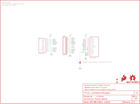

Contents
========

* [PRS11468 > Sparkfun](#prs11468--sparkfun)
	* [Images](#images)
	* [Tags](#tags)
  
![][im]
# PRS11468 > Sparkfun

- ID: PROJ-SPAR-11468-STAN-01
- Hex ID: PRS11468
- Name: Sparkfun
- Description: Sparkfun

## Images
  
  

|kicadPcb3d|kicadPcb3dFront|kicadPcb3dBack|eagleImage|eagleSchemImage|
| :---: | :---: | :---: | :---: | :---: |
||||||

## Tags

- hexID: PRS11468
- oompType: PROJ
- oompSize: SPAR
- oompColor: 11468
- oompDesc: STAN
- oompIndex: 01
- oompName: SD Sniffer
- sources: All source files from https://github.com/sparkfun/SD_Sniffer (source licence details in srcLicense.md)
- linkBuyPage: https://www.sparkfun.com/products/11468
- oompID: PROJ-SPAR-11468-STAN-01
- oompParts: FRAME1,UNMATCHED-UNMATCHED-UNMATCHED-UNMATCHED-UNMATCHED
- oompParts: JP4,UNMATCHED-UNMATCHED-UNMATCHED-UNMATCHED-UNMATCHED
- oompParts: LOGO,UNMATCHED-UNMATCHED-UNMATCHED-UNMATCHED-UNMATCHED
- oompParts: SJ1,UNMATCHED-UNMATCHED-UNMATCHED-UNMATCHED-UNMATCHED
- oompParts: U$2,UNMATCHED-UNMATCHED-UNMATCHED-UNMATCHED-UNMATCHED
- oompParts: U$4,UNMATCHED-UNMATCHED-UNMATCHED-UNMATCHED-UNMATCHED
- oompParts: U1,UNMATCHED-UNMATCHED-UNMATCHED-UNMATCHED-UNMATCHED
- oompParts: U2,UNMATCHED-UNMATCHED-UNMATCHED-UNMATCHED-UNMATCHED
- rawParts: FRAME1,FRAME-LETTER,FRAME-LETTER,CREATIVE_COMMONS,Schematic Frame,,
- rawParts: JP2,FIDUCIALUFIDUCIAL,FIDUCIALUFIDUCIAL,MICRO-FIDUCIAL,Fiducial Alignment Points,,
- rawParts: JP3,FIDUCIALUFIDUCIAL,FIDUCIALUFIDUCIAL,MICRO-FIDUCIAL,Fiducial Alignment Points,,
- rawParts: JP4,M11PTH,M11PTH,1X11,Header 11,,
- rawParts: LOGO,LOGO-SFENEW,LOGO-SFENEW,SFE-NEW-WEBLOGO,Spark Fun Electronics PCB Logo,,
- rawParts: SJ1,SOLDERJUMPERTRACE,SOLDERJUMPERTRACE,SJ_2S-TRACE,Solder Jumper,,
- rawParts: U$2,OSHW-LOGOS,OSHW-LOGOS,OSHW-LOGO-S,Open Source Hardware Logo This logo indicates the piece of hardware it is found on incorporates a OSHW license and/or adheres to the definition of open source hardware found here: http://freedomdefined.org/OSHW,,
- rawParts: U$4,SFE_LOGO_FLAME.2_INCH,SFE_LOGO_FLAME.2_INCH,SFE_LOGO_FLAME_.2,SFE Logo, flame only,,
- rawParts: U1,SD_CARD_SOCKET,SD_CARD_SOCKET,SD_1:1,SD Memory Card Connector, push-push normal type, CD enable, WP enable,,
- rawParts: U2,SD_MMC_CARDSD_PCB,SD_MMC_CARDSD_PCB,SD-MMC-CARD,Mechanical size of an SD/MMC card- NOT a socket!,,

[im]: kicadPcb3d_450.png
