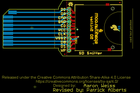
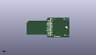
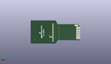
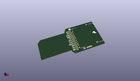

Contents
========

* [PROJ-SPAR-11468-STAN-01>SD Sniffer](#proj-spar-11468-stan-01sd-sniffer)
	* [Images](#images)
	* [Interactive BOM](#interactive-bom)
	* [OOMP Parts](#oomp-parts)
	* [Tags](#tags)
  
![][im]
# PROJ-SPAR-11468-STAN-01>SD Sniffer

- ID: PROJ-SPAR-11468-STAN-01
- Hex ID: PRS11468
- Name: SD Sniffer
- Description: 

## Images
  
  

|eagleImage|kicadPcb3dFront|kicadPcb3dBack|kicadPcb3d|
| :---: | :---: | :---: | :---: |
|||||

## Interactive BOM

- Interactive BOM page: [ibom.html](kicad/bom/ibom.html)

## OOMP Parts
  

|OOMP Parts|
| :---: |
|HEAD-I01-X-PI11-01, JP4, 40.64, 27.94, 270,JP4, M11PTH, 1X11, SparkFun-Connectors, (1.6, 1.1), R270|
|UNMATCHED-UNMATCHED-X-UNMATCHED-01, U1, 44.449999999999996, 16.509999999999998, 0,U1, SD_CARD_SOCKET, SD_1:1, SparkFun-Connectors, (1.75, 0.65), R0|
|UNMATCHED-UNMATCHED-X-UNMATCHED-01, U2, 17.779999999999998, 16.509999999999998, M270,U2, SD_MMC_CARDSD_PCB, SD-MMC-CARD, SparkFun-Boards, (0.7, 0.65), MR270|

## Tags

- hexID: PRS11468
- oompType: PROJ
- oompSize: SPAR
- oompColor: 11468
- oompDesc: STAN
- oompIndex: 01
- oompName: SD Sniffer
- sources: All source files from https://github.com/sparkfun/SD_Sniffer (source licence details in srcLicense.md)
- linkBuyPage: https://www.sparkfun.com/products/11468
- oompPart: SKIP-UNMATCHED-X-UNMATCHED-01, JP2, 72.136, 32.257999999999996, 0
- oompPart: SKIP-UNMATCHED-X-UNMATCHED-01, JP3, 38.099999999999994, 0.0, 0
- oompPart: HEAD-I01-X-PI11-01, JP4, 40.64, 27.94, 270
- oompPart: SKIP-UNMATCHED-X-UNMATCHED-01, SJ1, 43.053, 8.762999999999998, M90
- oompPart: UNMATCHED-UNMATCHED-X-UNMATCHED-01, U1, 44.449999999999996, 16.509999999999998, 0
- oompPart: UNMATCHED-UNMATCHED-X-UNMATCHED-01, U2, 17.779999999999998, 16.509999999999998, M270
- rawPart: JP2, FIDUCIALUFIDUCIAL, MICRO-FIDUCIAL, SparkFun, (2.84, 1.27), R0
- rawPart: JP3, FIDUCIALUFIDUCIAL, MICRO-FIDUCIAL, SparkFun, (1.5, 0), R0
- rawPart: JP4, M11PTH, 1X11, SparkFun-Connectors, (1.6, 1.1), R270
- rawPart: SJ1, SOLDERJUMPERTRACE, SJ_2S-TRACE, SparkFun-Passives, (1.695, 0.345), MR90
- rawPart: U1, SD_CARD_SOCKET, SD_1:1, SparkFun-Connectors, (1.75, 0.65), R0
- rawPart: U2, SD_MMC_CARDSD_PCB, SD-MMC-CARD, SparkFun-Boards, (0.7, 0.65), MR270
- oompID: PROJ-SPAR-11468-STAN-01

[im]: kicadPcb3d_450.png
