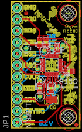
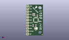
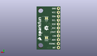
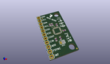

Contents
========

* [PROJ-SPAR-11486-STAN-01>MPU-9150 Breakout](#proj-spar-11486-stan-01mpu-9150-breakout)
	* [Images](#images)
	* [Interactive BOM](#interactive-bom)
	* [OOMP Parts](#oomp-parts)
	* [Tags](#tags)
  
![][im]
# PROJ-SPAR-11486-STAN-01>MPU-9150 Breakout

- ID: PROJ-SPAR-11486-STAN-01
- Hex ID: PRS11486
- Name: MPU-9150 Breakout
- Description: 

## Images
  
  

|eagleImage|kicadPcb3dFront|kicadPcb3dBack|kicadPcb3d|
| :---: | :---: | :---: | :---: |
|||||

## Interactive BOM

- Interactive BOM page: [ibom.html](kicad/bom/ibom.html)

## OOMP Parts
  

|OOMP Parts|
| :---: |
|CAPC-0402-X-NF100-V50, C1, 6.35, 8.889999999999999, 270,C1, 0.1uF, 0402-CAP, SparkFun-Passives, (0.25, 0.35), R270|
|CAPC-0402-X-NF22D-01, C2, 10.16, 17.779999999999998, 90,C2, 2.2nF, 0402-CAP, SparkFun-Passives, (0.4, 0.7), R90|
|CAPC-0402-X-UNMATCHED-01, C3, 12.7, 12.7, 0,C3, 10nF, 0402-CAP, SparkFun-Passives, (0.5, 0.5), R0|
|CAPC-0402-X-NF100-V50, C4, 8.889999999999999, 8.889999999999999, 270,C4, 0.1uF, 0402-CAP, SparkFun-Passives, (0.35, 0.35), R270|
|HEAD-I01-X-PI11-01, JP1, 1.27, 1.27, 90,JP1, M11PTH, 1X11, SparkFun-Connectors, (0.05, 0.05), R90|
|<table><tr><td></td><td> R1</td><td>[RESE-0402-X-O103-01 SMD (0402) 10k Ohm Resistor](https://github.com/oomlout/oomlout_OOMP_parts/tree/main/RESE-0402-X-O103-01/)</td><td>[R42103](https://github.com/oomlout/oomlout_OOMP_parts/tree/main/RESE-0402-X-O103-01/)</td></tr></table>|
|<table><tr><td></td><td> R2</td><td>[RESE-0402-X-O103-01 SMD (0402) 10k Ohm Resistor](https://github.com/oomlout/oomlout_OOMP_parts/tree/main/RESE-0402-X-O103-01/)</td><td>[R42103](https://github.com/oomlout/oomlout_OOMP_parts/tree/main/RESE-0402-X-O103-01/)</td></tr></table>|
|UNMATCHED-UNMATCHED-X-UNMATCHED-01, U1, 8.889999999999999, 13.97, 0,U1, MPU-9150, QFN-24-NP, SparkFun-Sensors, (0.35, 0.55), R0|

## Tags

- hexID: PRS11486
- oompType: PROJ
- oompSize: SPAR
- oompColor: 11486
- oompDesc: STAN
- oompIndex: 01
- oompName: MPU-9150 Breakout
- sources: All source files from https://github.com/sparkfun/MPU-9150_Breakout (source licence details in srcLicense.md)
- linkBuyPage: https://www.sparkfun.com/products/11486
- oompID: PROJ-SPAR-11486-STAN-01
- oompPart: CAPC-0402-X-NF100-V50, C1, 6.35, 8.889999999999999, 270
- oompPart: CAPC-0402-X-NF22D-01, C2, 10.16, 17.779999999999998, 90
- oompPart: CAPC-0402-X-UNMATCHED-01, C3, 12.7, 12.7, 0
- oompPart: CAPC-0402-X-NF100-V50, C4, 8.889999999999999, 8.889999999999999, 270
- oompPart: HEAD-I01-X-PI11-01, JP1, 1.27, 1.27, 90
- oompPart: SKIP-UNMATCHED-X-UNMATCHED-01, JP7, 3.302, 25.4, 0
- oompPart: SKIP-UNMATCHED-X-UNMATCHED-01, JP8, 14.477999999999998, 0.7619999999999999, 0
- oompPart: RESE-0402-X-O103-01, R1, 6.35, 19.049999999999997, 90
- oompPart: RESE-0402-X-O103-01, R2, 7.619999999999999, 19.049999999999997, 90
- oompPart: SKIP-UNMATCHED-X-UNMATCHED-01, SJ1, 8.889999999999999, 6.35, 0
- oompPart: SKIP-UNMATCHED-X-UNMATCHED-01, SJ2**, 8.889999999999999, 20.32, M0
- oompPart: SKIP-UNMATCHED-X-UNMATCHED-01, SJ3**, 8.889999999999999, 7.619999999999999, M180
- oompPart: UNMATCHED-UNMATCHED-X-UNMATCHED-01, U1, 8.889999999999999, 13.97, 0
- rawPart: C1, 0.1uF, 0402-CAP, SparkFun-Passives, (0.25, 0.35), R270
- rawPart: C2, 2.2nF, 0402-CAP, SparkFun-Passives, (0.4, 0.7), R90
- rawPart: C3, 10nF, 0402-CAP, SparkFun-Passives, (0.5, 0.5), R0
- rawPart: C4, 0.1uF, 0402-CAP, SparkFun-Passives, (0.35, 0.35), R270
- rawPart: JP1, M11PTH, 1X11, SparkFun-Connectors, (0.05, 0.05), R90
- rawPart: JP7, FIDUCIALUFIDUCIAL, MICRO-FIDUCIAL, SparkFun, (0.13, 1), R0
- rawPart: JP8, FIDUCIALUFIDUCIAL, MICRO-FIDUCIAL, SparkFun, (0.57, 0.03), R0
- rawPart: R1, 10k, 0402-RES, SparkFun-Passives, (0.25, 0.75), R90
- rawPart: R2, 10k, 0402-RES, SparkFun-Passives, (0.3, 0.75), R90
- rawPart: SJ1, SJ_3_PASTE2&3, SparkFun-Passives, (0.35, 0.25), R0
- rawPart: SJ2**, SOLDERJUMPERTRACE, SJ_2S-TRACE, SparkFun-Passives, (0.35, 0.8), MR0
- rawPart: SJ3**, SOLDERJUMPERTRACE, SJ_2S-TRACE, SparkFun-Passives, (0.35, 0.3), MR180
- rawPart: U1, MPU-9150, QFN-24-NP, SparkFun-Sensors, (0.35, 0.55), R0

[im]: kicadPcb3d_450.png
