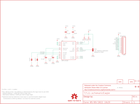

Contents
========

* [PRS11486 > Sparkfun](#prs11486--sparkfun)
	* [Schematic](#schematic)
	* [Interactive BOM](#interactive-bom)
	* [OOMP Parts](#oomp-parts)
	* [Images](#images)
	* [Tags](#tags)
  
![][im]
# PRS11486 > Sparkfun

- ID: PROJ-SPAR-11486-STAN-01
- Hex ID: PRS11486
- Name: Sparkfun
- Description: Sparkfun
- Long Link: [http://oom.lt/PROJ-SPAR-11486-STAN-01](http://oom.lt/PROJ-SPAR-11486-STAN-01)
- Short Link: [http://oom.lt/PRS11486](http://oom.lt/PRS11486)

## Schematic
  

## Interactive BOM

- Interactive BOM page: [ibom.html](https://htmlpreview.github.io/?https://github.com/oomlout/oomlout_OOMP_projects/blob/main/PROJ-SPAR-11486-STAN-01/kicad/bom/ibom.html)

## OOMP Parts
  

|OOMP Parts|
| :---: |
|C1,CAPC-0402-X-NF100-01,C1,0.1uF,CAP0402-CAP,0402-CAP,Capacitor,,|
|C2,CAPC-0402-X-UNMATCHED-01,C2,2.2nF,CAP0402-CAP,0402-CAP,Capacitor,,|
|C3,CAPC-0402-X-UNMATCHED-01,C3,10nF,CAP0402-CAP,0402-CAP,Capacitor,,|
|C4,CAPC-0402-X-NF100-01,C4,0.1uF,CAP0402-CAP,0402-CAP,Capacitor,,|
|JP1,HEAD-I01-X-PI11-01,JP1,M11PTH,M11PTH,1X11,Header 11,,|
|R1,RESE-0402-X-O103-01,JP2,STAND-OFF,STAND-OFF,STAND-OFF,#4 Stand Off,,|
|R2,RESE-0402-X-O103-01,JP3,STAND-OFF,STAND-OFF,STAND-OFF,#4 Stand Off,,|
|U1,UNMATCHED-UNMATCHED-X-UNMATCHED-01,JP4,LOGO-SFENW2,LOGO-SFENW2,SFE-NEW-WEB,Spark Fun Electronics PCB Logo,,|

## Images
  
  

|kicadPcb3d|kicadPcb3dFront|kicadPcb3dBack|eagleImage|eagleSchemImage|
| :---: | :---: | :---: | :---: | :---: |
||||||

## Tags

- hexID: PRS11486
- oompType: PROJ
- oompSize: SPAR
- oompColor: 11486
- oompDesc: STAN
- oompIndex: 01
- oompName: MPU-9150 Breakout
- sources: All source files from https://github.com/sparkfun/MPU-9150_Breakout (source licence details in srcLicense.md)
- linkBuyPage: https://www.sparkfun.com/products/11486
- oompID: PROJ-SPAR-11486-STAN-01
- oompParts: C1,CAPC-0402-X-NF100-01
- oompParts: C2,CAPC-0402-X-UNMATCHED-01
- oompParts: C3,CAPC-0402-X-UNMATCHED-01
- oompParts: C4,CAPC-0402-X-NF100-01
- oompParts: JP1,HEAD-I01-X-PI11-01
- oompParts: R1,RESE-0402-X-O103-01
- oompParts: R2,RESE-0402-X-O103-01
- oompParts: U1,UNMATCHED-UNMATCHED-X-UNMATCHED-01
- rawParts: C1,0.1uF,CAP0402-CAP,0402-CAP,Capacitor,,
- rawParts: C2,2.2nF,CAP0402-CAP,0402-CAP,Capacitor,,
- rawParts: C3,10nF,CAP0402-CAP,0402-CAP,Capacitor,,
- rawParts: C4,0.1uF,CAP0402-CAP,0402-CAP,Capacitor,,
- rawParts: JP1,M11PTH,M11PTH,1X11,Header 11,,
- rawParts: JP2,STAND-OFF,STAND-OFF,STAND-OFF,#4 Stand Off,,
- rawParts: JP3,STAND-OFF,STAND-OFF,STAND-OFF,#4 Stand Off,,
- rawParts: JP4,LOGO-SFENW2,LOGO-SFENW2,SFE-NEW-WEB,Spark Fun Electronics PCB Logo,,
- rawParts: JP6,LOGO-SFESK,LOGO-SFESK,SFE-LOGO-FLAME,Spark Fun Electronics PCB Logo,,
- rawParts: JP7,FIDUCIALUFIDUCIAL,FIDUCIALUFIDUCIAL,MICRO-FIDUCIAL,Fiducial Alignment Points,,
- rawParts: JP8,FIDUCIALUFIDUCIAL,FIDUCIALUFIDUCIAL,MICRO-FIDUCIAL,Fiducial Alignment Points,,
- rawParts: R1,10k,RESISTOR0402-RES,0402-RES,Resistor,,
- rawParts: R2,10k,RESISTOR0402-RES,0402-RES,Resistor,,
- rawParts: SJ1,,SOLDERJUMPER_2WAYPASTE2&3,SJ_3_PASTE2&3,Solder Jumper,,
- rawParts: SJ2**,SOLDERJUMPERTRACE,SOLDERJUMPERTRACE,SJ_2S-TRACE,Solder Jumper,,
- rawParts: SJ3**,SOLDERJUMPERTRACE,SOLDERJUMPERTRACE,SJ_2S-TRACE,Solder Jumper,,
- rawParts: U$1,OSHW-LOGOS,OSHW-LOGOS,OSHW-LOGO-S,Open Source Hardware Logo This logo indicates the piece of hardware it is found on incorporates a OSHW license and/or adheres to the definition of open source hardware found here: http://freedomdefined.org/OSHW,,
- rawParts: U1,MPU-9150,MPU-9150QFN-24-NP,QFN-24-NP,9DOF (3mag, 3accel, 3rotat). I2C interface.,,

[im]: kicadPcb3d_450.png
