Contents
========

* [PRS11509 > Papilio Button LED Wing](#prs11509--papilio-button-led-wing)
	* [Schematic](#schematic)
	* [PCB](#pcb)
	* [Interactive BOM](#interactive-bom)
	* [OOMP Parts](#oomp-parts)
	* [Images](#images)
	* [Tags](#tags)
  
![][im]
# PRS11509 > Papilio Button LED Wing

- ID: PROJ-SPAR-11509-STAN-01
- Hex ID: PRS11509
- Name: Sparkfun
- Description: Sparkfun
- Long Link: [http://oom.lt/PROJ-SPAR-11509-STAN-01](http://oom.lt/PROJ-SPAR-11509-STAN-01)
- Short Link: [http://oom.lt/PRS11509](http://oom.lt/PRS11509)

## Schematic
  
[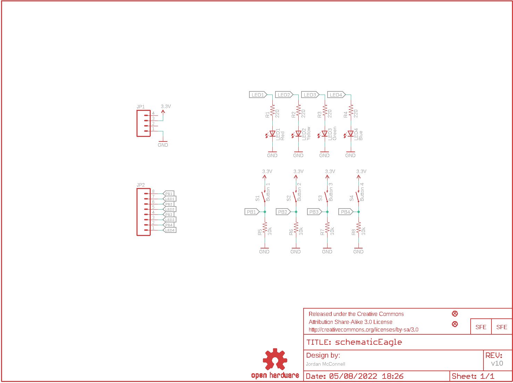](eagleSchemImage.png)
## PCB
  
[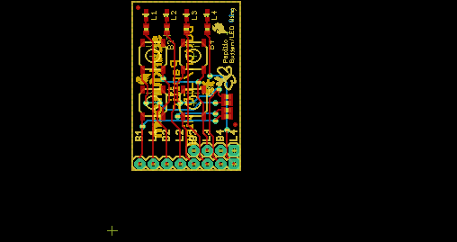](eagleImage.png)
## Interactive BOM

- Interactive BOM page: [ibom.html](https://htmlpreview.github.io/?https://github.com/oomlout/oomlout_OOMP_projects/blob/main/PROJ-SPAR-11509-STAN-01/kicad/bom/ibom.html)

## OOMP Parts
  

|OOMP ID|Name|Identifier|
| :---: | :---: | :---: |
|[HEAD-I01-X-PI04-01](https://github.com/oomlout/oomlout_OOMP_parts/tree/main/HEAD-I01-X-PI04-01/)|[2.54 mm 4 Pin Header](https://github.com/oomlout/oomlout_OOMP_parts/tree/main/HEAD-I01-X-PI04-01/)|[JP1](https://github.com/oomlout/oomlout_OOMP_parts/tree/main/HEAD-I01-X-PI04-01/)|
|[HEAD-I01-X-PI08-01](https://github.com/oomlout/oomlout_OOMP_parts/tree/main/HEAD-I01-X-PI08-01/)|[2.54 mm 8 Pin Header](https://github.com/oomlout/oomlout_OOMP_parts/tree/main/HEAD-I01-X-PI08-01/)|[JP2](https://github.com/oomlout/oomlout_OOMP_parts/tree/main/HEAD-I01-X-PI08-01/)|
|[LEDS-0603-R-STAN-01](https://github.com/oomlout/oomlout_OOMP_parts/tree/main/LEDS-0603-R-STAN-01/)|[SMD (0603) Red LED](https://github.com/oomlout/oomlout_OOMP_parts/tree/main/LEDS-0603-R-STAN-01/)|[LED1](https://github.com/oomlout/oomlout_OOMP_parts/tree/main/LEDS-0603-R-STAN-01/)|
|[LEDS-0603-Y-STAN-01](https://github.com/oomlout/oomlout_OOMP_parts/tree/main/LEDS-0603-Y-STAN-01/)|[SMD (0603) Yellow LED](https://github.com/oomlout/oomlout_OOMP_parts/tree/main/LEDS-0603-Y-STAN-01/)|[LED2](https://github.com/oomlout/oomlout_OOMP_parts/tree/main/LEDS-0603-Y-STAN-01/)|
|[LEDS-0603-G-STAN-01](https://github.com/oomlout/oomlout_OOMP_parts/tree/main/LEDS-0603-G-STAN-01/)|[SMD (0603) Green LED](https://github.com/oomlout/oomlout_OOMP_parts/tree/main/LEDS-0603-G-STAN-01/)|[LED3](https://github.com/oomlout/oomlout_OOMP_parts/tree/main/LEDS-0603-G-STAN-01/)|
|[LEDS-0603-L-STAN-01](https://github.com/oomlout/oomlout_OOMP_parts/tree/main/LEDS-0603-L-STAN-01/)|[SMD (0603) Blue LED](https://github.com/oomlout/oomlout_OOMP_parts/tree/main/LEDS-0603-L-STAN-01/)|[LED4](https://github.com/oomlout/oomlout_OOMP_parts/tree/main/LEDS-0603-L-STAN-01/)|
|[RESE-0402-X-O221-01](https://github.com/oomlout/oomlout_OOMP_parts/tree/main/RESE-0402-X-O221-01/)|[SMD (0402) 220 Ohm Resistor](https://github.com/oomlout/oomlout_OOMP_parts/tree/main/RESE-0402-X-O221-01/)|[R1, R2, R3, R4](https://github.com/oomlout/oomlout_OOMP_parts/tree/main/RESE-0402-X-O221-01/)|
|[RESE-0402-X-O103-01](https://github.com/oomlout/oomlout_OOMP_parts/tree/main/RESE-0402-X-O103-01/)|[SMD (0402) 10k Ohm Resistor](https://github.com/oomlout/oomlout_OOMP_parts/tree/main/RESE-0402-X-O103-01/)|[R5, R6, R7, R8](https://github.com/oomlout/oomlout_OOMP_parts/tree/main/RESE-0402-X-O103-01/)|
|UNMATCHED-UNMATCHED-X-UNMATCHED-01||S1, S2, S3, S4|

## Images
  
  

|bominteractivefront|bominteractiveback|kicadPcb3d|kicadPcb3dFront|kicadPcb3dBack|kicadSchem|eagleImage|eagleSchemImage|pcbdraw|pcbdrawback|
| :---: | :---: | :---: | :---: | :---: | :---: | :---: | :---: | :---: | :---: |
|[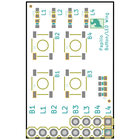](bomFront.png)|[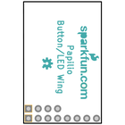](bomBack.png)|[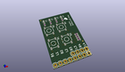](kicadPcb3d.png)|[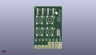](kicadPcb3dFront.png)|[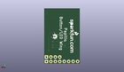](kicadPcb3dBack.png)|[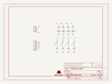](kicadSchem.png)|[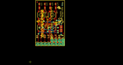](eagleImage.png)|[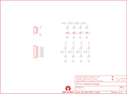](eagleSchemImage.png)|[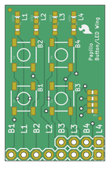](pcbdraw.png)|[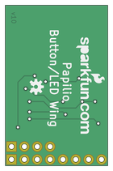](pcbdrawBack.png)|

## Tags

- hexID: PRS11509
- oompType: PROJ
- oompSize: SPAR
- oompColor: 11509
- oompDesc: STAN
- oompIndex: 01
- oompName: Papilio Button LED Wing
- sources: All source files from https://github.com/sparkfun/Papilio_Button_LED_Wing (source licence details in srcLicense.md)
- linkBuyPage: https://www.sparkfun.com/products/11509
- oompID: PROJ-SPAR-11509-STAN-01
- oompParts: JP1,HEAD-I01-X-PI04-01
- oompParts: JP2,HEAD-I01-X-PI08-01
- oompParts: LED1,LEDS-0603-R-STAN-01
- oompParts: LED2,LEDS-0603-Y-STAN-01
- oompParts: LED3,LEDS-0603-G-STAN-01
- oompParts: LED4,LEDS-0603-L-STAN-01
- oompParts: R1,RESE-0402-X-O221-01
- oompParts: R2,RESE-0402-X-O221-01
- oompParts: R3,RESE-0402-X-O221-01
- oompParts: R4,RESE-0402-X-O221-01
- oompParts: R5,RESE-0402-X-O103-01
- oompParts: R6,RESE-0402-X-O103-01
- oompParts: R7,RESE-0402-X-O103-01
- oompParts: R8,RESE-0402-X-O103-01
- oompParts: S1,UNMATCHED-UNMATCHED-X-UNMATCHED-01
- oompParts: S2,UNMATCHED-UNMATCHED-X-UNMATCHED-01
- oompParts: S3,UNMATCHED-UNMATCHED-X-UNMATCHED-01
- oompParts: S4,UNMATCHED-UNMATCHED-X-UNMATCHED-01
- rawParts: FRAME1,FRAME-LETTER,FRAME-LETTER,CREATIVE_COMMONS,Schematic Frame,,
- rawParts: JP1,,M04PTH,1X04,Header 4,,
- rawParts: JP2,,M081X08,1X08,Header 8,,
- rawParts: JP3,LOGO-SFESK,LOGO-SFESK,SFE-LOGO-FLAME,Spark Fun Electronics PCB Logo,,
- rawParts: JP4,LOGO-SFENEW,LOGO-SFENEW,SFE-NEW-WEBLOGO,Spark Fun Electronics PCB Logo,,
- rawParts: JP5,FIDUCIALUFIDUCIAL,FIDUCIALUFIDUCIAL,MICRO-FIDUCIAL,Fiducial Alignment Points,,
- rawParts: JP6,FIDUCIALUFIDUCIAL,FIDUCIALUFIDUCIAL,MICRO-FIDUCIAL,Fiducial Alignment Points,,
- rawParts: LED1,Red,LED0603,LED-0603,LEDs,,
- rawParts: LED2,Yellow,LED0603,LED-0603,LEDs,,
- rawParts: LED3,Green,LED0603,LED-0603,LEDs,,
- rawParts: LED4,Blue,LED0603,LED-0603,LEDs,,
- rawParts: R1,220,RESISTOR0402-RES,0402-RES,Resistor,,
- rawParts: R2,220,RESISTOR0402-RES,0402-RES,Resistor,,
- rawParts: R3,220,RESISTOR0402-RES,0402-RES,Resistor,,
- rawParts: R4,220,RESISTOR0402-RES,0402-RES,Resistor,,
- rawParts: R5,10k,RESISTOR0402-RES,0402-RES,Resistor,,
- rawParts: R6,10k,RESISTOR0402-RES,0402-RES,Resistor,,
- rawParts: R7,10k,RESISTOR0402-RES,0402-RES,Resistor,,
- rawParts: R8,10k,RESISTOR0402-RES,0402-RES,Resistor,,
- rawParts: S1,Button 1,SWITCH-MOMENTARY-2SMD,TACTILE_SWITCH_SMD,Various NO switches- pushbuttons, reed, etc,,
- rawParts: S2,Button 2,SWITCH-MOMENTARY-2SMD,TACTILE_SWITCH_SMD,Various NO switches- pushbuttons, reed, etc,,
- rawParts: S3,Button 3,SWITCH-MOMENTARY-2SMD,TACTILE_SWITCH_SMD,Various NO switches- pushbuttons, reed, etc,,
- rawParts: S4,Button 4,SWITCH-MOMENTARY-2SMD,TACTILE_SWITCH_SMD,Various NO switches- pushbuttons, reed, etc,,
- rawParts: U$1,OSHW-LOGOS,OSHW-LOGOS,OSHW-LOGO-S,Open Source Hardware Logo This logo indicates the piece of hardware it is found on incorporates a OSHW license and/or adheres to the definition of open source hardware found here: http://freedomdefined.org/OSHW,,

[im]: kicadPcb3d_450.png
