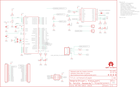

Contents
========

* [PRS11520 > Sparkfun](#prs11520--sparkfun)
	* [Schematic](#schematic)
	* [Interactive BOM](#interactive-bom)
	* [OOMP Parts](#oomp-parts)
	* [Images](#images)
	* [Tags](#tags)
  
![][im]
# PRS11520 > Sparkfun

- ID: PROJ-SPAR-11520-STAN-01
- Hex ID: PRS11520
- Name: Sparkfun
- Description: Sparkfun
- Long Link: [http://oom.lt/PROJ-SPAR-11520-STAN-01](http://oom.lt/PROJ-SPAR-11520-STAN-01)
- Long Link: [http://oom.lt/PRS11520](http://oom.lt/PRS11520)

## Schematic
  
![][schem]
## Interactive BOM

- Interactive BOM page: [ibom.html](https://htmlpreview.github.io/?https://github.com/oomlout/oomlout_OOMP_projects/blob/main/PROJ-SPAR-11520-STAN-01/kicad/bom/ibom.html)

## OOMP Parts
  

|OOMP Parts|
| :---: |
|C1,UNMATCHED-UNMATCHED-UNMATCHED-UNMATCHED-UNMATCHED,C1,10uF,CAP_POL1206,EIA3216,Capacitor Polarized,,,|
|C4,UNMATCHED-UNMATCHED-UNMATCHED-UNMATCHED-UNMATCHED,C4,0.1uF,CAP0603-CAP,0603-CAP,Capacitor,,,|
|C5,UNMATCHED-UNMATCHED-UNMATCHED-UNMATCHED-UNMATCHED,C5,22pF,CAP0603-CAP,0603-CAP,Capacitor,,,|
|C7,UNMATCHED-UNMATCHED-UNMATCHED-UNMATCHED-UNMATCHED,C7,22pF,CAP0603-CAP,0603-CAP,Capacitor,,,|
|C8,UNMATCHED-UNMATCHED-UNMATCHED-UNMATCHED-UNMATCHED,C8,1uF,CAP0603-CAP,0603-CAP,Capacitor,,,|
|C9,UNMATCHED-UNMATCHED-UNMATCHED-UNMATCHED-UNMATCHED,C9,4.7uF,CAP0603-CAP,0603-CAP,Capacitor,,,|
|C11,UNMATCHED-UNMATCHED-UNMATCHED-UNMATCHED-UNMATCHED,C11,1uF,CAP0603-CAP,0603-CAP,Capacitor,,,|
|C12,UNMATCHED-UNMATCHED-UNMATCHED-UNMATCHED-UNMATCHED,C12,1uF,CAP0603-CAP,0603-CAP,Capacitor,,,|
|C13,UNMATCHED-UNMATCHED-UNMATCHED-UNMATCHED-UNMATCHED,C13,10uF,CAP_POL1206,EIA3216,Capacitor Polarized,,,|
|C14,UNMATCHED-UNMATCHED-UNMATCHED-UNMATCHED-UNMATCHED,C14,0.1uF,CAP0603-CAP,0603-CAP,Capacitor,,,|
|D1,UNMATCHED-UNMATCHED-UNMATCHED-UNMATCHED-UNMATCHED,D1,Yellow,LED0603,LED-0603,LEDs,,,|
|D2,UNMATCHED-UNMATCHED-UNMATCHED-UNMATCHED-UNMATCHED,D2,Green,LED0603,LED-0603,LEDs,,,|
|D3,UNMATCHED-UNMATCHED-UNMATCHED-UNMATCHED-UNMATCHED,D3,Red,LED0603,LED-0603,LEDs,,,|
|D4,UNMATCHED-UNMATCHED-UNMATCHED-UNMATCHED-UNMATCHED,D4,Yellow,LED0603,LED-0603,LEDs,,,|
|D5,UNMATCHED-UNMATCHED-UNMATCHED-UNMATCHED-UNMATCHED,D5,Yellow,LED0603,LED-0603,LEDs,,,|
|D6,UNMATCHED-UNMATCHED-UNMATCHED-UNMATCHED-UNMATCHED,D6,Blue,LED0603,LED-0603,LEDs,,,|
|F1,UNMATCHED-UNMATCHED-UNMATCHED-UNMATCHED-UNMATCHED,F1,PTCSMD,PTCSMD,PTC-1206,Resettable Fuse PTC,,,|
|FRAME1,UNMATCHED-UNMATCHED-UNMATCHED-UNMATCHED-UNMATCHED,FRAME1,FRAME-LETTER,FRAME-LETTER,CREATIVE_COMMONS,Schematic Frame,,,|
|FRAME2,UNMATCHED-UNMATCHED-UNMATCHED-UNMATCHED-UNMATCHED,FRAME2,FRAME-LETTER,FRAME-LETTER,CREATIVE_COMMONS,Schematic Frame,,,|
|JP1,UNMATCHED-UNMATCHED-UNMATCHED-UNMATCHED-UNMATCHED,JP1,M14,M14,1X14,Header 14,,,|
|JP2,UNMATCHED-UNMATCHED-UNMATCHED-UNMATCHED-UNMATCHED,JP2,M14,M14,1X14,Header 14,,,|
|JP3,UNMATCHED-UNMATCHED-UNMATCHED-UNMATCHED-UNMATCHED,JP3,,M02-JST-2MM-SMT,JST-2-SMD,Header 2,,,|
|JP4,UNMATCHED-UNMATCHED-UNMATCHED-UNMATCHED-UNMATCHED,JP4,AVR_SPI,AVR_SPI_PRG_6PTH,2X3,AVR ISP 6 Pin,,,|
|JP5,UNMATCHED-UNMATCHED-UNMATCHED-UNMATCHED-UNMATCHED,JP5,STAND-OFF,STAND-OFF,STAND-OFF,Stand Off,,,|
|JP6,UNMATCHED-UNMATCHED-UNMATCHED-UNMATCHED-UNMATCHED,JP6,External Charge,M02PTH,1X02,Header 2,,,|
|JP7,UNMATCHED-UNMATCHED-UNMATCHED-UNMATCHED-UNMATCHED,JP7,External Switch,M02PTH,1X02,Header 2,,,|
|JP8,UNMATCHED-UNMATCHED-UNMATCHED-UNMATCHED-UNMATCHED,JP8,,M01PTH,1X01,Header 1,,,|
|JP9,UNMATCHED-UNMATCHED-UNMATCHED-UNMATCHED-UNMATCHED,JP9,,M01PTH,1X01,Header 1,,,|
|JP14,UNMATCHED-UNMATCHED-UNMATCHED-UNMATCHED-UNMATCHED,JP10,FIDUCIALUFIDUCIAL,FIDUCIAL1X2,FIDUCIAL-1X2,Fiducial Alignment Points,,,|
|JP16,UNMATCHED-UNMATCHED-UNMATCHED-UNMATCHED-UNMATCHED,JP11,FIDUCIALUFIDUCIAL,FIDUCIAL1X2,FIDUCIAL-1X2,Fiducial Alignment Points,,,|
|JP17,UNMATCHED-UNMATCHED-UNMATCHED-UNMATCHED-UNMATCHED,JP12,FIDUCIALUFIDUCIAL,FIDUCIAL1X2,FIDUCIAL-1X2,Fiducial Alignment Points,,,|
|LED1,UNMATCHED-UNMATCHED-UNMATCHED-UNMATCHED-UNMATCHED,JP13,FIDUCIALUFIDUCIAL,FIDUCIAL1X2,FIDUCIAL-1X2,Fiducial Alignment Points,,,|
|LOGO1,UNMATCHED-UNMATCHED-UNMATCHED-UNMATCHED-UNMATCHED,JP14,External Power,M02PTH,1X02,Header 2,,,|
|R1,UNMATCHED-UNMATCHED-UNMATCHED-UNMATCHED-UNMATCHED,JP16,STAND-OFF,STAND-OFF,STAND-OFF,Stand Off,,,|
|R2,UNMATCHED-UNMATCHED-UNMATCHED-UNMATCHED-UNMATCHED,JP17,STAND-OFF,STAND-OFF,STAND-OFF,Stand Off,,,|
|R3,UNMATCHED-UNMATCHED-UNMATCHED-UNMATCHED-UNMATCHED,LED1,Red,LED0603,LED-0603,LEDs,,,|
|R5,UNMATCHED-UNMATCHED-UNMATCHED-UNMATCHED-UNMATCHED,LOGO1,OSHW-LOGOL,OSHW-LOGOL,OSHW-LOGO-L,Open Source Hardware Logo This logo indicates the piece of hardware it is found on incorporates a OSHW license and/or adheres to the definition of open source hardware found here: http://freedomdefined.org/OSHW,,,|
|R6,UNMATCHED-UNMATCHED-UNMATCHED-UNMATCHED-UNMATCHED,R1,330,RESISTOR0603-RES,0603-RES,Resistor,,,|
|R7,UNMATCHED-UNMATCHED-UNMATCHED-UNMATCHED-UNMATCHED,R2,330,RESISTOR0603-RES,0603-RES,Resistor,,,|
|R8,UNMATCHED-UNMATCHED-UNMATCHED-UNMATCHED-UNMATCHED,R3,330,RESISTOR0603-RES,0603-RES,Resistor,,,|
|R9,UNMATCHED-UNMATCHED-UNMATCHED-UNMATCHED-UNMATCHED,R5,2K,RESISTOR0603-RES,0603-RES,Resistor,,,|
|R10,UNMATCHED-UNMATCHED-UNMATCHED-UNMATCHED-UNMATCHED,R6,10K,RESISTOR0603-RES,0603-RES,Resistor,,,|
|R11,UNMATCHED-UNMATCHED-UNMATCHED-UNMATCHED-UNMATCHED,R7,330,RESISTOR0603-RES,0603-RES,Resistor,,,|
|R12,UNMATCHED-UNMATCHED-UNMATCHED-UNMATCHED-UNMATCHED,R8,100,RESISTOR0603-RES,0603-RES,Resistor,,,|
|R13,UNMATCHED-UNMATCHED-UNMATCHED-UNMATCHED-UNMATCHED,R9,470,RESISTOR0603-RES,0603-RES,Resistor,,,|
|R14,UNMATCHED-UNMATCHED-UNMATCHED-UNMATCHED-UNMATCHED,R10,330,RESISTOR0603-RES,0603-RES,Resistor,,,|
|R15,UNMATCHED-UNMATCHED-UNMATCHED-UNMATCHED-UNMATCHED,R11,22,RESISTOR0603-RES,0603-RES,Resistor,,,|
|S2,UNMATCHED-UNMATCHED-UNMATCHED-UNMATCHED-UNMATCHED,R12,22,RESISTOR0603-RES,0603-RES,Resistor,,,|
|S3,UNMATCHED-UNMATCHED-UNMATCHED-UNMATCHED-UNMATCHED,R13,330,RESISTOR0603-RES,0603-RES,Resistor,,,|
|SJ1,UNMATCHED-UNMATCHED-UNMATCHED-UNMATCHED-UNMATCHED,R14,1k,RESISTOR0603-RES,0603-RES,Resistor,,,|
|SJ2,UNMATCHED-UNMATCHED-UNMATCHED-UNMATCHED-UNMATCHED,R15,1k,RESISTOR0603-RES,0603-RES,Resistor,,,|
|TP1,UNMATCHED-UNMATCHED-UNMATCHED-UNMATCHED-UNMATCHED,S2,Power Switch,SWITCH-SPSTSMD,AYZ0202,SPST Switch,,,|
|TP2,UNMATCHED-UNMATCHED-UNMATCHED-UNMATCHED-UNMATCHED,S3,Reset,SWITCH-MOMENTARY-2SMD,TACTILE_SWITCH_SMD,,,,|
|U$1,UNMATCHED-UNMATCHED-UNMATCHED-UNMATCHED-UNMATCHED,SJ1,SOLDERJUMPERNC,SOLDERJUMPERNC,SJ_2S,Solder Jumper,,,|
|U$2,UNMATCHED-UNMATCHED-UNMATCHED-UNMATCHED-UNMATCHED,SJ2,USB Power,SOLDERJUMPERTRACE,SJ_2S-TRACE,Solder Jumper,,,|
|U$6,UNMATCHED-UNMATCHED-UNMATCHED-UNMATCHED-UNMATCHED,TP1,RSSI,TEST-POINT3X5,PAD.03X.05,,,,|
|U1,UNMATCHED-UNMATCHED-UNMATCHED-UNMATCHED-UNMATCHED,TP2,ON,TEST-POINT3X5,PAD.03X.05,,,,|
|U4,UNMATCHED-UNMATCHED-UNMATCHED-UNMATCHED-UNMATCHED,U$1,LOGO-SFENEW,LOGO-SFENEW,SFE-NEW-WEBLOGO,Spark Fun Electronics PCB Logo,,,|
|U5,UNMATCHED-UNMATCHED-UNMATCHED-UNMATCHED-UNMATCHED,U$2,REVISION,REVISION,REVISION,,,,|
|U6,UNMATCHED-UNMATCHED-UNMATCHED-UNMATCHED-UNMATCHED,U$6,FIO_LOGOV2,FIO_LOGOV2,FUNNEL_LOGO_BOTTOM_V2,,,,|
|X2,UNMATCHED-UNMATCHED-UNMATCHED-UNMATCHED-UNMATCHED,U1,MCP73831,MCP73831,SOT23-5,Microchips MCP73831,,,|
|Y2,UNMATCHED-UNMATCHED-UNMATCHED-UNMATCHED-UNMATCHED,U4,XBEE,XBEE-1B3,XBEE-SMD,,,,|

## Images
  
  

|kicadPcb3d|kicadPcb3dFront|kicadPcb3dBack|eagleImage|eagleSchemImage|
| :---: | :---: | :---: | :---: | :---: |
||||||

## Tags

- hexID: PRS11520
- oompType: PROJ
- oompSize: SPAR
- oompColor: 11520
- oompDesc: STAN
- oompIndex: 01
- oompName: Fio v3
- sources: All source files from https://github.com/sparkfun/Fio_v3 (source licence details in srcLicense.md)
- linkBuyPage: https://www.sparkfun.com/products/11520
- oompID: PROJ-SPAR-11520-STAN-01
- oompParts: C1,UNMATCHED-UNMATCHED-UNMATCHED-UNMATCHED-UNMATCHED
- oompParts: C4,UNMATCHED-UNMATCHED-UNMATCHED-UNMATCHED-UNMATCHED
- oompParts: C5,UNMATCHED-UNMATCHED-UNMATCHED-UNMATCHED-UNMATCHED
- oompParts: C7,UNMATCHED-UNMATCHED-UNMATCHED-UNMATCHED-UNMATCHED
- oompParts: C8,UNMATCHED-UNMATCHED-UNMATCHED-UNMATCHED-UNMATCHED
- oompParts: C9,UNMATCHED-UNMATCHED-UNMATCHED-UNMATCHED-UNMATCHED
- oompParts: C11,UNMATCHED-UNMATCHED-UNMATCHED-UNMATCHED-UNMATCHED
- oompParts: C12,UNMATCHED-UNMATCHED-UNMATCHED-UNMATCHED-UNMATCHED
- oompParts: C13,UNMATCHED-UNMATCHED-UNMATCHED-UNMATCHED-UNMATCHED
- oompParts: C14,UNMATCHED-UNMATCHED-UNMATCHED-UNMATCHED-UNMATCHED
- oompParts: D1,UNMATCHED-UNMATCHED-UNMATCHED-UNMATCHED-UNMATCHED
- oompParts: D2,UNMATCHED-UNMATCHED-UNMATCHED-UNMATCHED-UNMATCHED
- oompParts: D3,UNMATCHED-UNMATCHED-UNMATCHED-UNMATCHED-UNMATCHED
- oompParts: D4,UNMATCHED-UNMATCHED-UNMATCHED-UNMATCHED-UNMATCHED
- oompParts: D5,UNMATCHED-UNMATCHED-UNMATCHED-UNMATCHED-UNMATCHED
- oompParts: D6,UNMATCHED-UNMATCHED-UNMATCHED-UNMATCHED-UNMATCHED
- oompParts: F1,UNMATCHED-UNMATCHED-UNMATCHED-UNMATCHED-UNMATCHED
- oompParts: FRAME1,UNMATCHED-UNMATCHED-UNMATCHED-UNMATCHED-UNMATCHED
- oompParts: FRAME2,UNMATCHED-UNMATCHED-UNMATCHED-UNMATCHED-UNMATCHED
- oompParts: JP1,UNMATCHED-UNMATCHED-UNMATCHED-UNMATCHED-UNMATCHED
- oompParts: JP2,UNMATCHED-UNMATCHED-UNMATCHED-UNMATCHED-UNMATCHED
- oompParts: JP3,UNMATCHED-UNMATCHED-UNMATCHED-UNMATCHED-UNMATCHED
- oompParts: JP4,UNMATCHED-UNMATCHED-UNMATCHED-UNMATCHED-UNMATCHED
- oompParts: JP5,UNMATCHED-UNMATCHED-UNMATCHED-UNMATCHED-UNMATCHED
- oompParts: JP6,UNMATCHED-UNMATCHED-UNMATCHED-UNMATCHED-UNMATCHED
- oompParts: JP7,UNMATCHED-UNMATCHED-UNMATCHED-UNMATCHED-UNMATCHED
- oompParts: JP8,UNMATCHED-UNMATCHED-UNMATCHED-UNMATCHED-UNMATCHED
- oompParts: JP9,UNMATCHED-UNMATCHED-UNMATCHED-UNMATCHED-UNMATCHED
- oompParts: JP14,UNMATCHED-UNMATCHED-UNMATCHED-UNMATCHED-UNMATCHED
- oompParts: JP16,UNMATCHED-UNMATCHED-UNMATCHED-UNMATCHED-UNMATCHED
- oompParts: JP17,UNMATCHED-UNMATCHED-UNMATCHED-UNMATCHED-UNMATCHED
- oompParts: LED1,UNMATCHED-UNMATCHED-UNMATCHED-UNMATCHED-UNMATCHED
- oompParts: LOGO1,UNMATCHED-UNMATCHED-UNMATCHED-UNMATCHED-UNMATCHED
- oompParts: R1,UNMATCHED-UNMATCHED-UNMATCHED-UNMATCHED-UNMATCHED
- oompParts: R2,UNMATCHED-UNMATCHED-UNMATCHED-UNMATCHED-UNMATCHED
- oompParts: R3,UNMATCHED-UNMATCHED-UNMATCHED-UNMATCHED-UNMATCHED
- oompParts: R5,UNMATCHED-UNMATCHED-UNMATCHED-UNMATCHED-UNMATCHED
- oompParts: R6,UNMATCHED-UNMATCHED-UNMATCHED-UNMATCHED-UNMATCHED
- oompParts: R7,UNMATCHED-UNMATCHED-UNMATCHED-UNMATCHED-UNMATCHED
- oompParts: R8,UNMATCHED-UNMATCHED-UNMATCHED-UNMATCHED-UNMATCHED
- oompParts: R9,UNMATCHED-UNMATCHED-UNMATCHED-UNMATCHED-UNMATCHED
- oompParts: R10,UNMATCHED-UNMATCHED-UNMATCHED-UNMATCHED-UNMATCHED
- oompParts: R11,UNMATCHED-UNMATCHED-UNMATCHED-UNMATCHED-UNMATCHED
- oompParts: R12,UNMATCHED-UNMATCHED-UNMATCHED-UNMATCHED-UNMATCHED
- oompParts: R13,UNMATCHED-UNMATCHED-UNMATCHED-UNMATCHED-UNMATCHED
- oompParts: R14,UNMATCHED-UNMATCHED-UNMATCHED-UNMATCHED-UNMATCHED
- oompParts: R15,UNMATCHED-UNMATCHED-UNMATCHED-UNMATCHED-UNMATCHED
- oompParts: S2,UNMATCHED-UNMATCHED-UNMATCHED-UNMATCHED-UNMATCHED
- oompParts: S3,UNMATCHED-UNMATCHED-UNMATCHED-UNMATCHED-UNMATCHED
- oompParts: SJ1,UNMATCHED-UNMATCHED-UNMATCHED-UNMATCHED-UNMATCHED
- oompParts: SJ2,UNMATCHED-UNMATCHED-UNMATCHED-UNMATCHED-UNMATCHED
- oompParts: TP1,UNMATCHED-UNMATCHED-UNMATCHED-UNMATCHED-UNMATCHED
- oompParts: TP2,UNMATCHED-UNMATCHED-UNMATCHED-UNMATCHED-UNMATCHED
- oompParts: U$1,UNMATCHED-UNMATCHED-UNMATCHED-UNMATCHED-UNMATCHED
- oompParts: U$2,UNMATCHED-UNMATCHED-UNMATCHED-UNMATCHED-UNMATCHED
- oompParts: U$6,UNMATCHED-UNMATCHED-UNMATCHED-UNMATCHED-UNMATCHED
- oompParts: U1,UNMATCHED-UNMATCHED-UNMATCHED-UNMATCHED-UNMATCHED
- oompParts: U4,UNMATCHED-UNMATCHED-UNMATCHED-UNMATCHED-UNMATCHED
- oompParts: U5,UNMATCHED-UNMATCHED-UNMATCHED-UNMATCHED-UNMATCHED
- oompParts: U6,UNMATCHED-UNMATCHED-UNMATCHED-UNMATCHED-UNMATCHED
- oompParts: X2,UNMATCHED-UNMATCHED-UNMATCHED-UNMATCHED-UNMATCHED
- oompParts: Y2,UNMATCHED-UNMATCHED-UNMATCHED-UNMATCHED-UNMATCHED
- rawParts: C1,10uF,CAP_POL1206,EIA3216,Capacitor Polarized,,,
- rawParts: C4,0.1uF,CAP0603-CAP,0603-CAP,Capacitor,,,
- rawParts: C5,22pF,CAP0603-CAP,0603-CAP,Capacitor,,,
- rawParts: C7,22pF,CAP0603-CAP,0603-CAP,Capacitor,,,
- rawParts: C8,1uF,CAP0603-CAP,0603-CAP,Capacitor,,,
- rawParts: C9,4.7uF,CAP0603-CAP,0603-CAP,Capacitor,,,
- rawParts: C11,1uF,CAP0603-CAP,0603-CAP,Capacitor,,,
- rawParts: C12,1uF,CAP0603-CAP,0603-CAP,Capacitor,,,
- rawParts: C13,10uF,CAP_POL1206,EIA3216,Capacitor Polarized,,,
- rawParts: C14,0.1uF,CAP0603-CAP,0603-CAP,Capacitor,,,
- rawParts: D1,Yellow,LED0603,LED-0603,LEDs,,,
- rawParts: D2,Green,LED0603,LED-0603,LEDs,,,
- rawParts: D3,Red,LED0603,LED-0603,LEDs,,,
- rawParts: D4,Yellow,LED0603,LED-0603,LEDs,,,
- rawParts: D5,Yellow,LED0603,LED-0603,LEDs,,,
- rawParts: D6,Blue,LED0603,LED-0603,LEDs,,,
- rawParts: F1,PTCSMD,PTCSMD,PTC-1206,Resettable Fuse PTC,,,
- rawParts: FRAME1,FRAME-LETTER,FRAME-LETTER,CREATIVE_COMMONS,Schematic Frame,,,
- rawParts: FRAME2,FRAME-LETTER,FRAME-LETTER,CREATIVE_COMMONS,Schematic Frame,,,
- rawParts: JP1,M14,M14,1X14,Header 14,,,
- rawParts: JP2,M14,M14,1X14,Header 14,,,
- rawParts: JP3,,M02-JST-2MM-SMT,JST-2-SMD,Header 2,,,
- rawParts: JP4,AVR_SPI,AVR_SPI_PRG_6PTH,2X3,AVR ISP 6 Pin,,,
- rawParts: JP5,STAND-OFF,STAND-OFF,STAND-OFF,Stand Off,,,
- rawParts: JP6,External Charge,M02PTH,1X02,Header 2,,,
- rawParts: JP7,External Switch,M02PTH,1X02,Header 2,,,
- rawParts: JP8,,M01PTH,1X01,Header 1,,,
- rawParts: JP9,,M01PTH,1X01,Header 1,,,
- rawParts: JP10,FIDUCIALUFIDUCIAL,FIDUCIAL1X2,FIDUCIAL-1X2,Fiducial Alignment Points,,,
- rawParts: JP11,FIDUCIALUFIDUCIAL,FIDUCIAL1X2,FIDUCIAL-1X2,Fiducial Alignment Points,,,
- rawParts: JP12,FIDUCIALUFIDUCIAL,FIDUCIAL1X2,FIDUCIAL-1X2,Fiducial Alignment Points,,,
- rawParts: JP13,FIDUCIALUFIDUCIAL,FIDUCIAL1X2,FIDUCIAL-1X2,Fiducial Alignment Points,,,
- rawParts: JP14,External Power,M02PTH,1X02,Header 2,,,
- rawParts: JP16,STAND-OFF,STAND-OFF,STAND-OFF,Stand Off,,,
- rawParts: JP17,STAND-OFF,STAND-OFF,STAND-OFF,Stand Off,,,
- rawParts: LED1,Red,LED0603,LED-0603,LEDs,,,
- rawParts: LOGO1,OSHW-LOGOL,OSHW-LOGOL,OSHW-LOGO-L,Open Source Hardware Logo This logo indicates the piece of hardware it is found on incorporates a OSHW license and/or adheres to the definition of open source hardware found here: http://freedomdefined.org/OSHW,,,
- rawParts: R1,330,RESISTOR0603-RES,0603-RES,Resistor,,,
- rawParts: R2,330,RESISTOR0603-RES,0603-RES,Resistor,,,
- rawParts: R3,330,RESISTOR0603-RES,0603-RES,Resistor,,,
- rawParts: R5,2K,RESISTOR0603-RES,0603-RES,Resistor,,,
- rawParts: R6,10K,RESISTOR0603-RES,0603-RES,Resistor,,,
- rawParts: R7,330,RESISTOR0603-RES,0603-RES,Resistor,,,
- rawParts: R8,100,RESISTOR0603-RES,0603-RES,Resistor,,,
- rawParts: R9,470,RESISTOR0603-RES,0603-RES,Resistor,,,
- rawParts: R10,330,RESISTOR0603-RES,0603-RES,Resistor,,,
- rawParts: R11,22,RESISTOR0603-RES,0603-RES,Resistor,,,
- rawParts: R12,22,RESISTOR0603-RES,0603-RES,Resistor,,,
- rawParts: R13,330,RESISTOR0603-RES,0603-RES,Resistor,,,
- rawParts: R14,1k,RESISTOR0603-RES,0603-RES,Resistor,,,
- rawParts: R15,1k,RESISTOR0603-RES,0603-RES,Resistor,,,
- rawParts: S2,Power Switch,SWITCH-SPSTSMD,AYZ0202,SPST Switch,,,
- rawParts: S3,Reset,SWITCH-MOMENTARY-2SMD,TACTILE_SWITCH_SMD,,,,
- rawParts: SJ1,SOLDERJUMPERNC,SOLDERJUMPERNC,SJ_2S,Solder Jumper,,,
- rawParts: SJ2,USB Power,SOLDERJUMPERTRACE,SJ_2S-TRACE,Solder Jumper,,,
- rawParts: TP1,RSSI,TEST-POINT3X5,PAD.03X.05,,,,
- rawParts: TP2,ON,TEST-POINT3X5,PAD.03X.05,,,,
- rawParts: U$1,LOGO-SFENEW,LOGO-SFENEW,SFE-NEW-WEBLOGO,Spark Fun Electronics PCB Logo,,,
- rawParts: U$2,REVISION,REVISION,REVISION,,,,
- rawParts: U$6,FIO_LOGOV2,FIO_LOGOV2,FUNNEL_LOGO_BOTTOM_V2,,,,
- rawParts: U1,MCP73831,MCP73831,SOT23-5,Microchips MCP73831,,,
- rawParts: U4,XBEE,XBEE-1B3,XBEE-SMD,,,,
- rawParts: U5,ATmega32U4,ATMEGA32U41:1,QFN-44-NOPAD_1:1,Atmel MCU, 32KByte,IC-10828,32U4,
- rawParts: U6,MIC5219-3.3,V_REG_LDOSMD,SOT23-5,Voltage Regulator LDO,,,
- rawParts: X2,USB_MICROB_PLUGCONN-11752,USB_MICROB_PLUGCONN-11752,USB-B-MICRO-SMD_V03,USB Micro-B Plug,CONN-11752,,
- rawParts: Y2,8MHz,CRYSTAL5X3,CRYSTAL-SMD-5X3,Crystals,,,

[im]: kicadPcb3d_450.png
[schem]: eagleSchemImage.png
