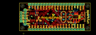
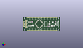
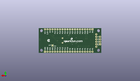
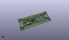

Contents
========

* [PROJ-SPAR-11525-STAN-01>P8X32A Breakout](#proj-spar-11525-stan-01p8x32a-breakout)
	* [Images](#images)
	* [Interactive BOM](#interactive-bom)
	* [OOMP Parts](#oomp-parts)
	* [Tags](#tags)
  
![][im]
# PROJ-SPAR-11525-STAN-01>P8X32A Breakout

- ID: PROJ-SPAR-11525-STAN-01
- Hex ID: PRS11525
- Name: P8X32A Breakout
- Description: 

## Images
  
  

|eagleImage|kicadPcb3dFront|kicadPcb3dBack|kicadPcb3d|
| :---: | :---: | :---: | :---: |
|||||

## Interactive BOM

- Interactive BOM page: [ibom.html](kicad/bom/ibom.html)

## OOMP Parts
  

|OOMP Parts|
| :---: |
|CAPC-0402-X-NF100-V50, C1, 43.18, 12.7, 270,C1, 0.1uF, 0402-CAP, SparkFun-Passives, (1.7, 0.5), R270|
|CAPC-UNMATCHED-X-UNMATCHED-01, C2, 45.72, 12.7, 90,C2, 10uF, EIA3216, SparkFun-Passives, (1.8, 0.5), R90|
|CAPC-UNMATCHED-X-UNMATCHED-01, C3, 55.88, 12.7, 270,C3, 10uF, EIA3216, SparkFun-Passives, (2.2, 0.5), R270|
|CAPC-0402-X-NF100-V50, C4, 13.97, 6.35, 90,C4, 0.1uF, 0402-CAP, SparkFun-Passives, (0.55, 0.25), R90|
|<table><tr><td></td><td> JP1</td><td>[HEAD-I01-X-PI04-01 2.54 mm 4 Pin Header](https://github.com/oomlout/oomlout_OOMP_parts/tree/main/HEAD-I01-X-PI04-01/)</td><td>[H04](https://github.com/oomlout/oomlout_OOMP_parts/tree/main/HEAD-I01-X-PI04-01/)</td></tr></table>|
|<table><tr><td></td><td> JP2</td><td>[HEAD-I01-X-PI20-01 2.54 mm 20 Pin Header](https://github.com/oomlout/oomlout_OOMP_parts/tree/main/HEAD-I01-X-PI20-01/)</td><td>[H20](https://github.com/oomlout/oomlout_OOMP_parts/tree/main/HEAD-I01-X-PI20-01/)</td></tr></table>|
|<table><tr><td></td><td> JP3</td><td>[HEAD-I01-X-PI20-01 2.54 mm 20 Pin Header](https://github.com/oomlout/oomlout_OOMP_parts/tree/main/HEAD-I01-X-PI20-01/)</td><td>[H20](https://github.com/oomlout/oomlout_OOMP_parts/tree/main/HEAD-I01-X-PI20-01/)</td></tr></table>|
|UNMATCHED-UNMATCHED-X-UNMATCHED-01, JP9, 5.08, 19.049999999999997, 270,JP9, FTDI_BASICPTH, FTDI_BASIC, SparkFun-Connectors, (0.2, 0.75), R270|
|UNMATCHED-0603-X-UNMATCHED-01, LED1, 45.72, 16.509999999999998, 90,LED1, red, LED-0603, SparkFun-LED, (1.8, 0.65), R90|
|UNMATCHED-0603-X-UNMATCHED-01, LED2, 45.72, 8.889999999999999, 270,LED2, yellow, LED-0603, SparkFun-LED, (1.8, 0.35), R270|
|RESE-0402-X-O331-01, R1, 55.88, 16.509999999999998, 0,R1, 330, 0402-RES, SparkFun-Passives, (2.2, 0.65), R0|
|RESE-0402-X-O331-01, R2, 43.18, 8.889999999999999, 180,R2, 330, 0402-RES, SparkFun-Passives, (1.7, 0.35), R180|
|<table><tr><td></td><td> R3</td><td>[RESE-0402-X-O103-01 SMD (0402) 10k Ohm Resistor](https://github.com/oomlout/oomlout_OOMP_parts/tree/main/RESE-0402-X-O103-01/)</td><td>[R42103](https://github.com/oomlout/oomlout_OOMP_parts/tree/main/RESE-0402-X-O103-01/)</td></tr></table>|
|RESE-0402-X-UNMATCHED-01, R4, 50.8, 7.619999999999999, 0,R4, 240, 0402-RES, SparkFun-Passives, (2, 0.3), R0|
|RESE-0402-X-UNMATCHED-01, R5, 48.26, 7.619999999999999, 0,R5, 390, 0402-RES, SparkFun-Passives, (1.9, 0.3), R0|
|<table><tr><td></td><td> R6</td><td>[RESE-0402-X-O103-01 SMD (0402) 10k Ohm Resistor](https://github.com/oomlout/oomlout_OOMP_parts/tree/main/RESE-0402-X-O103-01/)</td><td>[R42103](https://github.com/oomlout/oomlout_OOMP_parts/tree/main/RESE-0402-X-O103-01/)</td></tr></table>|
|UNMATCHED-UNMATCHED-X-UNMATCHED-01, U1, 27.94, 12.7, 45,U1, P8X32A-Q44, SparkFun-DigitalIC, (1.1, 0.5), R45|
|UNMATCHED-UNMATCHED-X-UNMATCHED-01, U3, 11.43, 12.7, 0,U3, EEPROM-I2CEIAJ, SO08-EIAJ, SparkFun-DigitalIC, (0.45, 0.5), R0|
|UNMATCHED-UNMATCHED-X-UNMATCHED-01, U4, 50.8, 12.7, 0,U4, V_REG_317SMD, SOT223, SparkFun-PowerIC, (2, 0.5), R0|
|UNMATCHED-UNMATCHED-X-UNMATCHED-01, Y1, 39.37, 12.7, 90,Y1, HC49U-V, SparkFun-FreqCtrl, (1.55, 0.5), R90|

## Tags

- hexID: PRS11525
- oompType: PROJ
- oompSize: SPAR
- oompColor: 11525
- oompDesc: STAN
- oompIndex: 01
- oompName: P8X32A Breakout
- sources: All source files from https://github.com/sparkfun/P8X32A_Breakout (source licence details in srcLicense.md)
- linkBuyPage: https://www.sparkfun.com/products/11525
- oompID: PROJ-SPAR-11525-STAN-01
- oompPart: CAPC-0402-X-NF100-V50, C1, 43.18, 12.7, 270
- oompPart: CAPC-UNMATCHED-X-UNMATCHED-01, C2, 45.72, 12.7, 90
- oompPart: CAPC-UNMATCHED-X-UNMATCHED-01, C3, 55.88, 12.7, 270
- oompPart: CAPC-0402-X-NF100-V50, C4, 13.97, 6.35, 90
- oompPart: HEAD-I01-X-PI04-01, JP1, 1.27, 8.889999999999999, 90
- oompPart: HEAD-I01-X-PI20-01, JP2, 57.15, 1.27, 180
- oompPart: HEAD-I01-X-PI20-01, JP3, 8.889999999999999, 24.13, 0
- oompPart: SKIP-UNMATCHED-X-UNMATCHED-01, JP4, 6.35, 24.13, 0
- oompPart: UNMATCHED-UNMATCHED-X-UNMATCHED-01, JP9, 5.08, 19.049999999999997, 270
- oompPart: SKIP-UNMATCHED-X-UNMATCHED-01, JP15, 62.230000000000004, 5.08, 0
- oompPart: UNMATCHED-0603-X-UNMATCHED-01, LED1, 45.72, 16.509999999999998, 90
- oompPart: UNMATCHED-0603-X-UNMATCHED-01, LED2, 45.72, 8.889999999999999, 270
- oompPart: RESE-0402-X-O331-01, R1, 55.88, 16.509999999999998, 0
- oompPart: RESE-0402-X-O331-01, R2, 43.18, 8.889999999999999, 180
- oompPart: RESE-0402-X-O103-01, R3, 15.239999999999998, 16.509999999999998, 90
- oompPart: RESE-0402-X-UNMATCHED-01, R4, 50.8, 7.619999999999999, 0
- oompPart: RESE-0402-X-UNMATCHED-01, R5, 48.26, 7.619999999999999, 0
- oompPart: RESE-0402-X-O103-01, R6, 16.509999999999998, 16.509999999999998, 90
- oompPart: SKIP-UNMATCHED-X-UNMATCHED-01, SJ1, 49.529999999999994, 7.619999999999999, M270
- oompPart: UNMATCHED-UNMATCHED-X-UNMATCHED-01, U1, 27.94, 12.7, 45
- oompPart: UNMATCHED-UNMATCHED-X-UNMATCHED-01, U3, 11.43, 12.7, 0
- oompPart: UNMATCHED-UNMATCHED-X-UNMATCHED-01, U4, 50.8, 12.7, 0
- oompPart: UNMATCHED-UNMATCHED-X-UNMATCHED-01, Y1, 39.37, 12.7, 90
- rawPart: C1, 0.1uF, 0402-CAP, SparkFun-Passives, (1.7, 0.5), R270
- rawPart: C2, 10uF, EIA3216, SparkFun-Passives, (1.8, 0.5), R90
- rawPart: C3, 10uF, EIA3216, SparkFun-Passives, (2.2, 0.5), R270
- rawPart: C4, 0.1uF, 0402-CAP, SparkFun-Passives, (0.55, 0.25), R90
- rawPart: JP1, PropPlug, 1X04, SparkFun-Connectors, (0.05, 0.35), R90
- rawPart: JP2, M20, 1X20, SparkFun-Connectors, (2.25, 0.05), R180
- rawPart: JP3, M20, 1X20, SparkFun-Connectors, (0.35, 0.95), R0
- rawPart: JP4, FIDUCIALUFIDUCIAL, MICRO-FIDUCIAL, SparkFun, (0.25, 0.95), R0
- rawPart: JP9, FTDI_BASICPTH, FTDI_BASIC, SparkFun-Connectors, (0.2, 0.75), R270
- rawPart: JP15, FIDUCIALUFIDUCIAL, MICRO-FIDUCIAL, SparkFun, (2.45, 0.2), R0
- rawPart: LED1, red, LED-0603, SparkFun-LED, (1.8, 0.65), R90
- rawPart: LED2, yellow, LED-0603, SparkFun-LED, (1.8, 0.35), R270
- rawPart: R1, 330, 0402-RES, SparkFun-Passives, (2.2, 0.65), R0
- rawPart: R2, 330, 0402-RES, SparkFun-Passives, (1.7, 0.35), R180
- rawPart: R3, 10k, 0402-RES, SparkFun-Passives, (0.6, 0.65), R90
- rawPart: R4, 240, 0402-RES, SparkFun-Passives, (2, 0.3), R0
- rawPart: R5, 390, 0402-RES, SparkFun-Passives, (1.9, 0.3), R0
- rawPart: R6, 10k, 0402-RES, SparkFun-Passives, (0.65, 0.65), R90
- rawPart: SJ1, SOLDERJUMPERTRACE, SJ_2S-TRACE, SparkFun-Passives, (1.95, 0.3), MR270
- rawPart: U1, P8X32A-Q44, SparkFun-DigitalIC, (1.1, 0.5), R45
- rawPart: U3, EEPROM-I2CEIAJ, SO08-EIAJ, SparkFun-DigitalIC, (0.45, 0.5), R0
- rawPart: U4, V_REG_317SMD, SOT223, SparkFun-PowerIC, (2, 0.5), R0
- rawPart: Y1, HC49U-V, SparkFun-FreqCtrl, (1.55, 0.5), R90

[im]: kicadPcb3d_450.png
