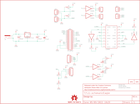

Contents
========

* [PRS11561 > RaspiRobot](#prs11561--raspirobot)
	* [Schematic](#schematic)
	* [PCB](#pcb)
	* [Interactive BOM](#interactive-bom)
	* [OOMP Parts](#oomp-parts)
	* [Images](#images)
	* [Tags](#tags)
  
![][im]
# PRS11561 > RaspiRobot

- ID: PROJ-SPAR-11561-STAN-01
- Hex ID: PRS11561
- Name: Sparkfun
- Description: Sparkfun
- Long Link: [http://oom.lt/PROJ-SPAR-11561-STAN-01](http://oom.lt/PROJ-SPAR-11561-STAN-01)
- Short Link: [http://oom.lt/PRS11561](http://oom.lt/PRS11561)

## Schematic
  

## PCB
  

## Interactive BOM

- Interactive BOM page: [ibom.html](https://htmlpreview.github.io/?https://github.com/oomlout/oomlout_OOMP_projects/blob/main/PROJ-SPAR-11561-STAN-01/kicad/bom/ibom.html)

## OOMP Parts
  

|OOMP Parts|
| :---: |
|CAPX-UNMATCHED-X-UF100-01 C1|
|CAPX-UNMATCHED-X-UF220-01 C2|
|CAPX-UNMATCHED-X-NF100-01 C3|
|UNMATCHED-UNMATCHED-X-UNMATCHED-01 IC1, IC2, IC3, JP9|
|[DCJP-21D-X-STAN-01  2.1 mm DC Jack  J1](https://github.com/oomlout/oomlout_OOMP_parts/tree/main/DCJP-21D-X-STAN-01/)|
|[TERS-35D-L-PI02-01  3.5 mm 2 Pin Blue Screw Terminal  JP1, JP2](https://github.com/oomlout/oomlout_OOMP_parts/tree/main/TERS-35D-L-PI02-01/)|
|[HEAD-I01-X-PI02-01  2.54 mm 2 Pin Header  JP3, JP4, JP5, JP6](https://github.com/oomlout/oomlout_OOMP_parts/tree/main/HEAD-I01-X-PI02-01/)|
|[HEAD-I01-X-PI04-01  2.54 mm 4 Pin Header  JP7, JP8](https://github.com/oomlout/oomlout_OOMP_parts/tree/main/HEAD-I01-X-PI04-01/)|
|LEDS-UNMATCHED-G-STAN-01 LED1|
|LEDS-UNMATCHED-Y-STAN-01 LED2|
|RESE-UNMATCHED-X-O271-01 R1, R2, R5|
|RESE-UNMATCHED-X-O102-01 R3, R4, R7, R8|
|RESE-UNMATCHED-X-O471-01 R6|

## Images
  
  

|bominteractivefront|bominteractiveback|kicadPcb3d|kicadPcb3dFront|kicadPcb3dBack|eagleImage|eagleSchemImage|
| :---: | :---: | :---: | :---: | :---: | :---: | :---: |
||||||||

## Tags

- hexID: PRS11561
- oompType: PROJ
- oompSize: SPAR
- oompColor: 11561
- oompDesc: STAN
- oompIndex: 01
- oompName: RaspiRobot
- sources: All source files from https://github.com/sparkfun/RaspiRobot (source licence details in srcLicense.md)
- linkBuyPage: https://www.sparkfun.com/products/11561
- oompID: PROJ-SPAR-11561-STAN-01
- oompParts: C1,CAPX-UNMATCHED-X-UF100-01
- oompParts: C2,CAPX-UNMATCHED-X-UF220-01
- oompParts: C3,CAPX-UNMATCHED-X-NF100-01
- oompParts: IC1,UNMATCHED-UNMATCHED-X-UNMATCHED-01
- oompParts: IC2,UNMATCHED-UNMATCHED-X-UNMATCHED-01
- oompParts: IC3,UNMATCHED-UNMATCHED-X-UNMATCHED-01
- oompParts: J1,DCJP-21D-X-STAN-01
- oompParts: JP1,TERS-35D-L-PI02-01
- oompParts: JP2,TERS-35D-L-PI02-01
- oompParts: JP3,HEAD-I01-X-PI02-01
- oompParts: JP4,HEAD-I01-X-PI02-01
- oompParts: JP5,HEAD-I01-X-PI02-01
- oompParts: JP6,HEAD-I01-X-PI02-01
- oompParts: JP7,HEAD-I01-X-PI04-01
- oompParts: JP8,HEAD-I01-X-PI04-01
- oompParts: JP9,UNMATCHED-UNMATCHED-X-UNMATCHED-01
- oompParts: LED1,LEDS-UNMATCHED-G-STAN-01
- oompParts: LED2,LEDS-UNMATCHED-Y-STAN-01
- oompParts: R1,RESE-UNMATCHED-X-O271-01
- oompParts: R2,RESE-UNMATCHED-X-O271-01
- oompParts: R3,RESE-UNMATCHED-X-O102-01
- oompParts: R4,RESE-UNMATCHED-X-O102-01
- oompParts: R5,RESE-UNMATCHED-X-O271-01
- oompParts: R6,RESE-UNMATCHED-X-O471-01
- oompParts: R7,RESE-UNMATCHED-X-O102-01
- oompParts: R8,RESE-UNMATCHED-X-O102-01
- rawParts: C1,100uF,CAP_POLPTH1,CPOL-RADIAL-100UF-25V,Capacitor Polarized,,,,,
- rawParts: C2,220uF,CAP_POLPTH1,CPOL-RADIAL-100UF-25V,Capacitor Polarized,,,,,
- rawParts: C3,0.1uF,CAPKIT,CAP-PTH-SMALL-KIT,Capacitor,,,,,
- rawParts: FRAME1,FRAME-LETTER,FRAME-LETTER,CREATIVE_COMMONS,Schematic Frame,,,,,
- rawParts: IC1,L293D,L293D,DIL16,PUSH-PULL 4 CHANNEL DRIVER,,L293D,9589619,56P8249,
- rawParts: IC2,LM2940CT-5.0,V_REG_78XXSINK,TO220-IGO,Voltage Regulator,,,,,
- rawParts: IC3,7406N,7406N,DIL14,Hex INVERTER, open collector high-voltage output,,,,,
- rawParts: J1,POWER_JACKPTH_LOCK,POWER_JACKPTH_LOCK,POWER_JACK_PTH_LOCK,Power Jack,,,,,
- rawParts: JP1,,M023.5MM_LOCK,SCREWTERMINAL-3.5MM-2_LOCK,Header 2,,,,,
- rawParts: JP2,,M023.5MM_LOCK,SCREWTERMINAL-3.5MM-2_LOCK,Header 2,,,,,
- rawParts: JP3,SW1,M02PTH,1X02,Header 2,,,,,
- rawParts: JP4,SW2,M02PTH,1X02,Header 2,,,,,
- rawParts: JP5,,M02PTH,1X02,Header 2,,,,,
- rawParts: JP6,,M02PTH,1X02,Header 2,,,,,
- rawParts: JP7,I2C,M04PTH,1X04,Header 4,,,,,
- rawParts: JP8,UART,M04PTH,1X04,Header 4,,,,,
- rawParts: JP9,M13X22X13,M13X22X13,2X13,,,,,,
- rawParts: JP10,LOGO-SFENEW,LOGO-SFENEW,SFE-NEW-WEBLOGO,Spark Fun Electronics PCB Logo,,,,,
- rawParts: JP11,LOGO-SFENEW,LOGO-SFENEW,SFE-NEW-WEBLOGO,Spark Fun Electronics PCB Logo,,,,,
- rawParts: LED1,green,LED3MM,LED3MM,LEDs,,,,,
- rawParts: LED2,yellow,LED3MM,LED3MM,LEDs,,,,,
- rawParts: R1,270,RESISTOREZ,AXIAL-0.3EZ,Resistor,,,,,
- rawParts: R2,270,RESISTOREZ,AXIAL-0.3EZ,Resistor,,,,,
- rawParts: R3,1k,RESISTOREZ,AXIAL-0.3EZ,Resistor,,,,,
- rawParts: R4,1k,RESISTOREZ,AXIAL-0.3EZ,Resistor,,,,,
- rawParts: R5,270,RESISTOREZ,AXIAL-0.3EZ,Resistor,,,,,
- rawParts: R6,470,RESISTOREZ,AXIAL-0.3EZ,Resistor,,,,,
- rawParts: R7,1k,RESISTOREZ,AXIAL-0.3EZ,Resistor,,,,,
- rawParts: R8,1k,RESISTOREZ,AXIAL-0.3EZ,Resistor,,,,,
- rawParts: U$4,OSHW-LOGOS,OSHW-LOGOS,OSHW-LOGO-S,Open Source Hardware Logo This logo indicates the piece of hardware it is found on incorporates a OSHW license and/or adheres to the definition of open source hardware found here: http://freedomdefined.org/OSHW,,,,,

[im]: kicadPcb3d_450.png
