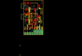
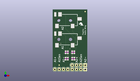
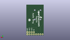
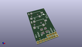

Contents
========

* [PROJ-SPAR-11568-STAN-01>Papilio Audio Wing](#proj-spar-11568-stan-01papilio-audio-wing)
	* [Images](#images)
	* [Interactive BOM](#interactive-bom)
	* [OOMP Parts](#oomp-parts)
	* [Tags](#tags)
  
![][im]
# PROJ-SPAR-11568-STAN-01>Papilio Audio Wing

- ID: PROJ-SPAR-11568-STAN-01
- Hex ID: PRS11568
- Name: Papilio Audio Wing
- Description: 

## Images
  
  

|eagleImage|kicadPcb3dFront|kicadPcb3dBack|kicadPcb3d|
| :---: | :---: | :---: | :---: |
|||||

## Interactive BOM

- Interactive BOM page: [ibom.html](kicad/bom/ibom.html)

## OOMP Parts
  

|OOMP Parts|
| :---: |
|UNMATCHED-UNMATCHED-X-UNMATCHED-01, AJ1, 0.0, 19.049999999999997, 0,AJ1, AUDIO-JACK2SMD, AUDIO-JACK-3.5MM-SMD, SparkFun-Connectors, (0, 0.75), R0|
|UNMATCHED-UNMATCHED-X-UNMATCHED-01, AJ2, 0.0, 30.479999999999997, 0,AJ2, AUDIO-JACK2SMD, AUDIO-JACK-3.5MM-SMD, SparkFun-Connectors, (0, 1.2), R0|
|CAPC-0402-X-UNMATCHED-01, C1, 7.619999999999999, 7.619999999999999, 270,C1, 4.7nF, 0402-CAP, SparkFun-Passives, (0.3, 0.3), R270|
|CAPC-0402-X-UNMATCHED-01, C2, 8.889999999999999, 7.619999999999999, 270,C2, 4.7nF, 0402-CAP, SparkFun-Passives, (0.35, 0.3), R270|
|CAPC-0402-X-UNMATCHED-01, C3, 11.43, 7.619999999999999, 270,C3, 4.7nF, 0402-CAP, SparkFun-Passives, (0.45, 0.3), R270|
|CAPC-0402-X-UNMATCHED-01, C4, 12.7, 7.619999999999999, 270,C4, 4.7nF, 0402-CAP, SparkFun-Passives, (0.5, 0.3), R270|
|<table><tr><td></td><td> JP1</td><td>[HEAD-I01-X-PI04-01 2.54 mm 4 Pin Header](https://github.com/oomlout/oomlout_OOMP_parts/tree/main/HEAD-I01-X-PI04-01/)</td><td>[H04](https://github.com/oomlout/oomlout_OOMP_parts/tree/main/HEAD-I01-X-PI04-01/)</td></tr></table>|
|<table><tr><td></td><td> JP2</td><td>[HEAD-I01-X-PI08-01 2.54 mm 8 Pin Header](https://github.com/oomlout/oomlout_OOMP_parts/tree/main/HEAD-I01-X-PI08-01/)</td><td>[H08](https://github.com/oomlout/oomlout_OOMP_parts/tree/main/HEAD-I01-X-PI08-01/)</td></tr></table>|
|RESE-0402-X-UNMATCHED-01, R1, 7.619999999999999, 11.43, 90,R1, 3.3k, 0402-RES, SparkFun-Passives, (0.3, 0.45), R90|
|RESE-0402-X-UNMATCHED-01, R2, 8.889999999999999, 11.43, 90,R2, 3.3k, 0402-RES, SparkFun-Passives, (0.35, 0.45), R90|
|RESE-0402-X-UNMATCHED-01, R3, 11.43, 11.43, 90,R3, 3.3k, 0402-RES, SparkFun-Passives, (0.45, 0.45), R90|
|RESE-0402-X-UNMATCHED-01, R4, 12.7, 11.43, 90,R4, 3.3k, 0402-RES, SparkFun-Passives, (0.5, 0.45), R90|

## Tags

- hexID: PRS11568
- oompType: PROJ
- oompSize: SPAR
- oompColor: 11568
- oompDesc: STAN
- oompIndex: 01
- oompName: Papilio Audio Wing
- sources: All source files from https://github.com/sparkfun/Papilio_Audio_Wing (source licence details in srcLicense.md)
- linkBuyPage: https://www.sparkfun.com/products/11568
- oompID: PROJ-SPAR-11568-STAN-01
- oompPart: UNMATCHED-UNMATCHED-X-UNMATCHED-01, AJ1, 0.0, 19.049999999999997, 0
- oompPart: UNMATCHED-UNMATCHED-X-UNMATCHED-01, AJ2, 0.0, 30.479999999999997, 0
- oompPart: CAPC-0402-X-UNMATCHED-01, C1, 7.619999999999999, 7.619999999999999, 270
- oompPart: CAPC-0402-X-UNMATCHED-01, C2, 8.889999999999999, 7.619999999999999, 270
- oompPart: CAPC-0402-X-UNMATCHED-01, C3, 11.43, 7.619999999999999, 270
- oompPart: CAPC-0402-X-UNMATCHED-01, C4, 12.7, 7.619999999999999, 270
- oompPart: HEAD-I01-X-PI04-01, JP1, 19.049999999999997, 3.8099999999999996, 180
- oompPart: HEAD-I01-X-PI08-01, JP2, 19.049999999999997, 1.27, 180
- oompPart: SKIP-UNMATCHED-X-UNMATCHED-01, JP5, 3.8099999999999996, 3.8099999999999996, 0
- oompPart: SKIP-UNMATCHED-X-UNMATCHED-01, JP6, 19.049999999999997, 35.559999999999995, 0
- oompPart: RESE-0402-X-UNMATCHED-01, R1, 7.619999999999999, 11.43, 90
- oompPart: RESE-0402-X-UNMATCHED-01, R2, 8.889999999999999, 11.43, 90
- oompPart: RESE-0402-X-UNMATCHED-01, R3, 11.43, 11.43, 90
- oompPart: RESE-0402-X-UNMATCHED-01, R4, 12.7, 11.43, 90
- rawPart: AJ1, AUDIO-JACK2SMD, AUDIO-JACK-3.5MM-SMD, SparkFun-Connectors, (0, 0.75), R0
- rawPart: AJ2, AUDIO-JACK2SMD, AUDIO-JACK-3.5MM-SMD, SparkFun-Connectors, (0, 1.2), R0
- rawPart: C1, 4.7nF, 0402-CAP, SparkFun-Passives, (0.3, 0.3), R270
- rawPart: C2, 4.7nF, 0402-CAP, SparkFun-Passives, (0.35, 0.3), R270
- rawPart: C3, 4.7nF, 0402-CAP, SparkFun-Passives, (0.45, 0.3), R270
- rawPart: C4, 4.7nF, 0402-CAP, SparkFun-Passives, (0.5, 0.3), R270
- rawPart: JP1, 1X04, SparkFun-Connectors, (0.75, 0.15), R180
- rawPart: JP2, 1X08, SparkFun-Connectors, (0.75, 0.05), R180
- rawPart: JP5, FIDUCIALUFIDUCIAL, MICRO-FIDUCIAL, SparkFun, (0.15, 0.15), R0
- rawPart: JP6, FIDUCIALUFIDUCIAL, MICRO-FIDUCIAL, SparkFun, (0.75, 1.4), R0
- rawPart: R1, 3.3k, 0402-RES, SparkFun-Passives, (0.3, 0.45), R90
- rawPart: R2, 3.3k, 0402-RES, SparkFun-Passives, (0.35, 0.45), R90
- rawPart: R3, 3.3k, 0402-RES, SparkFun-Passives, (0.45, 0.45), R90
- rawPart: R4, 3.3k, 0402-RES, SparkFun-Passives, (0.5, 0.45), R90

[im]: kicadPcb3d_450.png
