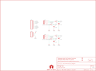

Contents
========

* [PRS11568 > Papilio Audio Wing](#prs11568--papilio-audio-wing)
	* [Schematic](#schematic)
	* [PCB](#pcb)
	* [Interactive BOM](#interactive-bom)
	* [OOMP Parts](#oomp-parts)
	* [Images](#images)
	* [Tags](#tags)
  
![][im]
# PRS11568 > Papilio Audio Wing

- ID: PROJ-SPAR-11568-STAN-01
- Hex ID: PRS11568
- Name: Sparkfun
- Description: Sparkfun
- Long Link: [http://oom.lt/PROJ-SPAR-11568-STAN-01](http://oom.lt/PROJ-SPAR-11568-STAN-01)
- Short Link: [http://oom.lt/PRS11568](http://oom.lt/PRS11568)

## Schematic
  

## PCB
  

## Interactive BOM

- Interactive BOM page: [ibom.html](https://htmlpreview.github.io/?https://github.com/oomlout/oomlout_OOMP_projects/blob/main/PROJ-SPAR-11568-STAN-01/kicad/bom/ibom.html)

## OOMP Parts
  

|OOMP Parts|
| :---: |
|AJ1 AJ1,UNMATCHED-UNMATCHED-X-UNMATCHED-01|
|AJ2 AJ2,UNMATCHED-UNMATCHED-X-UNMATCHED-01|
|C1 C1,CAPC-0402-X-PF47D-01|
|C2 C2,CAPC-0402-X-PF47D-01|
|C3 C3,CAPC-0402-X-PF47D-01|
|C4 C4,CAPC-0402-X-PF47D-01|
|[JP1 HEAD-I01-X-PI04-01 2.54 mm 4 Pin Header](https://github.com/oomlout/oomlout_OOMP_parts/tree/main/HEAD-I01-X-PI04-01/)|
|[JP2 HEAD-I01-X-PI08-01 2.54 mm 8 Pin Header](https://github.com/oomlout/oomlout_OOMP_parts/tree/main/HEAD-I01-X-PI08-01/)|
|R1 R1,RESE-0402-X-UNMATCHED-01|
|R2 R2,RESE-0402-X-UNMATCHED-01|
|R3 R3,RESE-0402-X-UNMATCHED-01|
|R4 R4,RESE-0402-X-UNMATCHED-01|

## Images
  
  

|kicadPcb3d|kicadPcb3dFront|kicadPcb3dBack|eagleImage|eagleSchemImage|
| :---: | :---: | :---: | :---: | :---: |
||||||

## Tags

- hexID: PRS11568
- oompType: PROJ
- oompSize: SPAR
- oompColor: 11568
- oompDesc: STAN
- oompIndex: 01
- oompName: Papilio Audio Wing
- sources: All source files from https://github.com/sparkfun/Papilio_Audio_Wing (source licence details in srcLicense.md)
- linkBuyPage: https://www.sparkfun.com/products/11568
- oompID: PROJ-SPAR-11568-STAN-01
- oompParts: AJ1,UNMATCHED-UNMATCHED-X-UNMATCHED-01
- oompParts: AJ2,UNMATCHED-UNMATCHED-X-UNMATCHED-01
- oompParts: C1,CAPC-0402-X-PF47D-01
- oompParts: C2,CAPC-0402-X-PF47D-01
- oompParts: C3,CAPC-0402-X-PF47D-01
- oompParts: C4,CAPC-0402-X-PF47D-01
- oompParts: JP1,HEAD-I01-X-PI04-01
- oompParts: JP2,HEAD-I01-X-PI08-01
- oompParts: R1,RESE-0402-X-UNMATCHED-01
- oompParts: R2,RESE-0402-X-UNMATCHED-01
- oompParts: R3,RESE-0402-X-UNMATCHED-01
- oompParts: R4,RESE-0402-X-UNMATCHED-01
- rawParts: AJ1,AUDIO-JACK2SMD,AUDIO-JACK2SMD,AUDIO-JACK-3.5MM-SMD,Stereo audio jack with bypass switches.,,
- rawParts: AJ2,AUDIO-JACK2SMD,AUDIO-JACK2SMD,AUDIO-JACK-3.5MM-SMD,Stereo audio jack with bypass switches.,,
- rawParts: C1,4.7nF,CAP0402-CAP,0402-CAP,Capacitor,,
- rawParts: C2,4.7nF,CAP0402-CAP,0402-CAP,Capacitor,,
- rawParts: C3,4.7nF,CAP0402-CAP,0402-CAP,Capacitor,,
- rawParts: C4,4.7nF,CAP0402-CAP,0402-CAP,Capacitor,,
- rawParts: FRAME2,FRAME-LETTER,FRAME-LETTER,CREATIVE_COMMONS,Schematic Frame,,
- rawParts: JP1,,M04PTH,1X04,Header 4,,
- rawParts: JP2,,M081X08,1X08,Header 8,,
- rawParts: JP4,LOGO-SFENEW,LOGO-SFENEW,SFE-NEW-WEBLOGO,Spark Fun Electronics PCB Logo,,
- rawParts: JP5,FIDUCIALUFIDUCIAL,FIDUCIALUFIDUCIAL,MICRO-FIDUCIAL,Fiducial Alignment Points,,
- rawParts: JP6,FIDUCIALUFIDUCIAL,FIDUCIALUFIDUCIAL,MICRO-FIDUCIAL,Fiducial Alignment Points,,
- rawParts: R1,3.3k,RESISTOR0402-RES,0402-RES,Resistor,,
- rawParts: R2,3.3k,RESISTOR0402-RES,0402-RES,Resistor,,
- rawParts: R3,3.3k,RESISTOR0402-RES,0402-RES,Resistor,,
- rawParts: R4,3.3k,RESISTOR0402-RES,0402-RES,Resistor,,
- rawParts: U$1,OSHW-LOGOS,OSHW-LOGOS,OSHW-LOGO-S,Open Source Hardware Logo This logo indicates the piece of hardware it is found on incorporates a OSHW license and/or adheres to the definition of open source hardware found here: http://freedomdefined.org/OSHW,,

[im]: kicadPcb3d_450.png
