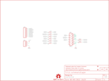

Contents
========

* [PRS11569 > Sparkfun](#prs11569--sparkfun)
	* [Images](#images)
	* [Tags](#tags)
  
![][im]
# PRS11569 > Sparkfun

- ID: PROJ-SPAR-11569-STAN-01
- Hex ID: PRS11569
- Name: Sparkfun
- Description: Sparkfun

## Images
  
  

|kicadPcb3d|kicadPcb3dFront|kicadPcb3dBack|eagleImage|eagleSchemImage|
| :---: | :---: | :---: | :---: | :---: |
||||||

## Tags

- hexID: PRS11569
- oompType: PROJ
- oompSize: SPAR
- oompColor: 11569
- oompDesc: STAN
- oompIndex: 01
- oompName: Papilio VGA Wing
- sources: All source files from https://github.com/sparkfun/Papilio_VGA_Wing (source licence details in srcLicense.md)
- linkBuyPage: https://www.sparkfun.com/products/11569
- oompID: PROJ-SPAR-11569-STAN-01
- oompParts: FRAME1,UNMATCHED-UNMATCHED-UNMATCHED-UNMATCHED-UNMATCHED
- oompParts: JP1,UNMATCHED-UNMATCHED-UNMATCHED-UNMATCHED-UNMATCHED
- oompParts: JP2,UNMATCHED-UNMATCHED-UNMATCHED-UNMATCHED-UNMATCHED
- oompParts: JP3,UNMATCHED-UNMATCHED-UNMATCHED-UNMATCHED-UNMATCHED
- oompParts: JP6,UNMATCHED-UNMATCHED-UNMATCHED-UNMATCHED-UNMATCHED
- oompParts: JP7,UNMATCHED-UNMATCHED-UNMATCHED-UNMATCHED-UNMATCHED
- oompParts: R1,UNMATCHED-UNMATCHED-UNMATCHED-UNMATCHED-UNMATCHED
- oompParts: R2,UNMATCHED-UNMATCHED-UNMATCHED-UNMATCHED-UNMATCHED
- oompParts: R3,UNMATCHED-UNMATCHED-UNMATCHED-UNMATCHED-UNMATCHED
- oompParts: R4,UNMATCHED-UNMATCHED-UNMATCHED-UNMATCHED-UNMATCHED
- oompParts: R5,UNMATCHED-UNMATCHED-UNMATCHED-UNMATCHED-UNMATCHED
- oompParts: R6,UNMATCHED-UNMATCHED-UNMATCHED-UNMATCHED-UNMATCHED
- oompParts: R7,UNMATCHED-UNMATCHED-UNMATCHED-UNMATCHED-UNMATCHED
- oompParts: R8,UNMATCHED-UNMATCHED-UNMATCHED-UNMATCHED-UNMATCHED
- oompParts: U$1,UNMATCHED-UNMATCHED-UNMATCHED-UNMATCHED-UNMATCHED
- rawParts: FRAME1,FRAME-LETTER,FRAME-LETTER,CREATIVE_COMMONS,Schematic Frame,,
- rawParts: JP1,,M04PTH,1X04,Header 4,,
- rawParts: JP2,,M081X08,1X08,Header 8,,
- rawParts: JP3,DB15,DB15,DB15,DB15 / VGA right angle through-hole female connector.,,
- rawParts: JP4,FIDUCIALUFIDUCIAL,FIDUCIALUFIDUCIAL,MICRO-FIDUCIAL,Fiducial Alignment Points,,
- rawParts: JP5,FIDUCIALUFIDUCIAL,FIDUCIALUFIDUCIAL,MICRO-FIDUCIAL,Fiducial Alignment Points,,
- rawParts: JP6,LOGO-SFENEW,LOGO-SFENEW,SFE-NEW-WEBLOGO,Spark Fun Electronics PCB Logo,,
- rawParts: JP7,LOGO-SFESK,LOGO-SFESK,SFE-LOGO-FLAME,Spark Fun Electronics PCB Logo,,
- rawParts: R1,82.5,RESISTOR0402-RES,0402-RES,Resistor,,
- rawParts: R2,82.5,RESISTOR0402-RES,0402-RES,Resistor,,
- rawParts: R3,270,RESISTOR0402-RES,0402-RES,Resistor,,
- rawParts: R4,270,RESISTOR0402-RES,0402-RES,Resistor,,
- rawParts: R5,270,RESISTOR0402-RES,0402-RES,Resistor,,
- rawParts: R6,270,RESISTOR0402-RES,0402-RES,Resistor,,
- rawParts: R7,270,RESISTOR0402-RES,0402-RES,Resistor,,
- rawParts: R8,270,RESISTOR0402-RES,0402-RES,Resistor,,
- rawParts: U$1,OSHW-LOGOS,OSHW-LOGOS,OSHW-LOGO-S,Open Source Hardware Logo This logo indicates the piece of hardware it is found on incorporates a OSHW license and/or adheres to the definition of open source hardware found here: http://freedomdefined.org/OSHW,,

[im]: kicadPcb3d_450.png
