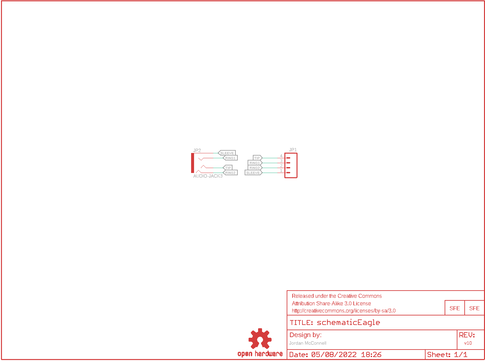
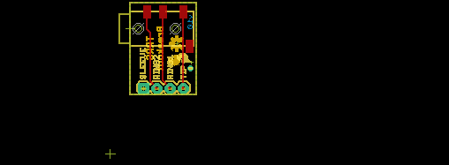
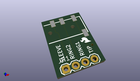
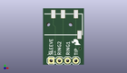
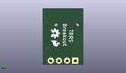
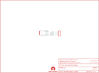

Contents
========

* [PRS11570 > TRRS 3.5mm Jack Breakout](#prs11570--trrs-35mm-jack-breakout)
	* [Schematic](#schematic)
	* [PCB](#pcb)
	* [Interactive BOM](#interactive-bom)
	* [OOMP Parts](#oomp-parts)
	* [Images](#images)
	* [Tags](#tags)
  
![][im]
# PRS11570 > TRRS 3.5mm Jack Breakout

- ID: PROJ-SPAR-11570-STAN-01
- Hex ID: PRS11570
- Name: Sparkfun
- Description: Sparkfun
- Long Link: [http://oom.lt/PROJ-SPAR-11570-STAN-01](http://oom.lt/PROJ-SPAR-11570-STAN-01)
- Short Link: [http://oom.lt/PRS11570](http://oom.lt/PRS11570)

## Schematic
  

## PCB
  

## Interactive BOM

- Interactive BOM page: [ibom.html](https://htmlpreview.github.io/?https://github.com/oomlout/oomlout_OOMP_projects/blob/main/PROJ-SPAR-11570-STAN-01/kicad/bom/ibom.html)

## OOMP Parts
  

|OOMP Parts|
| :---: |
|[HEAD-I01-X-PI04-01  2.54 mm 4 Pin Header  JP1](https://github.com/oomlout/oomlout_OOMP_parts/tree/main/HEAD-I01-X-PI04-01/)|
|UNMATCHED-UNMATCHED-X-UNMATCHED-01 JP2|

## Images
  
  

|kicadPcb3d|kicadPcb3dFront|kicadPcb3dBack|eagleImage|eagleSchemImage|
| :---: | :---: | :---: | :---: | :---: |
||||||

## Tags

- hexID: PRS11570
- oompType: PROJ
- oompSize: SPAR
- oompColor: 11570
- oompDesc: STAN
- oompIndex: 01
- oompName: TRRS 3.5mm Jack Breakout
- sources: All source files from https://github.com/sparkfun/TRRS_3.5mm_Jack_Breakout (source licence details in srcLicense.md)
- linkBuyPage: https://www.sparkfun.com/products/11570
- oompID: PROJ-SPAR-11570-STAN-01
- oompParts: JP1,HEAD-I01-X-PI04-01
- oompParts: JP2,UNMATCHED-UNMATCHED-X-UNMATCHED-01
- rawParts: FRAME1,FRAME-LETTER,FRAME-LETTER,CREATIVE_COMMONS,Schematic Frame,,
- rawParts: JP1,,M04PTH,1X04,Header 4,,
- rawParts: JP2,AUDIO-JACK3,AUDIO-JACK3,AUDIO-JACK-TRRS-SMD,Audio jack - 3.5mm TRRS variety - two rings.,,
- rawParts: JP3,LOGO-SFESK,LOGO-SFESK,SFE-LOGO-FLAME,Spark Fun Electronics PCB Logo,,
- rawParts: JP4,LOGO-SFESK,LOGO-SFESK,SFE-LOGO-FLAME,Spark Fun Electronics PCB Logo,,
- rawParts: U$1,OSHW-LOGOS,OSHW-LOGOS,OSHW-LOGO-S,Open Source Hardware Logo This logo indicates the piece of hardware it is found on incorporates a OSHW license and/or adheres to the definition of open source hardware found here: http://freedomdefined.org/OSHW,,

[im]: kicadPcb3d_450.png
