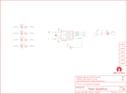

Contents
========

* [PRS11590 > LilyTwinkle ProtoSnap](#prs11590--lilytwinkle-protosnap)
	* [Schematic](#schematic)
	* [PCB](#pcb)
	* [Interactive BOM](#interactive-bom)
	* [OOMP Parts](#oomp-parts)
	* [Images](#images)
	* [Tags](#tags)
  
![][im]
# PRS11590 > LilyTwinkle ProtoSnap

- ID: PROJ-SPAR-11590-STAN-01
- Hex ID: PRS11590
- Name: Sparkfun
- Description: Sparkfun
- Long Link: [http://oom.lt/PROJ-SPAR-11590-STAN-01](http://oom.lt/PROJ-SPAR-11590-STAN-01)
- Short Link: [http://oom.lt/PRS11590](http://oom.lt/PRS11590)

## Schematic
  

## PCB
  

## Interactive BOM

- Interactive BOM page: [ibom.html](https://htmlpreview.github.io/?https://github.com/oomlout/oomlout_OOMP_projects/blob/main/PROJ-SPAR-11590-STAN-01/kicad/bom/ibom.html)

## OOMP Parts
  

|OOMP ID|Name|Identifier|
| :---: | :---: | :---: |
|UNMATCHED-UNMATCHED-X-UNMATCHED-01||BAT1, S1, U1|
|[CAPC-0402-X-NF100-V10](https://github.com/oomlout/oomlout_OOMP_parts/tree/main/CAPC-0402-X-NF100-V10/)|[SMD (0402) 100 nF Capacitor (Ceramic) 10v](https://github.com/oomlout/oomlout_OOMP_parts/tree/main/CAPC-0402-X-NF100-V10/)|[C1](https://github.com/oomlout/oomlout_OOMP_parts/tree/main/CAPC-0402-X-NF100-V10/)|
|LEDS-1206-G-STAN-01||LED1, LED2, LED3, LED4|
|[RESE-0603-X-O101-01](https://github.com/oomlout/oomlout_OOMP_parts/tree/main/RESE-0603-X-O101-01/)|[SMD (0603) 100 Ohm Resistor](https://github.com/oomlout/oomlout_OOMP_parts/tree/main/RESE-0603-X-O101-01/)|[R1, R2, R3, R4](https://github.com/oomlout/oomlout_OOMP_parts/tree/main/RESE-0603-X-O101-01/)|
|[RESE-0402-X-O103-01](https://github.com/oomlout/oomlout_OOMP_parts/tree/main/RESE-0402-X-O103-01/)|[SMD (0402) 10k Ohm Resistor](https://github.com/oomlout/oomlout_OOMP_parts/tree/main/RESE-0402-X-O103-01/)|[R5](https://github.com/oomlout/oomlout_OOMP_parts/tree/main/RESE-0402-X-O103-01/)|

## Images
  
  

|bominteractivefront|bominteractiveback|kicadPcb3d|kicadPcb3dFront|kicadPcb3dBack|eagleImage|eagleSchemImage|pcbdraw|pcbdrawback|
| :---: | :---: | :---: | :---: | :---: | :---: | :---: | :---: | :---: |
||||||||||

## Tags

- hexID: PRS11590
- oompType: PROJ
- oompSize: SPAR
- oompColor: 11590
- oompDesc: STAN
- oompIndex: 01
- oompName: LilyTwinkle ProtoSnap
- sources: All source files from https://github.com/sparkfun/LilyTwinkle_ProtoSnap (source licence details in srcLicense.md)
- linkBuyPage: https://www.sparkfun.com/products/11590
- oompID: PROJ-SPAR-11590-STAN-01
- oompParts: BAT1,UNMATCHED-UNMATCHED-X-UNMATCHED-01
- oompParts: C1,CAPC-0402-X-NF100-V10
- oompParts: LED1,LEDS-1206-G-STAN-01
- oompParts: LED2,LEDS-1206-G-STAN-01
- oompParts: LED3,LEDS-1206-G-STAN-01
- oompParts: LED4,LEDS-1206-G-STAN-01
- oompParts: R1,RESE-0603-X-O101-01
- oompParts: R2,RESE-0603-X-O101-01
- oompParts: R3,RESE-0603-X-O101-01
- oompParts: R4,RESE-0603-X-O101-01
- oompParts: R5,RESE-0402-X-O103-01
- oompParts: S1,UNMATCHED-UNMATCHED-X-UNMATCHED-01
- oompParts: U1,UNMATCHED-UNMATCHED-X-UNMATCHED-01
- rawParts: 1_U$2,SEWTAP6,SEWTAP6,PETAL-SMALL-2SIDE,,,,
- rawParts: 1_U$3,SEWTAP6,SEWTAP6,PETAL-SMALL-2SIDE,,,,
- rawParts: 1_U$4,SEWTAP6,SEWTAP6,PETAL-SMALL-2SIDE,,,,
- rawParts: 1_U$5,SEWTAP6,SEWTAP6,PETAL-SMALL-2SIDE,,,,
- rawParts: 1_U$6,SEWTAP6,SEWTAP6,PETAL-SMALL-2SIDE,,,,
- rawParts: 1_U$7,SEWTAP6,SEWTAP6,PETAL-SMALL-2SIDE,,,,
- rawParts: 3_LED+,SEWTAP6,SEWTAP4,PETAL-SMALL,,,,
- rawParts: 3_LED-,SEWTAP6,SEWTAP2SIDE,PETAL-SMALL,,,,
- rawParts: 4_LED+,SEWTAP6,SEWTAP4,PETAL-SMALL,,,,
- rawParts: 4_LED-,SEWTAP6,SEWTAP2SIDE,PETAL-SMALL,,,,
- rawParts: 5_LED+,SEWTAP6,SEWTAP4,PETAL-SMALL,,,,
- rawParts: 5_LED-,SEWTAP6,SEWTAP2SIDE,PETAL-SMALL,,,,
- rawParts: 6_LED+,SEWTAP6,SEWTAP4,PETAL-SMALL,,,,
- rawParts: 6_LED-,SEWTAP6,SEWTAP2SIDE,PETAL-SMALL,,,,
- rawParts: B1+,SEWTAP6,SEWTAP6,PETAL-SMALL-2SIDE,,,,
- rawParts: B1-,SEWTAP6,SEWTAP6,PETAL-SMALL-2SIDE,,,,
- rawParts: B2+,SEWTAP6,SEWTAP6,PETAL-SMALL-2SIDE,,,,
- rawParts: B2-,SEWTAP6,SEWTAP6,PETAL-SMALL-2SIDE,,,,
- rawParts: BAT1,,BATTERY20MM_4LEGS,BATTCON_20MM_4LEGS,Battery Holders,BATT-10373,20mm coincell,
- rawParts: BATT_LOGO,LOGO-LPLP,LOGO-LPLP,LOGO-LILYPAD,,,,
- rawParts: BATT_OHS,OSHW-LOGOS,OSHW-LOGOS,OSHW-LOGO-S,Open Source Hardware Logo This logo indicates the piece of hardware it is found on incorporates a OSHW license and/or adheres to the definition of open source hardware found here: http://freedomdefined.org/OSHW,,,
- rawParts: C1,0.1uF,.1UF-CER,0402-CAP,.1uF ceramic SMT,CAP-00810,0.1uF,
- rawParts: FRAME1,FRAME-LETTER,FRAME-LETTER,CREATIVE_COMMONS,Schematic Frame,,,
- rawParts: JP1,FIDUCIALUFIDUCIAL,FIDUCIALUFIDUCIAL,MICRO-FIDUCIAL,Fiducial Alignment Points,,,
- rawParts: JP2,FIDUCIALUFIDUCIAL,FIDUCIALUFIDUCIAL,MICRO-FIDUCIAL,Fiducial Alignment Points,,,
- rawParts: LED1,White,LED-WHITE,LED-1206,White SMD LEDs,DIO-09955,WHITE,
- rawParts: LED1_LOGO,LOGO-LPL,LOGO-LPL,LOGO-L,,,,
- rawParts: LED2,White,LED-WHITE,LED-1206,White SMD LEDs,DIO-09955,WHITE,
- rawParts: LED2_LOGO,LOGO-LPL,LOGO-LPL,LOGO-L,,,,
- rawParts: LED3,White,LED-WHITE,LED-1206,White SMD LEDs,DIO-09955,WHITE,
- rawParts: LED3_LOGO,LOGO-LPL,LOGO-LPL,LOGO-L,,,,
- rawParts: LED4,White,LED-WHITE,LED-1206,White SMD LEDs,DIO-09955,WHITE,
- rawParts: LED4_LOGO,LOGO-LPL,LOGO-LPL,LOGO-L,,,,
- rawParts: R1,100,RESISTOR0603-RES,0603-RES,Resistor,RES-07863,,
- rawParts: R2,100,RESISTOR0603-RES,0603-RES,Resistor,RES-07863,,
- rawParts: R3,100,RESISTOR0603-RES,0603-RES,Resistor,RES-07863,,
- rawParts: R4,100,RESISTOR0603-RES,0603-RES,Resistor,RES-07863,,
- rawParts: R5,10k,10K-1%RES-00824,0402-RES,10k-ohm SMT,RES-00824,10k,
- rawParts: S1,,SWITCH-SPDTSMD,AYZ0202,SPDT Switch,SWCH-08179,,
- rawParts: TINY_LOGO,LOGO-LPL,LOGO-LPL,LOGO-L,,,,
- rawParts: U1,ATTINY85,ATTINY45TINY85-20-SMT,SO08-EIAJ,Atmel 8-pin 2/4/8kB flash uC,IC-09092,Tiny85-20-SMT,

[im]: kicadPcb3d_450.png
