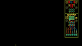
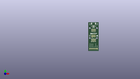
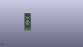
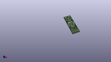

Contents
========

* [PROJ-SPAR-11591-STAN-01>ISP Pogo Board](#proj-spar-11591-stan-01isp-pogo-board)
	* [Images](#images)
	* [Interactive BOM](#interactive-bom)
	* [OOMP Parts](#oomp-parts)
	* [Tags](#tags)
  
![][im]
# PROJ-SPAR-11591-STAN-01>ISP Pogo Board

- ID: PROJ-SPAR-11591-STAN-01
- Hex ID: PRS11591
- Name: ISP Pogo Board
- Description: 

## Images
  
  

|eagleImage|kicadPcb3dFront|kicadPcb3dBack|kicadPcb3d|
| :---: | :---: | :---: | :---: |
|||||

## Interactive BOM

- Interactive BOM page: [ibom.html](kicad/bom/ibom.html)

## OOMP Parts
  

|OOMP Parts|
| :---: |
|UNMATCHED-UNMATCHED-X-UNMATCHED-01, J1, 6.35, 17.779999999999998, 0,J1, 2X3_POGO, SparkFun-Connectors, (0.25, 0.7), R0|
|UNMATCHED-UNMATCHED-X-UNMATCHED-01, J2, 8.889999999999999, 26.669999999999998, 0,J2, AVR_SPI_PRG_6NS, 2X3-NS, SparkFun-Connectors, (0.35, 1.05), R0|
|UNMATCHED-UNMATCHED-X-UNMATCHED-01, J3, 6.35, 35.559999999999995, 0,J3, 2X3_POGO, SparkFun-Connectors, (0.25, 1.4), R0|
|UNMATCHED-UNMATCHED-X-UNMATCHED-01, J4, 8.889999999999999, 46.99, 0,J4, JST-2-SMD, SparkFun-Connectors, (0.35, 1.85), R0|
|HEAD-I01-X-PI6-01, JP1, 15.239999999999998, 3.8099999999999996, 180,JP1, MOLEX-1X6, SparkFun-Connectors, (0.6, 0.15), R180|

## Tags

- hexID: PRS11591
- oompType: PROJ
- oompSize: SPAR
- oompColor: 11591
- oompDesc: STAN
- oompIndex: 01
- oompName: ISP Pogo Board
- sources: All source files from https://github.com/sparkfun/ISP_Pogo_Board (source licence details in srcLicense.md)
- linkBuyPage: https://www.sparkfun.com/products/11591
- oompPart: UNMATCHED-UNMATCHED-X-UNMATCHED-01, J1, 6.35, 17.779999999999998, 0
- oompPart: UNMATCHED-UNMATCHED-X-UNMATCHED-01, J2, 8.889999999999999, 26.669999999999998, 0
- oompPart: UNMATCHED-UNMATCHED-X-UNMATCHED-01, J3, 6.35, 35.559999999999995, 0
- oompPart: UNMATCHED-UNMATCHED-X-UNMATCHED-01, J4, 8.889999999999999, 46.99, 0
- oompPart: HEAD-I01-X-PI6-01, JP1, 15.239999999999998, 3.8099999999999996, 180
- rawPart: J1, 2X3_POGO, SparkFun-Connectors, (0.25, 0.7), R0
- rawPart: J2, AVR_SPI_PRG_6NS, 2X3-NS, SparkFun-Connectors, (0.35, 1.05), R0
- rawPart: J3, 2X3_POGO, SparkFun-Connectors, (0.25, 1.4), R0
- rawPart: J4, JST-2-SMD, SparkFun-Connectors, (0.35, 1.85), R0
- rawPart: JP1, MOLEX-1X6, SparkFun-Connectors, (0.6, 0.15), R180
- oompID: PROJ-SPAR-11591-STAN-01

[im]: kicadPcb3d_450.png
