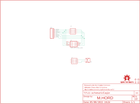

Contents
========

* [PRS11591 > Sparkfun](#prs11591--sparkfun)
	* [Schematic](#schematic)
	* [Interactive BOM](#interactive-bom)
	* [OOMP Parts](#oomp-parts)
	* [Images](#images)
	* [Tags](#tags)
  
![][im]
# PRS11591 > Sparkfun

- ID: PROJ-SPAR-11591-STAN-01
- Hex ID: PRS11591
- Name: Sparkfun
- Description: Sparkfun
- Long Link: [http://oom.lt/PROJ-SPAR-11591-STAN-01](http://oom.lt/PROJ-SPAR-11591-STAN-01)
- Long Link: [http://oom.lt/PRS11591](http://oom.lt/PRS11591)

## Schematic
  
![][schem]
## Interactive BOM

- Interactive BOM page: [ibom.html](https://htmlpreview.github.io/?https://github.com/oomlout/oomlout_OOMP_projects/blob/main/PROJ-SPAR-11591-STAN-01/kicad/bom/ibom.html)

## OOMP Parts
  

|OOMP Parts|
| :---: |
|FRAME1,UNMATCHED-UNMATCHED-UNMATCHED-UNMATCHED-UNMATCHED,FRAME1,FRAME-LETTER,FRAME-LETTER,CREATIVE_COMMONS,Schematic Frame,,|
|J1,UNMATCHED-UNMATCHED-UNMATCHED-UNMATCHED-UNMATCHED,J1,,M03X2POGO_PINS,2X3_POGO,2x3 .1 header.,HW-11044,|
|J2,UNMATCHED-UNMATCHED-UNMATCHED-UNMATCHED-UNMATCHED,J2,AVR_SPI_PRG_6NS,AVR_SPI_PRG_6NS,2X3-NS,AVR ISP 6 Pin,,|
|J3,UNMATCHED-UNMATCHED-UNMATCHED-UNMATCHED-UNMATCHED,J3,,M03X2POGO_PINS,2X3_POGO,2x3 .1 header.,HW-11044,|
|J4,UNMATCHED-UNMATCHED-UNMATCHED-UNMATCHED-UNMATCHED,J4,,JST_2MM_MALE,JST-2-SMD,Mates to single-cell LiPo batteries.,CONN-08352,|
|JP1,UNMATCHED-UNMATCHED-UNMATCHED-UNMATCHED-UNMATCHED,JP1,,M06POLAR,MOLEX-1X6,Header 6,,|
|JP2,UNMATCHED-UNMATCHED-UNMATCHED-UNMATCHED-UNMATCHED,JP2,STAND-OFF,STAND-OFF,STAND-OFF,#4 Stand Off,,|
|JP3,UNMATCHED-UNMATCHED-UNMATCHED-UNMATCHED-UNMATCHED,JP3,STAND-OFF,STAND-OFF,STAND-OFF,#4 Stand Off,,|
|JP4,UNMATCHED-UNMATCHED-UNMATCHED-UNMATCHED-UNMATCHED,JP4,STAND-OFF,STAND-OFF,STAND-OFF,#4 Stand Off,,|
|JP5,UNMATCHED-UNMATCHED-UNMATCHED-UNMATCHED-UNMATCHED,JP5,STAND-OFF,STAND-OFF,STAND-OFF,#4 Stand Off,,|
|JP6,UNMATCHED-UNMATCHED-UNMATCHED-UNMATCHED-UNMATCHED,JP6,LOGO-SFENW2,LOGO-SFENW2,SFE-NEW-WEB,Spark Fun Electronics PCB Logo,,|
|U$1,UNMATCHED-UNMATCHED-UNMATCHED-UNMATCHED-UNMATCHED,U$1,OSHW-LOGOS,OSHW-LOGOS,OSHW-LOGO-S,Open Source Hardware Logo This logo indicates the piece of hardware it is found on incorporates a OSHW license and/or adheres to the definition of open source hardware found here: http://freedomdefined.org/OSHW,,|

## Images
  
  

|kicadPcb3d|kicadPcb3dFront|kicadPcb3dBack|eagleImage|eagleSchemImage|
| :---: | :---: | :---: | :---: | :---: |
||||||

## Tags

- hexID: PRS11591
- oompType: PROJ
- oompSize: SPAR
- oompColor: 11591
- oompDesc: STAN
- oompIndex: 01
- oompName: ISP Pogo Board
- sources: All source files from https://github.com/sparkfun/ISP_Pogo_Board (source licence details in srcLicense.md)
- linkBuyPage: https://www.sparkfun.com/products/11591
- oompID: PROJ-SPAR-11591-STAN-01
- oompParts: FRAME1,UNMATCHED-UNMATCHED-UNMATCHED-UNMATCHED-UNMATCHED
- oompParts: J1,UNMATCHED-UNMATCHED-UNMATCHED-UNMATCHED-UNMATCHED
- oompParts: J2,UNMATCHED-UNMATCHED-UNMATCHED-UNMATCHED-UNMATCHED
- oompParts: J3,UNMATCHED-UNMATCHED-UNMATCHED-UNMATCHED-UNMATCHED
- oompParts: J4,UNMATCHED-UNMATCHED-UNMATCHED-UNMATCHED-UNMATCHED
- oompParts: JP1,UNMATCHED-UNMATCHED-UNMATCHED-UNMATCHED-UNMATCHED
- oompParts: JP2,UNMATCHED-UNMATCHED-UNMATCHED-UNMATCHED-UNMATCHED
- oompParts: JP3,UNMATCHED-UNMATCHED-UNMATCHED-UNMATCHED-UNMATCHED
- oompParts: JP4,UNMATCHED-UNMATCHED-UNMATCHED-UNMATCHED-UNMATCHED
- oompParts: JP5,UNMATCHED-UNMATCHED-UNMATCHED-UNMATCHED-UNMATCHED
- oompParts: JP6,UNMATCHED-UNMATCHED-UNMATCHED-UNMATCHED-UNMATCHED
- oompParts: U$1,UNMATCHED-UNMATCHED-UNMATCHED-UNMATCHED-UNMATCHED
- rawParts: FRAME1,FRAME-LETTER,FRAME-LETTER,CREATIVE_COMMONS,Schematic Frame,,
- rawParts: J1,,M03X2POGO_PINS,2X3_POGO,2x3 .1 header.,HW-11044,
- rawParts: J2,AVR_SPI_PRG_6NS,AVR_SPI_PRG_6NS,2X3-NS,AVR ISP 6 Pin,,
- rawParts: J3,,M03X2POGO_PINS,2X3_POGO,2x3 .1 header.,HW-11044,
- rawParts: J4,,JST_2MM_MALE,JST-2-SMD,Mates to single-cell LiPo batteries.,CONN-08352,
- rawParts: JP1,,M06POLAR,MOLEX-1X6,Header 6,,
- rawParts: JP2,STAND-OFF,STAND-OFF,STAND-OFF,#4 Stand Off,,
- rawParts: JP3,STAND-OFF,STAND-OFF,STAND-OFF,#4 Stand Off,,
- rawParts: JP4,STAND-OFF,STAND-OFF,STAND-OFF,#4 Stand Off,,
- rawParts: JP5,STAND-OFF,STAND-OFF,STAND-OFF,#4 Stand Off,,
- rawParts: JP6,LOGO-SFENW2,LOGO-SFENW2,SFE-NEW-WEB,Spark Fun Electronics PCB Logo,,
- rawParts: U$1,OSHW-LOGOS,OSHW-LOGOS,OSHW-LOGO-S,Open Source Hardware Logo This logo indicates the piece of hardware it is found on incorporates a OSHW license and/or adheres to the definition of open source hardware found here: http://freedomdefined.org/OSHW,,

[im]: kicadPcb3d_450.png
[schem]: eagleSchemImage.png
