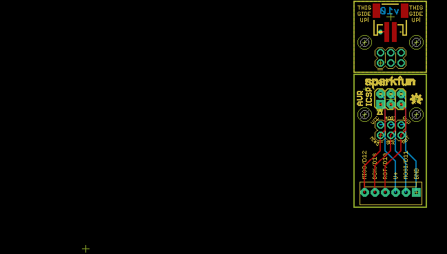
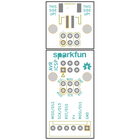
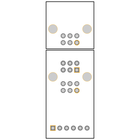

Contents
========

* [PRS11591 > ISP Pogo Board](#prs11591--isp-pogo-board)
	* [Schematic](#schematic)
	* [PCB](#pcb)
	* [Interactive BOM](#interactive-bom)
	* [OOMP Parts](#oomp-parts)
	* [Images](#images)
	* [Tags](#tags)
  
![][im]
# PRS11591 > ISP Pogo Board

- ID: PROJ-SPAR-11591-STAN-01
- Hex ID: PRS11591
- Name: Sparkfun
- Description: Sparkfun
- Long Link: [http://oom.lt/PROJ-SPAR-11591-STAN-01](http://oom.lt/PROJ-SPAR-11591-STAN-01)
- Short Link: [http://oom.lt/PRS11591](http://oom.lt/PRS11591)

## Schematic
  

## PCB
  

## Interactive BOM

- Interactive BOM page: [ibom.html](https://htmlpreview.github.io/?https://github.com/oomlout/oomlout_OOMP_projects/blob/main/PROJ-SPAR-11591-STAN-01/kicad/bom/ibom.html)

## OOMP Parts
  

|OOMP Parts|
| :---: |
|HEAD-I01-X-UNMATCHED-01 J1, J3, JP1|
|UNMATCHED-UNMATCHED-X-UNMATCHED-01 J2, J4|

## Images
  
  

|bominteractivefront|bominteractiveback|kicadPcb3d|kicadPcb3dFront|kicadPcb3dBack|eagleImage|eagleSchemImage|
| :---: | :---: | :---: | :---: | :---: | :---: | :---: |
||||||||

## Tags

- hexID: PRS11591
- oompType: PROJ
- oompSize: SPAR
- oompColor: 11591
- oompDesc: STAN
- oompIndex: 01
- oompName: ISP Pogo Board
- sources: All source files from https://github.com/sparkfun/ISP_Pogo_Board (source licence details in srcLicense.md)
- linkBuyPage: https://www.sparkfun.com/products/11591
- oompID: PROJ-SPAR-11591-STAN-01
- oompParts: J1,HEAD-I01-X-UNMATCHED-01
- oompParts: J2,UNMATCHED-UNMATCHED-X-UNMATCHED-01
- oompParts: J3,HEAD-I01-X-UNMATCHED-01
- oompParts: J4,UNMATCHED-UNMATCHED-X-UNMATCHED-01
- oompParts: JP1,HEAD-I01-X-UNMATCHED-01
- rawParts: FRAME1,FRAME-LETTER,FRAME-LETTER,CREATIVE_COMMONS,Schematic Frame,,
- rawParts: J1,,M03X2POGO_PINS,2X3_POGO,2x3 .1 header.,HW-11044,
- rawParts: J2,AVR_SPI_PRG_6NS,AVR_SPI_PRG_6NS,2X3-NS,AVR ISP 6 Pin,,
- rawParts: J3,,M03X2POGO_PINS,2X3_POGO,2x3 .1 header.,HW-11044,
- rawParts: J4,,JST_2MM_MALE,JST-2-SMD,Mates to single-cell LiPo batteries.,CONN-08352,
- rawParts: JP1,,M06POLAR,MOLEX-1X6,Header 6,,
- rawParts: JP2,STAND-OFF,STAND-OFF,STAND-OFF,#4 Stand Off,,
- rawParts: JP3,STAND-OFF,STAND-OFF,STAND-OFF,#4 Stand Off,,
- rawParts: JP4,STAND-OFF,STAND-OFF,STAND-OFF,#4 Stand Off,,
- rawParts: JP5,STAND-OFF,STAND-OFF,STAND-OFF,#4 Stand Off,,
- rawParts: JP6,LOGO-SFENW2,LOGO-SFENW2,SFE-NEW-WEB,Spark Fun Electronics PCB Logo,,
- rawParts: U$1,OSHW-LOGOS,OSHW-LOGOS,OSHW-LOGO-S,Open Source Hardware Logo This logo indicates the piece of hardware it is found on incorporates a OSHW license and/or adheres to the definition of open source hardware found here: http://freedomdefined.org/OSHW,,

[im]: kicadPcb3d_450.png
