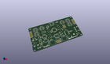
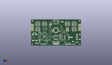
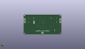
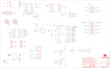

Contents
========

* [PRS11622 > Sparkfun](#prs11622--sparkfun)
	* [Schematic](#schematic)
	* [Interactive BOM](#interactive-bom)
	* [OOMP Parts](#oomp-parts)
	* [Images](#images)
	* [Tags](#tags)
  
![][im]
# PRS11622 > Sparkfun

- ID: PROJ-SPAR-11622-STAN-01
- Hex ID: PRS11622
- Name: Sparkfun
- Description: Sparkfun
- Long Link: [http://oom.lt/PROJ-SPAR-11622-STAN-01](http://oom.lt/PROJ-SPAR-11622-STAN-01)
- Short Link: [http://oom.lt/PRS11622](http://oom.lt/PRS11622)

## Schematic
  

## Interactive BOM

- Interactive BOM page: [ibom.html](https://htmlpreview.github.io/?https://github.com/oomlout/oomlout_OOMP_projects/blob/main/PROJ-SPAR-11622-STAN-01/kicad/bom/ibom.html)

## OOMP Parts
  

|OOMP Parts|
| :---: |
|C2,UNMATCHED-UNMATCHED-UNMATCHED-UNMATCHED-UNMATCHED,C2,0.1uF,0.1UF-25V(+80/-20%)(0603),0603-CAP,Ceramic,CAP-00810,0.1uF,|
|C3,UNMATCHED-UNMATCHED-UNMATCHED-UNMATCHED-UNMATCHED,C3,0.1uF,0.1UF-25V(+80/-20%)(0603),0603-CAP,Ceramic,CAP-00810,0.1uF,|
|C4,UNMATCHED-UNMATCHED-UNMATCHED-UNMATCHED-UNMATCHED,C4,0.1uF,0.1UF-25V(+80/-20%)(0603),0603-CAP,Ceramic,CAP-00810,0.1uF,|
|C5,UNMATCHED-UNMATCHED-UNMATCHED-UNMATCHED-UNMATCHED,C5,0.1uF,0.1UF-25V(+80/-20%)(0603),0603-CAP,Ceramic,CAP-00810,0.1uF,|
|C6,UNMATCHED-UNMATCHED-UNMATCHED-UNMATCHED-UNMATCHED,C6,0.1uF,0.1UF-25V(+80/-20%)(0603),0603-CAP,Ceramic,CAP-00810,0.1uF,|
|C7,UNMATCHED-UNMATCHED-UNMATCHED-UNMATCHED-UNMATCHED,C7,0.1uF,0.1UF-25V(+80/-20%)(0603),0603-CAP,Ceramic,CAP-00810,0.1uF,|
|C8,UNMATCHED-UNMATCHED-UNMATCHED-UNMATCHED-UNMATCHED,C8,10uF,10UF-16V-10%(TANT),EIA3216,CAP-00811,CAP-00811,10uF,|
|C9,UNMATCHED-UNMATCHED-UNMATCHED-UNMATCHED-UNMATCHED,C9,10uF,10UF-16V-10%(TANT),EIA3216,CAP-00811,CAP-00811,10uF,|
|D1,UNMATCHED-UNMATCHED-UNMATCHED-UNMATCHED-UNMATCHED,D1,,B340A,SMA-DIODE,Schottky Diode,DIO-09886,,|
|D2,UNMATCHED-UNMATCHED-UNMATCHED-UNMATCHED-UNMATCHED,D2,,B340A,SMA-DIODE,Schottky Diode,DIO-09886,,|
|D3,UNMATCHED-UNMATCHED-UNMATCHED-UNMATCHED-UNMATCHED,D3,GREEN,LED-GREEN0603,LED-0603,Various green LEDs,DIO-00821,GREEN,|
|D4,UNMATCHED-UNMATCHED-UNMATCHED-UNMATCHED-UNMATCHED,D4,GREEN,LED-GREEN0603,LED-0603,Various green LEDs,DIO-00821,GREEN,|
|D5,UNMATCHED-UNMATCHED-UNMATCHED-UNMATCHED-UNMATCHED,D5,GREEN,LED-GREEN0603,LED-0603,Various green LEDs,DIO-00821,GREEN,|
|D6,UNMATCHED-UNMATCHED-UNMATCHED-UNMATCHED-UNMATCHED,D6,GREEN,LED-GREEN0603,LED-0603,Various green LEDs,DIO-00821,GREEN,|
|FRAME1,UNMATCHED-UNMATCHED-UNMATCHED-UNMATCHED-UNMATCHED,FID1,FIDUCIALUFIDUCIAL,FIDUCIALUFIDUCIAL,MICRO-FIDUCIAL,Fiducial Alignment Points,,,|
|JP1,UNMATCHED-UNMATCHED-UNMATCHED-UNMATCHED-UNMATCHED,FID2,FIDUCIALUFIDUCIAL,FIDUCIALUFIDUCIAL,MICRO-FIDUCIAL,Fiducial Alignment Points,,,|
|JP2,UNMATCHED-UNMATCHED-UNMATCHED-UNMATCHED-UNMATCHED,FRAME1,FRAME-LETTER,FRAME-LETTER,CREATIVE_COMMONS,Schematic Frame,,,|
|JP3,UNMATCHED-UNMATCHED-UNMATCHED-UNMATCHED-UNMATCHED,JP1,1x3 RA Female .1,M03SMD_RA_FEMALE,1X03_SMD_RA_FEMALE,Header 3,CONN-10926,1x3 RA Female .1,|
|JP4,UNMATCHED-UNMATCHED-UNMATCHED-UNMATCHED-UNMATCHED,JP2,1x3 RA Female .1,M03SMD_RA_FEMALE,1X03_SMD_RA_FEMALE,Header 3,CONN-10926,1x3 RA Female .1,|
|JP5,UNMATCHED-UNMATCHED-UNMATCHED-UNMATCHED-UNMATCHED,JP3,5.5x2.1mm Barrel,POWER_JACKSMD,POWER_JACK_SMD,Power Jack,CONN-08106,5.5x2.1mm Barrel,|
|JP6,UNMATCHED-UNMATCHED-UNMATCHED-UNMATCHED-UNMATCHED,JP4,USB-B,USB-MINIB-5PIN,USB-MINIB,Mini-USB B connector with 5th pin broken out.,,,|
|JP7,UNMATCHED-UNMATCHED-UNMATCHED-UNMATCHED-UNMATCHED,JP5,AVR_SPI_PRG_6PTH,AVR_SPI_PRG_6PTH,2X3,AVR ISP 6 Pin,,,|
|JP8,UNMATCHED-UNMATCHED-UNMATCHED-UNMATCHED-UNMATCHED,JP6,M05X2NO_SILK,M05X2NO_SILK,2X5_NOSILK,Header 5x2,,,|
|JP9,UNMATCHED-UNMATCHED-UNMATCHED-UNMATCHED-UNMATCHED,JP7,M05X2NO_SILK,M05X2NO_SILK,2X5_NOSILK,Header 5x2,,,|
|JP10,UNMATCHED-UNMATCHED-UNMATCHED-UNMATCHED-UNMATCHED,JP8,,M03X2SMT,2X3_SMT_POSTS,2x3 .1 header.,CONN-11415,,|
|JP11,UNMATCHED-UNMATCHED-UNMATCHED-UNMATCHED-UNMATCHED,JP9,,M03X2SMT,2X3_SMT_POSTS,2x3 .1 header.,CONN-11415,,|
|JP12,UNMATCHED-UNMATCHED-UNMATCHED-UNMATCHED-UNMATCHED,JP10,,M03X2SMT,2X3_SMT_POSTS,2x3 .1 header.,CONN-11415,,|
|JP13,UNMATCHED-UNMATCHED-UNMATCHED-UNMATCHED-UNMATCHED,JP11,,M03X2SMT,2X3_SMT_POSTS,2x3 .1 header.,CONN-11415,,|
|JP14,UNMATCHED-UNMATCHED-UNMATCHED-UNMATCHED-UNMATCHED,JP12,,M03X2SMT,2X3_SMT_POSTS,2x3 .1 header.,CONN-11415,,|
|JP15,UNMATCHED-UNMATCHED-UNMATCHED-UNMATCHED-UNMATCHED,JP13,,M03X2SMT,2X3_SMT_POSTS,2x3 .1 header.,CONN-11415,,|
|JP16,UNMATCHED-UNMATCHED-UNMATCHED-UNMATCHED-UNMATCHED,JP14,,M02PTH,1X02,Header 2,,,|
|MOD1,UNMATCHED-UNMATCHED-UNMATCHED-UNMATCHED-UNMATCHED,JP15,,M02PTH,1X02,Header 2,,,|
|Q1,UNMATCHED-UNMATCHED-UNMATCHED-UNMATCHED-UNMATCHED,JP16,,M02PTH,1X02,Header 2,,,|
|R1,UNMATCHED-UNMATCHED-UNMATCHED-UNMATCHED-UNMATCHED,MOD1,XBEE-1B3,XBEE-1B3,XBEE-SMD,Xbee module footprints,CONN-09042,,|
|R2,UNMATCHED-UNMATCHED-UNMATCHED-UNMATCHED-UNMATCHED,Q1,,IRF7509,MSOP8,30V Dual PMOS/NMOS MSOP-8,TRANS-07913,,|
|R3,UNMATCHED-UNMATCHED-UNMATCHED-UNMATCHED-UNMATCHED,R1,10k,10KOHM1/10W1%(0603)0603,0603-RES,RES-00824,RES-00824,10K,|
|R4,UNMATCHED-UNMATCHED-UNMATCHED-UNMATCHED-UNMATCHED,R2,1k,1K-1%,0603-RES,1k-ohm SMT,RES-07856,1k,|
|R5,UNMATCHED-UNMATCHED-UNMATCHED-UNMATCHED-UNMATCHED,R3,1k,1K-1%,0603-RES,1k-ohm SMT,RES-07856,1k,|
|R6,UNMATCHED-UNMATCHED-UNMATCHED-UNMATCHED-UNMATCHED,R4,1k,1K-1%,0603-RES,1k-ohm SMT,RES-07856,1k,|
|R7,UNMATCHED-UNMATCHED-UNMATCHED-UNMATCHED-UNMATCHED,R5,1k,1K-1%,0603-RES,1k-ohm SMT,RES-07856,1k,|
|R8,UNMATCHED-UNMATCHED-UNMATCHED-UNMATCHED-UNMATCHED,R6,1k,1K-1%,0603-RES,1k-ohm SMT,RES-07856,1k,|
|R9,UNMATCHED-UNMATCHED-UNMATCHED-UNMATCHED-UNMATCHED,R7,1k,1K-1%,0603-RES,1k-ohm SMT,RES-07856,1k,|
|R10,UNMATCHED-UNMATCHED-UNMATCHED-UNMATCHED-UNMATCHED,R8,1k,1K-1%,0603-RES,1k-ohm SMT,RES-07856,1k,|
|R11,UNMATCHED-UNMATCHED-UNMATCHED-UNMATCHED-UNMATCHED,R9,10k,10KOHM1/10W1%(0603)0603,0603-RES,RES-00824,RES-00824,10K,|
|R12,UNMATCHED-UNMATCHED-UNMATCHED-UNMATCHED-UNMATCHED,R10,10k,10KOHM1/10W1%(0603)0603,0603-RES,RES-00824,RES-00824,10K,|
|R13,UNMATCHED-UNMATCHED-UNMATCHED-UNMATCHED-UNMATCHED,R11,10k,10KOHM1/10W1%(0603)0603,0603-RES,RES-00824,RES-00824,10K,|
|S1,UNMATCHED-UNMATCHED-UNMATCHED-UNMATCHED-UNMATCHED,R12,10k,10KOHM1/10W1%(0603)0603,0603-RES,RES-00824,RES-00824,10K,|
|S2,UNMATCHED-UNMATCHED-UNMATCHED-UNMATCHED-UNMATCHED,R13,10k,10KOHM1/10W1%(0603)0603,0603-RES,RES-00824,RES-00824,10K,|
|S3,UNMATCHED-UNMATCHED-UNMATCHED-UNMATCHED-UNMATCHED,S1,DPDT,SWITCH-DPDTAYZ0202,AYZ0202,DPDT Version of the COM-00597,SWCH-08179,DPDT,|
|S4,UNMATCHED-UNMATCHED-UNMATCHED-UNMATCHED-UNMATCHED,S2,DPDT,SWITCH-DPDTAYZ0202,AYZ0202,DPDT Version of the COM-00597,SWCH-08179,DPDT,|
|SFE-LOGO1,UNMATCHED-UNMATCHED-UNMATCHED-UNMATCHED-UNMATCHED,S3,DPDT,SWITCH-DPDTAYZ0202,AYZ0202,DPDT Version of the COM-00597,SWCH-08179,DPDT,|
|STANDOFF1,UNMATCHED-UNMATCHED-UNMATCHED-UNMATCHED-UNMATCHED,S4,,TAC_SWITCHSMD,TACTILE_SWITCH_SMD,Momentary Switch,SWCH-08247,,|
|STANDOFF2,UNMATCHED-UNMATCHED-UNMATCHED-UNMATCHED-UNMATCHED,SFE-LOGO1,LOGO-SFENEW,LOGO-SFENEW,SFE-NEW-WEBLOGO,Spark Fun Electronics PCB Logo,,,|
|STANDOFF3,UNMATCHED-UNMATCHED-UNMATCHED-UNMATCHED-UNMATCHED,STANDOFF1,STAND-OFF,STAND-OFF,STAND-OFF,#4 Stand Off,,,|
|STANDOFF4,UNMATCHED-UNMATCHED-UNMATCHED-UNMATCHED-UNMATCHED,STANDOFF2,STAND-OFF,STAND-OFF,STAND-OFF,#4 Stand Off,,,|
|U$17,UNMATCHED-UNMATCHED-UNMATCHED-UNMATCHED-UNMATCHED,STANDOFF3,STAND-OFF,STAND-OFF,STAND-OFF,#4 Stand Off,,,|
|U$21,UNMATCHED-UNMATCHED-UNMATCHED-UNMATCHED-UNMATCHED,STANDOFF4,STAND-OFF,STAND-OFF,STAND-OFF,#4 Stand Off,,,|
|U1,UNMATCHED-UNMATCHED-UNMATCHED-UNMATCHED-UNMATCHED,U$17,OSHW-LOGOS,OSHW-LOGOS,OSHW-LOGO-S,Open Source Hardware Logo This logo indicates the piece of hardware it is found on incorporates a OSHW license and/or adheres to the definition of open source hardware found here: http://freedomdefined.org/OSHW,,,|
|U2,UNMATCHED-UNMATCHED-UNMATCHED-UNMATCHED-UNMATCHED,U$21,FOUR_LAYER_WARNING,FOUR_LAYER_WARNING,FOUR_LAYER_WARNING,Warning text which will appear on both the schematic,,,|
|U3,UNMATCHED-UNMATCHED-UNMATCHED-UNMATCHED-UNMATCHED,U1,ATMEGA328P,ATMEGA328_SMT,TQFP32-08,32-Pin Atmega328 part,IC-09069,ATMEGA328P,|
|U4,UNMATCHED-UNMATCHED-UNMATCHED-UNMATCHED-UNMATCHED,U2,TB6612FNG,TB6621FNG,SSOP24,Toshiba 1A dual motor driver,IC-09363,TB6612FNG,|
|U5,UNMATCHED-UNMATCHED-UNMATCHED-UNMATCHED-UNMATCHED,U3,MIC5219 5V,V_REG_MIC52195V,SOT23-5,V_REG MIC5219,VREG-10107,MIC5219 5V,|
|U6,UNMATCHED-UNMATCHED-UNMATCHED-UNMATCHED-UNMATCHED,U4,MIC5219 3.3V,V_REG_MIC52193.3V,SOT23-5,V_REG MIC5219,VREG-09872,MIC5219 3.3V,|
|Y1,UNMATCHED-UNMATCHED-UNMATCHED-UNMATCHED-UNMATCHED,U5,FT232RLSSOP,FT232RLSSOP,SSOP28DB,USB UART,IC-00870,,|

## Images
  
  

|kicadPcb3d|kicadPcb3dFront|kicadPcb3dBack|eagleImage|eagleSchemImage|
| :---: | :---: | :---: | :---: | :---: |
||||||

## Tags

- hexID: PRS11622
- oompType: PROJ
- oompSize: SPAR
- oompColor: 11622
- oompDesc: STAN
- oompIndex: 01
- oompName: RedBot with Optical Encoder
- sources: All source files from https://github.com/sparkfun/RedBot_with_Optical_Encoder (source licence details in srcLicense.md)
- linkBuyPage: https://www.sparkfun.com/products/11622
- oompID: PROJ-SPAR-11622-STAN-01
- oompParts: C2,UNMATCHED-UNMATCHED-UNMATCHED-UNMATCHED-UNMATCHED
- oompParts: C3,UNMATCHED-UNMATCHED-UNMATCHED-UNMATCHED-UNMATCHED
- oompParts: C4,UNMATCHED-UNMATCHED-UNMATCHED-UNMATCHED-UNMATCHED
- oompParts: C5,UNMATCHED-UNMATCHED-UNMATCHED-UNMATCHED-UNMATCHED
- oompParts: C6,UNMATCHED-UNMATCHED-UNMATCHED-UNMATCHED-UNMATCHED
- oompParts: C7,UNMATCHED-UNMATCHED-UNMATCHED-UNMATCHED-UNMATCHED
- oompParts: C8,UNMATCHED-UNMATCHED-UNMATCHED-UNMATCHED-UNMATCHED
- oompParts: C9,UNMATCHED-UNMATCHED-UNMATCHED-UNMATCHED-UNMATCHED
- oompParts: D1,UNMATCHED-UNMATCHED-UNMATCHED-UNMATCHED-UNMATCHED
- oompParts: D2,UNMATCHED-UNMATCHED-UNMATCHED-UNMATCHED-UNMATCHED
- oompParts: D3,UNMATCHED-UNMATCHED-UNMATCHED-UNMATCHED-UNMATCHED
- oompParts: D4,UNMATCHED-UNMATCHED-UNMATCHED-UNMATCHED-UNMATCHED
- oompParts: D5,UNMATCHED-UNMATCHED-UNMATCHED-UNMATCHED-UNMATCHED
- oompParts: D6,UNMATCHED-UNMATCHED-UNMATCHED-UNMATCHED-UNMATCHED
- oompParts: FRAME1,UNMATCHED-UNMATCHED-UNMATCHED-UNMATCHED-UNMATCHED
- oompParts: JP1,UNMATCHED-UNMATCHED-UNMATCHED-UNMATCHED-UNMATCHED
- oompParts: JP2,UNMATCHED-UNMATCHED-UNMATCHED-UNMATCHED-UNMATCHED
- oompParts: JP3,UNMATCHED-UNMATCHED-UNMATCHED-UNMATCHED-UNMATCHED
- oompParts: JP4,UNMATCHED-UNMATCHED-UNMATCHED-UNMATCHED-UNMATCHED
- oompParts: JP5,UNMATCHED-UNMATCHED-UNMATCHED-UNMATCHED-UNMATCHED
- oompParts: JP6,UNMATCHED-UNMATCHED-UNMATCHED-UNMATCHED-UNMATCHED
- oompParts: JP7,UNMATCHED-UNMATCHED-UNMATCHED-UNMATCHED-UNMATCHED
- oompParts: JP8,UNMATCHED-UNMATCHED-UNMATCHED-UNMATCHED-UNMATCHED
- oompParts: JP9,UNMATCHED-UNMATCHED-UNMATCHED-UNMATCHED-UNMATCHED
- oompParts: JP10,UNMATCHED-UNMATCHED-UNMATCHED-UNMATCHED-UNMATCHED
- oompParts: JP11,UNMATCHED-UNMATCHED-UNMATCHED-UNMATCHED-UNMATCHED
- oompParts: JP12,UNMATCHED-UNMATCHED-UNMATCHED-UNMATCHED-UNMATCHED
- oompParts: JP13,UNMATCHED-UNMATCHED-UNMATCHED-UNMATCHED-UNMATCHED
- oompParts: JP14,UNMATCHED-UNMATCHED-UNMATCHED-UNMATCHED-UNMATCHED
- oompParts: JP15,UNMATCHED-UNMATCHED-UNMATCHED-UNMATCHED-UNMATCHED
- oompParts: JP16,UNMATCHED-UNMATCHED-UNMATCHED-UNMATCHED-UNMATCHED
- oompParts: MOD1,UNMATCHED-UNMATCHED-UNMATCHED-UNMATCHED-UNMATCHED
- oompParts: Q1,UNMATCHED-UNMATCHED-UNMATCHED-UNMATCHED-UNMATCHED
- oompParts: R1,UNMATCHED-UNMATCHED-UNMATCHED-UNMATCHED-UNMATCHED
- oompParts: R2,UNMATCHED-UNMATCHED-UNMATCHED-UNMATCHED-UNMATCHED
- oompParts: R3,UNMATCHED-UNMATCHED-UNMATCHED-UNMATCHED-UNMATCHED
- oompParts: R4,UNMATCHED-UNMATCHED-UNMATCHED-UNMATCHED-UNMATCHED
- oompParts: R5,UNMATCHED-UNMATCHED-UNMATCHED-UNMATCHED-UNMATCHED
- oompParts: R6,UNMATCHED-UNMATCHED-UNMATCHED-UNMATCHED-UNMATCHED
- oompParts: R7,UNMATCHED-UNMATCHED-UNMATCHED-UNMATCHED-UNMATCHED
- oompParts: R8,UNMATCHED-UNMATCHED-UNMATCHED-UNMATCHED-UNMATCHED
- oompParts: R9,UNMATCHED-UNMATCHED-UNMATCHED-UNMATCHED-UNMATCHED
- oompParts: R10,UNMATCHED-UNMATCHED-UNMATCHED-UNMATCHED-UNMATCHED
- oompParts: R11,UNMATCHED-UNMATCHED-UNMATCHED-UNMATCHED-UNMATCHED
- oompParts: R12,UNMATCHED-UNMATCHED-UNMATCHED-UNMATCHED-UNMATCHED
- oompParts: R13,UNMATCHED-UNMATCHED-UNMATCHED-UNMATCHED-UNMATCHED
- oompParts: S1,UNMATCHED-UNMATCHED-UNMATCHED-UNMATCHED-UNMATCHED
- oompParts: S2,UNMATCHED-UNMATCHED-UNMATCHED-UNMATCHED-UNMATCHED
- oompParts: S3,UNMATCHED-UNMATCHED-UNMATCHED-UNMATCHED-UNMATCHED
- oompParts: S4,UNMATCHED-UNMATCHED-UNMATCHED-UNMATCHED-UNMATCHED
- oompParts: SFE-LOGO1,UNMATCHED-UNMATCHED-UNMATCHED-UNMATCHED-UNMATCHED
- oompParts: STANDOFF1,UNMATCHED-UNMATCHED-UNMATCHED-UNMATCHED-UNMATCHED
- oompParts: STANDOFF2,UNMATCHED-UNMATCHED-UNMATCHED-UNMATCHED-UNMATCHED
- oompParts: STANDOFF3,UNMATCHED-UNMATCHED-UNMATCHED-UNMATCHED-UNMATCHED
- oompParts: STANDOFF4,UNMATCHED-UNMATCHED-UNMATCHED-UNMATCHED-UNMATCHED
- oompParts: U$17,UNMATCHED-UNMATCHED-UNMATCHED-UNMATCHED-UNMATCHED
- oompParts: U$21,UNMATCHED-UNMATCHED-UNMATCHED-UNMATCHED-UNMATCHED
- oompParts: U1,UNMATCHED-UNMATCHED-UNMATCHED-UNMATCHED-UNMATCHED
- oompParts: U2,UNMATCHED-UNMATCHED-UNMATCHED-UNMATCHED-UNMATCHED
- oompParts: U3,UNMATCHED-UNMATCHED-UNMATCHED-UNMATCHED-UNMATCHED
- oompParts: U4,UNMATCHED-UNMATCHED-UNMATCHED-UNMATCHED-UNMATCHED
- oompParts: U5,UNMATCHED-UNMATCHED-UNMATCHED-UNMATCHED-UNMATCHED
- oompParts: U6,UNMATCHED-UNMATCHED-UNMATCHED-UNMATCHED-UNMATCHED
- oompParts: Y1,UNMATCHED-UNMATCHED-UNMATCHED-UNMATCHED-UNMATCHED
- rawParts: C2,0.1uF,0.1UF-25V(+80/-20%)(0603),0603-CAP,Ceramic,CAP-00810,0.1uF,
- rawParts: C3,0.1uF,0.1UF-25V(+80/-20%)(0603),0603-CAP,Ceramic,CAP-00810,0.1uF,
- rawParts: C4,0.1uF,0.1UF-25V(+80/-20%)(0603),0603-CAP,Ceramic,CAP-00810,0.1uF,
- rawParts: C5,0.1uF,0.1UF-25V(+80/-20%)(0603),0603-CAP,Ceramic,CAP-00810,0.1uF,
- rawParts: C6,0.1uF,0.1UF-25V(+80/-20%)(0603),0603-CAP,Ceramic,CAP-00810,0.1uF,
- rawParts: C7,0.1uF,0.1UF-25V(+80/-20%)(0603),0603-CAP,Ceramic,CAP-00810,0.1uF,
- rawParts: C8,10uF,10UF-16V-10%(TANT),EIA3216,CAP-00811,CAP-00811,10uF,
- rawParts: C9,10uF,10UF-16V-10%(TANT),EIA3216,CAP-00811,CAP-00811,10uF,
- rawParts: D1,,B340A,SMA-DIODE,Schottky Diode,DIO-09886,,
- rawParts: D2,,B340A,SMA-DIODE,Schottky Diode,DIO-09886,,
- rawParts: D3,GREEN,LED-GREEN0603,LED-0603,Various green LEDs,DIO-00821,GREEN,
- rawParts: D4,GREEN,LED-GREEN0603,LED-0603,Various green LEDs,DIO-00821,GREEN,
- rawParts: D5,GREEN,LED-GREEN0603,LED-0603,Various green LEDs,DIO-00821,GREEN,
- rawParts: D6,GREEN,LED-GREEN0603,LED-0603,Various green LEDs,DIO-00821,GREEN,
- rawParts: FID1,FIDUCIALUFIDUCIAL,FIDUCIALUFIDUCIAL,MICRO-FIDUCIAL,Fiducial Alignment Points,,,
- rawParts: FID2,FIDUCIALUFIDUCIAL,FIDUCIALUFIDUCIAL,MICRO-FIDUCIAL,Fiducial Alignment Points,,,
- rawParts: FRAME1,FRAME-LETTER,FRAME-LETTER,CREATIVE_COMMONS,Schematic Frame,,,
- rawParts: JP1,1x3 RA Female .1,M03SMD_RA_FEMALE,1X03_SMD_RA_FEMALE,Header 3,CONN-10926,1x3 RA Female .1,
- rawParts: JP2,1x3 RA Female .1,M03SMD_RA_FEMALE,1X03_SMD_RA_FEMALE,Header 3,CONN-10926,1x3 RA Female .1,
- rawParts: JP3,5.5x2.1mm Barrel,POWER_JACKSMD,POWER_JACK_SMD,Power Jack,CONN-08106,5.5x2.1mm Barrel,
- rawParts: JP4,USB-B,USB-MINIB-5PIN,USB-MINIB,Mini-USB B connector with 5th pin broken out.,,,
- rawParts: JP5,AVR_SPI_PRG_6PTH,AVR_SPI_PRG_6PTH,2X3,AVR ISP 6 Pin,,,
- rawParts: JP6,M05X2NO_SILK,M05X2NO_SILK,2X5_NOSILK,Header 5x2,,,
- rawParts: JP7,M05X2NO_SILK,M05X2NO_SILK,2X5_NOSILK,Header 5x2,,,
- rawParts: JP8,,M03X2SMT,2X3_SMT_POSTS,2x3 .1 header.,CONN-11415,,
- rawParts: JP9,,M03X2SMT,2X3_SMT_POSTS,2x3 .1 header.,CONN-11415,,
- rawParts: JP10,,M03X2SMT,2X3_SMT_POSTS,2x3 .1 header.,CONN-11415,,
- rawParts: JP11,,M03X2SMT,2X3_SMT_POSTS,2x3 .1 header.,CONN-11415,,
- rawParts: JP12,,M03X2SMT,2X3_SMT_POSTS,2x3 .1 header.,CONN-11415,,
- rawParts: JP13,,M03X2SMT,2X3_SMT_POSTS,2x3 .1 header.,CONN-11415,,
- rawParts: JP14,,M02PTH,1X02,Header 2,,,
- rawParts: JP15,,M02PTH,1X02,Header 2,,,
- rawParts: JP16,,M02PTH,1X02,Header 2,,,
- rawParts: MOD1,XBEE-1B3,XBEE-1B3,XBEE-SMD,Xbee module footprints,CONN-09042,,
- rawParts: Q1,,IRF7509,MSOP8,30V Dual PMOS/NMOS MSOP-8,TRANS-07913,,
- rawParts: R1,10k,10KOHM1/10W1%(0603)0603,0603-RES,RES-00824,RES-00824,10K,
- rawParts: R2,1k,1K-1%,0603-RES,1k-ohm SMT,RES-07856,1k,
- rawParts: R3,1k,1K-1%,0603-RES,1k-ohm SMT,RES-07856,1k,
- rawParts: R4,1k,1K-1%,0603-RES,1k-ohm SMT,RES-07856,1k,
- rawParts: R5,1k,1K-1%,0603-RES,1k-ohm SMT,RES-07856,1k,
- rawParts: R6,1k,1K-1%,0603-RES,1k-ohm SMT,RES-07856,1k,
- rawParts: R7,1k,1K-1%,0603-RES,1k-ohm SMT,RES-07856,1k,
- rawParts: R8,1k,1K-1%,0603-RES,1k-ohm SMT,RES-07856,1k,
- rawParts: R9,10k,10KOHM1/10W1%(0603)0603,0603-RES,RES-00824,RES-00824,10K,
- rawParts: R10,10k,10KOHM1/10W1%(0603)0603,0603-RES,RES-00824,RES-00824,10K,
- rawParts: R11,10k,10KOHM1/10W1%(0603)0603,0603-RES,RES-00824,RES-00824,10K,
- rawParts: R12,10k,10KOHM1/10W1%(0603)0603,0603-RES,RES-00824,RES-00824,10K,
- rawParts: R13,10k,10KOHM1/10W1%(0603)0603,0603-RES,RES-00824,RES-00824,10K,
- rawParts: S1,DPDT,SWITCH-DPDTAYZ0202,AYZ0202,DPDT Version of the COM-00597,SWCH-08179,DPDT,
- rawParts: S2,DPDT,SWITCH-DPDTAYZ0202,AYZ0202,DPDT Version of the COM-00597,SWCH-08179,DPDT,
- rawParts: S3,DPDT,SWITCH-DPDTAYZ0202,AYZ0202,DPDT Version of the COM-00597,SWCH-08179,DPDT,
- rawParts: S4,,TAC_SWITCHSMD,TACTILE_SWITCH_SMD,Momentary Switch,SWCH-08247,,
- rawParts: SFE-LOGO1,LOGO-SFENEW,LOGO-SFENEW,SFE-NEW-WEBLOGO,Spark Fun Electronics PCB Logo,,,
- rawParts: STANDOFF1,STAND-OFF,STAND-OFF,STAND-OFF,#4 Stand Off,,,
- rawParts: STANDOFF2,STAND-OFF,STAND-OFF,STAND-OFF,#4 Stand Off,,,
- rawParts: STANDOFF3,STAND-OFF,STAND-OFF,STAND-OFF,#4 Stand Off,,,
- rawParts: STANDOFF4,STAND-OFF,STAND-OFF,STAND-OFF,#4 Stand Off,,,
- rawParts: U$17,OSHW-LOGOS,OSHW-LOGOS,OSHW-LOGO-S,Open Source Hardware Logo This logo indicates the piece of hardware it is found on incorporates a OSHW license and/or adheres to the definition of open source hardware found here: http://freedomdefined.org/OSHW,,,
- rawParts: U$21,FOUR_LAYER_WARNING,FOUR_LAYER_WARNING,FOUR_LAYER_WARNING,Warning text which will appear on both the schematic,,,
- rawParts: U1,ATMEGA328P,ATMEGA328_SMT,TQFP32-08,32-Pin Atmega328 part,IC-09069,ATMEGA328P,
- rawParts: U2,TB6612FNG,TB6621FNG,SSOP24,Toshiba 1A dual motor driver,IC-09363,TB6612FNG,
- rawParts: U3,MIC5219 5V,V_REG_MIC52195V,SOT23-5,V_REG MIC5219,VREG-10107,MIC5219 5V,
- rawParts: U4,MIC5219 3.3V,V_REG_MIC52193.3V,SOT23-5,V_REG MIC5219,VREG-09872,MIC5219 3.3V,
- rawParts: U5,FT232RLSSOP,FT232RLSSOP,SSOP28DB,USB UART,IC-00870,,
- rawParts: U6,7408SE,7408SE,SOT353,Single 2-input AND gate,IC-10841,74LVC1G08SE-7,
- rawParts: Y1,16MHz,RESONATOR16MHZ,RESONATOR-SMD,Resonator,XTAL-08900,16MHz,

[im]: kicadPcb3d_450.png
