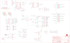

Contents
========

* [PRS11622 > RedBot with Optical Encoder](#prs11622--redbot-with-optical-encoder)
	* [Schematic](#schematic)
	* [PCB](#pcb)
	* [Interactive BOM](#interactive-bom)
	* [OOMP Parts](#oomp-parts)
	* [Images](#images)
	* [Tags](#tags)
  
![][im]
# PRS11622 > RedBot with Optical Encoder

- ID: PROJ-SPAR-11622-STAN-01
- Hex ID: PRS11622
- Name: Sparkfun
- Description: Sparkfun
- Long Link: [http://oom.lt/PROJ-SPAR-11622-STAN-01](http://oom.lt/PROJ-SPAR-11622-STAN-01)
- Short Link: [http://oom.lt/PRS11622](http://oom.lt/PRS11622)

## Schematic
  

## PCB
  

## Interactive BOM

- Interactive BOM page: [ibom.html](https://htmlpreview.github.io/?https://github.com/oomlout/oomlout_OOMP_projects/blob/main/PROJ-SPAR-11622-STAN-01/kicad/bom/ibom.html)

## OOMP Parts
  

|OOMP ID|Name|Identifier|
| :---: | :---: | :---: |
|[CAPC-0603-X-NF100-V50](https://github.com/oomlout/oomlout_OOMP_parts/tree/main/CAPC-0603-X-NF100-V50/)|[SMD (0603) 100 nF Capacitor (Ceramic) 50v](https://github.com/oomlout/oomlout_OOMP_parts/tree/main/CAPC-0603-X-NF100-V50/)|[C2, C3, C4, C5, C6, C7](https://github.com/oomlout/oomlout_OOMP_parts/tree/main/CAPC-0603-X-NF100-V50/)|
|[CAPT-3216-X-UF10-V10](https://github.com/oomlout/oomlout_OOMP_parts/tree/main/CAPT-3216-X-UF10-V10/)|[SMD (3216) 10 uF Capacitor (Tantalum) 10v](https://github.com/oomlout/oomlout_OOMP_parts/tree/main/CAPT-3216-X-UF10-V10/)|[C8, C9](https://github.com/oomlout/oomlout_OOMP_parts/tree/main/CAPT-3216-X-UF10-V10/)|
|DIOD-UNMATCHED-X-UNMATCHED-01||D1, D2|
|[LEDS-0603-G-STAN-01](https://github.com/oomlout/oomlout_OOMP_parts/tree/main/LEDS-0603-G-STAN-01/)|[SMD (0603) Green LED](https://github.com/oomlout/oomlout_OOMP_parts/tree/main/LEDS-0603-G-STAN-01/)|[D3, D4, D5, D6](https://github.com/oomlout/oomlout_OOMP_parts/tree/main/LEDS-0603-G-STAN-01/)|
|[HEAD-I01-X-PI03-01](https://github.com/oomlout/oomlout_OOMP_parts/tree/main/HEAD-I01-X-PI03-01/)|[2.54 mm 3 Pin Header](https://github.com/oomlout/oomlout_OOMP_parts/tree/main/HEAD-I01-X-PI03-01/)|[JP1, JP2](https://github.com/oomlout/oomlout_OOMP_parts/tree/main/HEAD-I01-X-PI03-01/)|
|UNMATCHED-UNMATCHED-X-UNMATCHED-01||JP3, JP4, JP5, MOD1, Q1, S1, S2, S3, S4, U$21, U1, U2, U5, U6, Y1|
|HEAD-I01-X-UNMATCHED-01||JP6, JP7, JP8, JP9, JP10, JP11, JP12, JP13|
|[HEAD-I01-X-PI02-01](https://github.com/oomlout/oomlout_OOMP_parts/tree/main/HEAD-I01-X-PI02-01/)|[2.54 mm 2 Pin Header](https://github.com/oomlout/oomlout_OOMP_parts/tree/main/HEAD-I01-X-PI02-01/)|[JP14, JP15, JP16](https://github.com/oomlout/oomlout_OOMP_parts/tree/main/HEAD-I01-X-PI02-01/)|
|[RESE-0603-X-O103-01](https://github.com/oomlout/oomlout_OOMP_parts/tree/main/RESE-0603-X-O103-01/)|[SMD (0603) 10k Ohm Resistor](https://github.com/oomlout/oomlout_OOMP_parts/tree/main/RESE-0603-X-O103-01/)|[R1, R9, R10, R11, R12, R13](https://github.com/oomlout/oomlout_OOMP_parts/tree/main/RESE-0603-X-O103-01/)|
|[RESE-0603-X-O102-01](https://github.com/oomlout/oomlout_OOMP_parts/tree/main/RESE-0603-X-O102-01/)|[SMD (0603) 1k Ohm Resistor](https://github.com/oomlout/oomlout_OOMP_parts/tree/main/RESE-0603-X-O102-01/)|[R2, R3, R4, R5, R6, R7, R8](https://github.com/oomlout/oomlout_OOMP_parts/tree/main/RESE-0603-X-O102-01/)|
|UNMATCHED-SO235-X-UNMATCHED-01||U3, U4|

## Images
  
  

|bominteractivefront|bominteractiveback|kicadPcb3d|kicadPcb3dFront|kicadPcb3dBack|eagleImage|eagleSchemImage|pcbdraw|pcbdrawback|
| :---: | :---: | :---: | :---: | :---: | :---: | :---: | :---: | :---: |
||||||||||

## Tags

- hexID: PRS11622
- oompType: PROJ
- oompSize: SPAR
- oompColor: 11622
- oompDesc: STAN
- oompIndex: 01
- oompName: RedBot with Optical Encoder
- sources: All source files from https://github.com/sparkfun/RedBot_with_Optical_Encoder (source licence details in srcLicense.md)
- linkBuyPage: https://www.sparkfun.com/products/11622
- oompID: PROJ-SPAR-11622-STAN-01
- oompParts: C2,CAPC-0603-X-NF100-V50
- oompParts: C3,CAPC-0603-X-NF100-V50
- oompParts: C4,CAPC-0603-X-NF100-V50
- oompParts: C5,CAPC-0603-X-NF100-V50
- oompParts: C6,CAPC-0603-X-NF100-V50
- oompParts: C7,CAPC-0603-X-NF100-V50
- oompParts: C8,CAPT-3216-X-UF10-V10
- oompParts: C9,CAPT-3216-X-UF10-V10
- oompParts: D1,DIOD-UNMATCHED-X-UNMATCHED-01
- oompParts: D2,DIOD-UNMATCHED-X-UNMATCHED-01
- oompParts: D3,LEDS-0603-G-STAN-01
- oompParts: D4,LEDS-0603-G-STAN-01
- oompParts: D5,LEDS-0603-G-STAN-01
- oompParts: D6,LEDS-0603-G-STAN-01
- oompParts: JP1,HEAD-I01-X-PI03-01
- oompParts: JP2,HEAD-I01-X-PI03-01
- oompParts: JP3,UNMATCHED-UNMATCHED-X-UNMATCHED-01
- oompParts: JP4,UNMATCHED-UNMATCHED-X-UNMATCHED-01
- oompParts: JP5,UNMATCHED-UNMATCHED-X-UNMATCHED-01
- oompParts: JP6,HEAD-I01-X-UNMATCHED-01
- oompParts: JP7,HEAD-I01-X-UNMATCHED-01
- oompParts: JP8,HEAD-I01-X-UNMATCHED-01
- oompParts: JP9,HEAD-I01-X-UNMATCHED-01
- oompParts: JP10,HEAD-I01-X-UNMATCHED-01
- oompParts: JP11,HEAD-I01-X-UNMATCHED-01
- oompParts: JP12,HEAD-I01-X-UNMATCHED-01
- oompParts: JP13,HEAD-I01-X-UNMATCHED-01
- oompParts: JP14,HEAD-I01-X-PI02-01
- oompParts: JP15,HEAD-I01-X-PI02-01
- oompParts: JP16,HEAD-I01-X-PI02-01
- oompParts: MOD1,UNMATCHED-UNMATCHED-X-UNMATCHED-01
- oompParts: Q1,UNMATCHED-UNMATCHED-X-UNMATCHED-01
- oompParts: R1,RESE-0603-X-O103-01
- oompParts: R2,RESE-0603-X-O102-01
- oompParts: R3,RESE-0603-X-O102-01
- oompParts: R4,RESE-0603-X-O102-01
- oompParts: R5,RESE-0603-X-O102-01
- oompParts: R6,RESE-0603-X-O102-01
- oompParts: R7,RESE-0603-X-O102-01
- oompParts: R8,RESE-0603-X-O102-01
- oompParts: R9,RESE-0603-X-O103-01
- oompParts: R10,RESE-0603-X-O103-01
- oompParts: R11,RESE-0603-X-O103-01
- oompParts: R12,RESE-0603-X-O103-01
- oompParts: R13,RESE-0603-X-O103-01
- oompParts: S1,UNMATCHED-UNMATCHED-X-UNMATCHED-01
- oompParts: S2,UNMATCHED-UNMATCHED-X-UNMATCHED-01
- oompParts: S3,UNMATCHED-UNMATCHED-X-UNMATCHED-01
- oompParts: S4,UNMATCHED-UNMATCHED-X-UNMATCHED-01
- oompParts: U$21,UNMATCHED-UNMATCHED-X-UNMATCHED-01
- oompParts: U1,UNMATCHED-UNMATCHED-X-UNMATCHED-01
- oompParts: U2,UNMATCHED-UNMATCHED-X-UNMATCHED-01
- oompParts: U3,UNMATCHED-SO235-X-UNMATCHED-01
- oompParts: U4,UNMATCHED-SO235-X-UNMATCHED-01
- oompParts: U5,UNMATCHED-UNMATCHED-X-UNMATCHED-01
- oompParts: U6,UNMATCHED-UNMATCHED-X-UNMATCHED-01
- oompParts: Y1,UNMATCHED-UNMATCHED-X-UNMATCHED-01
- rawParts: C2,0.1uF,0.1UF-25V(+80/-20%)(0603),0603-CAP,Ceramic,CAP-00810,0.1uF,
- rawParts: C3,0.1uF,0.1UF-25V(+80/-20%)(0603),0603-CAP,Ceramic,CAP-00810,0.1uF,
- rawParts: C4,0.1uF,0.1UF-25V(+80/-20%)(0603),0603-CAP,Ceramic,CAP-00810,0.1uF,
- rawParts: C5,0.1uF,0.1UF-25V(+80/-20%)(0603),0603-CAP,Ceramic,CAP-00810,0.1uF,
- rawParts: C6,0.1uF,0.1UF-25V(+80/-20%)(0603),0603-CAP,Ceramic,CAP-00810,0.1uF,
- rawParts: C7,0.1uF,0.1UF-25V(+80/-20%)(0603),0603-CAP,Ceramic,CAP-00810,0.1uF,
- rawParts: C8,10uF,10UF-16V-10%(TANT),EIA3216,CAP-00811,CAP-00811,10uF,
- rawParts: C9,10uF,10UF-16V-10%(TANT),EIA3216,CAP-00811,CAP-00811,10uF,
- rawParts: D1,,B340A,SMA-DIODE,Schottky Diode,DIO-09886,,
- rawParts: D2,,B340A,SMA-DIODE,Schottky Diode,DIO-09886,,
- rawParts: D3,GREEN,LED-GREEN0603,LED-0603,Various green LEDs,DIO-00821,GREEN,
- rawParts: D4,GREEN,LED-GREEN0603,LED-0603,Various green LEDs,DIO-00821,GREEN,
- rawParts: D5,GREEN,LED-GREEN0603,LED-0603,Various green LEDs,DIO-00821,GREEN,
- rawParts: D6,GREEN,LED-GREEN0603,LED-0603,Various green LEDs,DIO-00821,GREEN,
- rawParts: FID1,FIDUCIALUFIDUCIAL,FIDUCIALUFIDUCIAL,MICRO-FIDUCIAL,Fiducial Alignment Points,,,
- rawParts: FID2,FIDUCIALUFIDUCIAL,FIDUCIALUFIDUCIAL,MICRO-FIDUCIAL,Fiducial Alignment Points,,,
- rawParts: FRAME1,FRAME-LETTER,FRAME-LETTER,CREATIVE_COMMONS,Schematic Frame,,,
- rawParts: JP1,1x3 RA Female .1,M03SMD_RA_FEMALE,1X03_SMD_RA_FEMALE,Header 3,CONN-10926,1x3 RA Female .1,
- rawParts: JP2,1x3 RA Female .1,M03SMD_RA_FEMALE,1X03_SMD_RA_FEMALE,Header 3,CONN-10926,1x3 RA Female .1,
- rawParts: JP3,5.5x2.1mm Barrel,POWER_JACKSMD,POWER_JACK_SMD,Power Jack,CONN-08106,5.5x2.1mm Barrel,
- rawParts: JP4,USB-B,USB-MINIB-5PIN,USB-MINIB,Mini-USB B connector with 5th pin broken out.,,,
- rawParts: JP5,AVR_SPI_PRG_6PTH,AVR_SPI_PRG_6PTH,2X3,AVR ISP 6 Pin,,,
- rawParts: JP6,M05X2NO_SILK,M05X2NO_SILK,2X5_NOSILK,Header 5x2,,,
- rawParts: JP7,M05X2NO_SILK,M05X2NO_SILK,2X5_NOSILK,Header 5x2,,,
- rawParts: JP8,,M03X2SMT,2X3_SMT_POSTS,2x3 .1 header.,CONN-11415,,
- rawParts: JP9,,M03X2SMT,2X3_SMT_POSTS,2x3 .1 header.,CONN-11415,,
- rawParts: JP10,,M03X2SMT,2X3_SMT_POSTS,2x3 .1 header.,CONN-11415,,
- rawParts: JP11,,M03X2SMT,2X3_SMT_POSTS,2x3 .1 header.,CONN-11415,,
- rawParts: JP12,,M03X2SMT,2X3_SMT_POSTS,2x3 .1 header.,CONN-11415,,
- rawParts: JP13,,M03X2SMT,2X3_SMT_POSTS,2x3 .1 header.,CONN-11415,,
- rawParts: JP14,,M02PTH,1X02,Header 2,,,
- rawParts: JP15,,M02PTH,1X02,Header 2,,,
- rawParts: JP16,,M02PTH,1X02,Header 2,,,
- rawParts: MOD1,XBEE-1B3,XBEE-1B3,XBEE-SMD,Xbee module footprints,CONN-09042,,
- rawParts: Q1,,IRF7509,MSOP8,30V Dual PMOS/NMOS MSOP-8,TRANS-07913,,
- rawParts: R1,10k,10KOHM1/10W1%(0603)0603,0603-RES,RES-00824,RES-00824,10K,
- rawParts: R2,1k,1K-1%,0603-RES,1k-ohm SMT,RES-07856,1k,
- rawParts: R3,1k,1K-1%,0603-RES,1k-ohm SMT,RES-07856,1k,
- rawParts: R4,1k,1K-1%,0603-RES,1k-ohm SMT,RES-07856,1k,
- rawParts: R5,1k,1K-1%,0603-RES,1k-ohm SMT,RES-07856,1k,
- rawParts: R6,1k,1K-1%,0603-RES,1k-ohm SMT,RES-07856,1k,
- rawParts: R7,1k,1K-1%,0603-RES,1k-ohm SMT,RES-07856,1k,
- rawParts: R8,1k,1K-1%,0603-RES,1k-ohm SMT,RES-07856,1k,
- rawParts: R9,10k,10KOHM1/10W1%(0603)0603,0603-RES,RES-00824,RES-00824,10K,
- rawParts: R10,10k,10KOHM1/10W1%(0603)0603,0603-RES,RES-00824,RES-00824,10K,
- rawParts: R11,10k,10KOHM1/10W1%(0603)0603,0603-RES,RES-00824,RES-00824,10K,
- rawParts: R12,10k,10KOHM1/10W1%(0603)0603,0603-RES,RES-00824,RES-00824,10K,
- rawParts: R13,10k,10KOHM1/10W1%(0603)0603,0603-RES,RES-00824,RES-00824,10K,
- rawParts: S1,DPDT,SWITCH-DPDTAYZ0202,AYZ0202,DPDT Version of the COM-00597,SWCH-08179,DPDT,
- rawParts: S2,DPDT,SWITCH-DPDTAYZ0202,AYZ0202,DPDT Version of the COM-00597,SWCH-08179,DPDT,
- rawParts: S3,DPDT,SWITCH-DPDTAYZ0202,AYZ0202,DPDT Version of the COM-00597,SWCH-08179,DPDT,
- rawParts: S4,,TAC_SWITCHSMD,TACTILE_SWITCH_SMD,Momentary Switch,SWCH-08247,,
- rawParts: SFE-LOGO1,LOGO-SFENEW,LOGO-SFENEW,SFE-NEW-WEBLOGO,Spark Fun Electronics PCB Logo,,,
- rawParts: STANDOFF1,STAND-OFF,STAND-OFF,STAND-OFF,#4 Stand Off,,,
- rawParts: STANDOFF2,STAND-OFF,STAND-OFF,STAND-OFF,#4 Stand Off,,,
- rawParts: STANDOFF3,STAND-OFF,STAND-OFF,STAND-OFF,#4 Stand Off,,,
- rawParts: STANDOFF4,STAND-OFF,STAND-OFF,STAND-OFF,#4 Stand Off,,,
- rawParts: U$17,OSHW-LOGOS,OSHW-LOGOS,OSHW-LOGO-S,Open Source Hardware Logo This logo indicates the piece of hardware it is found on incorporates a OSHW license and/or adheres to the definition of open source hardware found here: http://freedomdefined.org/OSHW,,,
- rawParts: U$21,FOUR_LAYER_WARNING,FOUR_LAYER_WARNING,FOUR_LAYER_WARNING,Warning text which will appear on both the schematic,,,
- rawParts: U1,ATMEGA328P,ATMEGA328_SMT,TQFP32-08,32-Pin Atmega328 part,IC-09069,ATMEGA328P,
- rawParts: U2,TB6612FNG,TB6621FNG,SSOP24,Toshiba 1A dual motor driver,IC-09363,TB6612FNG,
- rawParts: U3,MIC5219 5V,V_REG_MIC52195V,SOT23-5,V_REG MIC5219,VREG-10107,MIC5219 5V,
- rawParts: U4,MIC5219 3.3V,V_REG_MIC52193.3V,SOT23-5,V_REG MIC5219,VREG-09872,MIC5219 3.3V,
- rawParts: U5,FT232RLSSOP,FT232RLSSOP,SSOP28DB,USB UART,IC-00870,,
- rawParts: U6,7408SE,7408SE,SOT353,Single 2-input AND gate,IC-10841,74LVC1G08SE-7,
- rawParts: Y1,16MHz,RESONATOR16MHZ,RESONATOR-SMD,Resonator,XTAL-08900,16MHz,

[im]: kicadPcb3d_450.png
