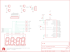

Contents
========

* [PRS11629 > Sparkfun](#prs11629--sparkfun)
	* [Schematic](#schematic)
	* [Interactive BOM](#interactive-bom)
	* [OOMP Parts](#oomp-parts)
	* [Images](#images)
	* [Tags](#tags)
  
![][im]
# PRS11629 > Sparkfun

- ID: PROJ-SPAR-11629-STAN-01
- Hex ID: PRS11629
- Name: Sparkfun
- Description: Sparkfun
- Long Link: [http://oom.lt/PROJ-SPAR-11629-STAN-01](http://oom.lt/PROJ-SPAR-11629-STAN-01)
- Short Link: [http://oom.lt/PRS11629](http://oom.lt/PRS11629)

## Schematic
  

## Interactive BOM

- Interactive BOM page: [ibom.html](https://htmlpreview.github.io/?https://github.com/oomlout/oomlout_OOMP_projects/blob/main/PROJ-SPAR-11629-STAN-01/kicad/bom/ibom.html)

## OOMP Parts
  

|OOMP Parts|
| :---: |
|ATMEGA328P-AU,UNMATCHED-UNMATCHED-UNMATCHED-UNMATCHED-UNMATCHED,ATMEGA328P-AU,ATMEGA328P-AU,ATMEGA168,TQFP32-08,,,|
|C1,UNMATCHED-UNMATCHED-UNMATCHED-UNMATCHED-UNMATCHED,C1,0.1uF,CAP0402-CAP,0402-CAP,Capacitor,,|
|C3,UNMATCHED-UNMATCHED-UNMATCHED-UNMATCHED-UNMATCHED,C3,0.1uF,CAP0402-CAP,0402-CAP,Capacitor,,|
|C4,UNMATCHED-UNMATCHED-UNMATCHED-UNMATCHED-UNMATCHED,C4,0.1uF,CAP0402-CAP,0402-CAP,Capacitor,,|
|JP1,UNMATCHED-UNMATCHED-UNMATCHED-UNMATCHED-UNMATCHED,JP1,STAND-OFF,STAND-OFF,STAND-OFF,#4 Stand Off,,|
|JP2,UNMATCHED-UNMATCHED-UNMATCHED-UNMATCHED-UNMATCHED,JP2,,M021X02_NO_SILK,1X02_NO_SILK,Header 2,,|
|JP3,UNMATCHED-UNMATCHED-UNMATCHED-UNMATCHED-UNMATCHED,JP3,STAND-OFF,STAND-OFF,STAND-OFF,#4 Stand Off,,|
|JP4,UNMATCHED-UNMATCHED-UNMATCHED-UNMATCHED-UNMATCHED,JP4,STAND-OFF,STAND-OFF,STAND-OFF,#4 Stand Off,,|
|JP5,UNMATCHED-UNMATCHED-UNMATCHED-UNMATCHED-UNMATCHED,JP5,STAND-OFF,STAND-OFF,STAND-OFF,#4 Stand Off,,|
|JP6,UNMATCHED-UNMATCHED-UNMATCHED-UNMATCHED-UNMATCHED,JP6,,M021X02_NO_SILK,1X02_NO_SILK,Header 2,,|
|JP7,UNMATCHED-UNMATCHED-UNMATCHED-UNMATCHED-UNMATCHED,JP7,,M021X02_NO_SILK,1X02_NO_SILK,Header 2,,|
|JP8,UNMATCHED-UNMATCHED-UNMATCHED-UNMATCHED-UNMATCHED,JP8,,M021X02_NO_SILK,1X02_NO_SILK,Header 2,,|
|JP11,UNMATCHED-UNMATCHED-UNMATCHED-UNMATCHED-UNMATCHED,JP9,FIDUCIALUFIDUCIAL,FIDUCIALUFIDUCIAL,MICRO-FIDUCIAL,Fiducial Alignment Points,,|
|JP12,UNMATCHED-UNMATCHED-UNMATCHED-UNMATCHED-UNMATCHED,JP10,FIDUCIALUFIDUCIAL,FIDUCIALUFIDUCIAL,MICRO-FIDUCIAL,Fiducial Alignment Points,,|
|LED1,UNMATCHED-UNMATCHED-UNMATCHED-UNMATCHED-UNMATCHED,JP11,,M05PTH-NS,1X05_NO_SILK,Header 5,,|
|R1,UNMATCHED-UNMATCHED-UNMATCHED-UNMATCHED-UNMATCHED,JP12,M10SIP_NS,M10SIP_NS,1X10_NO_SILK,Header 10,,|
|R2,UNMATCHED-UNMATCHED-UNMATCHED-UNMATCHED-UNMATCHED,LED1,7-SEGMENT-4DIGIT-YOUNGSUN,7-SEGMENT-4DIGIT-YOUNGSUN,7-SEGMENT-4DIGIT-YOUNGSUN,This is a part for the 4-Digit 7-segment LEDs from Young Sun.  Different from the Digikey LEDs, all 16 pins are used.,,|
|R3,UNMATCHED-UNMATCHED-UNMATCHED-UNMATCHED-UNMATCHED,R1,10k,RESISTOR0402-RES,0402-RES,Resistor,,|
|R4,UNMATCHED-UNMATCHED-UNMATCHED-UNMATCHED-UNMATCHED,R2,1k,RESISTOR0402-RES,0402-RES,Resistor,,|
|R6,UNMATCHED-UNMATCHED-UNMATCHED-UNMATCHED-UNMATCHED,R3,1k,RESISTOR0402-RES,0402-RES,Resistor,,|
|R7,UNMATCHED-UNMATCHED-UNMATCHED-UNMATCHED-UNMATCHED,R4,1k,RESISTOR0402-RES,0402-RES,Resistor,,|
|R8,UNMATCHED-UNMATCHED-UNMATCHED-UNMATCHED-UNMATCHED,R6,1k,RESISTOR0402-RES,0402-RES,Resistor,,|
|R9,UNMATCHED-UNMATCHED-UNMATCHED-UNMATCHED-UNMATCHED,R7,1k,RESISTOR0402-RES,0402-RES,Resistor,,|
|R10,UNMATCHED-UNMATCHED-UNMATCHED-UNMATCHED-UNMATCHED,R8,1k,RESISTOR0402-RES,0402-RES,Resistor,,|
|U$1,UNMATCHED-UNMATCHED-UNMATCHED-UNMATCHED-UNMATCHED,R9,1k,RESISTOR0402-RES,0402-RES,Resistor,,|
|U$2,UNMATCHED-UNMATCHED-UNMATCHED-UNMATCHED-UNMATCHED,R10,1k,RESISTOR0402-RES,0402-RES,Resistor,,|
|U$4,UNMATCHED-UNMATCHED-UNMATCHED-UNMATCHED-UNMATCHED,U$1,CREATIVE_COMMONS,CREATIVE_COMMONS,CREATIVE_COMMONS,,,|

## Images
  
  

|kicadPcb3d|kicadPcb3dFront|kicadPcb3dBack|eagleImage|eagleSchemImage|
| :---: | :---: | :---: | :---: | :---: |
||||||

## Tags

- hexID: PRS11629
- oompType: PROJ
- oompSize: SPAR
- oompColor: 11629
- oompDesc: STAN
- oompIndex: 01
- oompName: Serial7SegmentDisplay
- sources: All source files from https://github.com/sparkfun/Serial7SegmentDisplay (source licence details in srcLicense.md)
- linkBuyPage: https://www.sparkfun.com/products/11629
- oompID: PROJ-SPAR-11629-STAN-01
- oompParts: ATMEGA328P-AU,UNMATCHED-UNMATCHED-UNMATCHED-UNMATCHED-UNMATCHED
- oompParts: C1,UNMATCHED-UNMATCHED-UNMATCHED-UNMATCHED-UNMATCHED
- oompParts: C3,UNMATCHED-UNMATCHED-UNMATCHED-UNMATCHED-UNMATCHED
- oompParts: C4,UNMATCHED-UNMATCHED-UNMATCHED-UNMATCHED-UNMATCHED
- oompParts: JP1,UNMATCHED-UNMATCHED-UNMATCHED-UNMATCHED-UNMATCHED
- oompParts: JP2,UNMATCHED-UNMATCHED-UNMATCHED-UNMATCHED-UNMATCHED
- oompParts: JP3,UNMATCHED-UNMATCHED-UNMATCHED-UNMATCHED-UNMATCHED
- oompParts: JP4,UNMATCHED-UNMATCHED-UNMATCHED-UNMATCHED-UNMATCHED
- oompParts: JP5,UNMATCHED-UNMATCHED-UNMATCHED-UNMATCHED-UNMATCHED
- oompParts: JP6,UNMATCHED-UNMATCHED-UNMATCHED-UNMATCHED-UNMATCHED
- oompParts: JP7,UNMATCHED-UNMATCHED-UNMATCHED-UNMATCHED-UNMATCHED
- oompParts: JP8,UNMATCHED-UNMATCHED-UNMATCHED-UNMATCHED-UNMATCHED
- oompParts: JP11,UNMATCHED-UNMATCHED-UNMATCHED-UNMATCHED-UNMATCHED
- oompParts: JP12,UNMATCHED-UNMATCHED-UNMATCHED-UNMATCHED-UNMATCHED
- oompParts: LED1,UNMATCHED-UNMATCHED-UNMATCHED-UNMATCHED-UNMATCHED
- oompParts: R1,UNMATCHED-UNMATCHED-UNMATCHED-UNMATCHED-UNMATCHED
- oompParts: R2,UNMATCHED-UNMATCHED-UNMATCHED-UNMATCHED-UNMATCHED
- oompParts: R3,UNMATCHED-UNMATCHED-UNMATCHED-UNMATCHED-UNMATCHED
- oompParts: R4,UNMATCHED-UNMATCHED-UNMATCHED-UNMATCHED-UNMATCHED
- oompParts: R6,UNMATCHED-UNMATCHED-UNMATCHED-UNMATCHED-UNMATCHED
- oompParts: R7,UNMATCHED-UNMATCHED-UNMATCHED-UNMATCHED-UNMATCHED
- oompParts: R8,UNMATCHED-UNMATCHED-UNMATCHED-UNMATCHED-UNMATCHED
- oompParts: R9,UNMATCHED-UNMATCHED-UNMATCHED-UNMATCHED-UNMATCHED
- oompParts: R10,UNMATCHED-UNMATCHED-UNMATCHED-UNMATCHED-UNMATCHED
- oompParts: U$1,UNMATCHED-UNMATCHED-UNMATCHED-UNMATCHED-UNMATCHED
- oompParts: U$2,UNMATCHED-UNMATCHED-UNMATCHED-UNMATCHED-UNMATCHED
- oompParts: U$4,UNMATCHED-UNMATCHED-UNMATCHED-UNMATCHED-UNMATCHED
- rawParts: ATMEGA328P-AU,ATMEGA328P-AU,ATMEGA168,TQFP32-08,,,
- rawParts: C1,0.1uF,CAP0402-CAP,0402-CAP,Capacitor,,
- rawParts: C3,0.1uF,CAP0402-CAP,0402-CAP,Capacitor,,
- rawParts: C4,0.1uF,CAP0402-CAP,0402-CAP,Capacitor,,
- rawParts: JP1,STAND-OFF,STAND-OFF,STAND-OFF,#4 Stand Off,,
- rawParts: JP2,,M021X02_NO_SILK,1X02_NO_SILK,Header 2,,
- rawParts: JP3,STAND-OFF,STAND-OFF,STAND-OFF,#4 Stand Off,,
- rawParts: JP4,STAND-OFF,STAND-OFF,STAND-OFF,#4 Stand Off,,
- rawParts: JP5,STAND-OFF,STAND-OFF,STAND-OFF,#4 Stand Off,,
- rawParts: JP6,,M021X02_NO_SILK,1X02_NO_SILK,Header 2,,
- rawParts: JP7,,M021X02_NO_SILK,1X02_NO_SILK,Header 2,,
- rawParts: JP8,,M021X02_NO_SILK,1X02_NO_SILK,Header 2,,
- rawParts: JP9,FIDUCIALUFIDUCIAL,FIDUCIALUFIDUCIAL,MICRO-FIDUCIAL,Fiducial Alignment Points,,
- rawParts: JP10,FIDUCIALUFIDUCIAL,FIDUCIALUFIDUCIAL,MICRO-FIDUCIAL,Fiducial Alignment Points,,
- rawParts: JP11,,M05PTH-NS,1X05_NO_SILK,Header 5,,
- rawParts: JP12,M10SIP_NS,M10SIP_NS,1X10_NO_SILK,Header 10,,
- rawParts: LED1,7-SEGMENT-4DIGIT-YOUNGSUN,7-SEGMENT-4DIGIT-YOUNGSUN,7-SEGMENT-4DIGIT-YOUNGSUN,This is a part for the 4-Digit 7-segment LEDs from Young Sun.  Different from the Digikey LEDs, all 16 pins are used.,,
- rawParts: R1,10k,RESISTOR0402-RES,0402-RES,Resistor,,
- rawParts: R2,1k,RESISTOR0402-RES,0402-RES,Resistor,,
- rawParts: R3,1k,RESISTOR0402-RES,0402-RES,Resistor,,
- rawParts: R4,1k,RESISTOR0402-RES,0402-RES,Resistor,,
- rawParts: R6,1k,RESISTOR0402-RES,0402-RES,Resistor,,
- rawParts: R7,1k,RESISTOR0402-RES,0402-RES,Resistor,,
- rawParts: R8,1k,RESISTOR0402-RES,0402-RES,Resistor,,
- rawParts: R9,1k,RESISTOR0402-RES,0402-RES,Resistor,,
- rawParts: R10,1k,RESISTOR0402-RES,0402-RES,Resistor,,
- rawParts: U$1,CREATIVE_COMMONS,CREATIVE_COMMONS,CREATIVE_COMMONS,,,
- rawParts: U$2,LOGO-SFESK,LOGO-SFESK,SFE-LOGO-FLAME,Spark Fun Electronics PCB Logo,,
- rawParts: U$4,OSHW-LOGOS,OSHW-LOGOS,OSHW-LOGO-S,Open Source Hardware Logo This logo indicates the piece of hardware it is found on incorporates a OSHW license and/or adheres to the definition of open source hardware found here: http://freedomdefined.org/OSHW,,

[im]: kicadPcb3d_450.png
