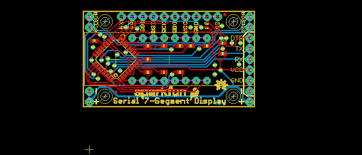
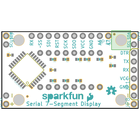
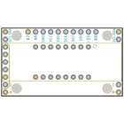
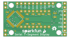
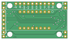

Contents
========

* [PRS11629 > Serial7SegmentDisplay](#prs11629--serial7segmentdisplay)
	* [Schematic](#schematic)
	* [PCB](#pcb)
	* [Interactive BOM](#interactive-bom)
	* [OOMP Parts](#oomp-parts)
	* [Images](#images)
	* [Tags](#tags)
  
![][im]
# PRS11629 > Serial7SegmentDisplay

- ID: PROJ-SPAR-11629-STAN-01
- Hex ID: PRS11629
- Name: Sparkfun
- Description: Sparkfun
- Long Link: [http://oom.lt/PROJ-SPAR-11629-STAN-01](http://oom.lt/PROJ-SPAR-11629-STAN-01)
- Short Link: [http://oom.lt/PRS11629](http://oom.lt/PRS11629)

## Schematic
  

## PCB
  

## Interactive BOM

- Interactive BOM page: [ibom.html](https://htmlpreview.github.io/?https://github.com/oomlout/oomlout_OOMP_projects/blob/main/PROJ-SPAR-11629-STAN-01/kicad/bom/ibom.html)

## OOMP Parts
  

|OOMP ID|Name|Identifier|
| :---: | :---: | :---: |
|UNMATCHED-UNMATCHED-X-UNMATCHED-01||ATMEGA328P-AU|
|[CAPC-0402-X-NF100-V10](https://github.com/oomlout/oomlout_OOMP_parts/tree/main/CAPC-0402-X-NF100-V10/)|[SMD (0402) 100 nF Capacitor (Ceramic) 10v](https://github.com/oomlout/oomlout_OOMP_parts/tree/main/CAPC-0402-X-NF100-V10/)|[C1, C3, C4](https://github.com/oomlout/oomlout_OOMP_parts/tree/main/CAPC-0402-X-NF100-V10/)|
|[HEAD-I01-X-PI02-01](https://github.com/oomlout/oomlout_OOMP_parts/tree/main/HEAD-I01-X-PI02-01/)|[2.54 mm 2 Pin Header](https://github.com/oomlout/oomlout_OOMP_parts/tree/main/HEAD-I01-X-PI02-01/)|[JP2, JP6, JP7, JP8](https://github.com/oomlout/oomlout_OOMP_parts/tree/main/HEAD-I01-X-PI02-01/)|
|[HEAD-I01-X-PI05-01](https://github.com/oomlout/oomlout_OOMP_parts/tree/main/HEAD-I01-X-PI05-01/)|[2.54 mm 5 Pin Header](https://github.com/oomlout/oomlout_OOMP_parts/tree/main/HEAD-I01-X-PI05-01/)|[JP11](https://github.com/oomlout/oomlout_OOMP_parts/tree/main/HEAD-I01-X-PI05-01/)|
|[HEAD-I01-X-PI10-01](https://github.com/oomlout/oomlout_OOMP_parts/tree/main/HEAD-I01-X-PI10-01/)|[2.54 mm 10 Pin Header](https://github.com/oomlout/oomlout_OOMP_parts/tree/main/HEAD-I01-X-PI10-01/)|[JP12](https://github.com/oomlout/oomlout_OOMP_parts/tree/main/HEAD-I01-X-PI10-01/)|
|LEDS-UNMATCHED-G-STAN-01||LED1|
|[RESE-0402-X-O103-01](https://github.com/oomlout/oomlout_OOMP_parts/tree/main/RESE-0402-X-O103-01/)|[SMD (0402) 10k Ohm Resistor](https://github.com/oomlout/oomlout_OOMP_parts/tree/main/RESE-0402-X-O103-01/)|[R1](https://github.com/oomlout/oomlout_OOMP_parts/tree/main/RESE-0402-X-O103-01/)|
|[RESE-0402-X-O102-01](https://github.com/oomlout/oomlout_OOMP_parts/tree/main/RESE-0402-X-O102-01/)|[SMD (0402) 1k Ohm Resistor](https://github.com/oomlout/oomlout_OOMP_parts/tree/main/RESE-0402-X-O102-01/)|[R2, R3, R4, R6, R7, R8, R9, R10](https://github.com/oomlout/oomlout_OOMP_parts/tree/main/RESE-0402-X-O102-01/)|

## Images
  
  

|bominteractivefront|bominteractiveback|kicadPcb3d|kicadPcb3dFront|kicadPcb3dBack|eagleImage|eagleSchemImage|pcbdraw|pcbdrawback|
| :---: | :---: | :---: | :---: | :---: | :---: | :---: | :---: | :---: |
||||||||||

## Tags

- hexID: PRS11629
- oompType: PROJ
- oompSize: SPAR
- oompColor: 11629
- oompDesc: STAN
- oompIndex: 01
- oompName: Serial7SegmentDisplay
- sources: All source files from https://github.com/sparkfun/Serial7SegmentDisplay (source licence details in srcLicense.md)
- linkBuyPage: https://www.sparkfun.com/products/11629
- oompID: PROJ-SPAR-11629-STAN-01
- oompParts: ATMEGA328P-AU,UNMATCHED-UNMATCHED-X-UNMATCHED-01
- oompParts: C1,CAPC-0402-X-NF100-V10
- oompParts: C3,CAPC-0402-X-NF100-V10
- oompParts: C4,CAPC-0402-X-NF100-V10
- oompParts: JP2,HEAD-I01-X-PI02-01
- oompParts: JP6,HEAD-I01-X-PI02-01
- oompParts: JP7,HEAD-I01-X-PI02-01
- oompParts: JP8,HEAD-I01-X-PI02-01
- oompParts: JP11,HEAD-I01-X-PI05-01
- oompParts: JP12,HEAD-I01-X-PI10-01
- oompParts: LED1,LEDS-UNMATCHED-G-STAN-01
- oompParts: R1,RESE-0402-X-O103-01
- oompParts: R2,RESE-0402-X-O102-01
- oompParts: R3,RESE-0402-X-O102-01
- oompParts: R4,RESE-0402-X-O102-01
- oompParts: R6,RESE-0402-X-O102-01
- oompParts: R7,RESE-0402-X-O102-01
- oompParts: R8,RESE-0402-X-O102-01
- oompParts: R9,RESE-0402-X-O102-01
- oompParts: R10,RESE-0402-X-O102-01
- rawParts: ATMEGA328P-AU,ATMEGA328P-AU,ATMEGA168,TQFP32-08,,,
- rawParts: C1,0.1uF,CAP0402-CAP,0402-CAP,Capacitor,,
- rawParts: C3,0.1uF,CAP0402-CAP,0402-CAP,Capacitor,,
- rawParts: C4,0.1uF,CAP0402-CAP,0402-CAP,Capacitor,,
- rawParts: JP1,STAND-OFF,STAND-OFF,STAND-OFF,#4 Stand Off,,
- rawParts: JP2,,M021X02_NO_SILK,1X02_NO_SILK,Header 2,,
- rawParts: JP3,STAND-OFF,STAND-OFF,STAND-OFF,#4 Stand Off,,
- rawParts: JP4,STAND-OFF,STAND-OFF,STAND-OFF,#4 Stand Off,,
- rawParts: JP5,STAND-OFF,STAND-OFF,STAND-OFF,#4 Stand Off,,
- rawParts: JP6,,M021X02_NO_SILK,1X02_NO_SILK,Header 2,,
- rawParts: JP7,,M021X02_NO_SILK,1X02_NO_SILK,Header 2,,
- rawParts: JP8,,M021X02_NO_SILK,1X02_NO_SILK,Header 2,,
- rawParts: JP9,FIDUCIALUFIDUCIAL,FIDUCIALUFIDUCIAL,MICRO-FIDUCIAL,Fiducial Alignment Points,,
- rawParts: JP10,FIDUCIALUFIDUCIAL,FIDUCIALUFIDUCIAL,MICRO-FIDUCIAL,Fiducial Alignment Points,,
- rawParts: JP11,,M05PTH-NS,1X05_NO_SILK,Header 5,,
- rawParts: JP12,M10SIP_NS,M10SIP_NS,1X10_NO_SILK,Header 10,,
- rawParts: LED1,7-SEGMENT-4DIGIT-YOUNGSUN,7-SEGMENT-4DIGIT-YOUNGSUN,7-SEGMENT-4DIGIT-YOUNGSUN,This is a part for the 4-Digit 7-segment LEDs from Young Sun.  Different from the Digikey LEDs, all 16 pins are used.,,
- rawParts: R1,10k,RESISTOR0402-RES,0402-RES,Resistor,,
- rawParts: R2,1k,RESISTOR0402-RES,0402-RES,Resistor,,
- rawParts: R3,1k,RESISTOR0402-RES,0402-RES,Resistor,,
- rawParts: R4,1k,RESISTOR0402-RES,0402-RES,Resistor,,
- rawParts: R6,1k,RESISTOR0402-RES,0402-RES,Resistor,,
- rawParts: R7,1k,RESISTOR0402-RES,0402-RES,Resistor,,
- rawParts: R8,1k,RESISTOR0402-RES,0402-RES,Resistor,,
- rawParts: R9,1k,RESISTOR0402-RES,0402-RES,Resistor,,
- rawParts: R10,1k,RESISTOR0402-RES,0402-RES,Resistor,,
- rawParts: U$1,CREATIVE_COMMONS,CREATIVE_COMMONS,CREATIVE_COMMONS,,,
- rawParts: U$2,LOGO-SFESK,LOGO-SFESK,SFE-LOGO-FLAME,Spark Fun Electronics PCB Logo,,
- rawParts: U$4,OSHW-LOGOS,OSHW-LOGOS,OSHW-LOGO-S,Open Source Hardware Logo This logo indicates the piece of hardware it is found on incorporates a OSHW license and/or adheres to the definition of open source hardware found here: http://freedomdefined.org/OSHW,,

[im]: kicadPcb3d_450.png
