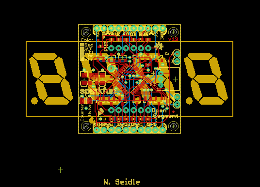
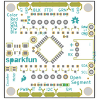
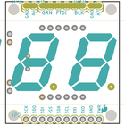
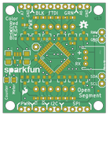
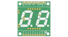

Contents
========

* [PRS11645 > OpenSegment](#prs11645--opensegment)
	* [Schematic](#schematic)
	* [PCB](#pcb)
	* [Interactive BOM](#interactive-bom)
	* [OOMP Parts](#oomp-parts)
	* [Images](#images)
	* [Tags](#tags)
  
![][im]
# PRS11645 > OpenSegment

- ID: PROJ-SPAR-11645-STAN-01
- Hex ID: PRS11645
- Name: Sparkfun
- Description: Sparkfun
- Long Link: [http://oom.lt/PROJ-SPAR-11645-STAN-01](http://oom.lt/PROJ-SPAR-11645-STAN-01)
- Short Link: [http://oom.lt/PRS11645](http://oom.lt/PRS11645)

## Schematic
  

## PCB
  

## Interactive BOM

- Interactive BOM page: [ibom.html](https://htmlpreview.github.io/?https://github.com/oomlout/oomlout_OOMP_projects/blob/main/PROJ-SPAR-11645-STAN-01/kicad/bom/ibom.html)

## OOMP Parts
  

|OOMP ID|Name|Identifier|
| :---: | :---: | :---: |
|[CAPC-0402-X-NF100-V10](https://github.com/oomlout/oomlout_OOMP_parts/tree/main/CAPC-0402-X-NF100-V10/)|[SMD (0402) 100 nF Capacitor (Ceramic) 10v](https://github.com/oomlout/oomlout_OOMP_parts/tree/main/CAPC-0402-X-NF100-V10/)|[C1, C3, C4](https://github.com/oomlout/oomlout_OOMP_parts/tree/main/CAPC-0402-X-NF100-V10/)|
|[CAPC-0402-X-UF1-V63D](https://github.com/oomlout/oomlout_OOMP_parts/tree/main/CAPC-0402-X-UF1-V63D/)|[SMD (0402) 1 uF Capacitor (Ceramic) 6.3v](https://github.com/oomlout/oomlout_OOMP_parts/tree/main/CAPC-0402-X-UF1-V63D/)|[C10](https://github.com/oomlout/oomlout_OOMP_parts/tree/main/CAPC-0402-X-UF1-V63D/)|
|CAPT-3216-X-UF10-01||C13, C19|
|UNMATCHED-UNMATCHED-X-UNMATCHED-01||JP1, U2, U3|
|[HEAD-I01-X-PI10-01](https://github.com/oomlout/oomlout_OOMP_parts/tree/main/HEAD-I01-X-PI10-01/)|[2.54 mm 10 Pin Header](https://github.com/oomlout/oomlout_OOMP_parts/tree/main/HEAD-I01-X-PI10-01/)|[JP2](https://github.com/oomlout/oomlout_OOMP_parts/tree/main/HEAD-I01-X-PI10-01/)|
|HEAD-I01-X-PI01-01||JP8|
|[HEAD-I01-X-PI02-01](https://github.com/oomlout/oomlout_OOMP_parts/tree/main/HEAD-I01-X-PI02-01/)|[2.54 mm 2 Pin Header](https://github.com/oomlout/oomlout_OOMP_parts/tree/main/HEAD-I01-X-PI02-01/)|[JP9, JP10, JP12, JP13](https://github.com/oomlout/oomlout_OOMP_parts/tree/main/HEAD-I01-X-PI02-01/)|
|HEAD-I01-X-UNMATCHED-01||JP11|
|[LEDS-0603-R-STAN-01](https://github.com/oomlout/oomlout_OOMP_parts/tree/main/LEDS-0603-R-STAN-01/)|[SMD (0603) Red LED](https://github.com/oomlout/oomlout_OOMP_parts/tree/main/LEDS-0603-R-STAN-01/)|[LED1](https://github.com/oomlout/oomlout_OOMP_parts/tree/main/LEDS-0603-R-STAN-01/)|
|UNMATCHED-SO23-X-UNMATCHED-01||Q1, Q2, Q3, Q4, Q5, Q6, Q7, Q8, Q9, Q10, Q11, Q12|
|[RESE-0402-X-O103-01](https://github.com/oomlout/oomlout_OOMP_parts/tree/main/RESE-0402-X-O103-01/)|[SMD (0402) 10k Ohm Resistor](https://github.com/oomlout/oomlout_OOMP_parts/tree/main/RESE-0402-X-O103-01/)|[R1](https://github.com/oomlout/oomlout_OOMP_parts/tree/main/RESE-0402-X-O103-01/)|
|RESE-0402-X-UNMATCHED-01||R2, R3, R4, R5, R6, R7, R8, R9|
|RESE-0402-X-O331-01||R11|
|UNMATCHED-SO235-X-UNMATCHED-01||U1|

## Images
  
  

|bominteractivefront|bominteractiveback|kicadPcb3d|kicadPcb3dFront|kicadPcb3dBack|eagleImage|eagleSchemImage|pcbdraw|pcbdrawback|
| :---: | :---: | :---: | :---: | :---: | :---: | :---: | :---: | :---: |
||||||||||

## Tags

- hexID: PRS11645
- oompType: PROJ
- oompSize: SPAR
- oompColor: 11645
- oompDesc: STAN
- oompIndex: 01
- oompName: OpenSegment
- sources: All source files from https://github.com/sparkfun/OpenSegment (source licence details in srcLicense.md)
- linkBuyPage: https://www.sparkfun.com/products/11645
- oompID: PROJ-SPAR-11645-STAN-01
- oompParts: C1,CAPC-0402-X-NF100-V10
- oompParts: C3,CAPC-0402-X-NF100-V10
- oompParts: C4,CAPC-0402-X-NF100-V10
- oompParts: C10,CAPC-0402-X-UF1-V63D
- oompParts: C13,CAPT-3216-X-UF10-01
- oompParts: C19,CAPT-3216-X-UF10-01
- oompParts: JP1,UNMATCHED-UNMATCHED-X-UNMATCHED-01
- oompParts: JP2,HEAD-I01-X-PI10-01
- oompParts: JP8,HEAD-I01-X-PI01-01
- oompParts: JP9,HEAD-I01-X-PI02-01
- oompParts: JP10,HEAD-I01-X-PI02-01
- oompParts: JP11,HEAD-I01-X-UNMATCHED-01
- oompParts: JP12,HEAD-I01-X-PI02-01
- oompParts: JP13,HEAD-I01-X-PI02-01
- oompParts: LED1,LEDS-0603-R-STAN-01
- oompParts: Q1,UNMATCHED-SO23-X-UNMATCHED-01
- oompParts: Q2,UNMATCHED-SO23-X-UNMATCHED-01
- oompParts: Q3,UNMATCHED-SO23-X-UNMATCHED-01
- oompParts: Q4,UNMATCHED-SO23-X-UNMATCHED-01
- oompParts: Q5,UNMATCHED-SO23-X-UNMATCHED-01
- oompParts: Q6,UNMATCHED-SO23-X-UNMATCHED-01
- oompParts: Q7,UNMATCHED-SO23-X-UNMATCHED-01
- oompParts: Q8,UNMATCHED-SO23-X-UNMATCHED-01
- oompParts: Q9,UNMATCHED-SO23-X-UNMATCHED-01
- oompParts: Q10,UNMATCHED-SO23-X-UNMATCHED-01
- oompParts: Q11,UNMATCHED-SO23-X-UNMATCHED-01
- oompParts: Q12,UNMATCHED-SO23-X-UNMATCHED-01
- oompParts: R1,RESE-0402-X-O103-01
- oompParts: R2,RESE-0402-X-UNMATCHED-01
- oompParts: R3,RESE-0402-X-UNMATCHED-01
- oompParts: R4,RESE-0402-X-UNMATCHED-01
- oompParts: R5,RESE-0402-X-UNMATCHED-01
- oompParts: R6,RESE-0402-X-UNMATCHED-01
- oompParts: R7,RESE-0402-X-UNMATCHED-01
- oompParts: R8,RESE-0402-X-UNMATCHED-01
- oompParts: R9,RESE-0402-X-UNMATCHED-01
- oompParts: R11,RESE-0402-X-O331-01
- oompParts: U1,UNMATCHED-SO235-X-UNMATCHED-01
- oompParts: U2,UNMATCHED-UNMATCHED-X-UNMATCHED-01
- oompParts: U3,UNMATCHED-UNMATCHED-X-UNMATCHED-01
- rawParts: C1,0.1uF,CAP0402-CAP,0402-CAP,Capacitor,,
- rawParts: C3,0.1uF,CAP0402-CAP,0402-CAP,Capacitor,,
- rawParts: C4,0.1uF,CAP0402-CAP,0402-CAP,Capacitor,,
- rawParts: C10,1uF,CAP0402-CAP,0402-CAP,Capacitor,,
- rawParts: C13,10uF,CAP_POL1206,EIA3216,Capacitor Polarized,,
- rawParts: C19,10uF,CAP_POL1206,EIA3216,Capacitor Polarized,,
- rawParts: JP1,FTDI_BASIC,FTDI_BASICPTH,FTDI_BASIC,FTDI Basic: 3.3V and 5V,,
- rawParts: JP2,Connections,M10,1X10,Header 10,,
- rawParts: JP3,STAND-OFF,STAND-OFF,STAND-OFF,#4 Stand Off,,
- rawParts: JP4,STAND-OFF,STAND-OFF,STAND-OFF,#4 Stand Off,,
- rawParts: JP5,STAND-OFF,STAND-OFF,STAND-OFF,#4 Stand Off,,
- rawParts: JP6,STAND-OFF,STAND-OFF,STAND-OFF,#4 Stand Off,,
- rawParts: JP7,FIDUCIALUFIDUCIAL,FIDUCIALUFIDUCIAL,MICRO-FIDUCIAL,Fiducial Alignment Points,,
- rawParts: JP8,RESET,M01PTH,1X01,Header 1,,
- rawParts: JP9,,M02PTH,1X02,Header 2,,
- rawParts: JP10,,M02PTH,1X02,Header 2,,
- rawParts: JP11,Serial,M03JST-PTH,JST-3-PTH,Header 3,,
- rawParts: JP12,,M02PTH,1X02,Header 2,,
- rawParts: JP13,,M02PTH,1X02,Header 2,,
- rawParts: JP14,FIDUCIALUFIDUCIAL,FIDUCIALUFIDUCIAL,MICRO-FIDUCIAL,Fiducial Alignment Points,,
- rawParts: LED1,Red,LED0603,LED-0603,LEDs,,
- rawParts: Q1,PNP,TRANSISTOR_PNPSMD,SOT23-3,Generic PNP BJT. Double check pinouts against datasheets- not all devices are the same!,,
- rawParts: Q2,PNP,TRANSISTOR_PNPSMD,SOT23-3,Generic PNP BJT. Double check pinouts against datasheets- not all devices are the same!,,
- rawParts: Q3,PNP,TRANSISTOR_PNPSMD,SOT23-3,Generic PNP BJT. Double check pinouts against datasheets- not all devices are the same!,,
- rawParts: Q4,PNP,TRANSISTOR_PNPSMD,SOT23-3,Generic PNP BJT. Double check pinouts against datasheets- not all devices are the same!,,
- rawParts: Q5,PNP,TRANSISTOR_PNPSMD,SOT23-3,Generic PNP BJT. Double check pinouts against datasheets- not all devices are the same!,,
- rawParts: Q6,PNP,TRANSISTOR_PNPSMD,SOT23-3,Generic PNP BJT. Double check pinouts against datasheets- not all devices are the same!,,
- rawParts: Q7,PNP,TRANSISTOR_PNPSMD,SOT23-3,Generic PNP BJT. Double check pinouts against datasheets- not all devices are the same!,,
- rawParts: Q8,PNP,TRANSISTOR_PNPSMD,SOT23-3,Generic PNP BJT. Double check pinouts against datasheets- not all devices are the same!,,
- rawParts: Q9,MMBT2222,TRANSISTOR_NPNSOT23-3,SOT23-3,Generic NPN BJT. MMBT2222 is the common NPN we use. Double check against datasheet- not all devices are the same!,,
- rawParts: Q10,MMBT2222,TRANSISTOR_NPNSOT23-3,SOT23-3,Generic NPN BJT. MMBT2222 is the common NPN we use. Double check against datasheet- not all devices are the same!,,
- rawParts: Q11,MMBT2222,TRANSISTOR_NPNSOT23-3,SOT23-3,Generic NPN BJT. MMBT2222 is the common NPN we use. Double check against datasheet- not all devices are the same!,,
- rawParts: Q12,MMBT2222,TRANSISTOR_NPNSOT23-3,SOT23-3,Generic NPN BJT. MMBT2222 is the common NPN we use. Double check against datasheet- not all devices are the same!,,
- rawParts: R1,10k,RESISTOR0402-RES,0402-RES,Resistor,,
- rawParts: R2,33/68,RESISTOR0402-RES,0402-RES,Resistor,,
- rawParts: R3,33/68,RESISTOR0402-RES,0402-RES,Resistor,,
- rawParts: R4,33/68,RESISTOR0402-RES,0402-RES,Resistor,,
- rawParts: R5,33/68,RESISTOR0402-RES,0402-RES,Resistor,,
- rawParts: R6,33/68,RESISTOR0402-RES,0402-RES,Resistor,,
- rawParts: R7,33/68,RESISTOR0402-RES,0402-RES,Resistor,,
- rawParts: R8,33/68,RESISTOR0402-RES,0402-RES,Resistor,,
- rawParts: R9,33/68,RESISTOR0402-RES,0402-RES,Resistor,,
- rawParts: R11,330,RESISTOR0402-RES,0402-RES,Resistor,,
- rawParts: SJ1,Counter Ctl,SOLDERJUMPERNO,SJ_2S-NO,Solder Jumper,,
- rawParts: SJ2,Counter Ctl,SOLDERJUMPERNO,SJ_2S-NO,Solder Jumper,,
- rawParts: U$2,LOGO-SFESK,LOGO-SFESK,SFE-LOGO-FLAME,Spark Fun Electronics PCB Logo,,
- rawParts: U$3,CREATIVE_COMMONS,CREATIVE_COMMONS,CREATIVE_COMMONS,,,
- rawParts: U$4,OSHW-LOGOS,OSHW-LOGOS,OSHW-LOGO-S,Open Source Hardware Logo This logo indicates the piece of hardware it is found on incorporates a OSHW license and/or adheres to the definition of open source hardware found here: http://freedomdefined.org/OSHW,,
- rawParts: U$7,LOGO-SFENW2,LOGO-SFENW2,SFE-NEW-WEB,Spark Fun Electronics PCB Logo,,
- rawParts: U1,MIC5219,V_REG_LDOSMD,SOT23-5,Voltage Regulator LDO,,
- rawParts: U2,ATMEGA328,ATMEGA168,TQFP32-08,Atmel 32-pin 8-bit micro, 16k flash.,,
- rawParts: U3,7-SEGMENT-4DIGIT-COUNTERPTH,7-SEGMENT-4DIGIT-COUNTERPTH,7-SEGMENT-4DIGIT-COUNTER,,,

[im]: kicadPcb3d_450.png
