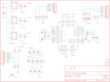

Contents
========

* [PRS11684 > Sparkfun](#prs11684--sparkfun)
	* [Schematic](#schematic)
	* [Interactive BOM](#interactive-bom)
	* [OOMP Parts](#oomp-parts)
	* [Images](#images)
	* [Tags](#tags)
  
![][im]
# PRS11684 > Sparkfun

- ID: PROJ-SPAR-11684-STAN-01
- Hex ID: PRS11684
- Name: Sparkfun
- Description: Sparkfun
- Long Link: [http://oom.lt/PROJ-SPAR-11684-STAN-01](http://oom.lt/PROJ-SPAR-11684-STAN-01)
- Short Link: [http://oom.lt/PRS11684](http://oom.lt/PRS11684)

## Schematic
  

## Interactive BOM

- Interactive BOM page: [ibom.html](https://htmlpreview.github.io/?https://github.com/oomlout/oomlout_OOMP_projects/blob/main/PROJ-SPAR-11684-STAN-01/kicad/bom/ibom.html)

## OOMP Parts
  

|OOMP Parts|
| :---: |
|C1,CAPX-UNMATCHED-X-UF10-01,C1,10uF,CAP_POL1206,EIA3216,Capacitor Polarized,,|
|C2,CAPC-0402-X-NF100-01,C2,0.1uF,CAP0402-CAP,0402-CAP,Capacitor,,|
|C3,CAPC-0402-X-UNMATCHED-01,C3,18pF,CAP0402-CAP,0402-CAP,Capacitor,,|
|C4,CAPX-UNMATCHED-X-UF10-01,C4,10uF,CAP_POL1206,EIA3216,Capacitor Polarized,,|
|C5,CAPC-0402-X-NF100-01,C5,0.1uF,CAP0402-CAP,0402-CAP,Capacitor,,|
|C6,CAPX-UNMATCHED-X-UF10-01,C6,10uF,CAP_POL1206,EIA3216,Capacitor Polarized,,|
|C7,CAPC-0402-X-NF100-01,C7,0.1uF,CAP0402-CAP,0402-CAP,Capacitor,,|
|C8,CAPC-0402-X-UNMATCHED-01,C8,18pF,CAP0402-CAP,0402-CAP,Capacitor,,|
|C9,CAPC-0402-X-NF100-01,C9,0.1uF,CAP0402-CAP,0402-CAP,Capacitor,,|
|C10,CAPC-0402-X-UNMATCHED-01,C10,10nF,CAP0402-CAP,0402-CAP,Capacitor,,|
|C11,CAPC-0402-X-UNMATCHED-01,C11,47nF,CAP0402-CAP,0402-CAP,Capacitor,,|
|C12,CAPC-0402-X-UNMATCHED-01,C12,10nF,CAP0402-CAP,0402-CAP,Capacitor,,|
|C13,CAPC-0402-X-UNMATCHED-01,C13,100nF,CAP0402-CAP,0402-CAP,Capacitor,,|
|C14,CAPC-0402-X-UNMATCHED-01,C14,100nF,CAP0402-CAP,0402-CAP,Capacitor,,|
|C15,CAPC-0402-X-UNMATCHED-01,C15,100nF,CAP0402-CAP,0402-CAP,Capacitor,,|
|C16,CAPC-0402-X-UNMATCHED-01,C16,100nF,CAP0402-CAP,0402-CAP,Capacitor,,|
|C17,CAPC-0402-X-UNMATCHED-01,C17,100nF,CAP0402-CAP,0402-CAP,Capacitor,,|
|C18,CAPC-0402-X-UNMATCHED-01,C18,100nF,CAP0402-CAP,0402-CAP,Capacitor,,|
|C19,CAPC-0402-X-UNMATCHED-01,C19,100nF,CAP0402-CAP,0402-CAP,Capacitor,,|
|C20,CAPC-0402-X-UNMATCHED-01,C20,100nF,CAP0402-CAP,0402-CAP,Capacitor,,|
|C21,CAPC-0402-X-UNMATCHED-01,C21,100nF,CAP0402-CAP,0402-CAP,Capacitor,,|
|C22,CAPC-0402-X-UNMATCHED-01,C22,100nF,CAP0402-CAP,0402-CAP,Capacitor,,|
|C23,CAPC-0402-X-UNMATCHED-01,C23,10nF,CAP0402-CAP,0402-CAP,Capacitor,,|
|C24,CAPC-0402-X-UNMATCHED-01,C24,10nF,CAP0402-CAP,0402-CAP,Capacitor,,|
|JP1,HEAD-I01-X-PI10-01,JP1,M10,M10,1X10,Header 10,,|
|JP2,HEAD-I01-X-PI10-01,JP2,M10,M10,1X10,Header 10,,|
|JP3,HEAD-I01-X-PI07-01,JP3,,M07,1X07,Header 7,,|
|JP4,UNMATCHED-UNMATCHED-X-UNMATCHED-01,JP4,,JUMPER-2SMD-NC,SJ_2S,Jumper,,|
|LED1,LEDS-0603-G-STAN-01,LED1,Power,LED0603,LED-0603,LEDs,,|
|Q1,UNMATCHED-UNMATCHED-X-UNMATCHED-01,Q1,12.288MHz,CRYSTAL5X3,CRYSTAL-SMD-5X3,Crystals,,|
|R1,RESE-0402-X-O105-01,R1,1M,RESISTOR0402-RES,0402-RES,Resistor,,|
|R2,RESE-0402-X-O1003-01,R2,100k,RESISTOR0402-RES,0402-RES,Resistor,,|
|R3,RESE-0402-X-O1003-01,R3,100k,RESISTOR0402-RES,0402-RES,Resistor,,|
|R4,RESE-0402-X-O1003-01,R4,100k,RESISTOR0402-RES,0402-RES,Resistor,,|
|R5,RESE-0402-X-O1003-01,R5,100k,RESISTOR0402-RES,0402-RES,Resistor,,|
|R6,RESE-0402-X-O21-01,R6,20,RESISTOR0402-RES,0402-RES,Resistor,,|
|R7,RESE-0402-X-O11-01,R7,10,RESISTOR0402-RES,0402-RES,Resistor,,|
|R8,RESE-0402-X-O331-01,R8,330,RESISTOR0402-RES,0402-RES,Resistor,,|
|R9,RESE-0402-X-O21-01,R9,20,RESISTOR0402-RES,0402-RES,Resistor,,|
|R10,RESE-0402-X-O1003-01,R10,100k,RESISTOR0402-RES,0402-RES,Resistor,,|
|R11,RESE-0402-X-O1003-01,R11,100k,RESISTOR0402-RES,0402-RES,Resistor,,|
|R12,RESE-0402-X-O471-01,R12,470,RESISTOR0402-RES,0402-RES,Resistor,,|
|R13,RESE-0402-X-O471-01,R13,470,RESISTOR0402-RES,0402-RES,Resistor,,|
|R14,RESE-0402-X-O1003-01,R14,100k,RESISTOR0402-RES,0402-RES,Resistor,,|
|R15,RESE-0402-X-O1003-01,R15,100k,RESISTOR0402-RES,0402-RES,Resistor,,|
|R16,RESE-0402-X-O1003-01,R16,100k,RESISTOR0402-RES,0402-RES,Resistor,,|
|R17,RESE-0402-X-O1003-01,R17,100k,RESISTOR0402-RES,0402-RES,Resistor,,|
|U$2,UNMATCHED-UNMATCHED-X-UNMATCHED-01,U$2,2.8,V_REG_LDOSMD2,SC70,Voltage Regulator LDO,,|
|U$12,UNMATCHED-UNMATCHED-X-UNMATCHED-01,U$4,FIDUCIAL1X2,FIDUCIAL1X2,FIDUCIAL-1X2,Fiducial Alignment Points,,|
|U1,UNMATCHED-SO235-X-UNMATCHED-01,U$5,FIDUCIAL1X2,FIDUCIAL1X2,FIDUCIAL-1X2,Fiducial Alignment Points,,|
|U2,UNMATCHED-UNMATCHED-X-UNMATCHED-01,U$6,LOGO-SFESK,LOGO-SFESK,SFE-LOGO-FLAME,Spark Fun Electronics PCB Logo,,|

## Images
  
  

|kicadPcb3d|kicadPcb3dFront|kicadPcb3dBack|eagleImage|eagleSchemImage|
| :---: | :---: | :---: | :---: | :---: |
||||||

## Tags

- hexID: PRS11684
- oompType: PROJ
- oompSize: SPAR
- oompColor: 11684
- oompDesc: STAN
- oompIndex: 01
- oompName: MP3 Breakout-VS1063
- sources: All source files from https://github.com/sparkfun/MP3_Breakout-VS1063 (source licence details in srcLicense.md)
- linkBuyPage: https://www.sparkfun.com/products/11684
- oompID: PROJ-SPAR-11684-STAN-01
- oompParts: C1,CAPX-UNMATCHED-X-UF10-01
- oompParts: C2,CAPC-0402-X-NF100-01
- oompParts: C3,CAPC-0402-X-UNMATCHED-01
- oompParts: C4,CAPX-UNMATCHED-X-UF10-01
- oompParts: C5,CAPC-0402-X-NF100-01
- oompParts: C6,CAPX-UNMATCHED-X-UF10-01
- oompParts: C7,CAPC-0402-X-NF100-01
- oompParts: C8,CAPC-0402-X-UNMATCHED-01
- oompParts: C9,CAPC-0402-X-NF100-01
- oompParts: C10,CAPC-0402-X-UNMATCHED-01
- oompParts: C11,CAPC-0402-X-UNMATCHED-01
- oompParts: C12,CAPC-0402-X-UNMATCHED-01
- oompParts: C13,CAPC-0402-X-UNMATCHED-01
- oompParts: C14,CAPC-0402-X-UNMATCHED-01
- oompParts: C15,CAPC-0402-X-UNMATCHED-01
- oompParts: C16,CAPC-0402-X-UNMATCHED-01
- oompParts: C17,CAPC-0402-X-UNMATCHED-01
- oompParts: C18,CAPC-0402-X-UNMATCHED-01
- oompParts: C19,CAPC-0402-X-UNMATCHED-01
- oompParts: C20,CAPC-0402-X-UNMATCHED-01
- oompParts: C21,CAPC-0402-X-UNMATCHED-01
- oompParts: C22,CAPC-0402-X-UNMATCHED-01
- oompParts: C23,CAPC-0402-X-UNMATCHED-01
- oompParts: C24,CAPC-0402-X-UNMATCHED-01
- oompParts: JP1,HEAD-I01-X-PI10-01
- oompParts: JP2,HEAD-I01-X-PI10-01
- oompParts: JP3,HEAD-I01-X-PI07-01
- oompParts: JP4,UNMATCHED-UNMATCHED-X-UNMATCHED-01
- oompParts: LED1,LEDS-0603-G-STAN-01
- oompParts: Q1,UNMATCHED-UNMATCHED-X-UNMATCHED-01
- oompParts: R1,RESE-0402-X-O105-01
- oompParts: R2,RESE-0402-X-O1003-01
- oompParts: R3,RESE-0402-X-O1003-01
- oompParts: R4,RESE-0402-X-O1003-01
- oompParts: R5,RESE-0402-X-O1003-01
- oompParts: R6,RESE-0402-X-O21-01
- oompParts: R7,RESE-0402-X-O11-01
- oompParts: R8,RESE-0402-X-O331-01
- oompParts: R9,RESE-0402-X-O21-01
- oompParts: R10,RESE-0402-X-O1003-01
- oompParts: R11,RESE-0402-X-O1003-01
- oompParts: R12,RESE-0402-X-O471-01
- oompParts: R13,RESE-0402-X-O471-01
- oompParts: R14,RESE-0402-X-O1003-01
- oompParts: R15,RESE-0402-X-O1003-01
- oompParts: R16,RESE-0402-X-O1003-01
- oompParts: R17,RESE-0402-X-O1003-01
- oompParts: U$2,UNMATCHED-UNMATCHED-X-UNMATCHED-01
- oompParts: U$12,UNMATCHED-UNMATCHED-X-UNMATCHED-01
- oompParts: U1,UNMATCHED-SO235-X-UNMATCHED-01
- oompParts: U2,UNMATCHED-UNMATCHED-X-UNMATCHED-01
- rawParts: C1,10uF,CAP_POL1206,EIA3216,Capacitor Polarized,,
- rawParts: C2,0.1uF,CAP0402-CAP,0402-CAP,Capacitor,,
- rawParts: C3,18pF,CAP0402-CAP,0402-CAP,Capacitor,,
- rawParts: C4,10uF,CAP_POL1206,EIA3216,Capacitor Polarized,,
- rawParts: C5,0.1uF,CAP0402-CAP,0402-CAP,Capacitor,,
- rawParts: C6,10uF,CAP_POL1206,EIA3216,Capacitor Polarized,,
- rawParts: C7,0.1uF,CAP0402-CAP,0402-CAP,Capacitor,,
- rawParts: C8,18pF,CAP0402-CAP,0402-CAP,Capacitor,,
- rawParts: C9,0.1uF,CAP0402-CAP,0402-CAP,Capacitor,,
- rawParts: C10,10nF,CAP0402-CAP,0402-CAP,Capacitor,,
- rawParts: C11,47nF,CAP0402-CAP,0402-CAP,Capacitor,,
- rawParts: C12,10nF,CAP0402-CAP,0402-CAP,Capacitor,,
- rawParts: C13,100nF,CAP0402-CAP,0402-CAP,Capacitor,,
- rawParts: C14,100nF,CAP0402-CAP,0402-CAP,Capacitor,,
- rawParts: C15,100nF,CAP0402-CAP,0402-CAP,Capacitor,,
- rawParts: C16,100nF,CAP0402-CAP,0402-CAP,Capacitor,,
- rawParts: C17,100nF,CAP0402-CAP,0402-CAP,Capacitor,,
- rawParts: C18,100nF,CAP0402-CAP,0402-CAP,Capacitor,,
- rawParts: C19,100nF,CAP0402-CAP,0402-CAP,Capacitor,,
- rawParts: C20,100nF,CAP0402-CAP,0402-CAP,Capacitor,,
- rawParts: C21,100nF,CAP0402-CAP,0402-CAP,Capacitor,,
- rawParts: C22,100nF,CAP0402-CAP,0402-CAP,Capacitor,,
- rawParts: C23,10nF,CAP0402-CAP,0402-CAP,Capacitor,,
- rawParts: C24,10nF,CAP0402-CAP,0402-CAP,Capacitor,,
- rawParts: JP1,M10,M10,1X10,Header 10,,
- rawParts: JP2,M10,M10,1X10,Header 10,,
- rawParts: JP3,,M07,1X07,Header 7,,
- rawParts: JP4,,JUMPER-2SMD-NC,SJ_2S,Jumper,,
- rawParts: LED1,Power,LED0603,LED-0603,LEDs,,
- rawParts: Q1,12.288MHz,CRYSTAL5X3,CRYSTAL-SMD-5X3,Crystals,,
- rawParts: R1,1M,RESISTOR0402-RES,0402-RES,Resistor,,
- rawParts: R2,100k,RESISTOR0402-RES,0402-RES,Resistor,,
- rawParts: R3,100k,RESISTOR0402-RES,0402-RES,Resistor,,
- rawParts: R4,100k,RESISTOR0402-RES,0402-RES,Resistor,,
- rawParts: R5,100k,RESISTOR0402-RES,0402-RES,Resistor,,
- rawParts: R6,20,RESISTOR0402-RES,0402-RES,Resistor,,
- rawParts: R7,10,RESISTOR0402-RES,0402-RES,Resistor,,
- rawParts: R8,330,RESISTOR0402-RES,0402-RES,Resistor,,
- rawParts: R9,20,RESISTOR0402-RES,0402-RES,Resistor,,
- rawParts: R10,100k,RESISTOR0402-RES,0402-RES,Resistor,,
- rawParts: R11,100k,RESISTOR0402-RES,0402-RES,Resistor,,
- rawParts: R12,470,RESISTOR0402-RES,0402-RES,Resistor,,
- rawParts: R13,470,RESISTOR0402-RES,0402-RES,Resistor,,
- rawParts: R14,100k,RESISTOR0402-RES,0402-RES,Resistor,,
- rawParts: R15,100k,RESISTOR0402-RES,0402-RES,Resistor,,
- rawParts: R16,100k,RESISTOR0402-RES,0402-RES,Resistor,,
- rawParts: R17,100k,RESISTOR0402-RES,0402-RES,Resistor,,
- rawParts: U$2,2.8,V_REG_LDOSMD2,SC70,Voltage Regulator LDO,,
- rawParts: U$4,FIDUCIAL1X2,FIDUCIAL1X2,FIDUCIAL-1X2,Fiducial Alignment Points,,
- rawParts: U$5,FIDUCIAL1X2,FIDUCIAL1X2,FIDUCIAL-1X2,Fiducial Alignment Points,,
- rawParts: U$6,LOGO-SFESK,LOGO-SFESK,SFE-LOGO-FLAME,Spark Fun Electronics PCB Logo,,
- rawParts: U$7,LOGO-SFENEW,LOGO-SFENEW,SFE-NEW-WEBLOGO,Spark Fun Electronics PCB Logo,,
- rawParts: U$12,1.8,V_REG_LDOSMD2,SC70,Voltage Regulator LDO,,
- rawParts: U1,3.3V,V_REG_LDOSMD,SOT23-5,Voltage Regulator LDO,,
- rawParts: U2,VS1053,VS1033,LQFP-48,,,

[im]: kicadPcb3d_450.png
