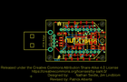
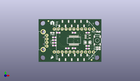
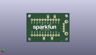
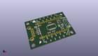

Contents
========

* [PROJ-SPAR-11697-STAN-01>XBee Explorer Dongle](#proj-spar-11697-stan-01xbee-explorer-dongle)
	* [Images](#images)
	* [Interactive BOM](#interactive-bom)
	* [Tags](#tags)
  
![][im]
# PROJ-SPAR-11697-STAN-01>XBee Explorer Dongle

- ID: PROJ-SPAR-11697-STAN-01
- Hex ID: PRS11697
- Name: XBee Explorer Dongle
- Description: 

## Images
  
  

|eagleImage|kicadPcb3dFront|kicadPcb3dBack|kicadPcb3d|
| :---: | :---: | :---: | :---: |
|||||

## Interactive BOM

- Interactive BOM page: [ibom.html](kicad/bom/ibom.html)

## Tags

- hexID: PRS11697
- oompType: PROJ
- oompSize: SPAR
- oompColor: 11697
- oompDesc: STAN
- oompIndex: 01
- oompName: XBee Explorer Dongle
- sources: All source files from https://github.com/sparkfun/XBee_Explorer_Dongle (source licence details in srcLicense.md)
- linkBuyPage: https://www.sparkfun.com/products/11697
- oompID: PROJ-SPAR-11697-STAN-01
- oompParts: C1,UNMATCHED-UNMATCHED-UNMATCHED-UNMATCHED-UNMATCHED
- oompParts: C2,UNMATCHED-UNMATCHED-UNMATCHED-UNMATCHED-UNMATCHED
- oompParts: C3,UNMATCHED-UNMATCHED-UNMATCHED-UNMATCHED-UNMATCHED
- oompParts: C4,UNMATCHED-UNMATCHED-UNMATCHED-UNMATCHED-UNMATCHED
- oompParts: C11,UNMATCHED-UNMATCHED-UNMATCHED-UNMATCHED-UNMATCHED
- oompParts: C14,UNMATCHED-UNMATCHED-UNMATCHED-UNMATCHED-UNMATCHED
- oompParts: D1,UNMATCHED-UNMATCHED-UNMATCHED-UNMATCHED-UNMATCHED
- oompParts: D2,UNMATCHED-UNMATCHED-UNMATCHED-UNMATCHED-UNMATCHED
- oompParts: D3,UNMATCHED-UNMATCHED-UNMATCHED-UNMATCHED-UNMATCHED
- oompParts: D4,UNMATCHED-UNMATCHED-UNMATCHED-UNMATCHED-UNMATCHED
- oompParts: FRAME1,UNMATCHED-UNMATCHED-UNMATCHED-UNMATCHED-UNMATCHED
- oompParts: JP2,UNMATCHED-UNMATCHED-UNMATCHED-UNMATCHED-UNMATCHED
- oompParts: JP3,UNMATCHED-UNMATCHED-UNMATCHED-UNMATCHED-UNMATCHED
- oompParts: JP4,UNMATCHED-UNMATCHED-UNMATCHED-UNMATCHED-UNMATCHED
- oompParts: LOGO1,UNMATCHED-UNMATCHED-UNMATCHED-UNMATCHED-UNMATCHED
- oompParts: LOGO2,UNMATCHED-UNMATCHED-UNMATCHED-UNMATCHED-UNMATCHED
- oompParts: R1,UNMATCHED-UNMATCHED-UNMATCHED-UNMATCHED-UNMATCHED
- oompParts: R2,UNMATCHED-UNMATCHED-UNMATCHED-UNMATCHED-UNMATCHED
- oompParts: R3,UNMATCHED-UNMATCHED-UNMATCHED-UNMATCHED-UNMATCHED
- oompParts: R4,UNMATCHED-UNMATCHED-UNMATCHED-UNMATCHED-UNMATCHED
- oompParts: R5,UNMATCHED-UNMATCHED-UNMATCHED-UNMATCHED-UNMATCHED
- oompParts: R11,UNMATCHED-UNMATCHED-UNMATCHED-UNMATCHED-UNMATCHED
- oompParts: S2,UNMATCHED-UNMATCHED-UNMATCHED-UNMATCHED-UNMATCHED
- oompParts: SJ1,UNMATCHED-UNMATCHED-UNMATCHED-UNMATCHED-UNMATCHED
- oompParts: SJ2,UNMATCHED-UNMATCHED-UNMATCHED-UNMATCHED-UNMATCHED
- oompParts: SJ3,UNMATCHED-UNMATCHED-UNMATCHED-UNMATCHED-UNMATCHED
- oompParts: SJ4,UNMATCHED-UNMATCHED-UNMATCHED-UNMATCHED-UNMATCHED
- oompParts: U$5,UNMATCHED-UNMATCHED-UNMATCHED-UNMATCHED-UNMATCHED
- oompParts: U$7,UNMATCHED-UNMATCHED-UNMATCHED-UNMATCHED-UNMATCHED
- oompParts: U$9,UNMATCHED-UNMATCHED-UNMATCHED-UNMATCHED-UNMATCHED
- oompParts: U$10,UNMATCHED-UNMATCHED-UNMATCHED-UNMATCHED-UNMATCHED
- oompParts: U$11,UNMATCHED-UNMATCHED-UNMATCHED-UNMATCHED-UNMATCHED
- oompParts: U2,UNMATCHED-UNMATCHED-UNMATCHED-UNMATCHED-UNMATCHED
- oompParts: U3,UNMATCHED-UNMATCHED-UNMATCHED-UNMATCHED-UNMATCHED
- oompParts: U4,UNMATCHED-UNMATCHED-UNMATCHED-UNMATCHED-UNMATCHED
- rawParts: C1,10uF,10UF-16V-10%(TANT),EIA3216,CAP-00811,CAP-00811,10uF,
- rawParts: C2,0.1uF,0.1UF-25V(+80/-20%)(0603),0603-CAP,CAP-00810,CAP-00810,0.1uF,
- rawParts: C3,47pF,47PF-50V-5%(0603),0603-CAP,CAP-08913,CAP-08913,47pF,
- rawParts: C4,47pF,47PF-50V-5%(0603),0603-CAP,CAP-08913,CAP-08913,47pF,
- rawParts: C11,0.1uF,0.1UF-25V(+80/-20%)(0603),0603-CAP,CAP-00810,CAP-00810,0.1uF,
- rawParts: C14,0.1uF,0.1UF-25V(+80/-20%)(0603),0603-CAP,CAP-00810,CAP-00810,0.1uF,
- rawParts: D1,GREEN,LED-GREEN0603,LED-0603,Various green LEDs,DIO-00821,GREEN,
- rawParts: D2,Yellow,LED-YELLOW0603,LED-0603,Yellow SMD LEDs,DIO-09003,Yellow,
- rawParts: D3,GREEN,LED-GREEN0603,LED-0603,Various green LEDs,DIO-00821,GREEN,
- rawParts: D4,RED,LED-RED0603,LED-0603,Assorted Red LEDs,DIO-00819,RED,
- rawParts: FID1,FIDUCIAL1X2,FIDUCIAL1X2,FIDUCIAL-1X2,Fiducial Alignment Points,,,
- rawParts: FID2,FIDUCIAL1X2,FIDUCIAL1X2,FIDUCIAL-1X2,Fiducial Alignment Points,,,
- rawParts: FRAME1,FRAME-LETTER,FRAME-LETTER,CREATIVE_COMMONS,Schematic Frame,,,
- rawParts: JP2,M111X11_NO_SILK,M111X11_NO_SILK,1X11_NO_SILK,Header 11,,,
- rawParts: JP3,M111X11_NO_SILK,M111X11_NO_SILK,1X11_NO_SILK,Header 11,,,
- rawParts: JP4,USB-A-H,USB-A-H,USB-A-H,USB Connectors,CONN-08367,,
- rawParts: LOGO1,SFE_LOGO_FLAME.1_INCH,SFE_LOGO_FLAME.1_INCH,SFE_LOGO_FLAME_.1,SFE Logo, flame only,,,
- rawParts: LOGO2,SFE_LOGO_NAME.2_INCH,SFE_LOGO_NAME.2_INCH,SFE_LOGO_NAME_.2,SFE Logo, name only,,,
- rawParts: R1,1K,1KOHM-1/10W-1%(0603),0603-RES,RES-07856,RES-07856,1K,
- rawParts: R2,27,27OHM1/10W1%(0603)0603-RES,0603-RES,RES-09334,RES-09334,,
- rawParts: R3,1K,1KOHM-1/10W-1%(0603),0603-RES,RES-07856,RES-07856,1K,
- rawParts: R4,330,330OHM1/10W1%(0603),0603-RES,RES-00818,RES-00818,330,
- rawParts: R5,27,27OHM1/10W1%(0603)0603-RES,0603-RES,RES-09334,RES-09334,,
- rawParts: R11,1K,1KOHM-1/10W-1%(0603),0603-RES,RES-07856,RES-07856,1K,
- rawParts: S2,Reset,SWITCH-MOMENTARY-2SMD,TACTILE_SWITCH_SMD,Various NO switches- pushbuttons, reed, etc,SWCH-08247,,
- rawParts: SJ1,RSSI,SOLDERJUMPERTRACE,SJ_2S-TRACE,Solder Jumper,,,
- rawParts: SJ2,RSSI,SOLDERJUMPERTRACE,SJ_2S-TRACE,Solder Jumper,,,
- rawParts: SJ3,RSSI,SOLDERJUMPERTRACE,SJ_2S-TRACE,Solder Jumper,,,
- rawParts: SJ4,RSSI,SOLDERJUMPERTRACE,SJ_2S-TRACE,Solder Jumper,,,
- rawParts: U$5,STAND-OFF,STAND-OFF,STAND-OFF,Stand Off,,,
- rawParts: U$7,OSHW-LOGOS,OSHW-LOGOS,OSHW-LOGO-S,Open Source Hardware Logo This logo indicates the piece of hardware it is found on incorporates a OSHW license and/or adheres to the definition of open source hardware found here: http://freedomdefined.org/OSHW,,,
- rawParts: U$9,STAND-OFF,STAND-OFF,STAND-OFF,Stand Off,,,
- rawParts: U$10,STAND-OFF,STAND-OFF,STAND-OFF,Stand Off,,,
- rawParts: U$11,STAND-OFF,STAND-OFF,STAND-OFF,Stand Off,,,
- rawParts: U2,XBEE-1B3,XBEE-1B3,XBEE-SMD,Xbee module footprints,CONN-09042,,
- rawParts: U3,MIC5219 3.3V,V_REG_MIC52193.3V,SOT23-5,V_REG MIC5219,VREG-09872,MIC5219 3.3V,
- rawParts: U4,FTS31XS-U,FT231XS,SSOP20_L,FTDI FT231X Full Speed USB to Full-handshake UART,IC-11524,FTS31XS-U,

[im]: kicadPcb3d_450.png
