Contents
========

* [PRS11703 > UDB5](#prs11703--udb5)
	* [Schematic](#schematic)
	* [PCB](#pcb)
	* [Interactive BOM](#interactive-bom)
	* [OOMP Parts](#oomp-parts)
	* [Images](#images)
	* [Tags](#tags)
  
![][im]
# PRS11703 > UDB5

- ID: PROJ-SPAR-11703-STAN-01
- Hex ID: PRS11703
- Name: Sparkfun
- Description: Sparkfun
- Long Link: [http://oom.lt/PROJ-SPAR-11703-STAN-01](http://oom.lt/PROJ-SPAR-11703-STAN-01)
- Short Link: [http://oom.lt/PRS11703](http://oom.lt/PRS11703)

## Schematic
  
[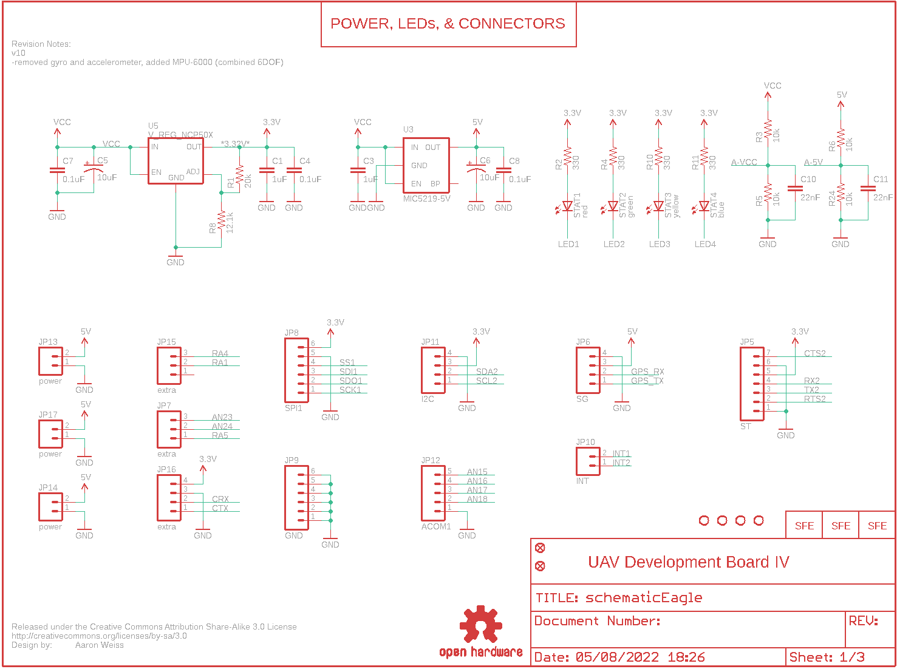](eagleSchemImage.png)
## PCB
  

## Interactive BOM

- Interactive BOM page: [ibom.html](https://htmlpreview.github.io/?https://github.com/oomlout/oomlout_OOMP_projects/blob/main/PROJ-SPAR-11703-STAN-01/kicad/bom/ibom.html)

## OOMP Parts
  

|OOMP ID|Name|Identifier|
| :---: | :---: | :---: |
|[CAPC-0402-X-UF1-V63D](https://github.com/oomlout/oomlout_OOMP_parts/tree/main/CAPC-0402-X-UF1-V63D/)|[SMD (0402) 1 uF Capacitor (Ceramic) 6.3v](https://github.com/oomlout/oomlout_OOMP_parts/tree/main/CAPC-0402-X-UF1-V63D/)|[C1, C3](https://github.com/oomlout/oomlout_OOMP_parts/tree/main/CAPC-0402-X-UF1-V63D/)|
|[CAPC-0402-X-PF22D-V50](https://github.com/oomlout/oomlout_OOMP_parts/tree/main/CAPC-0402-X-PF22D-V50/)|[SMD (0402) 2.2 pF Capacitor (Ceramic) 50v](https://github.com/oomlout/oomlout_OOMP_parts/tree/main/CAPC-0402-X-PF22D-V50/)|[C2](https://github.com/oomlout/oomlout_OOMP_parts/tree/main/CAPC-0402-X-PF22D-V50/)|
|[CAPC-0402-X-NF100-V10](https://github.com/oomlout/oomlout_OOMP_parts/tree/main/CAPC-0402-X-NF100-V10/)|[SMD (0402) 100 nF Capacitor (Ceramic) 10v](https://github.com/oomlout/oomlout_OOMP_parts/tree/main/CAPC-0402-X-NF100-V10/)|[C4, C7, C8, C9, C13, C21, C23, C24, C26, C27, INPUT1, INPUT2, MPU, OUTPUT1](https://github.com/oomlout/oomlout_OOMP_parts/tree/main/CAPC-0402-X-NF100-V10/)|
|[CAPT-3216-X-UF10-V10](https://github.com/oomlout/oomlout_OOMP_parts/tree/main/CAPT-3216-X-UF10-V10/)|[SMD (3216) 10 uF Capacitor (Tantalum) 10v](https://github.com/oomlout/oomlout_OOMP_parts/tree/main/CAPT-3216-X-UF10-V10/)|[C5, C6, C28, OUTPUT2](https://github.com/oomlout/oomlout_OOMP_parts/tree/main/CAPT-3216-X-UF10-V10/)|
|[CAPC-0402-X-NF22-V50](https://github.com/oomlout/oomlout_OOMP_parts/tree/main/CAPC-0402-X-NF22-V50/)|[SMD (0402) 22 nF Capacitor (Ceramic) 50v](https://github.com/oomlout/oomlout_OOMP_parts/tree/main/CAPC-0402-X-NF22-V50/)|[C10, C11](https://github.com/oomlout/oomlout_OOMP_parts/tree/main/CAPC-0402-X-NF22-V50/)|
|CAPX-UNMATCHED-X-UNMATCHED-01||C12|
|[HEAD-I01-X-PI03-01](https://github.com/oomlout/oomlout_OOMP_parts/tree/main/HEAD-I01-X-PI03-01/)|[2.54 mm 3 Pin Header](https://github.com/oomlout/oomlout_OOMP_parts/tree/main/HEAD-I01-X-PI03-01/)|[I1, I2, I3, I4, I5, I6, I7, I8, JP7, JP15, O1, O2, O3, O4, O5, O6, O7, O8](https://github.com/oomlout/oomlout_OOMP_parts/tree/main/HEAD-I01-X-PI03-01/)|
|[HEAD-I01-X-PI02-01](https://github.com/oomlout/oomlout_OOMP_parts/tree/main/HEAD-I01-X-PI02-01/)|[2.54 mm 2 Pin Header](https://github.com/oomlout/oomlout_OOMP_parts/tree/main/HEAD-I01-X-PI02-01/)|[JP1, JP4, JP10, JP13, JP14, JP17](https://github.com/oomlout/oomlout_OOMP_parts/tree/main/HEAD-I01-X-PI02-01/)|
|[HEAD-I01-X-PI06-01](https://github.com/oomlout/oomlout_OOMP_parts/tree/main/HEAD-I01-X-PI06-01/)|[2.54 mm 6 Pin Header](https://github.com/oomlout/oomlout_OOMP_parts/tree/main/HEAD-I01-X-PI06-01/)|[JP2, JP8, JP9](https://github.com/oomlout/oomlout_OOMP_parts/tree/main/HEAD-I01-X-PI06-01/)|
|[HEAD-I01-X-PI07-01](https://github.com/oomlout/oomlout_OOMP_parts/tree/main/HEAD-I01-X-PI07-01/)|[2.54 mm 7 Pin Header](https://github.com/oomlout/oomlout_OOMP_parts/tree/main/HEAD-I01-X-PI07-01/)|[JP5](https://github.com/oomlout/oomlout_OOMP_parts/tree/main/HEAD-I01-X-PI07-01/)|
|[HEAD-I01-X-PI04-01](https://github.com/oomlout/oomlout_OOMP_parts/tree/main/HEAD-I01-X-PI04-01/)|[2.54 mm 4 Pin Header](https://github.com/oomlout/oomlout_OOMP_parts/tree/main/HEAD-I01-X-PI04-01/)|[JP6, JP11, JP16](https://github.com/oomlout/oomlout_OOMP_parts/tree/main/HEAD-I01-X-PI04-01/)|
|[HEAD-I01-X-PI05-01](https://github.com/oomlout/oomlout_OOMP_parts/tree/main/HEAD-I01-X-PI05-01/)|[2.54 mm 5 Pin Header](https://github.com/oomlout/oomlout_OOMP_parts/tree/main/HEAD-I01-X-PI05-01/)|[JP12](https://github.com/oomlout/oomlout_OOMP_parts/tree/main/HEAD-I01-X-PI05-01/)|
|[RESE-0402-X-O203-01](https://github.com/oomlout/oomlout_OOMP_parts/tree/main/RESE-0402-X-O203-01/)|[SMD (0402) 20k Ohm Resistor](https://github.com/oomlout/oomlout_OOMP_parts/tree/main/RESE-0402-X-O203-01/)|[R1](https://github.com/oomlout/oomlout_OOMP_parts/tree/main/RESE-0402-X-O203-01/)|
|[RESE-0402-X-O331-01](https://github.com/oomlout/oomlout_OOMP_parts/tree/main/RESE-0402-X-O331-01/)|[SMD (0402) 330 Ohm Resistor](https://github.com/oomlout/oomlout_OOMP_parts/tree/main/RESE-0402-X-O331-01/)|[R2, R4, R10, R11, R16, R17, R18, R19, R20, R21, R22, R23](https://github.com/oomlout/oomlout_OOMP_parts/tree/main/RESE-0402-X-O331-01/)|
|[RESE-0402-X-O103-01](https://github.com/oomlout/oomlout_OOMP_parts/tree/main/RESE-0402-X-O103-01/)|[SMD (0402) 10k Ohm Resistor](https://github.com/oomlout/oomlout_OOMP_parts/tree/main/RESE-0402-X-O103-01/)|[R3, R5, R6, R12, R24](https://github.com/oomlout/oomlout_OOMP_parts/tree/main/RESE-0402-X-O103-01/)|
|[RESE-0402-X-O472-01](https://github.com/oomlout/oomlout_OOMP_parts/tree/main/RESE-0402-X-O472-01/)|[SMD (0402) 4.7k Ohm Resistor](https://github.com/oomlout/oomlout_OOMP_parts/tree/main/RESE-0402-X-O472-01/)|[R7, R9, R13, R14](https://github.com/oomlout/oomlout_OOMP_parts/tree/main/RESE-0402-X-O472-01/)|
|RESE-0402-X-UNMATCHED-01||R8|
|[RESE-0402-X-O471-01](https://github.com/oomlout/oomlout_OOMP_parts/tree/main/RESE-0402-X-O471-01/)|[SMD (0402) 470 Ohm Resistor](https://github.com/oomlout/oomlout_OOMP_parts/tree/main/RESE-0402-X-O471-01/)|[R15](https://github.com/oomlout/oomlout_OOMP_parts/tree/main/RESE-0402-X-O471-01/)|
|[RESE-0402-X-O102-01](https://github.com/oomlout/oomlout_OOMP_parts/tree/main/RESE-0402-X-O102-01/)|[SMD (0402) 1k Ohm Resistor](https://github.com/oomlout/oomlout_OOMP_parts/tree/main/RESE-0402-X-O102-01/)|[R25](https://github.com/oomlout/oomlout_OOMP_parts/tree/main/RESE-0402-X-O102-01/)|
|UNMATCHED-UNMATCHED-X-UNMATCHED-01||S1, U1, U5, U6, U8, U9, U10, Y1|
|[LEDS-0603-R-STAN-01](https://github.com/oomlout/oomlout_OOMP_parts/tree/main/LEDS-0603-R-STAN-01/)|[SMD (0603) Red LED](https://github.com/oomlout/oomlout_OOMP_parts/tree/main/LEDS-0603-R-STAN-01/)|[STAT1](https://github.com/oomlout/oomlout_OOMP_parts/tree/main/LEDS-0603-R-STAN-01/)|
|[LEDS-0603-G-STAN-01](https://github.com/oomlout/oomlout_OOMP_parts/tree/main/LEDS-0603-G-STAN-01/)|[SMD (0603) Green LED](https://github.com/oomlout/oomlout_OOMP_parts/tree/main/LEDS-0603-G-STAN-01/)|[STAT2](https://github.com/oomlout/oomlout_OOMP_parts/tree/main/LEDS-0603-G-STAN-01/)|
|[LEDS-0603-Y-STAN-01](https://github.com/oomlout/oomlout_OOMP_parts/tree/main/LEDS-0603-Y-STAN-01/)|[SMD (0603) Yellow LED](https://github.com/oomlout/oomlout_OOMP_parts/tree/main/LEDS-0603-Y-STAN-01/)|[STAT3](https://github.com/oomlout/oomlout_OOMP_parts/tree/main/LEDS-0603-Y-STAN-01/)|
|[LEDS-0603-L-STAN-01](https://github.com/oomlout/oomlout_OOMP_parts/tree/main/LEDS-0603-L-STAN-01/)|[SMD (0603) Blue LED](https://github.com/oomlout/oomlout_OOMP_parts/tree/main/LEDS-0603-L-STAN-01/)|[STAT4](https://github.com/oomlout/oomlout_OOMP_parts/tree/main/LEDS-0603-L-STAN-01/)|
|UNMATCHED-SO235-X-UNMATCHED-01||U3|

## Images
  
  

|bominteractivefront|bominteractiveback|kicadPcb3d|kicadPcb3dFront|kicadPcb3dBack|kicadSchem|eagleImage|eagleSchemImage|pcbdraw|pcbdrawback|
| :---: | :---: | :---: | :---: | :---: | :---: | :---: | :---: | :---: | :---: |
|[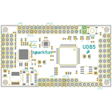](bomFront.png)|[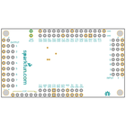](bomBack.png)|[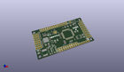](kicadPcb3d.png)|[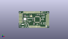](kicadPcb3dFront.png)|[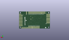](kicadPcb3dBack.png)|[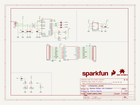](kicadSchem.png)|[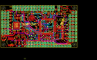](eagleImage.png)|[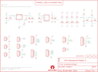](eagleSchemImage.png)|[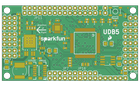](pcbdraw.png)|[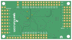](pcbdrawBack.png)|

## Tags

- hexID: PRS11703
- oompType: PROJ
- oompSize: SPAR
- oompColor: 11703
- oompDesc: STAN
- oompIndex: 01
- oompName: UDB5
- sources: All source files from https://github.com/sparkfun/UDB5 (source licence details in srcLicense.md)
- linkBuyPage: https://www.sparkfun.com/products/11703
- oompID: PROJ-SPAR-11703-STAN-01
- oompParts: C1,CAPC-0402-X-UF1-V63D
- oompParts: C2,CAPC-0402-X-PF22D-V50
- oompParts: C3,CAPC-0402-X-UF1-V63D
- oompParts: C4,CAPC-0402-X-NF100-V10
- oompParts: C5,CAPT-3216-X-UF10-V10
- oompParts: C6,CAPT-3216-X-UF10-V10
- oompParts: C7,CAPC-0402-X-NF100-V10
- oompParts: C8,CAPC-0402-X-NF100-V10
- oompParts: C9,CAPC-0402-X-NF100-V10
- oompParts: C10,CAPC-0402-X-NF22-V50
- oompParts: C11,CAPC-0402-X-NF22-V50
- oompParts: C12,CAPX-UNMATCHED-X-UNMATCHED-01
- oompParts: C13,CAPC-0402-X-NF100-V10
- oompParts: C21,CAPC-0402-X-NF100-V10
- oompParts: C23,CAPC-0402-X-NF100-V10
- oompParts: C24,CAPC-0402-X-NF100-V10
- oompParts: C26,CAPC-0402-X-NF100-V10
- oompParts: C27,CAPC-0402-X-NF100-V10
- oompParts: C28,CAPT-3216-X-UF10-V10
- oompParts: I1,HEAD-I01-X-PI03-01
- oompParts: I2,HEAD-I01-X-PI03-01
- oompParts: I3,HEAD-I01-X-PI03-01
- oompParts: I4,HEAD-I01-X-PI03-01
- oompParts: I5,HEAD-I01-X-PI03-01
- oompParts: I6,HEAD-I01-X-PI03-01
- oompParts: I7,HEAD-I01-X-PI03-01
- oompParts: I8,HEAD-I01-X-PI03-01
- oompParts: INPUT1,CAPC-0402-X-NF100-V10
- oompParts: INPUT2,CAPC-0402-X-NF100-V10
- oompParts: JP1,HEAD-I01-X-PI02-01
- oompParts: JP2,HEAD-I01-X-PI06-01
- oompParts: JP4,HEAD-I01-X-PI02-01
- oompParts: JP5,HEAD-I01-X-PI07-01
- oompParts: JP6,HEAD-I01-X-PI04-01
- oompParts: JP7,HEAD-I01-X-PI03-01
- oompParts: JP8,HEAD-I01-X-PI06-01
- oompParts: JP9,HEAD-I01-X-PI06-01
- oompParts: JP10,HEAD-I01-X-PI02-01
- oompParts: JP11,HEAD-I01-X-PI04-01
- oompParts: JP12,HEAD-I01-X-PI05-01
- oompParts: JP13,HEAD-I01-X-PI02-01
- oompParts: JP14,HEAD-I01-X-PI02-01
- oompParts: JP15,HEAD-I01-X-PI03-01
- oompParts: JP16,HEAD-I01-X-PI04-01
- oompParts: JP17,HEAD-I01-X-PI02-01
- oompParts: MPU,CAPC-0402-X-NF100-V10
- oompParts: O1,HEAD-I01-X-PI03-01
- oompParts: O2,HEAD-I01-X-PI03-01
- oompParts: O3,HEAD-I01-X-PI03-01
- oompParts: O4,HEAD-I01-X-PI03-01
- oompParts: O5,HEAD-I01-X-PI03-01
- oompParts: O6,HEAD-I01-X-PI03-01
- oompParts: O7,HEAD-I01-X-PI03-01
- oompParts: O8,HEAD-I01-X-PI03-01
- oompParts: OUTPUT1,CAPC-0402-X-NF100-V10
- oompParts: OUTPUT2,CAPT-3216-X-UF10-V10
- oompParts: R1,RESE-0402-X-O203-01
- oompParts: R2,RESE-0402-X-O331-01
- oompParts: R3,RESE-0402-X-O103-01
- oompParts: R4,RESE-0402-X-O331-01
- oompParts: R5,RESE-0402-X-O103-01
- oompParts: R6,RESE-0402-X-O103-01
- oompParts: R7,RESE-0402-X-O472-01
- oompParts: R8,RESE-0402-X-UNMATCHED-01
- oompParts: R9,RESE-0402-X-O472-01
- oompParts: R10,RESE-0402-X-O331-01
- oompParts: R11,RESE-0402-X-O331-01
- oompParts: R12,RESE-0402-X-O103-01
- oompParts: R13,RESE-0402-X-O472-01
- oompParts: R14,RESE-0402-X-O472-01
- oompParts: R15,RESE-0402-X-O471-01
- oompParts: R16,RESE-0402-X-O331-01
- oompParts: R17,RESE-0402-X-O331-01
- oompParts: R18,RESE-0402-X-O331-01
- oompParts: R19,RESE-0402-X-O331-01
- oompParts: R20,RESE-0402-X-O331-01
- oompParts: R21,RESE-0402-X-O331-01
- oompParts: R22,RESE-0402-X-O331-01
- oompParts: R23,RESE-0402-X-O331-01
- oompParts: R24,RESE-0402-X-O103-01
- oompParts: R25,RESE-0402-X-O102-01
- oompParts: S1,UNMATCHED-UNMATCHED-X-UNMATCHED-01
- oompParts: STAT1,LEDS-0603-R-STAN-01
- oompParts: STAT2,LEDS-0603-G-STAN-01
- oompParts: STAT3,LEDS-0603-Y-STAN-01
- oompParts: STAT4,LEDS-0603-L-STAN-01
- oompParts: U1,UNMATCHED-UNMATCHED-X-UNMATCHED-01
- oompParts: U3,UNMATCHED-SO235-X-UNMATCHED-01
- oompParts: U5,UNMATCHED-UNMATCHED-X-UNMATCHED-01
- oompParts: U6,UNMATCHED-UNMATCHED-X-UNMATCHED-01
- oompParts: U8,UNMATCHED-UNMATCHED-X-UNMATCHED-01
- oompParts: U9,UNMATCHED-UNMATCHED-X-UNMATCHED-01
- oompParts: U10,UNMATCHED-UNMATCHED-X-UNMATCHED-01
- oompParts: Y1,UNMATCHED-UNMATCHED-X-UNMATCHED-01
- rawParts: C1,1uF,CAP0402-CAP,0402-CAP,Capacitor,,
- rawParts: C2,2.2nF,CAP0402-CAP,0402-CAP,Capacitor,,
- rawParts: C3,1uF,CAP0402-CAP,0402-CAP,Capacitor,,
- rawParts: C4,0.1uF,CAP0402-CAP,0402-CAP,Capacitor,,
- rawParts: C5,10uF,CAP_POL1206,EIA3216,Capacitor Polarized,,
- rawParts: C6,10uF,CAP_POL1206,EIA3216,Capacitor Polarized,,
- rawParts: C7,0.1uF,CAP0402-CAP,0402-CAP,Capacitor,,
- rawParts: C8,0.1uF,CAP0402-CAP,0402-CAP,Capacitor,,
- rawParts: C9,0.1uF,CAP0402-CAP,0402-CAP,Capacitor,,
- rawParts: C10,22nF,CAP0402-CAP,0402-CAP,Capacitor,,
- rawParts: C11,22nF,CAP0402-CAP,0402-CAP,Capacitor,,
- rawParts: C12,0.2F/3.3V,CAP_POLEN_J2,EN_J2,Capacitor Polarized,,
- rawParts: C13,0.1uF,CAP0402-CAP,0402-CAP,Capacitor,,
- rawParts: C21,0.1uF,CAP0402-CAP,0402-CAP,Capacitor,,
- rawParts: C23,0.1uF,CAP0402-CAP,0402-CAP,Capacitor,,
- rawParts: C24,0.1uF,CAP0402-CAP,0402-CAP,Capacitor,,
- rawParts: C26,0.1uF,CAP0402-CAP,0402-CAP,Capacitor,,
- rawParts: C27,0.1uF,CAP0402-CAP,0402-CAP,Capacitor,,
- rawParts: C28,10uF,CAP_POL1206,EIA3216,Capacitor Polarized,,
- rawParts: CC_TEXT1,CREATIVE_COMMONS,CREATIVE_COMMONS,CREATIVE_COMMONS,Creative Commons License summary,,
- rawParts: I1,S,M03PTH,1X03,Header 3,,
- rawParts: I2,S,M03PTH,1X03,Header 3,,
- rawParts: I3,S,M03PTH,1X03,Header 3,,
- rawParts: I4,S,M03PTH,1X03,Header 3,,
- rawParts: I5,S,M03PTH,1X03,Header 3,,
- rawParts: I6,S,M03PTH,1X03,Header 3,,
- rawParts: I7,S,M03PTH,1X03,Header 3,,
- rawParts: I8,S,M03PTH,1X03,Header 3,,
- rawParts: INPUT1,0.1uF,CAP0402-CAP,0402-CAP,Capacitor,,
- rawParts: INPUT2,0.1uF,CAP0402-CAP,0402-CAP,Capacitor,,
- rawParts: JP1,EXT_Reset,M02PTH,1X02,Header 2,,
- rawParts: JP2,prog,M06SIP,1X06,Header 6,,
- rawParts: JP3,LOGO-SFENEW,LOGO-SFENEW,SFE-NEW-WEBLOGO,Spark Fun Electronics PCB Logo,,
- rawParts: JP4,SVCC,M02PTH,1X02,Header 2,,
- rawParts: JP5,ST,M07,1X07,Header 7,,
- rawParts: JP6,SG,M04PTH,1X04,Header 4,,
- rawParts: JP7,extra,M03PTH,1X03,Header 3,,
- rawParts: JP8,SPI1,M06SIP,1X06,Header 6,,
- rawParts: JP9,GND,M06SIP,1X06,Header 6,,
- rawParts: JP10,INT,M02PTH,1X02,Header 2,,
- rawParts: JP11,I2C,M04PTH,1X04,Header 4,,
- rawParts: JP12,ACOM1,M05PTH,1X05,Header 5,,
- rawParts: JP13,power,M02PTH,1X02,Header 2,,
- rawParts: JP14,power,M02PTH,1X02,Header 2,,
- rawParts: JP15,extra,M03PTH,1X03,Header 3,,
- rawParts: JP16,extra,M04PTH,1X04,Header 4,,
- rawParts: JP17,power,M02PTH,1X02,Header 2,,
- rawParts: JP18,FIDUCIAL1X2.5,FIDUCIAL1X2.5,FIDUCIAL-1X2.5,Fiducial Alignment Points,,
- rawParts: JP19,FIDUCIAL1X2.5,FIDUCIAL1X2.5,FIDUCIAL-1X2.5,Fiducial Alignment Points,,
- rawParts: LOGO1,LOGO-SFENW2,LOGO-SFENW2,SFE-NEW-WEB,Spark Fun Electronics PCB Logo,,
- rawParts: MPU,0.1uF,CAP0402-CAP,0402-CAP,Capacitor,,
- rawParts: O1,RA,M03PTH,1X03,Header 3,,
- rawParts: O2,RA,M03PTH,1X03,Header 3,,
- rawParts: O3,RA,M03PTH,1X03,Header 3,,
- rawParts: O4,RA,M03PTH,1X03,Header 3,,
- rawParts: O5,RA,M03PTH,1X03,Header 3,,
- rawParts: O6,RA,M03PTH,1X03,Header 3,,
- rawParts: O7,RA,M03PTH,1X03,Header 3,,
- rawParts: O8,RA,M03PTH,1X03,Header 3,,
- rawParts: OUTPUT1,0.1uF,CAP0402-CAP,0402-CAP,Capacitor,,
- rawParts: OUTPUT2,10uF,CAP_POL1206,EIA3216,Capacitor Polarized,,
- rawParts: R1,20k,RESISTOR0402-RES,0402-RES,Resistor,,
- rawParts: R2,330,RESISTOR0402-RES,0402-RES,Resistor,,
- rawParts: R3,10k,RESISTOR0402-RES,0402-RES,Resistor,,
- rawParts: R4,330,RESISTOR0402-RES,0402-RES,Resistor,,
- rawParts: R5,10k,RESISTOR0402-RES,0402-RES,Resistor,,
- rawParts: R6,10k,RESISTOR0402-RES,0402-RES,Resistor,,
- rawParts: R7,4.7k,RESISTOR0402-RES,0402-RES,Resistor,,
- rawParts: R8,12.1k,RESISTOR0402-RES,0402-RES,Resistor,,
- rawParts: R9,4.7k,RESISTOR0402-RES,0402-RES,Resistor,,
- rawParts: R10,330,RESISTOR0402-RES,0402-RES,Resistor,,
- rawParts: R11,330,RESISTOR0402-RES,0402-RES,Resistor,,
- rawParts: R12,10k,RESISTOR0402-RES,0402-RES,Resistor,,
- rawParts: R13,4.7k,RESISTOR0402-RES,0402-RES,Resistor,,
- rawParts: R14,4.7k,RESISTOR0402-RES,0402-RES,Resistor,,
- rawParts: R15,470,RESISTOR0402-RES,0402-RES,Resistor,,
- rawParts: R16,330,RESISTOR0402-RES,0402-RES,Resistor,,
- rawParts: R17,330,RESISTOR0402-RES,0402-RES,Resistor,,
- rawParts: R18,330,RESISTOR0402-RES,0402-RES,Resistor,,
- rawParts: R19,330,RESISTOR0402-RES,0402-RES,Resistor,,
- rawParts: R20,330,RESISTOR0402-RES,0402-RES,Resistor,,
- rawParts: R21,330,RESISTOR0402-RES,0402-RES,Resistor,,
- rawParts: R22,330,RESISTOR0402-RES,0402-RES,Resistor,,
- rawParts: R23,330,RESISTOR0402-RES,0402-RES,Resistor,,
- rawParts: R24,10k,RESISTOR0402-RES,0402-RES,Resistor,,
- rawParts: R25,1k,RESISTOR0402-RES,0402-RES,Resistor,,
- rawParts: S1,SWITCH-MOMENTARY-2SMD,SWITCH-MOMENTARY-2SMD,TACTILE_SWITCH_SMD,,,
- rawParts: SJ1,SOLDERJUMPERNC,SOLDERJUMPERNC,SJ_2S,Solder Jumper,,
- rawParts: STAT1,red,LED0603,LED-0603,LEDs,,
- rawParts: STAT2,green,LED0603,LED-0603,LEDs,,
- rawParts: STAT3,yellow,LED0603,LED-0603,LEDs,,
- rawParts: STAT4,blue,LED0603,LED-0603,LEDs,,
- rawParts: TP1,TEST-POINT3,TEST-POINT3,PAD.03X.03,Bare copper test points for troubleshooting or ICT,,
- rawParts: TP2,TEST-POINT3,TEST-POINT3,PAD.03X.03,Bare copper test points for troubleshooting or ICT,,
- rawParts: TP3,TEST-POINT3,TEST-POINT3,PAD.03X.03,Bare copper test points for troubleshooting or ICT,,
- rawParts: TP4,TEST-POINT3,TEST-POINT3,PAD.03X.03,Bare copper test points for troubleshooting or ICT,,
- rawParts: U$2,STAND-OFF,STAND-OFF,STAND-OFF,Stand Off,,
- rawParts: U$3,STAND-OFF,STAND-OFF,STAND-OFF,Stand Off,,
- rawParts: U$4,STAND-OFF,STAND-OFF,STAND-OFF,Stand Off,,
- rawParts: U$5,STAND-OFF,STAND-OFF,STAND-OFF,Stand Off,,
- rawParts: U$9,OSHW-LOGOS,OSHW-LOGOS,OSHW-LOGO-S,Open Source Hardware Logo This logo indicates the piece of hardware it is found on incorporates a OSHW license and/or adheres to the definition of open source hardware found here: http://freedomdefined.org/OSHW,,
- rawParts: U$10,LOGO-SFESK,LOGO-SFESK,SFE-LOGO-FLAME,Spark Fun Electronics PCB Logo,,
- rawParts: U1,DSPIC33FJ256GP710_,DSPIC33FJ256GP710_,TQFP-100-12X12MM,,,
- rawParts: U3,V_REG_LDOSMD,V_REG_LDOSMD,SOT23-5,Voltage Regulator LDO,,
- rawParts: U5,V_REG_NCP50X,V_REG_NCP50X,DPAK-5,NCP550x 500mA LDO Voltage Regulator,,
- rawParts: U6,D2523T_,D2523T_,EM406,D2523T GPS Module,,
- rawParts: U8,EEPROM-I2CSMD,EEPROM-I2CSMD,SO08,,,
- rawParts: U9,EM406,EM406,EM406,EM406 Connector,,
- rawParts: U10,MPU-6000QFN-24,MPU-6000QFN-24,QFN-24-TESTING,MPU-6000 - I2C address is 0x68 with AD0 low and 0x69 with AD0 high.,,
- rawParts: Y1,RESONATORSMD,RESONATORSMD,RESONATOR-SMD,Resonator,,

[im]: kicadPcb3d_450.png
