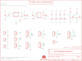

Contents
========

* [PRS11703 > Sparkfun](#prs11703--sparkfun)
	* [Schematic](#schematic)
	* [Interactive BOM](#interactive-bom)
	* [OOMP Parts](#oomp-parts)
	* [Images](#images)
	* [Tags](#tags)
  
![][im]
# PRS11703 > Sparkfun

- ID: PROJ-SPAR-11703-STAN-01
- Hex ID: PRS11703
- Name: Sparkfun
- Description: Sparkfun
- Long Link: [http://oom.lt/PROJ-SPAR-11703-STAN-01](http://oom.lt/PROJ-SPAR-11703-STAN-01)
- Short Link: [http://oom.lt/PRS11703](http://oom.lt/PRS11703)

## Schematic
  

## Interactive BOM

- Interactive BOM page: [ibom.html](https://htmlpreview.github.io/?https://github.com/oomlout/oomlout_OOMP_projects/blob/main/PROJ-SPAR-11703-STAN-01/kicad/bom/ibom.html)

## OOMP Parts
  

|OOMP Parts|
| :---: |
|C1,UNMATCHED-UNMATCHED-UNMATCHED-UNMATCHED-UNMATCHED,C1,1uF,CAP0402-CAP,0402-CAP,Capacitor,,|
|C2,UNMATCHED-UNMATCHED-UNMATCHED-UNMATCHED-UNMATCHED,C2,2.2nF,CAP0402-CAP,0402-CAP,Capacitor,,|
|C3,UNMATCHED-UNMATCHED-UNMATCHED-UNMATCHED-UNMATCHED,C3,1uF,CAP0402-CAP,0402-CAP,Capacitor,,|
|C4,UNMATCHED-UNMATCHED-UNMATCHED-UNMATCHED-UNMATCHED,C4,0.1uF,CAP0402-CAP,0402-CAP,Capacitor,,|
|C5,UNMATCHED-UNMATCHED-UNMATCHED-UNMATCHED-UNMATCHED,C5,10uF,CAP_POL1206,EIA3216,Capacitor Polarized,,|
|C6,UNMATCHED-UNMATCHED-UNMATCHED-UNMATCHED-UNMATCHED,C6,10uF,CAP_POL1206,EIA3216,Capacitor Polarized,,|
|C7,UNMATCHED-UNMATCHED-UNMATCHED-UNMATCHED-UNMATCHED,C7,0.1uF,CAP0402-CAP,0402-CAP,Capacitor,,|
|C8,UNMATCHED-UNMATCHED-UNMATCHED-UNMATCHED-UNMATCHED,C8,0.1uF,CAP0402-CAP,0402-CAP,Capacitor,,|
|C9,UNMATCHED-UNMATCHED-UNMATCHED-UNMATCHED-UNMATCHED,C9,0.1uF,CAP0402-CAP,0402-CAP,Capacitor,,|
|C10,UNMATCHED-UNMATCHED-UNMATCHED-UNMATCHED-UNMATCHED,C10,22nF,CAP0402-CAP,0402-CAP,Capacitor,,|
|C11,UNMATCHED-UNMATCHED-UNMATCHED-UNMATCHED-UNMATCHED,C11,22nF,CAP0402-CAP,0402-CAP,Capacitor,,|
|C12,UNMATCHED-UNMATCHED-UNMATCHED-UNMATCHED-UNMATCHED,C12,0.2F/3.3V,CAP_POLEN_J2,EN_J2,Capacitor Polarized,,|
|C13,UNMATCHED-UNMATCHED-UNMATCHED-UNMATCHED-UNMATCHED,C13,0.1uF,CAP0402-CAP,0402-CAP,Capacitor,,|
|C21,UNMATCHED-UNMATCHED-UNMATCHED-UNMATCHED-UNMATCHED,C21,0.1uF,CAP0402-CAP,0402-CAP,Capacitor,,|
|C23,UNMATCHED-UNMATCHED-UNMATCHED-UNMATCHED-UNMATCHED,C23,0.1uF,CAP0402-CAP,0402-CAP,Capacitor,,|
|C24,UNMATCHED-UNMATCHED-UNMATCHED-UNMATCHED-UNMATCHED,C24,0.1uF,CAP0402-CAP,0402-CAP,Capacitor,,|
|C26,UNMATCHED-UNMATCHED-UNMATCHED-UNMATCHED-UNMATCHED,C26,0.1uF,CAP0402-CAP,0402-CAP,Capacitor,,|
|C27,UNMATCHED-UNMATCHED-UNMATCHED-UNMATCHED-UNMATCHED,C27,0.1uF,CAP0402-CAP,0402-CAP,Capacitor,,|
|C28,UNMATCHED-UNMATCHED-UNMATCHED-UNMATCHED-UNMATCHED,C28,10uF,CAP_POL1206,EIA3216,Capacitor Polarized,,|
|CC_TEXT1,UNMATCHED-UNMATCHED-UNMATCHED-UNMATCHED-UNMATCHED,CC_TEXT1,CREATIVE_COMMONS,CREATIVE_COMMONS,CREATIVE_COMMONS,Creative Commons License summary,,|
|I1,UNMATCHED-UNMATCHED-UNMATCHED-UNMATCHED-UNMATCHED,I1,S,M03PTH,1X03,Header 3,,|
|I2,UNMATCHED-UNMATCHED-UNMATCHED-UNMATCHED-UNMATCHED,I2,S,M03PTH,1X03,Header 3,,|
|I3,UNMATCHED-UNMATCHED-UNMATCHED-UNMATCHED-UNMATCHED,I3,S,M03PTH,1X03,Header 3,,|
|I4,UNMATCHED-UNMATCHED-UNMATCHED-UNMATCHED-UNMATCHED,I4,S,M03PTH,1X03,Header 3,,|
|I5,UNMATCHED-UNMATCHED-UNMATCHED-UNMATCHED-UNMATCHED,I5,S,M03PTH,1X03,Header 3,,|
|I6,UNMATCHED-UNMATCHED-UNMATCHED-UNMATCHED-UNMATCHED,I6,S,M03PTH,1X03,Header 3,,|
|I7,UNMATCHED-UNMATCHED-UNMATCHED-UNMATCHED-UNMATCHED,I7,S,M03PTH,1X03,Header 3,,|
|I8,UNMATCHED-UNMATCHED-UNMATCHED-UNMATCHED-UNMATCHED,I8,S,M03PTH,1X03,Header 3,,|
|INPUT1,UNMATCHED-UNMATCHED-UNMATCHED-UNMATCHED-UNMATCHED,INPUT1,0.1uF,CAP0402-CAP,0402-CAP,Capacitor,,|
|INPUT2,UNMATCHED-UNMATCHED-UNMATCHED-UNMATCHED-UNMATCHED,INPUT2,0.1uF,CAP0402-CAP,0402-CAP,Capacitor,,|
|JP1,UNMATCHED-UNMATCHED-UNMATCHED-UNMATCHED-UNMATCHED,JP1,EXT_Reset,M02PTH,1X02,Header 2,,|
|JP2,UNMATCHED-UNMATCHED-UNMATCHED-UNMATCHED-UNMATCHED,JP2,prog,M06SIP,1X06,Header 6,,|
|JP3,UNMATCHED-UNMATCHED-UNMATCHED-UNMATCHED-UNMATCHED,JP3,LOGO-SFENEW,LOGO-SFENEW,SFE-NEW-WEBLOGO,Spark Fun Electronics PCB Logo,,|
|JP4,UNMATCHED-UNMATCHED-UNMATCHED-UNMATCHED-UNMATCHED,JP4,SVCC,M02PTH,1X02,Header 2,,|
|JP5,UNMATCHED-UNMATCHED-UNMATCHED-UNMATCHED-UNMATCHED,JP5,ST,M07,1X07,Header 7,,|
|JP6,UNMATCHED-UNMATCHED-UNMATCHED-UNMATCHED-UNMATCHED,JP6,SG,M04PTH,1X04,Header 4,,|
|JP7,UNMATCHED-UNMATCHED-UNMATCHED-UNMATCHED-UNMATCHED,JP7,extra,M03PTH,1X03,Header 3,,|
|JP8,UNMATCHED-UNMATCHED-UNMATCHED-UNMATCHED-UNMATCHED,JP8,SPI1,M06SIP,1X06,Header 6,,|
|JP9,UNMATCHED-UNMATCHED-UNMATCHED-UNMATCHED-UNMATCHED,JP9,GND,M06SIP,1X06,Header 6,,|
|JP10,UNMATCHED-UNMATCHED-UNMATCHED-UNMATCHED-UNMATCHED,JP10,INT,M02PTH,1X02,Header 2,,|
|JP11,UNMATCHED-UNMATCHED-UNMATCHED-UNMATCHED-UNMATCHED,JP11,I2C,M04PTH,1X04,Header 4,,|
|JP12,UNMATCHED-UNMATCHED-UNMATCHED-UNMATCHED-UNMATCHED,JP12,ACOM1,M05PTH,1X05,Header 5,,|
|JP13,UNMATCHED-UNMATCHED-UNMATCHED-UNMATCHED-UNMATCHED,JP13,power,M02PTH,1X02,Header 2,,|
|JP14,UNMATCHED-UNMATCHED-UNMATCHED-UNMATCHED-UNMATCHED,JP14,power,M02PTH,1X02,Header 2,,|
|JP15,UNMATCHED-UNMATCHED-UNMATCHED-UNMATCHED-UNMATCHED,JP15,extra,M03PTH,1X03,Header 3,,|
|JP16,UNMATCHED-UNMATCHED-UNMATCHED-UNMATCHED-UNMATCHED,JP16,extra,M04PTH,1X04,Header 4,,|
|JP17,UNMATCHED-UNMATCHED-UNMATCHED-UNMATCHED-UNMATCHED,JP17,power,M02PTH,1X02,Header 2,,|
|LOGO1,UNMATCHED-UNMATCHED-UNMATCHED-UNMATCHED-UNMATCHED,JP18,FIDUCIAL1X2.5,FIDUCIAL1X2.5,FIDUCIAL-1X2.5,Fiducial Alignment Points,,|
|MPU,UNMATCHED-UNMATCHED-UNMATCHED-UNMATCHED-UNMATCHED,JP19,FIDUCIAL1X2.5,FIDUCIAL1X2.5,FIDUCIAL-1X2.5,Fiducial Alignment Points,,|
|O1,UNMATCHED-UNMATCHED-UNMATCHED-UNMATCHED-UNMATCHED,LOGO1,LOGO-SFENW2,LOGO-SFENW2,SFE-NEW-WEB,Spark Fun Electronics PCB Logo,,|
|O2,UNMATCHED-UNMATCHED-UNMATCHED-UNMATCHED-UNMATCHED,MPU,0.1uF,CAP0402-CAP,0402-CAP,Capacitor,,|
|O3,UNMATCHED-UNMATCHED-UNMATCHED-UNMATCHED-UNMATCHED,O1,RA,M03PTH,1X03,Header 3,,|
|O4,UNMATCHED-UNMATCHED-UNMATCHED-UNMATCHED-UNMATCHED,O2,RA,M03PTH,1X03,Header 3,,|
|O5,UNMATCHED-UNMATCHED-UNMATCHED-UNMATCHED-UNMATCHED,O3,RA,M03PTH,1X03,Header 3,,|
|O6,UNMATCHED-UNMATCHED-UNMATCHED-UNMATCHED-UNMATCHED,O4,RA,M03PTH,1X03,Header 3,,|
|O7,UNMATCHED-UNMATCHED-UNMATCHED-UNMATCHED-UNMATCHED,O5,RA,M03PTH,1X03,Header 3,,|
|O8,UNMATCHED-UNMATCHED-UNMATCHED-UNMATCHED-UNMATCHED,O6,RA,M03PTH,1X03,Header 3,,|
|OUTPUT1,UNMATCHED-UNMATCHED-UNMATCHED-UNMATCHED-UNMATCHED,O7,RA,M03PTH,1X03,Header 3,,|
|OUTPUT2,UNMATCHED-UNMATCHED-UNMATCHED-UNMATCHED-UNMATCHED,O8,RA,M03PTH,1X03,Header 3,,|
|R1,UNMATCHED-UNMATCHED-UNMATCHED-UNMATCHED-UNMATCHED,OUTPUT1,0.1uF,CAP0402-CAP,0402-CAP,Capacitor,,|
|R2,UNMATCHED-UNMATCHED-UNMATCHED-UNMATCHED-UNMATCHED,OUTPUT2,10uF,CAP_POL1206,EIA3216,Capacitor Polarized,,|
|R3,UNMATCHED-UNMATCHED-UNMATCHED-UNMATCHED-UNMATCHED,R1,20k,RESISTOR0402-RES,0402-RES,Resistor,,|
|R4,UNMATCHED-UNMATCHED-UNMATCHED-UNMATCHED-UNMATCHED,R2,330,RESISTOR0402-RES,0402-RES,Resistor,,|
|R5,UNMATCHED-UNMATCHED-UNMATCHED-UNMATCHED-UNMATCHED,R3,10k,RESISTOR0402-RES,0402-RES,Resistor,,|
|R6,UNMATCHED-UNMATCHED-UNMATCHED-UNMATCHED-UNMATCHED,R4,330,RESISTOR0402-RES,0402-RES,Resistor,,|
|R7,UNMATCHED-UNMATCHED-UNMATCHED-UNMATCHED-UNMATCHED,R5,10k,RESISTOR0402-RES,0402-RES,Resistor,,|
|R8,UNMATCHED-UNMATCHED-UNMATCHED-UNMATCHED-UNMATCHED,R6,10k,RESISTOR0402-RES,0402-RES,Resistor,,|
|R9,UNMATCHED-UNMATCHED-UNMATCHED-UNMATCHED-UNMATCHED,R7,4.7k,RESISTOR0402-RES,0402-RES,Resistor,,|
|R10,UNMATCHED-UNMATCHED-UNMATCHED-UNMATCHED-UNMATCHED,R8,12.1k,RESISTOR0402-RES,0402-RES,Resistor,,|
|R11,UNMATCHED-UNMATCHED-UNMATCHED-UNMATCHED-UNMATCHED,R9,4.7k,RESISTOR0402-RES,0402-RES,Resistor,,|
|R12,UNMATCHED-UNMATCHED-UNMATCHED-UNMATCHED-UNMATCHED,R10,330,RESISTOR0402-RES,0402-RES,Resistor,,|
|R13,UNMATCHED-UNMATCHED-UNMATCHED-UNMATCHED-UNMATCHED,R11,330,RESISTOR0402-RES,0402-RES,Resistor,,|
|R14,UNMATCHED-UNMATCHED-UNMATCHED-UNMATCHED-UNMATCHED,R12,10k,RESISTOR0402-RES,0402-RES,Resistor,,|
|R15,UNMATCHED-UNMATCHED-UNMATCHED-UNMATCHED-UNMATCHED,R13,4.7k,RESISTOR0402-RES,0402-RES,Resistor,,|
|R16,UNMATCHED-UNMATCHED-UNMATCHED-UNMATCHED-UNMATCHED,R14,4.7k,RESISTOR0402-RES,0402-RES,Resistor,,|
|R17,UNMATCHED-UNMATCHED-UNMATCHED-UNMATCHED-UNMATCHED,R15,470,RESISTOR0402-RES,0402-RES,Resistor,,|
|R18,UNMATCHED-UNMATCHED-UNMATCHED-UNMATCHED-UNMATCHED,R16,330,RESISTOR0402-RES,0402-RES,Resistor,,|
|R19,UNMATCHED-UNMATCHED-UNMATCHED-UNMATCHED-UNMATCHED,R17,330,RESISTOR0402-RES,0402-RES,Resistor,,|
|R20,UNMATCHED-UNMATCHED-UNMATCHED-UNMATCHED-UNMATCHED,R18,330,RESISTOR0402-RES,0402-RES,Resistor,,|
|R21,UNMATCHED-UNMATCHED-UNMATCHED-UNMATCHED-UNMATCHED,R19,330,RESISTOR0402-RES,0402-RES,Resistor,,|
|R22,UNMATCHED-UNMATCHED-UNMATCHED-UNMATCHED-UNMATCHED,R20,330,RESISTOR0402-RES,0402-RES,Resistor,,|
|R23,UNMATCHED-UNMATCHED-UNMATCHED-UNMATCHED-UNMATCHED,R21,330,RESISTOR0402-RES,0402-RES,Resistor,,|
|R24,UNMATCHED-UNMATCHED-UNMATCHED-UNMATCHED-UNMATCHED,R22,330,RESISTOR0402-RES,0402-RES,Resistor,,|
|R25,UNMATCHED-UNMATCHED-UNMATCHED-UNMATCHED-UNMATCHED,R23,330,RESISTOR0402-RES,0402-RES,Resistor,,|
|S1,UNMATCHED-UNMATCHED-UNMATCHED-UNMATCHED-UNMATCHED,R24,10k,RESISTOR0402-RES,0402-RES,Resistor,,|
|SJ1,UNMATCHED-UNMATCHED-UNMATCHED-UNMATCHED-UNMATCHED,R25,1k,RESISTOR0402-RES,0402-RES,Resistor,,|
|STAT1,UNMATCHED-UNMATCHED-UNMATCHED-UNMATCHED-UNMATCHED,S1,SWITCH-MOMENTARY-2SMD,SWITCH-MOMENTARY-2SMD,TACTILE_SWITCH_SMD,,,|
|STAT2,UNMATCHED-UNMATCHED-UNMATCHED-UNMATCHED-UNMATCHED,SJ1,SOLDERJUMPERNC,SOLDERJUMPERNC,SJ_2S,Solder Jumper,,|
|STAT3,UNMATCHED-UNMATCHED-UNMATCHED-UNMATCHED-UNMATCHED,STAT1,red,LED0603,LED-0603,LEDs,,|
|STAT4,UNMATCHED-UNMATCHED-UNMATCHED-UNMATCHED-UNMATCHED,STAT2,green,LED0603,LED-0603,LEDs,,|
|TP1,UNMATCHED-UNMATCHED-UNMATCHED-UNMATCHED-UNMATCHED,STAT3,yellow,LED0603,LED-0603,LEDs,,|
|TP2,UNMATCHED-UNMATCHED-UNMATCHED-UNMATCHED-UNMATCHED,STAT4,blue,LED0603,LED-0603,LEDs,,|
|TP3,UNMATCHED-UNMATCHED-UNMATCHED-UNMATCHED-UNMATCHED,TP1,TEST-POINT3,TEST-POINT3,PAD.03X.03,Bare copper test points for troubleshooting or ICT,,|
|TP4,UNMATCHED-UNMATCHED-UNMATCHED-UNMATCHED-UNMATCHED,TP2,TEST-POINT3,TEST-POINT3,PAD.03X.03,Bare copper test points for troubleshooting or ICT,,|
|U$2,UNMATCHED-UNMATCHED-UNMATCHED-UNMATCHED-UNMATCHED,TP3,TEST-POINT3,TEST-POINT3,PAD.03X.03,Bare copper test points for troubleshooting or ICT,,|
|U$3,UNMATCHED-UNMATCHED-UNMATCHED-UNMATCHED-UNMATCHED,TP4,TEST-POINT3,TEST-POINT3,PAD.03X.03,Bare copper test points for troubleshooting or ICT,,|
|U$4,UNMATCHED-UNMATCHED-UNMATCHED-UNMATCHED-UNMATCHED,U$2,STAND-OFF,STAND-OFF,STAND-OFF,Stand Off,,|
|U$5,UNMATCHED-UNMATCHED-UNMATCHED-UNMATCHED-UNMATCHED,U$3,STAND-OFF,STAND-OFF,STAND-OFF,Stand Off,,|
|U$9,UNMATCHED-UNMATCHED-UNMATCHED-UNMATCHED-UNMATCHED,U$4,STAND-OFF,STAND-OFF,STAND-OFF,Stand Off,,|
|U$10,UNMATCHED-UNMATCHED-UNMATCHED-UNMATCHED-UNMATCHED,U$5,STAND-OFF,STAND-OFF,STAND-OFF,Stand Off,,|
|U1,UNMATCHED-UNMATCHED-UNMATCHED-UNMATCHED-UNMATCHED,U$9,OSHW-LOGOS,OSHW-LOGOS,OSHW-LOGO-S,Open Source Hardware Logo This logo indicates the piece of hardware it is found on incorporates a OSHW license and/or adheres to the definition of open source hardware found here: http://freedomdefined.org/OSHW,,|
|U3,UNMATCHED-UNMATCHED-UNMATCHED-UNMATCHED-UNMATCHED,U$10,LOGO-SFESK,LOGO-SFESK,SFE-LOGO-FLAME,Spark Fun Electronics PCB Logo,,|
|U5,UNMATCHED-UNMATCHED-UNMATCHED-UNMATCHED-UNMATCHED,U1,DSPIC33FJ256GP710_,DSPIC33FJ256GP710_,TQFP-100-12X12MM,,,|
|U6,UNMATCHED-UNMATCHED-UNMATCHED-UNMATCHED-UNMATCHED,U3,V_REG_LDOSMD,V_REG_LDOSMD,SOT23-5,Voltage Regulator LDO,,|
|U8,UNMATCHED-UNMATCHED-UNMATCHED-UNMATCHED-UNMATCHED,U5,V_REG_NCP50X,V_REG_NCP50X,DPAK-5,NCP550x 500mA LDO Voltage Regulator,,|
|U9,UNMATCHED-UNMATCHED-UNMATCHED-UNMATCHED-UNMATCHED,U6,D2523T_,D2523T_,EM406,D2523T GPS Module,,|
|U10,UNMATCHED-UNMATCHED-UNMATCHED-UNMATCHED-UNMATCHED,U8,EEPROM-I2CSMD,EEPROM-I2CSMD,SO08,,,|
|Y1,UNMATCHED-UNMATCHED-UNMATCHED-UNMATCHED-UNMATCHED,U9,EM406,EM406,EM406,EM406 Connector,,|

## Images
  
  

|kicadPcb3d|kicadPcb3dFront|kicadPcb3dBack|eagleImage|eagleSchemImage|
| :---: | :---: | :---: | :---: | :---: |
||||||

## Tags

- hexID: PRS11703
- oompType: PROJ
- oompSize: SPAR
- oompColor: 11703
- oompDesc: STAN
- oompIndex: 01
- oompName: UDB5
- sources: All source files from https://github.com/sparkfun/UDB5 (source licence details in srcLicense.md)
- linkBuyPage: https://www.sparkfun.com/products/11703
- oompID: PROJ-SPAR-11703-STAN-01
- oompParts: C1,UNMATCHED-UNMATCHED-UNMATCHED-UNMATCHED-UNMATCHED
- oompParts: C2,UNMATCHED-UNMATCHED-UNMATCHED-UNMATCHED-UNMATCHED
- oompParts: C3,UNMATCHED-UNMATCHED-UNMATCHED-UNMATCHED-UNMATCHED
- oompParts: C4,UNMATCHED-UNMATCHED-UNMATCHED-UNMATCHED-UNMATCHED
- oompParts: C5,UNMATCHED-UNMATCHED-UNMATCHED-UNMATCHED-UNMATCHED
- oompParts: C6,UNMATCHED-UNMATCHED-UNMATCHED-UNMATCHED-UNMATCHED
- oompParts: C7,UNMATCHED-UNMATCHED-UNMATCHED-UNMATCHED-UNMATCHED
- oompParts: C8,UNMATCHED-UNMATCHED-UNMATCHED-UNMATCHED-UNMATCHED
- oompParts: C9,UNMATCHED-UNMATCHED-UNMATCHED-UNMATCHED-UNMATCHED
- oompParts: C10,UNMATCHED-UNMATCHED-UNMATCHED-UNMATCHED-UNMATCHED
- oompParts: C11,UNMATCHED-UNMATCHED-UNMATCHED-UNMATCHED-UNMATCHED
- oompParts: C12,UNMATCHED-UNMATCHED-UNMATCHED-UNMATCHED-UNMATCHED
- oompParts: C13,UNMATCHED-UNMATCHED-UNMATCHED-UNMATCHED-UNMATCHED
- oompParts: C21,UNMATCHED-UNMATCHED-UNMATCHED-UNMATCHED-UNMATCHED
- oompParts: C23,UNMATCHED-UNMATCHED-UNMATCHED-UNMATCHED-UNMATCHED
- oompParts: C24,UNMATCHED-UNMATCHED-UNMATCHED-UNMATCHED-UNMATCHED
- oompParts: C26,UNMATCHED-UNMATCHED-UNMATCHED-UNMATCHED-UNMATCHED
- oompParts: C27,UNMATCHED-UNMATCHED-UNMATCHED-UNMATCHED-UNMATCHED
- oompParts: C28,UNMATCHED-UNMATCHED-UNMATCHED-UNMATCHED-UNMATCHED
- oompParts: CC_TEXT1,UNMATCHED-UNMATCHED-UNMATCHED-UNMATCHED-UNMATCHED
- oompParts: I1,UNMATCHED-UNMATCHED-UNMATCHED-UNMATCHED-UNMATCHED
- oompParts: I2,UNMATCHED-UNMATCHED-UNMATCHED-UNMATCHED-UNMATCHED
- oompParts: I3,UNMATCHED-UNMATCHED-UNMATCHED-UNMATCHED-UNMATCHED
- oompParts: I4,UNMATCHED-UNMATCHED-UNMATCHED-UNMATCHED-UNMATCHED
- oompParts: I5,UNMATCHED-UNMATCHED-UNMATCHED-UNMATCHED-UNMATCHED
- oompParts: I6,UNMATCHED-UNMATCHED-UNMATCHED-UNMATCHED-UNMATCHED
- oompParts: I7,UNMATCHED-UNMATCHED-UNMATCHED-UNMATCHED-UNMATCHED
- oompParts: I8,UNMATCHED-UNMATCHED-UNMATCHED-UNMATCHED-UNMATCHED
- oompParts: INPUT1,UNMATCHED-UNMATCHED-UNMATCHED-UNMATCHED-UNMATCHED
- oompParts: INPUT2,UNMATCHED-UNMATCHED-UNMATCHED-UNMATCHED-UNMATCHED
- oompParts: JP1,UNMATCHED-UNMATCHED-UNMATCHED-UNMATCHED-UNMATCHED
- oompParts: JP2,UNMATCHED-UNMATCHED-UNMATCHED-UNMATCHED-UNMATCHED
- oompParts: JP3,UNMATCHED-UNMATCHED-UNMATCHED-UNMATCHED-UNMATCHED
- oompParts: JP4,UNMATCHED-UNMATCHED-UNMATCHED-UNMATCHED-UNMATCHED
- oompParts: JP5,UNMATCHED-UNMATCHED-UNMATCHED-UNMATCHED-UNMATCHED
- oompParts: JP6,UNMATCHED-UNMATCHED-UNMATCHED-UNMATCHED-UNMATCHED
- oompParts: JP7,UNMATCHED-UNMATCHED-UNMATCHED-UNMATCHED-UNMATCHED
- oompParts: JP8,UNMATCHED-UNMATCHED-UNMATCHED-UNMATCHED-UNMATCHED
- oompParts: JP9,UNMATCHED-UNMATCHED-UNMATCHED-UNMATCHED-UNMATCHED
- oompParts: JP10,UNMATCHED-UNMATCHED-UNMATCHED-UNMATCHED-UNMATCHED
- oompParts: JP11,UNMATCHED-UNMATCHED-UNMATCHED-UNMATCHED-UNMATCHED
- oompParts: JP12,UNMATCHED-UNMATCHED-UNMATCHED-UNMATCHED-UNMATCHED
- oompParts: JP13,UNMATCHED-UNMATCHED-UNMATCHED-UNMATCHED-UNMATCHED
- oompParts: JP14,UNMATCHED-UNMATCHED-UNMATCHED-UNMATCHED-UNMATCHED
- oompParts: JP15,UNMATCHED-UNMATCHED-UNMATCHED-UNMATCHED-UNMATCHED
- oompParts: JP16,UNMATCHED-UNMATCHED-UNMATCHED-UNMATCHED-UNMATCHED
- oompParts: JP17,UNMATCHED-UNMATCHED-UNMATCHED-UNMATCHED-UNMATCHED
- oompParts: LOGO1,UNMATCHED-UNMATCHED-UNMATCHED-UNMATCHED-UNMATCHED
- oompParts: MPU,UNMATCHED-UNMATCHED-UNMATCHED-UNMATCHED-UNMATCHED
- oompParts: O1,UNMATCHED-UNMATCHED-UNMATCHED-UNMATCHED-UNMATCHED
- oompParts: O2,UNMATCHED-UNMATCHED-UNMATCHED-UNMATCHED-UNMATCHED
- oompParts: O3,UNMATCHED-UNMATCHED-UNMATCHED-UNMATCHED-UNMATCHED
- oompParts: O4,UNMATCHED-UNMATCHED-UNMATCHED-UNMATCHED-UNMATCHED
- oompParts: O5,UNMATCHED-UNMATCHED-UNMATCHED-UNMATCHED-UNMATCHED
- oompParts: O6,UNMATCHED-UNMATCHED-UNMATCHED-UNMATCHED-UNMATCHED
- oompParts: O7,UNMATCHED-UNMATCHED-UNMATCHED-UNMATCHED-UNMATCHED
- oompParts: O8,UNMATCHED-UNMATCHED-UNMATCHED-UNMATCHED-UNMATCHED
- oompParts: OUTPUT1,UNMATCHED-UNMATCHED-UNMATCHED-UNMATCHED-UNMATCHED
- oompParts: OUTPUT2,UNMATCHED-UNMATCHED-UNMATCHED-UNMATCHED-UNMATCHED
- oompParts: R1,UNMATCHED-UNMATCHED-UNMATCHED-UNMATCHED-UNMATCHED
- oompParts: R2,UNMATCHED-UNMATCHED-UNMATCHED-UNMATCHED-UNMATCHED
- oompParts: R3,UNMATCHED-UNMATCHED-UNMATCHED-UNMATCHED-UNMATCHED
- oompParts: R4,UNMATCHED-UNMATCHED-UNMATCHED-UNMATCHED-UNMATCHED
- oompParts: R5,UNMATCHED-UNMATCHED-UNMATCHED-UNMATCHED-UNMATCHED
- oompParts: R6,UNMATCHED-UNMATCHED-UNMATCHED-UNMATCHED-UNMATCHED
- oompParts: R7,UNMATCHED-UNMATCHED-UNMATCHED-UNMATCHED-UNMATCHED
- oompParts: R8,UNMATCHED-UNMATCHED-UNMATCHED-UNMATCHED-UNMATCHED
- oompParts: R9,UNMATCHED-UNMATCHED-UNMATCHED-UNMATCHED-UNMATCHED
- oompParts: R10,UNMATCHED-UNMATCHED-UNMATCHED-UNMATCHED-UNMATCHED
- oompParts: R11,UNMATCHED-UNMATCHED-UNMATCHED-UNMATCHED-UNMATCHED
- oompParts: R12,UNMATCHED-UNMATCHED-UNMATCHED-UNMATCHED-UNMATCHED
- oompParts: R13,UNMATCHED-UNMATCHED-UNMATCHED-UNMATCHED-UNMATCHED
- oompParts: R14,UNMATCHED-UNMATCHED-UNMATCHED-UNMATCHED-UNMATCHED
- oompParts: R15,UNMATCHED-UNMATCHED-UNMATCHED-UNMATCHED-UNMATCHED
- oompParts: R16,UNMATCHED-UNMATCHED-UNMATCHED-UNMATCHED-UNMATCHED
- oompParts: R17,UNMATCHED-UNMATCHED-UNMATCHED-UNMATCHED-UNMATCHED
- oompParts: R18,UNMATCHED-UNMATCHED-UNMATCHED-UNMATCHED-UNMATCHED
- oompParts: R19,UNMATCHED-UNMATCHED-UNMATCHED-UNMATCHED-UNMATCHED
- oompParts: R20,UNMATCHED-UNMATCHED-UNMATCHED-UNMATCHED-UNMATCHED
- oompParts: R21,UNMATCHED-UNMATCHED-UNMATCHED-UNMATCHED-UNMATCHED
- oompParts: R22,UNMATCHED-UNMATCHED-UNMATCHED-UNMATCHED-UNMATCHED
- oompParts: R23,UNMATCHED-UNMATCHED-UNMATCHED-UNMATCHED-UNMATCHED
- oompParts: R24,UNMATCHED-UNMATCHED-UNMATCHED-UNMATCHED-UNMATCHED
- oompParts: R25,UNMATCHED-UNMATCHED-UNMATCHED-UNMATCHED-UNMATCHED
- oompParts: S1,UNMATCHED-UNMATCHED-UNMATCHED-UNMATCHED-UNMATCHED
- oompParts: SJ1,UNMATCHED-UNMATCHED-UNMATCHED-UNMATCHED-UNMATCHED
- oompParts: STAT1,UNMATCHED-UNMATCHED-UNMATCHED-UNMATCHED-UNMATCHED
- oompParts: STAT2,UNMATCHED-UNMATCHED-UNMATCHED-UNMATCHED-UNMATCHED
- oompParts: STAT3,UNMATCHED-UNMATCHED-UNMATCHED-UNMATCHED-UNMATCHED
- oompParts: STAT4,UNMATCHED-UNMATCHED-UNMATCHED-UNMATCHED-UNMATCHED
- oompParts: TP1,UNMATCHED-UNMATCHED-UNMATCHED-UNMATCHED-UNMATCHED
- oompParts: TP2,UNMATCHED-UNMATCHED-UNMATCHED-UNMATCHED-UNMATCHED
- oompParts: TP3,UNMATCHED-UNMATCHED-UNMATCHED-UNMATCHED-UNMATCHED
- oompParts: TP4,UNMATCHED-UNMATCHED-UNMATCHED-UNMATCHED-UNMATCHED
- oompParts: U$2,UNMATCHED-UNMATCHED-UNMATCHED-UNMATCHED-UNMATCHED
- oompParts: U$3,UNMATCHED-UNMATCHED-UNMATCHED-UNMATCHED-UNMATCHED
- oompParts: U$4,UNMATCHED-UNMATCHED-UNMATCHED-UNMATCHED-UNMATCHED
- oompParts: U$5,UNMATCHED-UNMATCHED-UNMATCHED-UNMATCHED-UNMATCHED
- oompParts: U$9,UNMATCHED-UNMATCHED-UNMATCHED-UNMATCHED-UNMATCHED
- oompParts: U$10,UNMATCHED-UNMATCHED-UNMATCHED-UNMATCHED-UNMATCHED
- oompParts: U1,UNMATCHED-UNMATCHED-UNMATCHED-UNMATCHED-UNMATCHED
- oompParts: U3,UNMATCHED-UNMATCHED-UNMATCHED-UNMATCHED-UNMATCHED
- oompParts: U5,UNMATCHED-UNMATCHED-UNMATCHED-UNMATCHED-UNMATCHED
- oompParts: U6,UNMATCHED-UNMATCHED-UNMATCHED-UNMATCHED-UNMATCHED
- oompParts: U8,UNMATCHED-UNMATCHED-UNMATCHED-UNMATCHED-UNMATCHED
- oompParts: U9,UNMATCHED-UNMATCHED-UNMATCHED-UNMATCHED-UNMATCHED
- oompParts: U10,UNMATCHED-UNMATCHED-UNMATCHED-UNMATCHED-UNMATCHED
- oompParts: Y1,UNMATCHED-UNMATCHED-UNMATCHED-UNMATCHED-UNMATCHED
- rawParts: C1,1uF,CAP0402-CAP,0402-CAP,Capacitor,,
- rawParts: C2,2.2nF,CAP0402-CAP,0402-CAP,Capacitor,,
- rawParts: C3,1uF,CAP0402-CAP,0402-CAP,Capacitor,,
- rawParts: C4,0.1uF,CAP0402-CAP,0402-CAP,Capacitor,,
- rawParts: C5,10uF,CAP_POL1206,EIA3216,Capacitor Polarized,,
- rawParts: C6,10uF,CAP_POL1206,EIA3216,Capacitor Polarized,,
- rawParts: C7,0.1uF,CAP0402-CAP,0402-CAP,Capacitor,,
- rawParts: C8,0.1uF,CAP0402-CAP,0402-CAP,Capacitor,,
- rawParts: C9,0.1uF,CAP0402-CAP,0402-CAP,Capacitor,,
- rawParts: C10,22nF,CAP0402-CAP,0402-CAP,Capacitor,,
- rawParts: C11,22nF,CAP0402-CAP,0402-CAP,Capacitor,,
- rawParts: C12,0.2F/3.3V,CAP_POLEN_J2,EN_J2,Capacitor Polarized,,
- rawParts: C13,0.1uF,CAP0402-CAP,0402-CAP,Capacitor,,
- rawParts: C21,0.1uF,CAP0402-CAP,0402-CAP,Capacitor,,
- rawParts: C23,0.1uF,CAP0402-CAP,0402-CAP,Capacitor,,
- rawParts: C24,0.1uF,CAP0402-CAP,0402-CAP,Capacitor,,
- rawParts: C26,0.1uF,CAP0402-CAP,0402-CAP,Capacitor,,
- rawParts: C27,0.1uF,CAP0402-CAP,0402-CAP,Capacitor,,
- rawParts: C28,10uF,CAP_POL1206,EIA3216,Capacitor Polarized,,
- rawParts: CC_TEXT1,CREATIVE_COMMONS,CREATIVE_COMMONS,CREATIVE_COMMONS,Creative Commons License summary,,
- rawParts: I1,S,M03PTH,1X03,Header 3,,
- rawParts: I2,S,M03PTH,1X03,Header 3,,
- rawParts: I3,S,M03PTH,1X03,Header 3,,
- rawParts: I4,S,M03PTH,1X03,Header 3,,
- rawParts: I5,S,M03PTH,1X03,Header 3,,
- rawParts: I6,S,M03PTH,1X03,Header 3,,
- rawParts: I7,S,M03PTH,1X03,Header 3,,
- rawParts: I8,S,M03PTH,1X03,Header 3,,
- rawParts: INPUT1,0.1uF,CAP0402-CAP,0402-CAP,Capacitor,,
- rawParts: INPUT2,0.1uF,CAP0402-CAP,0402-CAP,Capacitor,,
- rawParts: JP1,EXT_Reset,M02PTH,1X02,Header 2,,
- rawParts: JP2,prog,M06SIP,1X06,Header 6,,
- rawParts: JP3,LOGO-SFENEW,LOGO-SFENEW,SFE-NEW-WEBLOGO,Spark Fun Electronics PCB Logo,,
- rawParts: JP4,SVCC,M02PTH,1X02,Header 2,,
- rawParts: JP5,ST,M07,1X07,Header 7,,
- rawParts: JP6,SG,M04PTH,1X04,Header 4,,
- rawParts: JP7,extra,M03PTH,1X03,Header 3,,
- rawParts: JP8,SPI1,M06SIP,1X06,Header 6,,
- rawParts: JP9,GND,M06SIP,1X06,Header 6,,
- rawParts: JP10,INT,M02PTH,1X02,Header 2,,
- rawParts: JP11,I2C,M04PTH,1X04,Header 4,,
- rawParts: JP12,ACOM1,M05PTH,1X05,Header 5,,
- rawParts: JP13,power,M02PTH,1X02,Header 2,,
- rawParts: JP14,power,M02PTH,1X02,Header 2,,
- rawParts: JP15,extra,M03PTH,1X03,Header 3,,
- rawParts: JP16,extra,M04PTH,1X04,Header 4,,
- rawParts: JP17,power,M02PTH,1X02,Header 2,,
- rawParts: JP18,FIDUCIAL1X2.5,FIDUCIAL1X2.5,FIDUCIAL-1X2.5,Fiducial Alignment Points,,
- rawParts: JP19,FIDUCIAL1X2.5,FIDUCIAL1X2.5,FIDUCIAL-1X2.5,Fiducial Alignment Points,,
- rawParts: LOGO1,LOGO-SFENW2,LOGO-SFENW2,SFE-NEW-WEB,Spark Fun Electronics PCB Logo,,
- rawParts: MPU,0.1uF,CAP0402-CAP,0402-CAP,Capacitor,,
- rawParts: O1,RA,M03PTH,1X03,Header 3,,
- rawParts: O2,RA,M03PTH,1X03,Header 3,,
- rawParts: O3,RA,M03PTH,1X03,Header 3,,
- rawParts: O4,RA,M03PTH,1X03,Header 3,,
- rawParts: O5,RA,M03PTH,1X03,Header 3,,
- rawParts: O6,RA,M03PTH,1X03,Header 3,,
- rawParts: O7,RA,M03PTH,1X03,Header 3,,
- rawParts: O8,RA,M03PTH,1X03,Header 3,,
- rawParts: OUTPUT1,0.1uF,CAP0402-CAP,0402-CAP,Capacitor,,
- rawParts: OUTPUT2,10uF,CAP_POL1206,EIA3216,Capacitor Polarized,,
- rawParts: R1,20k,RESISTOR0402-RES,0402-RES,Resistor,,
- rawParts: R2,330,RESISTOR0402-RES,0402-RES,Resistor,,
- rawParts: R3,10k,RESISTOR0402-RES,0402-RES,Resistor,,
- rawParts: R4,330,RESISTOR0402-RES,0402-RES,Resistor,,
- rawParts: R5,10k,RESISTOR0402-RES,0402-RES,Resistor,,
- rawParts: R6,10k,RESISTOR0402-RES,0402-RES,Resistor,,
- rawParts: R7,4.7k,RESISTOR0402-RES,0402-RES,Resistor,,
- rawParts: R8,12.1k,RESISTOR0402-RES,0402-RES,Resistor,,
- rawParts: R9,4.7k,RESISTOR0402-RES,0402-RES,Resistor,,
- rawParts: R10,330,RESISTOR0402-RES,0402-RES,Resistor,,
- rawParts: R11,330,RESISTOR0402-RES,0402-RES,Resistor,,
- rawParts: R12,10k,RESISTOR0402-RES,0402-RES,Resistor,,
- rawParts: R13,4.7k,RESISTOR0402-RES,0402-RES,Resistor,,
- rawParts: R14,4.7k,RESISTOR0402-RES,0402-RES,Resistor,,
- rawParts: R15,470,RESISTOR0402-RES,0402-RES,Resistor,,
- rawParts: R16,330,RESISTOR0402-RES,0402-RES,Resistor,,
- rawParts: R17,330,RESISTOR0402-RES,0402-RES,Resistor,,
- rawParts: R18,330,RESISTOR0402-RES,0402-RES,Resistor,,
- rawParts: R19,330,RESISTOR0402-RES,0402-RES,Resistor,,
- rawParts: R20,330,RESISTOR0402-RES,0402-RES,Resistor,,
- rawParts: R21,330,RESISTOR0402-RES,0402-RES,Resistor,,
- rawParts: R22,330,RESISTOR0402-RES,0402-RES,Resistor,,
- rawParts: R23,330,RESISTOR0402-RES,0402-RES,Resistor,,
- rawParts: R24,10k,RESISTOR0402-RES,0402-RES,Resistor,,
- rawParts: R25,1k,RESISTOR0402-RES,0402-RES,Resistor,,
- rawParts: S1,SWITCH-MOMENTARY-2SMD,SWITCH-MOMENTARY-2SMD,TACTILE_SWITCH_SMD,,,
- rawParts: SJ1,SOLDERJUMPERNC,SOLDERJUMPERNC,SJ_2S,Solder Jumper,,
- rawParts: STAT1,red,LED0603,LED-0603,LEDs,,
- rawParts: STAT2,green,LED0603,LED-0603,LEDs,,
- rawParts: STAT3,yellow,LED0603,LED-0603,LEDs,,
- rawParts: STAT4,blue,LED0603,LED-0603,LEDs,,
- rawParts: TP1,TEST-POINT3,TEST-POINT3,PAD.03X.03,Bare copper test points for troubleshooting or ICT,,
- rawParts: TP2,TEST-POINT3,TEST-POINT3,PAD.03X.03,Bare copper test points for troubleshooting or ICT,,
- rawParts: TP3,TEST-POINT3,TEST-POINT3,PAD.03X.03,Bare copper test points for troubleshooting or ICT,,
- rawParts: TP4,TEST-POINT3,TEST-POINT3,PAD.03X.03,Bare copper test points for troubleshooting or ICT,,
- rawParts: U$2,STAND-OFF,STAND-OFF,STAND-OFF,Stand Off,,
- rawParts: U$3,STAND-OFF,STAND-OFF,STAND-OFF,Stand Off,,
- rawParts: U$4,STAND-OFF,STAND-OFF,STAND-OFF,Stand Off,,
- rawParts: U$5,STAND-OFF,STAND-OFF,STAND-OFF,Stand Off,,
- rawParts: U$9,OSHW-LOGOS,OSHW-LOGOS,OSHW-LOGO-S,Open Source Hardware Logo This logo indicates the piece of hardware it is found on incorporates a OSHW license and/or adheres to the definition of open source hardware found here: http://freedomdefined.org/OSHW,,
- rawParts: U$10,LOGO-SFESK,LOGO-SFESK,SFE-LOGO-FLAME,Spark Fun Electronics PCB Logo,,
- rawParts: U1,DSPIC33FJ256GP710_,DSPIC33FJ256GP710_,TQFP-100-12X12MM,,,
- rawParts: U3,V_REG_LDOSMD,V_REG_LDOSMD,SOT23-5,Voltage Regulator LDO,,
- rawParts: U5,V_REG_NCP50X,V_REG_NCP50X,DPAK-5,NCP550x 500mA LDO Voltage Regulator,,
- rawParts: U6,D2523T_,D2523T_,EM406,D2523T GPS Module,,
- rawParts: U8,EEPROM-I2CSMD,EEPROM-I2CSMD,SO08,,,
- rawParts: U9,EM406,EM406,EM406,EM406 Connector,,
- rawParts: U10,MPU-6000QFN-24,MPU-6000QFN-24,QFN-24-TESTING,MPU-6000 - I2C address is 0x68 with AD0 low and 0x69 with AD0 high.,,
- rawParts: Y1,RESONATORSMD,RESONATORSMD,RESONATOR-SMD,Resonator,,

[im]: kicadPcb3d_450.png
