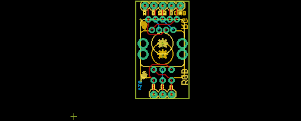

Contents
========

* [PRS11722 > Rotary Encoder Breakout-Illuminated](#prs11722--rotary-encoder-breakout-illuminated)
	* [Schematic](#schematic)
	* [PCB](#pcb)
	* [Interactive BOM](#interactive-bom)
	* [OOMP Parts](#oomp-parts)
	* [Images](#images)
	* [Tags](#tags)
  
![][im]
# PRS11722 > Rotary Encoder Breakout-Illuminated

- ID: PROJ-SPAR-11722-STAN-01
- Hex ID: PRS11722
- Name: Sparkfun
- Description: Sparkfun
- Long Link: [http://oom.lt/PROJ-SPAR-11722-STAN-01](http://oom.lt/PROJ-SPAR-11722-STAN-01)
- Short Link: [http://oom.lt/PRS11722](http://oom.lt/PRS11722)

## Schematic
  

## PCB
  

## Interactive BOM

- Interactive BOM page: [ibom.html](https://htmlpreview.github.io/?https://github.com/oomlout/oomlout_OOMP_projects/blob/main/PROJ-SPAR-11722-STAN-01/kicad/bom/ibom.html)

## OOMP Parts
  

|OOMP Parts|
| :---: |
|[JP1 HEAD-I01-X-PI03-01 2.54 mm 3 Pin Header](https://github.com/oomlout/oomlout_OOMP_parts/tree/main/HEAD-I01-X-PI03-01/)|
|[JP2 HEAD-I01-X-PI05-01 2.54 mm 5 Pin Header](https://github.com/oomlout/oomlout_OOMP_parts/tree/main/HEAD-I01-X-PI05-01/)|
|SW1 SW1,UNMATCHED-UNMATCHED-X-UNMATCHED-01|
|U1 U1,UNMATCHED-UNMATCHED-X-UNMATCHED-01|

## Images
  
  

|kicadPcb3d|kicadPcb3dFront|kicadPcb3dBack|eagleImage|eagleSchemImage|
| :---: | :---: | :---: | :---: | :---: |
||||||

## Tags

- hexID: PRS11722
- oompType: PROJ
- oompSize: SPAR
- oompColor: 11722
- oompDesc: STAN
- oompIndex: 01
- oompName: Rotary Encoder Breakout-Illuminated
- sources: All source files from https://github.com/sparkfun/Rotary_Encoder_Breakout-Illuminated (source licence details in srcLicense.md)
- linkBuyPage: https://www.sparkfun.com/products/11722
- oompID: PROJ-SPAR-11722-STAN-01
- oompParts: JP1,HEAD-I01-X-PI03-01
- oompParts: JP2,HEAD-I01-X-PI05-01
- oompParts: SW1,UNMATCHED-UNMATCHED-X-UNMATCHED-01
- oompParts: U1,UNMATCHED-UNMATCHED-X-UNMATCHED-01
- rawParts: FRAME1,FRAME-LETTER,FRAME-LETTER,CREATIVE_COMMONS,Schematic Frame,,
- rawParts: JP1,,M03PTH,1X03,Header 3,,
- rawParts: JP2,,M05PTH,1X05,Header 5,,
- rawParts: JP3,LOGO-SFESK,LOGO-SFESK,SFE-LOGO-FLAME,Spark Fun Electronics PCB Logo,,
- rawParts: JP4,LOGO-SFESK,LOGO-SFESK,SFE-LOGO-FLAME,Spark Fun Electronics PCB Logo,,
- rawParts: SW1,,ENCODER_RGB_CAKIT,ENCODER_LED_3_KIT,Illuminated Rotary Encoder w/ RGB LED and select switch,,
- rawParts: U$2,OSHW-LOGOS,OSHW-LOGOS,OSHW-LOGO-S,Open Source Hardware Logo This logo indicates the piece of hardware it is found on incorporates a OSHW license and/or adheres to the definition of open source hardware found here: http://freedomdefined.org/OSHW,,
- rawParts: U1,ENCODER_2LEDKIT,ENCODER_2LEDKIT,ENCODER_LED_2_KIT,Illuminated Rotary Encoder w/ 2 LEDs,,

[im]: kicadPcb3d_450.png
