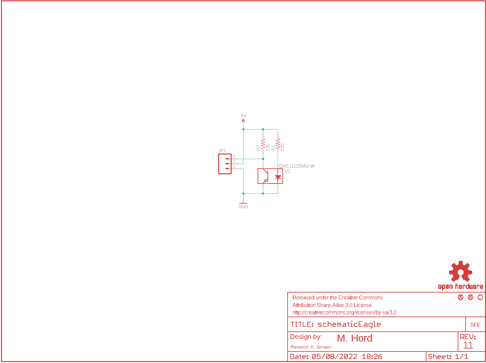
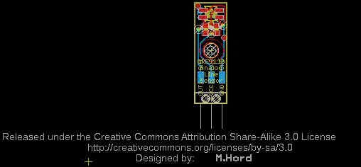
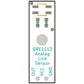
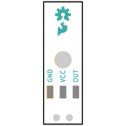
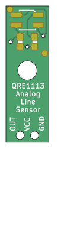
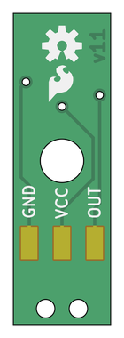

Contents
========

* [PRS11769 > RedBot Line Sensor](#prs11769--redbot-line-sensor)
	* [Schematic](#schematic)
	* [PCB](#pcb)
	* [Interactive BOM](#interactive-bom)
	* [OOMP Parts](#oomp-parts)
	* [Images](#images)
	* [Tags](#tags)
  
![][im]
# PRS11769 > RedBot Line Sensor

- ID: PROJ-SPAR-11769-STAN-01
- Hex ID: PRS11769
- Name: Sparkfun
- Description: Sparkfun
- Long Link: [http://oom.lt/PROJ-SPAR-11769-STAN-01](http://oom.lt/PROJ-SPAR-11769-STAN-01)
- Short Link: [http://oom.lt/PRS11769](http://oom.lt/PRS11769)

## Schematic
  

## PCB
  

## Interactive BOM

- Interactive BOM page: [ibom.html](https://htmlpreview.github.io/?https://github.com/oomlout/oomlout_OOMP_projects/blob/main/PROJ-SPAR-11769-STAN-01/kicad/bom/ibom.html)

## OOMP Parts
  

|OOMP Parts|
| :---: |
|[HEAD-I01-X-PI03-01  2.54 mm 3 Pin Header  JP1](https://github.com/oomlout/oomlout_OOMP_parts/tree/main/HEAD-I01-X-PI03-01/)|
|[RESE-0603-X-O101-01  SMD (0603) 100 Ohm Resistor  R1](https://github.com/oomlout/oomlout_OOMP_parts/tree/main/RESE-0603-X-O101-01/)|
|[RESE-0603-X-O103-01  SMD (0603) 10k Ohm Resistor  R2](https://github.com/oomlout/oomlout_OOMP_parts/tree/main/RESE-0603-X-O103-01/)|
|UNMATCHED-UNMATCHED-X-UNMATCHED-01 U1|

## Images
  
  

|bominteractivefront|bominteractiveback|kicadPcb3d|kicadPcb3dFront|kicadPcb3dBack|eagleImage|eagleSchemImage|pcbdraw|pcbdrawback|
| :---: | :---: | :---: | :---: | :---: | :---: | :---: | :---: | :---: |
||||||||||

## Tags

- hexID: PRS11769
- oompType: PROJ
- oompSize: SPAR
- oompColor: 11769
- oompDesc: STAN
- oompIndex: 01
- oompName: RedBot Line Sensor
- sources: All source files from https://github.com/sparkfun/RedBot_Line_Sensor (source licence details in srcLicense.md)
- linkBuyPage: https://www.sparkfun.com/products/11769
- oompID: PROJ-SPAR-11769-STAN-01
- oompParts: JP1,HEAD-I01-X-PI03-01
- oompParts: R1,RESE-0603-X-O101-01
- oompParts: R2,RESE-0603-X-O103-01
- oompParts: U1,UNMATCHED-UNMATCHED-X-UNMATCHED-01
- rawParts: FID1,FIDUCIAL1X2,FIDUCIAL1X2,FIDUCIAL-1X2,Fiducial Alignment Points,,,
- rawParts: FID2,FIDUCIAL1X2,FIDUCIAL1X2,FIDUCIAL-1X2,Fiducial Alignment Points,,,
- rawParts: FRAME1,FRAME-LETTER,FRAME-LETTER,CREATIVE_COMMONS,Schematic Frame,,,
- rawParts: JP1,,M031X03_SMD_RA_MALE_POST_SMALLER,1X03_SMD_RA_MALE_POST_SMALLER,Header 3,,,
- rawParts: LOGO2,OSHW-LOGOS,OSHW-LOGOS,OSHW-LOGO-S,Open Source Hardware Logo This logo indicates the piece of hardware it is found on incorporates a OSHW license and/or adheres to the definition of open source hardware found here: http://freedomdefined.org/OSHW,,,
- rawParts: LOGO3,LOGO-SFESK,LOGO-SFESK,SFE-LOGO-FLAME,Spark Fun Electronics PCB Logo,,,
- rawParts: R1,100,100-1%,0603-RES,100-ohm SMT,RES-07863,100,
- rawParts: R2,10k,10KOHM1/10W1%(0603)0603,0603-RES,RES-00824,RES-00824,10K,
- rawParts: STANDOFF1,STAND-OFF,STAND-OFF,STAND-OFF,#4 Stand Off,,,
- rawParts: U1,QRE1113SMD-W,QRE1113SMD-W,QRE1113-W,Reflective object sensor,,,

[im]: kicadPcb3d_450.png
