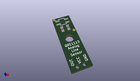
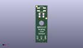
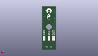
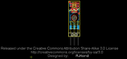

Contents
========

* [PRS11769 > Sparkfun](#prs11769--sparkfun)
	* [Images](#images)
	* [Tags](#tags)
  
![][im]
# PRS11769 > Sparkfun

- ID: PROJ-SPAR-11769-STAN-01
- Hex ID: PRS11769
- Name: Sparkfun
- Description: Sparkfun

## Images
  
  

|kicadPcb3d|kicadPcb3dFront|kicadPcb3dBack|eagleImage|eagleSchemImage|
| :---: | :---: | :---: | :---: | :---: |
||||||

## Tags

- hexID: PRS11769
- oompType: PROJ
- oompSize: SPAR
- oompColor: 11769
- oompDesc: STAN
- oompIndex: 01
- oompName: RedBot Line Sensor
- sources: All source files from https://github.com/sparkfun/RedBot_Line_Sensor (source licence details in srcLicense.md)
- linkBuyPage: https://www.sparkfun.com/products/11769
- oompID: PROJ-SPAR-11769-STAN-01
- oompParts: FRAME1,UNMATCHED-UNMATCHED-UNMATCHED-UNMATCHED-UNMATCHED
- oompParts: JP1,UNMATCHED-UNMATCHED-UNMATCHED-UNMATCHED-UNMATCHED
- oompParts: LOGO2,UNMATCHED-UNMATCHED-UNMATCHED-UNMATCHED-UNMATCHED
- oompParts: LOGO3,UNMATCHED-UNMATCHED-UNMATCHED-UNMATCHED-UNMATCHED
- oompParts: R1,UNMATCHED-UNMATCHED-UNMATCHED-UNMATCHED-UNMATCHED
- oompParts: R2,UNMATCHED-UNMATCHED-UNMATCHED-UNMATCHED-UNMATCHED
- oompParts: STANDOFF1,UNMATCHED-UNMATCHED-UNMATCHED-UNMATCHED-UNMATCHED
- oompParts: U1,UNMATCHED-UNMATCHED-UNMATCHED-UNMATCHED-UNMATCHED
- rawParts: FID1,FIDUCIAL1X2,FIDUCIAL1X2,FIDUCIAL-1X2,Fiducial Alignment Points,,,
- rawParts: FID2,FIDUCIAL1X2,FIDUCIAL1X2,FIDUCIAL-1X2,Fiducial Alignment Points,,,
- rawParts: FRAME1,FRAME-LETTER,FRAME-LETTER,CREATIVE_COMMONS,Schematic Frame,,,
- rawParts: JP1,,M031X03_SMD_RA_MALE_POST_SMALLER,1X03_SMD_RA_MALE_POST_SMALLER,Header 3,,,
- rawParts: LOGO2,OSHW-LOGOS,OSHW-LOGOS,OSHW-LOGO-S,Open Source Hardware Logo This logo indicates the piece of hardware it is found on incorporates a OSHW license and/or adheres to the definition of open source hardware found here: http://freedomdefined.org/OSHW,,,
- rawParts: LOGO3,LOGO-SFESK,LOGO-SFESK,SFE-LOGO-FLAME,Spark Fun Electronics PCB Logo,,,
- rawParts: R1,100,100-1%,0603-RES,100-ohm SMT,RES-07863,100,
- rawParts: R2,10k,10KOHM1/10W1%(0603)0603,0603-RES,RES-00824,RES-00824,10K,
- rawParts: STANDOFF1,STAND-OFF,STAND-OFF,STAND-OFF,#4 Stand Off,,,
- rawParts: U1,QRE1113SMD-W,QRE1113SMD-W,QRE1113-W,Reflective object sensor,,,

[im]: kicadPcb3d_450.png
