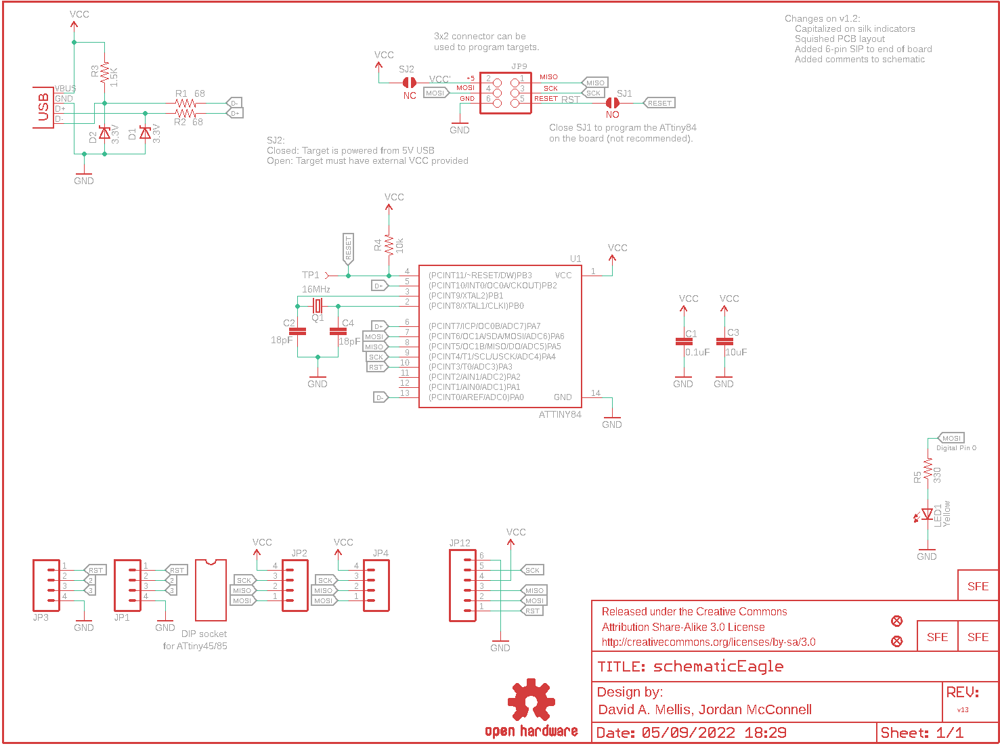
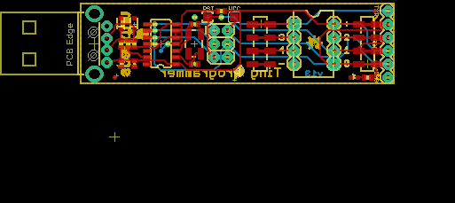
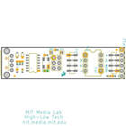
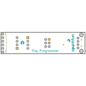
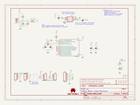
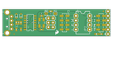
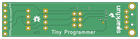

Contents
========

* [PRS11801 > Tiny-AVR-Programmer](#prs11801--tiny-avr-programmer)
	* [Schematic](#schematic)
	* [PCB](#pcb)
	* [Interactive BOM](#interactive-bom)
	* [OOMP Parts](#oomp-parts)
	* [Images](#images)
	* [Tags](#tags)
  
![][im]
# PRS11801 > Tiny-AVR-Programmer

- ID: PROJ-SPAR-11801-STAN-01
- Hex ID: PRS11801
- Name: Sparkfun
- Description: Sparkfun
- Long Link: [http://oom.lt/PROJ-SPAR-11801-STAN-01](http://oom.lt/PROJ-SPAR-11801-STAN-01)
- Short Link: [http://oom.lt/PRS11801](http://oom.lt/PRS11801)

## Schematic
  

## PCB
  

## Interactive BOM

- Interactive BOM page: [ibom.html](https://htmlpreview.github.io/?https://github.com/oomlout/oomlout_OOMP_projects/blob/main/PROJ-SPAR-11801-STAN-01/kicad/bom/ibom.html)

## OOMP Parts
  

|OOMP ID|Name|Identifier|
| :---: | :---: | :---: |
|[CAPC-0402-X-NF100-V10](https://github.com/oomlout/oomlout_OOMP_parts/tree/main/CAPC-0402-X-NF100-V10/)|[SMD (0402) 100 nF Capacitor (Ceramic) 10v](https://github.com/oomlout/oomlout_OOMP_parts/tree/main/CAPC-0402-X-NF100-V10/)|[C1](https://github.com/oomlout/oomlout_OOMP_parts/tree/main/CAPC-0402-X-NF100-V10/)|
|[CAPC-0402-X-PF18-V50](https://github.com/oomlout/oomlout_OOMP_parts/tree/main/CAPC-0402-X-PF18-V50/)|[SMD (0402) 18 pF Capacitor (Ceramic) 50v](https://github.com/oomlout/oomlout_OOMP_parts/tree/main/CAPC-0402-X-PF18-V50/)|[C2, C4](https://github.com/oomlout/oomlout_OOMP_parts/tree/main/CAPC-0402-X-PF18-V50/)|
|[CAPC-0402-X-UF10-V63D](https://github.com/oomlout/oomlout_OOMP_parts/tree/main/CAPC-0402-X-UF10-V63D/)|[SMD (0402) 10 uF Capacitor (Ceramic) 6.3v](https://github.com/oomlout/oomlout_OOMP_parts/tree/main/CAPC-0402-X-UF10-V63D/)|[C3](https://github.com/oomlout/oomlout_OOMP_parts/tree/main/CAPC-0402-X-UF10-V63D/)|
|DIOD-S323-X-UNMATCHED-01||D1, D2|
|[HEAD-I01-X-PI04-01](https://github.com/oomlout/oomlout_OOMP_parts/tree/main/HEAD-I01-X-PI04-01/)|[2.54 mm 4 Pin Header](https://github.com/oomlout/oomlout_OOMP_parts/tree/main/HEAD-I01-X-PI04-01/)|[JP1, JP2, JP3, JP4](https://github.com/oomlout/oomlout_OOMP_parts/tree/main/HEAD-I01-X-PI04-01/)|
|UNMATCHED-UNMATCHED-X-UNMATCHED-01||JP9, Q1, X1|
|[HEAD-I01-X-PI06-01](https://github.com/oomlout/oomlout_OOMP_parts/tree/main/HEAD-I01-X-PI06-01/)|[2.54 mm 6 Pin Header](https://github.com/oomlout/oomlout_OOMP_parts/tree/main/HEAD-I01-X-PI06-01/)|[JP12](https://github.com/oomlout/oomlout_OOMP_parts/tree/main/HEAD-I01-X-PI06-01/)|
|[LEDS-0603-Y-STAN-01](https://github.com/oomlout/oomlout_OOMP_parts/tree/main/LEDS-0603-Y-STAN-01/)|[SMD (0603) Yellow LED](https://github.com/oomlout/oomlout_OOMP_parts/tree/main/LEDS-0603-Y-STAN-01/)|[LED1](https://github.com/oomlout/oomlout_OOMP_parts/tree/main/LEDS-0603-Y-STAN-01/)|
|RESE-0402-X-O680-01||R1, R2|
|RESE-0402-X-UNMATCHED-01||R3|
|[RESE-0402-X-O103-01](https://github.com/oomlout/oomlout_OOMP_parts/tree/main/RESE-0402-X-O103-01/)|[SMD (0402) 10k Ohm Resistor](https://github.com/oomlout/oomlout_OOMP_parts/tree/main/RESE-0402-X-O103-01/)|[R4](https://github.com/oomlout/oomlout_OOMP_parts/tree/main/RESE-0402-X-O103-01/)|
|[RESE-0402-X-O331-01](https://github.com/oomlout/oomlout_OOMP_parts/tree/main/RESE-0402-X-O331-01/)|[SMD (0402) 330 Ohm Resistor](https://github.com/oomlout/oomlout_OOMP_parts/tree/main/RESE-0402-X-O331-01/)|[R5](https://github.com/oomlout/oomlout_OOMP_parts/tree/main/RESE-0402-X-O331-01/)|
|[HEAD-JSTSH-X-PI04-RS](https://github.com/oomlout/oomlout_OOMP_parts/tree/main/HEAD-JSTSH-X-PI04-RS/)|[JST XH (1 mm) 4 Pin Header Right Angle (SMD)](https://github.com/oomlout/oomlout_OOMP_parts/tree/main/HEAD-JSTSH-X-PI04-RS/)|[U1](https://github.com/oomlout/oomlout_OOMP_parts/tree/main/HEAD-JSTSH-X-PI04-RS/)|

## Images
  
  

|bominteractivefront|bominteractiveback|kicadPcb3d|kicadPcb3dFront|kicadPcb3dBack|kicadSchem|eagleImage|eagleSchemImage|pcbdraw|pcbdrawback|
| :---: | :---: | :---: | :---: | :---: | :---: | :---: | :---: | :---: | :---: |
|||||||||||

## Tags

- hexID: PRS11801
- oompType: PROJ
- oompSize: SPAR
- oompColor: 11801
- oompDesc: STAN
- oompIndex: 01
- oompName: Tiny-AVR-Programmer
- sources: All source files from https://github.com/sparkfun/Tiny-AVR-Programmer (source licence details in srcLicense.md)
- linkBuyPage: https://www.sparkfun.com/products/11801
- oompID: PROJ-SPAR-11801-STAN-01
- oompParts: C1,CAPC-0402-X-NF100-V10
- oompParts: C2,CAPC-0402-X-PF18-V50
- oompParts: C3,CAPC-0402-X-UF10-V63D
- oompParts: C4,CAPC-0402-X-PF18-V50
- oompParts: D1,DIOD-S323-X-UNMATCHED-01
- oompParts: D2,DIOD-S323-X-UNMATCHED-01
- oompParts: JP1,HEAD-I01-X-PI04-01
- oompParts: JP2,HEAD-I01-X-PI04-01
- oompParts: JP3,HEAD-I01-X-PI04-01
- oompParts: JP4,HEAD-I01-X-PI04-01
- oompParts: JP9,UNMATCHED-UNMATCHED-X-UNMATCHED-01
- oompParts: JP12,HEAD-I01-X-PI06-01
- oompParts: LED1,LEDS-0603-Y-STAN-01
- oompParts: Q1,UNMATCHED-UNMATCHED-X-UNMATCHED-01
- oompParts: R1,RESE-0402-X-O680-01
- oompParts: R2,RESE-0402-X-O680-01
- oompParts: R3,RESE-0402-X-UNMATCHED-01
- oompParts: R4,RESE-0402-X-O103-01
- oompParts: R5,RESE-0402-X-O331-01
- oompParts: U1,HEAD-JSTSH-X-PI04-RS
- oompParts: X1,UNMATCHED-UNMATCHED-X-UNMATCHED-01
- rawParts: C1,0.1uF,CAP0402-CAP,0402-CAP,Capacitor,,
- rawParts: C2,18pF,CAP0402-CAP,0402-CAP,Capacitor,,
- rawParts: C3,10uF,CAP0402-CAP,0402-CAP,Capacitor,,
- rawParts: C4,18pF,CAP0402-CAP,0402-CAP,Capacitor,,
- rawParts: D1,3.3V,DIODE-ZENER-BZT52,SOD-323,Zener Diode,,
- rawParts: D2,3.3V,DIODE-ZENER-BZT52,SOD-323,Zener Diode,,
- rawParts: FRAME1,FRAME-LETTER,FRAME-LETTER,CREATIVE_COMMONS,Schematic Frame,,
- rawParts: JP1,,M04PTH,1X04,Header 4,,
- rawParts: JP2,,M04PTH,1X04,Header 4,,
- rawParts: JP3,,M04SMD_STRAIGHT_COMBO,1X04_SMD_STRAIGHT_COMBO,Header 4,,
- rawParts: JP4,,M04SMD_STRAIGHT_COMBO,1X04_SMD_STRAIGHT_COMBO,Header 4,,
- rawParts: JP5,LOGO-SFENW2,LOGO-SFENW2,SFE-NEW-WEB,Spark Fun Electronics PCB Logo,,
- rawParts: JP6,LOGO-SFESK,LOGO-SFESK,SFE-LOGO-FLAME,Spark Fun Electronics PCB Logo,,
- rawParts: JP7,FIDUCIALUFIDUCIAL,FIDUCIALUFIDUCIAL,MICRO-FIDUCIAL,Fiducial Alignment Points,,
- rawParts: JP8,FIDUCIALUFIDUCIAL,FIDUCIALUFIDUCIAL,MICRO-FIDUCIAL,Fiducial Alignment Points,,
- rawParts: JP9,,AVR_SPI_PRG_6PTH,2X3,AVR ISP 6 Pin,,
- rawParts: JP11,LOGO-SFESK,LOGO-SFESK,SFE-LOGO-FLAME,Spark Fun Electronics PCB Logo,,
- rawParts: JP12,,M06SIP,1X06,Header 6,,
- rawParts: LED1,Yellow,LED0603,LED-0603,LEDs,,
- rawParts: Q1,16MHz,CRYSTAL5X3,CRYSTAL-SMD-5X3,Various standard crystals. Proven footprints. Spark Fun Electronics SKU : COM-00534,,
- rawParts: R1,68,RESISTOR0402-RES,0402-RES,Resistor,,
- rawParts: R2,68,RESISTOR0402-RES,0402-RES,Resistor,,
- rawParts: R3,1.5K,RESISTOR0402-RES,0402-RES,Resistor,,
- rawParts: R4,10k,RESISTOR0402-RES,0402-RES,Resistor,,
- rawParts: R5,330,RESISTOR0402-RES,0402-RES,Resistor,,
- rawParts: SJ1,SOLDERJUMPERNO,SOLDERJUMPERNO,SJ_2S-NO,Solder Jumper,,
- rawParts: SJ2,NC,SOLDERJUMPERNC,SJ_2S,Solder Jumper,,
- rawParts: TP1,TEST-POINT3,TEST-POINT3,PAD.03X.03,Bare copper test points for troubleshooting or ICT,,
- rawParts: U$1,OSHW-LOGOS,OSHW-LOGOS,OSHW-LOGO-S,Open Source Hardware Logo This logo indicates the piece of hardware it is found on incorporates a OSHW license and/or adheres to the definition of open source hardware found here: http://freedomdefined.org/OSHW,,
- rawParts: U1,ATTINY84,ATTINY84,SO14,Atmel 14-pin 2/4/8kB flash uC,,
- rawParts: X1,USB-A-H,USB-A-H,USB-A-H,USB Connectors,,

[im]: kicadPcb3d_450.png
