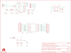

Contents
========

* [PRS11812 > XBee Explorer USB](#prs11812--xbee-explorer-usb)
	* [Schematic](#schematic)
	* [PCB](#pcb)
	* [Interactive BOM](#interactive-bom)
	* [OOMP Parts](#oomp-parts)
	* [Images](#images)
	* [Tags](#tags)
  
![][im]
# PRS11812 > XBee Explorer USB

- ID: PROJ-SPAR-11812-STAN-01
- Hex ID: PRS11812
- Name: Sparkfun
- Description: Sparkfun
- Long Link: [http://oom.lt/PROJ-SPAR-11812-STAN-01](http://oom.lt/PROJ-SPAR-11812-STAN-01)
- Short Link: [http://oom.lt/PRS11812](http://oom.lt/PRS11812)

## Schematic
  

## PCB
  

## Interactive BOM

- Interactive BOM page: [ibom.html](https://htmlpreview.github.io/?https://github.com/oomlout/oomlout_OOMP_projects/blob/main/PROJ-SPAR-11812-STAN-01/kicad/bom/ibom.html)

## OOMP Parts
  

|OOMP ID|Name|Identifier|
| :---: | :---: | :---: |
|[CAPT-3216-X-UF10-V10](https://github.com/oomlout/oomlout_OOMP_parts/tree/main/CAPT-3216-X-UF10-V10/)|[SMD (3216) 10 uF Capacitor (Tantalum) 10v](https://github.com/oomlout/oomlout_OOMP_parts/tree/main/CAPT-3216-X-UF10-V10/)|[C1](https://github.com/oomlout/oomlout_OOMP_parts/tree/main/CAPT-3216-X-UF10-V10/)|
|CAPC-0603-X-PF47-01||C3, C4|
|[CAPC-0603-X-NF100-V50](https://github.com/oomlout/oomlout_OOMP_parts/tree/main/CAPC-0603-X-NF100-V50/)|[SMD (0603) 100 nF Capacitor (Ceramic) 50v](https://github.com/oomlout/oomlout_OOMP_parts/tree/main/CAPC-0603-X-NF100-V50/)|[C5, C6, C7](https://github.com/oomlout/oomlout_OOMP_parts/tree/main/CAPC-0603-X-NF100-V50/)|
|[LEDS-0603-R-STAN-01](https://github.com/oomlout/oomlout_OOMP_parts/tree/main/LEDS-0603-R-STAN-01/)|[SMD (0603) Red LED](https://github.com/oomlout/oomlout_OOMP_parts/tree/main/LEDS-0603-R-STAN-01/)|[D1, D2](https://github.com/oomlout/oomlout_OOMP_parts/tree/main/LEDS-0603-R-STAN-01/)|
|[LEDS-0603-G-STAN-01](https://github.com/oomlout/oomlout_OOMP_parts/tree/main/LEDS-0603-G-STAN-01/)|[SMD (0603) Green LED](https://github.com/oomlout/oomlout_OOMP_parts/tree/main/LEDS-0603-G-STAN-01/)|[D3, D4](https://github.com/oomlout/oomlout_OOMP_parts/tree/main/LEDS-0603-G-STAN-01/)|
|HEAD-I01-X-PI11-01||JP5, JP6|
|RESE-0603-X-O270-01||R2, R5|
|[RESE-0603-X-O102-01](https://github.com/oomlout/oomlout_OOMP_parts/tree/main/RESE-0603-X-O102-01/)|[SMD (0603) 1k Ohm Resistor](https://github.com/oomlout/oomlout_OOMP_parts/tree/main/RESE-0603-X-O102-01/)|[R4, R6, R8](https://github.com/oomlout/oomlout_OOMP_parts/tree/main/RESE-0603-X-O102-01/)|
|[RESE-0603-X-O331-01](https://github.com/oomlout/oomlout_OOMP_parts/tree/main/RESE-0603-X-O331-01/)|[SMD (0603) 330 Ohm Resistor](https://github.com/oomlout/oomlout_OOMP_parts/tree/main/RESE-0603-X-O331-01/)|[R7](https://github.com/oomlout/oomlout_OOMP_parts/tree/main/RESE-0603-X-O331-01/)|
|UNMATCHED-UNMATCHED-X-UNMATCHED-01||S2, U2, U4, X1|
|UNMATCHED-SO235-X-UNMATCHED-01||U3|

## Images
  
  

|bominteractivefront|bominteractiveback|kicadPcb3d|kicadPcb3dFront|kicadPcb3dBack|eagleImage|eagleSchemImage|pcbdraw|pcbdrawback|
| :---: | :---: | :---: | :---: | :---: | :---: | :---: | :---: | :---: |
||||||||||

## Tags

- hexID: PRS11812
- oompType: PROJ
- oompSize: SPAR
- oompColor: 11812
- oompDesc: STAN
- oompIndex: 01
- oompName: XBee Explorer USB
- sources: All source files from https://github.com/sparkfun/XBee_Explorer_USB (source licence details in srcLicense.md)
- linkBuyPage: https://www.sparkfun.com/products/11812
- oompID: PROJ-SPAR-11812-STAN-01
- oompParts: C1,CAPT-3216-X-UF10-V10
- oompParts: C3,CAPC-0603-X-PF47-01
- oompParts: C4,CAPC-0603-X-PF47-01
- oompParts: C5,CAPC-0603-X-NF100-V50
- oompParts: C6,CAPC-0603-X-NF100-V50
- oompParts: C7,CAPC-0603-X-NF100-V50
- oompParts: D1,LEDS-0603-R-STAN-01
- oompParts: D2,LEDS-0603-R-STAN-01
- oompParts: D3,LEDS-0603-G-STAN-01
- oompParts: D4,LEDS-0603-G-STAN-01
- oompParts: JP5,HEAD-I01-X-PI11-01
- oompParts: JP6,HEAD-I01-X-PI11-01
- oompParts: R2,RESE-0603-X-O270-01
- oompParts: R4,RESE-0603-X-O102-01
- oompParts: R5,RESE-0603-X-O270-01
- oompParts: R6,RESE-0603-X-O102-01
- oompParts: R7,RESE-0603-X-O331-01
- oompParts: R8,RESE-0603-X-O102-01
- oompParts: S2,UNMATCHED-UNMATCHED-X-UNMATCHED-01
- oompParts: U2,UNMATCHED-UNMATCHED-X-UNMATCHED-01
- oompParts: U3,UNMATCHED-SO235-X-UNMATCHED-01
- oompParts: U4,UNMATCHED-UNMATCHED-X-UNMATCHED-01
- oompParts: X1,UNMATCHED-UNMATCHED-X-UNMATCHED-01
- rawParts: C1,10uF,CAP_POL1206,EIA3216,Capacitor Polarized,,,
- rawParts: C3,47pF,CAP0603-CAP,0603-CAP,Capacitor,,,
- rawParts: C4,47pF,CAP0603-CAP,0603-CAP,Capacitor,,,
- rawParts: C5,0.1uF,CAP0603-CAP,0603-CAP,Capacitor,,,
- rawParts: C6,0.1uF,CAP0603-CAP,0603-CAP,Capacitor,,,
- rawParts: C7,0.1uF,CAP0603-CAP,0603-CAP,Capacitor,,,
- rawParts: D1,RED,LED-RED0603,LED-0603,Assorted Red LEDs,DIO-00819,RED,
- rawParts: D2,RED,LED-RED0603,LED-0603,Assorted Red LEDs,DIO-00819,RED,
- rawParts: D3,GREEN,LED-GREEN0603,LED-0603,Various green LEDs,DIO-00821,GREEN,
- rawParts: D4,GREEN,LED-GREEN0603,LED-0603,Various green LEDs,DIO-00821,GREEN,
- rawParts: FRAME1,FRAME-LETTER,FRAME-LETTER,CREATIVE_COMMONS,Schematic Frame,,,
- rawParts: JP1,FIDUCIAL1X2,FIDUCIAL1X2,FIDUCIAL-1X2,Fiducial Alignment Points,,,
- rawParts: JP4,FIDUCIAL1X2,FIDUCIAL1X2,FIDUCIAL-1X2,Fiducial Alignment Points,,,
- rawParts: JP5,M111X11_NO_SILK,M111X11_NO_SILK,1X11_NO_SILK,Header 11,,,
- rawParts: JP6,M111X11_NO_SILK,M111X11_NO_SILK,1X11_NO_SILK,Header 11,,,
- rawParts: LOGO1,OSHW-LOGOS,OSHW-LOGOS,OSHW-LOGO-S,Open Source Hardware Logo This logo indicates the piece of hardware it is found on incorporates a OSHW license and/or adheres to the definition of open source hardware found here: http://freedomdefined.org/OSHW,,,
- rawParts: R2,27,RESISTOR0603-RES,0603-RES,Resistor,,,
- rawParts: R4,1k,RESISTOR0603-RES,0603-RES,Resistor,,,
- rawParts: R5,27,RESISTOR0603-RES,0603-RES,Resistor,,,
- rawParts: R6,1k,RESISTOR0603-RES,0603-RES,Resistor,,,
- rawParts: R7,330,RESISTOR0603-RES,0603-RES,Resistor,,,
- rawParts: R8,1k,RESISTOR0603-RES,0603-RES,Resistor,,,
- rawParts: S2,Reset,SWITCH-MOMENTARY-2SMD,TACTILE_SWITCH_SMD,Various NO switches- pushbuttons, reed, etc,SWCH-08247,,
- rawParts: SJ1,RSSI_LED_EN,SOLDERJUMPERTRACE,SJ_2S-TRACE,Solder Jumper,,,
- rawParts: SJ2,CTS_EN,SOLDERJUMPERTRACE,SJ_2S-TRACE,Solder Jumper,,,
- rawParts: SJ3,RTS_EN,SOLDERJUMPERTRACE,SJ_2S-TRACE,Solder Jumper,,,
- rawParts: SJ4,DTR,SOLDERJUMPERTRACE,SJ_2S-TRACE,Solder Jumper,,,
- rawParts: U$1,LOGO-SFESK,LOGO-SFESK,SFE-LOGO-FLAME,Spark Fun Electronics PCB Logo,,,
- rawParts: U$4,LOGO-SFENEW,LOGO-SFENEW,SFE-NEW-WEBLOGO,Spark Fun Electronics PCB Logo,,,
- rawParts: U$5,STAND-OFF,STAND-OFF,STAND-OFF,Stand Off,,,
- rawParts: U$9,STAND-OFF,STAND-OFF,STAND-OFF,Stand Off,,,
- rawParts: U$10,STAND-OFF,STAND-OFF,STAND-OFF,Stand Off,,,
- rawParts: U$11,STAND-OFF,STAND-OFF,STAND-OFF,Stand Off,,,
- rawParts: U2,XBEE-1B3,XBEE-1B3,XBEE-SMD,,,,
- rawParts: U3,MIC5219 3.3V,V_REG_LDOSMD,SOT23-5,Voltage Regulator LDO,,,
- rawParts: U4,FT231XS,FT231XS,SSOP20_L,FTDI FT231X Full Speed USB to Full-handshake UART,,,
- rawParts: X1,USBSMD,USBSMD,USB-MINIB,USB Connectors,,,

[im]: kicadPcb3d_450.png
