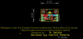
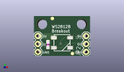
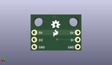
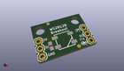

Contents
========

* [PROJ-SPAR-11820-STAN-01>WS2812 Breakout](#proj-spar-11820-stan-01ws2812-breakout)
	* [Images](#images)
	* [Interactive BOM](#interactive-bom)
	* [OOMP Parts](#oomp-parts)
	* [Tags](#tags)
  
![][im]
# PROJ-SPAR-11820-STAN-01>WS2812 Breakout

- ID: PROJ-SPAR-11820-STAN-01
- Hex ID: PRS11820
- Name: WS2812 Breakout
- Description: 

## Images
  
  

|eagleImage|kicadPcb3dFront|kicadPcb3dBack|kicadPcb3d|
| :---: | :---: | :---: | :---: |
|||||

## Interactive BOM

- Interactive BOM page: [ibom.html](kicad/bom/ibom.html)

## OOMP Parts
  

|OOMP Parts|
| :---: |
|CAPE-0603-X-NF100-01, C1, 4.444999999999999, 3.6067999999999993, 90,C1, 0.1uF, 0603-CAP, SparkFun-Capacitors, (0.175, 0.142), R90|
|UNMATCHED-UNMATCHED-X-UNMATCHED-01, JP1, 1.27, 1.27, 90,JP1, INPUT, 1X03, SparkFun-Connectors, (0.05, 0.05), R90|
|UNMATCHED-UNMATCHED-X-UNMATCHED-01, JP2, 16.509999999999998, 1.27, 90,JP2, OUTPUT, 1X03, SparkFun-Connectors, (0.65, 0.05), R90|
|UNMATCHED-UNMATCHED-X-UNMATCHED-01, U1, 8.889999999999999, 4.2164, 0,U1, WS2812B, WS2812B, SparkFun-LED, (0.35, 0.166), R0|

## Tags

- hexID: PRS11820
- oompType: PROJ
- oompSize: SPAR
- oompColor: 11820
- oompDesc: STAN
- oompIndex: 01
- oompName: WS2812 Breakout
- sources: All source files from https://github.com/sparkfun/WS2812_Breakout (source licence details in srcLicense.md)
- linkBuyPage: https://www.sparkfun.com/products/11820
- oompPart: CAPE-0603-X-NF100-01, C1, 4.444999999999999, 3.6067999999999993, 90
- oompPart: SKIP-UNMATCHED-X-UNMATCHED-01, FID1, 5.842, 11.937999999999999, 0
- oompPart: SKIP-UNMATCHED-X-UNMATCHED-01, FID2, 12.191999999999998, 0.7619999999999999, 0
- oompPart: UNMATCHED-UNMATCHED-X-UNMATCHED-01, JP1, 1.27, 1.27, 90
- oompPart: UNMATCHED-UNMATCHED-X-UNMATCHED-01, JP2, 16.509999999999998, 1.27, 90
- oompPart: UNMATCHED-UNMATCHED-X-UNMATCHED-01, U1, 8.889999999999999, 4.2164, 0
- rawPart: C1, 0.1uF, 0603-CAP, SparkFun-Capacitors, (0.175, 0.142), R90
- rawPart: FID1, FIDUCIAL1X2, FIDUCIAL-1X2, SparkFun-Aesthetics, (0.23, 0.47), R0
- rawPart: FID2, FIDUCIAL1X2, FIDUCIAL-1X2, SparkFun-Aesthetics, (0.48, 0.03), R0
- rawPart: JP1, INPUT, 1X03, SparkFun-Connectors, (0.05, 0.05), R90
- rawPart: JP2, OUTPUT, 1X03, SparkFun-Connectors, (0.65, 0.05), R90
- rawPart: U1, WS2812B, WS2812B, SparkFun-LED, (0.35, 0.166), R0

[im]: kicadPcb3d_450.png
