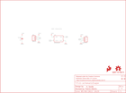

Contents
========

* [PRS11820 > WS2812 Breakout](#prs11820--ws2812-breakout)
	* [Schematic](#schematic)
	* [PCB](#pcb)
	* [Interactive BOM](#interactive-bom)
	* [OOMP Parts](#oomp-parts)
	* [Images](#images)
	* [Tags](#tags)
  
![][im]
# PRS11820 > WS2812 Breakout

- ID: PROJ-SPAR-11820-STAN-01
- Hex ID: PRS11820
- Name: Sparkfun
- Description: Sparkfun
- Long Link: [http://oom.lt/PROJ-SPAR-11820-STAN-01](http://oom.lt/PROJ-SPAR-11820-STAN-01)
- Short Link: [http://oom.lt/PRS11820](http://oom.lt/PRS11820)

## Schematic
  

## PCB
  

## Interactive BOM

- Interactive BOM page: [ibom.html](https://htmlpreview.github.io/?https://github.com/oomlout/oomlout_OOMP_projects/blob/main/PROJ-SPAR-11820-STAN-01/kicad/bom/ibom.html)

## OOMP Parts
  

|OOMP ID|Name|Identifier|
| :---: | :---: | :---: |
|[CAPC-0603-X-NF100-V50](https://github.com/oomlout/oomlout_OOMP_parts/tree/main/CAPC-0603-X-NF100-V50/)|[SMD (0603) 100 nF Capacitor (Ceramic) 50v](https://github.com/oomlout/oomlout_OOMP_parts/tree/main/CAPC-0603-X-NF100-V50/)|[C1](https://github.com/oomlout/oomlout_OOMP_parts/tree/main/CAPC-0603-X-NF100-V50/)|
|UNMATCHED-UNMATCHED-X-UNMATCHED-01||FRAME1|
|[HEAD-I01-X-PI03-01](https://github.com/oomlout/oomlout_OOMP_parts/tree/main/HEAD-I01-X-PI03-01/)|[2.54 mm 3 Pin Header](https://github.com/oomlout/oomlout_OOMP_parts/tree/main/HEAD-I01-X-PI03-01/)|[JP1, JP2](https://github.com/oomlout/oomlout_OOMP_parts/tree/main/HEAD-I01-X-PI03-01/)|
|UNMATCHED-UNMATCHED-X-K2812-01||U1|

## Images
  
  

|bominteractivefront|bominteractiveback|kicadPcb3d|kicadPcb3dFront|kicadPcb3dBack|kicadSchem|eagleImage|eagleSchemImage|pcbdraw|pcbdrawback|
| :---: | :---: | :---: | :---: | :---: | :---: | :---: | :---: | :---: | :---: |
|||||||||||

## Tags

- hexID: PRS11820
- oompType: PROJ
- oompSize: SPAR
- oompColor: 11820
- oompDesc: STAN
- oompIndex: 01
- oompName: WS2812 Breakout
- sources: All source files from https://github.com/sparkfun/WS2812_Breakout (source licence details in srcLicense.md)
- linkBuyPage: https://www.sparkfun.com/products/11820
- oompID: PROJ-SPAR-11820-STAN-01
- oompParts: C1,CAPC-0603-X-NF100-V50
- oompParts: FRAME1,UNMATCHED-UNMATCHED-X-UNMATCHED-01
- oompParts: JP1,HEAD-I01-X-PI03-01
- oompParts: JP2,HEAD-I01-X-PI03-01
- oompParts: U1,UNMATCHED-UNMATCHED-X-K2812-01
- rawParts: C1,0.1uF,0.1UF-25V(+80/-20%)(0603),0603-CAP,CAP-00810,,CAP-00810,0.1uF,,
- rawParts: FID1,FIDUCIAL1X2,FIDUCIAL1X2,FIDUCIAL-1X2,Fiducial Alignment Points,,,,,
- rawParts: FID2,FIDUCIAL1X2,FIDUCIAL1X2,FIDUCIAL-1X2,Fiducial Alignment Points,,,,,
- rawParts: FRAME1,,FRAME-LETTER,CREATIVE_COMMONS,Schematic Frame,NAME,,,v01,
- rawParts: JP1,INPUT,M03PTH,1X03,Header 3,,,,,
- rawParts: JP2,OUTPUT,M03PTH,1X03,Header 3,,,,,
- rawParts: JP4,STAND-OFF,STAND-OFF,STAND-OFF,Stand Off,,,,,
- rawParts: JP15,STAND-OFF,STAND-OFF,STAND-OFF,Stand Off,,,,,
- rawParts: LOGO1,OSHW-LOGOS,OSHW-LOGOS,OSHW-LOGO-S,Open Source Hardware Logo,,,,,
- rawParts: LOGO2,SFE_LOGO_FLAME.1_INCH,SFE_LOGO_FLAME.1_INCH,SFE_LOGO_FLAME_.1,SFE Logo, flame only,,,,,
- rawParts: U1,WS2812B,WS2812B,WS2812B,WS2812B - Intelligent control LED integrated light source,,DIO-12503,,,

[im]: kicadPcb3d_450.png
