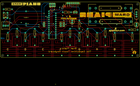
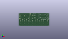
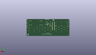
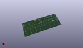

Contents
========

* [PROJ-SPAR-11835-STAN-01>Gram Piano](#proj-spar-11835-stan-01gram-piano)
	* [Images](#images)
	* [Interactive BOM](#interactive-bom)
	* [OOMP Parts](#oomp-parts)
	* [Tags](#tags)
  
![][im]
# PROJ-SPAR-11835-STAN-01>Gram Piano

- ID: PROJ-SPAR-11835-STAN-01
- Hex ID: PRS11835
- Name: Gram Piano
- Description: 

## Images
  
  

|eagleImage|kicadPcb3dFront|kicadPcb3dBack|kicadPcb3d|
| :---: | :---: | :---: | :---: |
|||||

## Interactive BOM

- Interactive BOM page: [ibom.html](kicad/bom/ibom.html)

## OOMP Parts
  

|OOMP Parts|
| :---: |
|UNMATCHED-UNMATCHED-X-UNMATCHED-01, BAT1, 134.61999999999998, 60.959999999999994, 180,BAT1, BATTERY-AA-KIT, SparkFun-Electromechanical, (5.3, 2.4), R180|
|UNMATCHED-UNMATCHED-X-UNMATCHED-01, BAT2, 134.61999999999998, 44.449999999999996, 0,BAT2, BATTERY-AA-KIT, SparkFun-Electromechanical, (5.3, 1.75), R0|
|CAPE-UNMATCHED-X-NF100-01, C1, 73.66, 40.64, 270,C1, 0.1uF, CAP-PTH-SMALL-KIT, SparkFun-Capacitors, (2.9, 1.6), R270|
|CAPE-UNMATCHED-X-NF100-01, C2, 91.44, 55.88, 180,C2, 0.1uF, CAP-PTH-SMALL-KIT, SparkFun-Capacitors, (3.6, 2.2), R180|
|CAPE-UNMATCHED-X-NF100-01, C3, 53.339999999999996, 40.513, 90,C3, 0.1uF, CAP-PTH-SMALL-KIT, SparkFun-Capacitors, (2.1, 1.595), R90|
|CAPE-UNMATCHED-X-NF100-01, C10, 77.46999999999998, 40.64, 90,C10, 0.1uF, CAP-PTH-SMALL-KIT, SparkFun-Capacitors, (3.05, 1.6), R90|
|UNMATCHED-UNMATCHED-X-UNMATCHED-01, J1, 60.959999999999994, 63.5, 0,J1, AVR_SPI_PRG_6PTH, 2X3, SparkFun-Connectors, (2.4, 2.5), R0|
|UNMATCHED-UNMATCHED-X-UNMATCHED-01, JP1, 78.74, 63.5, 0,JP1, SJ_2S-NO, SparkFun-Passives, (3.1, 2.5), R0|
|UNMATCHED-UNMATCHED-X-UNMATCHED-01, JP9, 94.83800006199999, 67.118999874, 180,JP9, Program, 1X06-KIT, SparkFun-Connectors, (3.73377953, 2.64248031), R180|
|UNMATCHED-UNMATCHED-X-UNMATCHED-01, LED1, 87.63, 44.449999999999996, 270,LED1, Red, LED5MM-KIT, SparkFun-LED, (3.45, 1.75), R270|
|UNMATCHED-UNMATCHED-X-UNMATCHED-01, LED2, 166.36999999999998, 40.64, 270,LED2, Red, LED5MM-KIT, SparkFun-LED, (6.55, 1.6), R270|
|RESE-UNMATCHED-X-UNMATCHED-01, R1, 8.889999999999999, 25.4, 270,R1, 2M, AXIAL-0.4, SparkFun-Resistors, (0.35, 1), R270|
|RESE-UNMATCHED-X-O103-01, R2, 81.28, 55.88, 180,R2, 10K, AXIAL-0.4, SparkFun-Resistors, (3.2, 2.2), R180|
|RESE-UNMATCHED-X-UNMATCHED-01, R3, 30.479999999999997, 25.4, 270,R3, 2M, AXIAL-0.4, SparkFun-Resistors, (1.2, 1), R270|
|RESE-UNMATCHED-X-UNMATCHED-01, R4, 20.32, 30.479999999999997, 270,R4, 2M, AXIAL-0.4, SparkFun-Resistors, (0.8, 1.2), R270|
|RESE-UNMATCHED-X-UNMATCHED-01, R5, 41.91, 30.479999999999997, 270,R5, 2M, AXIAL-0.4, SparkFun-Resistors, (1.65, 1.2), R270|
|RESE-UNMATCHED-X-UNMATCHED-01, R6, 74.93, 25.4, 270,R6, 2M, AXIAL-0.4, SparkFun-Resistors, (2.95, 1), R270|
|RESE-UNMATCHED-X-UNMATCHED-01, R7, 128.26999999999998, 30.479999999999997, 270,R7, 2M, AXIAL-0.4, SparkFun-Resistors, (5.05, 1.2), R270|
|RESE-UNMATCHED-X-UNMATCHED-01, R8, 139.7, 25.4, 270,R8, 2M, AXIAL-0.4, SparkFun-Resistors, (5.5, 1), R270|
|RESE-UNMATCHED-X-UNMATCHED-01, R9, 161.29, 25.4, 270,R9, 2M, AXIAL-0.4, SparkFun-Resistors, (6.35, 1), R270|
|RESE-UNMATCHED-X-O331-01, R10, 96.52, 40.64, 270,R10, 330, AXIAL-0.4, SparkFun-Resistors, (3.8, 1.6), R270|
|RESE-UNMATCHED-X-UNMATCHED-01, R11, 6.35, 39.37, 0,R11, TRIMPOT-PTH-KNOB, 3386U, SparkFun-Electromechanical, (0.25, 1.55), R0|
|RESE-UNMATCHED-X-O331-01, R12, 162.56, 34.29, 0,R12, 330, AXIAL-0.4, SparkFun-Resistors, (6.4, 1.35), R0|
|RESE-UNMATCHED-X-O103-01, R14, 8.889999999999999, 59.69, 0,R14, 10K, AXIAL-0.4, SparkFun-Resistors, (0.35, 2.35), R0|
|RESE-UNMATCHED-X-UNMATCHED-01, R17, 52.06999999999999, 25.4, 270,R17, 2M, AXIAL-0.4, SparkFun-Resistors, (2.05, 1), R270|
|RESE-UNMATCHED-X-UNMATCHED-01, R18, 85.09, 30.479999999999997, 270,R18, 2M, AXIAL-0.4, SparkFun-Resistors, (3.35, 1.2), R270|
|RESE-UNMATCHED-X-UNMATCHED-01, R19, 96.52, 25.4, 270,R19, 2M, AXIAL-0.4, SparkFun-Resistors, (3.8, 1), R270|
|RESE-UNMATCHED-X-UNMATCHED-01, R20, 118.11, 25.4, 270,R20, 2M, AXIAL-0.4, SparkFun-Resistors, (4.65, 1), R270|
|RESE-UNMATCHED-X-UNMATCHED-01, R21, 106.67999999999999, 30.479999999999997, 270,R21, 2M, AXIAL-0.4, SparkFun-Resistors, (4.2, 1.2), R270|
|UNMATCHED-UNMATCHED-X-UNMATCHED-01, S1, 166.36999999999998, 53.339999999999996, 0,S1, SWITCH-SPDT_KIT, SparkFun-Electromechanical, (6.55, 2.1), R0|
|UNMATCHED-UNMATCHED-X-UNMATCHED-01, S2, 6.35, 52.06999999999999, 90,S2, TACTILE-PTH, SparkFun-Electromechanical, (0.25, 2.05), R90|
|UNMATCHED-UNMATCHED-X-UNMATCHED-01, SP1, 31.369, 49.403, 90,SP1, SPEAKERPCB_MOUNT, PCB_MOUNT_SPEAKER, SparkFun-Electromechanical, (1.235, 1.945), R90|
|UNMATCHED-UNMATCHED-X-UNMATCHED-01, U3, 63.5, 40.64, 270,U3, ATMEGA328P_PDIP_EZ, DIL28-EZ, SparkFun-DigitalIC, (2.5, 1.6), R270|

## Tags

- hexID: PRS11835
- oompType: PROJ
- oompSize: SPAR
- oompColor: 11835
- oompDesc: STAN
- oompIndex: 01
- oompName: Gram Piano
- sources: All source files from https://github.com/sparkfun/Gram_Piano (source licence details in srcLicense.md)
- linkBuyPage: https://www.sparkfun.com/products/11835
- oompPart: UNMATCHED-UNMATCHED-X-UNMATCHED-01, BAT1, 134.61999999999998, 60.959999999999994, 180
- oompPart: UNMATCHED-UNMATCHED-X-UNMATCHED-01, BAT2, 134.61999999999998, 44.449999999999996, 0
- oompPart: CAPE-UNMATCHED-X-NF100-01, C1, 73.66, 40.64, 270
- oompPart: CAPE-UNMATCHED-X-NF100-01, C2, 91.44, 55.88, 180
- oompPart: CAPE-UNMATCHED-X-NF100-01, C3, 53.339999999999996, 40.513, 90
- oompPart: CAPE-UNMATCHED-X-NF100-01, C10, 77.46999999999998, 40.64, 90
- oompPart: UNMATCHED-UNMATCHED-X-UNMATCHED-01, J1, 60.959999999999994, 63.5, 0
- oompPart: UNMATCHED-UNMATCHED-X-UNMATCHED-01, JP1, 78.74, 63.5, 0
- oompPart: UNMATCHED-UNMATCHED-X-UNMATCHED-01, JP9, 94.83800006199999, 67.118999874, 180
- oompPart: UNMATCHED-UNMATCHED-X-UNMATCHED-01, LED1, 87.63, 44.449999999999996, 270
- oompPart: UNMATCHED-UNMATCHED-X-UNMATCHED-01, LED2, 166.36999999999998, 40.64, 270
- oompPart: RESE-UNMATCHED-X-UNMATCHED-01, R1, 8.889999999999999, 25.4, 270
- oompPart: RESE-UNMATCHED-X-O103-01, R2, 81.28, 55.88, 180
- oompPart: RESE-UNMATCHED-X-UNMATCHED-01, R3, 30.479999999999997, 25.4, 270
- oompPart: RESE-UNMATCHED-X-UNMATCHED-01, R4, 20.32, 30.479999999999997, 270
- oompPart: RESE-UNMATCHED-X-UNMATCHED-01, R5, 41.91, 30.479999999999997, 270
- oompPart: RESE-UNMATCHED-X-UNMATCHED-01, R6, 74.93, 25.4, 270
- oompPart: RESE-UNMATCHED-X-UNMATCHED-01, R7, 128.26999999999998, 30.479999999999997, 270
- oompPart: RESE-UNMATCHED-X-UNMATCHED-01, R8, 139.7, 25.4, 270
- oompPart: RESE-UNMATCHED-X-UNMATCHED-01, R9, 161.29, 25.4, 270
- oompPart: RESE-UNMATCHED-X-O331-01, R10, 96.52, 40.64, 270
- oompPart: RESE-UNMATCHED-X-UNMATCHED-01, R11, 6.35, 39.37, 0
- oompPart: RESE-UNMATCHED-X-O331-01, R12, 162.56, 34.29, 0
- oompPart: RESE-UNMATCHED-X-O103-01, R14, 8.889999999999999, 59.69, 0
- oompPart: RESE-UNMATCHED-X-UNMATCHED-01, R17, 52.06999999999999, 25.4, 270
- oompPart: RESE-UNMATCHED-X-UNMATCHED-01, R18, 85.09, 30.479999999999997, 270
- oompPart: RESE-UNMATCHED-X-UNMATCHED-01, R19, 96.52, 25.4, 270
- oompPart: RESE-UNMATCHED-X-UNMATCHED-01, R20, 118.11, 25.4, 270
- oompPart: RESE-UNMATCHED-X-UNMATCHED-01, R21, 106.67999999999999, 30.479999999999997, 270
- oompPart: UNMATCHED-UNMATCHED-X-UNMATCHED-01, S1, 166.36999999999998, 53.339999999999996, 0
- oompPart: UNMATCHED-UNMATCHED-X-UNMATCHED-01, S2, 6.35, 52.06999999999999, 90
- oompPart: UNMATCHED-UNMATCHED-X-UNMATCHED-01, SP1, 31.369, 49.403, 90
- oompPart: UNMATCHED-UNMATCHED-X-UNMATCHED-01, U3, 63.5, 40.64, 270
- rawPart: BAT1, BATTERY-AA-KIT, SparkFun-Electromechanical, (5.3, 2.4), R180
- rawPart: BAT2, BATTERY-AA-KIT, SparkFun-Electromechanical, (5.3, 1.75), R0
- rawPart: C1, 0.1uF, CAP-PTH-SMALL-KIT, SparkFun-Capacitors, (2.9, 1.6), R270
- rawPart: C2, 0.1uF, CAP-PTH-SMALL-KIT, SparkFun-Capacitors, (3.6, 2.2), R180
- rawPart: C3, 0.1uF, CAP-PTH-SMALL-KIT, SparkFun-Capacitors, (2.1, 1.595), R90
- rawPart: C10, 0.1uF, CAP-PTH-SMALL-KIT, SparkFun-Capacitors, (3.05, 1.6), R90
- rawPart: J1, AVR_SPI_PRG_6PTH, 2X3, SparkFun-Connectors, (2.4, 2.5), R0
- rawPart: JP1, SJ_2S-NO, SparkFun-Passives, (3.1, 2.5), R0
- rawPart: JP9, Program, 1X06-KIT, SparkFun-Connectors, (3.73377953, 2.64248031), R180
- rawPart: LED1, Red, LED5MM-KIT, SparkFun-LED, (3.45, 1.75), R270
- rawPart: LED2, Red, LED5MM-KIT, SparkFun-LED, (6.55, 1.6), R270
- rawPart: R1, 2M, AXIAL-0.4, SparkFun-Resistors, (0.35, 1), R270
- rawPart: R2, 10K, AXIAL-0.4, SparkFun-Resistors, (3.2, 2.2), R180
- rawPart: R3, 2M, AXIAL-0.4, SparkFun-Resistors, (1.2, 1), R270
- rawPart: R4, 2M, AXIAL-0.4, SparkFun-Resistors, (0.8, 1.2), R270
- rawPart: R5, 2M, AXIAL-0.4, SparkFun-Resistors, (1.65, 1.2), R270
- rawPart: R6, 2M, AXIAL-0.4, SparkFun-Resistors, (2.95, 1), R270
- rawPart: R7, 2M, AXIAL-0.4, SparkFun-Resistors, (5.05, 1.2), R270
- rawPart: R8, 2M, AXIAL-0.4, SparkFun-Resistors, (5.5, 1), R270
- rawPart: R9, 2M, AXIAL-0.4, SparkFun-Resistors, (6.35, 1), R270
- rawPart: R10, 330, AXIAL-0.4, SparkFun-Resistors, (3.8, 1.6), R270
- rawPart: R11, TRIMPOT-PTH-KNOB, 3386U, SparkFun-Electromechanical, (0.25, 1.55), R0
- rawPart: R12, 330, AXIAL-0.4, SparkFun-Resistors, (6.4, 1.35), R0
- rawPart: R14, 10K, AXIAL-0.4, SparkFun-Resistors, (0.35, 2.35), R0
- rawPart: R17, 2M, AXIAL-0.4, SparkFun-Resistors, (2.05, 1), R270
- rawPart: R18, 2M, AXIAL-0.4, SparkFun-Resistors, (3.35, 1.2), R270
- rawPart: R19, 2M, AXIAL-0.4, SparkFun-Resistors, (3.8, 1), R270
- rawPart: R20, 2M, AXIAL-0.4, SparkFun-Resistors, (4.65, 1), R270
- rawPart: R21, 2M, AXIAL-0.4, SparkFun-Resistors, (4.2, 1.2), R270
- rawPart: S1, SWITCH-SPDT_KIT, SparkFun-Electromechanical, (6.55, 2.1), R0
- rawPart: S2, TACTILE-PTH, SparkFun-Electromechanical, (0.25, 2.05), R90
- rawPart: SP1, SPEAKERPCB_MOUNT, PCB_MOUNT_SPEAKER, SparkFun-Electromechanical, (1.235, 1.945), R90
- rawPart: U3, ATMEGA328P_PDIP_EZ, DIL28-EZ, SparkFun-DigitalIC, (2.5, 1.6), R270

[im]: kicadPcb3d_450.png
