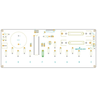
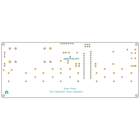
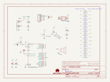
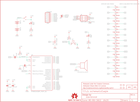
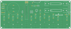
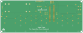

Contents
========

* [PRS11835 > Gram Piano](#prs11835--gram-piano)
	* [Schematic](#schematic)
	* [PCB](#pcb)
	* [Interactive BOM](#interactive-bom)
	* [OOMP Parts](#oomp-parts)
	* [Images](#images)
	* [Tags](#tags)
  
![][im]
# PRS11835 > Gram Piano

- ID: PROJ-SPAR-11835-STAN-01
- Hex ID: PRS11835
- Name: Sparkfun
- Description: Sparkfun
- Long Link: [http://oom.lt/PROJ-SPAR-11835-STAN-01](http://oom.lt/PROJ-SPAR-11835-STAN-01)
- Short Link: [http://oom.lt/PRS11835](http://oom.lt/PRS11835)

## Schematic
  

## PCB
  

## Interactive BOM

- Interactive BOM page: [ibom.html](https://htmlpreview.github.io/?https://github.com/oomlout/oomlout_OOMP_projects/blob/main/PROJ-SPAR-11835-STAN-01/kicad/bom/ibom.html)

## OOMP Parts
  

|OOMP ID|Name|Identifier|
| :---: | :---: | :---: |
|UNMATCHED-UNMATCHED-X-UNMATCHED-01||BAT1, BAT2, J1, JP1, S1, S2, SP1, U3|
|CAPX-UNMATCHED-X-NF100-01||C1, C2, C3, C10|
|[HEAD-I01-X-PI06-01](https://github.com/oomlout/oomlout_OOMP_parts/tree/main/HEAD-I01-X-PI06-01/)|[2.54 mm 6 Pin Header](https://github.com/oomlout/oomlout_OOMP_parts/tree/main/HEAD-I01-X-PI06-01/)|[JP9](https://github.com/oomlout/oomlout_OOMP_parts/tree/main/HEAD-I01-X-PI06-01/)|
|LEDS-UNMATCHED-R-STAN-01||LED1, LED2|
|RESE-UNMATCHED-X-O205-01||R1, R3, R4, R5, R6, R7, R8, R9, R17, R18, R19, R20, R21|
|RESE-UNMATCHED-X-O103-01||R2, R14|
|RESE-UNMATCHED-X-O331-01||R10, R12|
|RESE-UNMATCHED-X-UNMATCHED-01||R11|

## Images
  
  

|bominteractivefront|bominteractiveback|kicadPcb3d|kicadPcb3dFront|kicadPcb3dBack|kicadSchem|eagleImage|eagleSchemImage|pcbdraw|pcbdrawback|
| :---: | :---: | :---: | :---: | :---: | :---: | :---: | :---: | :---: | :---: |
|||||||||||

## Tags

- hexID: PRS11835
- oompType: PROJ
- oompSize: SPAR
- oompColor: 11835
- oompDesc: STAN
- oompIndex: 01
- oompName: Gram Piano
- sources: All source files from https://github.com/sparkfun/Gram_Piano (source licence details in srcLicense.md)
- linkBuyPage: https://www.sparkfun.com/products/11835
- oompID: PROJ-SPAR-11835-STAN-01
- oompParts: BAT1,UNMATCHED-UNMATCHED-X-UNMATCHED-01
- oompParts: BAT2,UNMATCHED-UNMATCHED-X-UNMATCHED-01
- oompParts: C1,CAPX-UNMATCHED-X-NF100-01
- oompParts: C2,CAPX-UNMATCHED-X-NF100-01
- oompParts: C3,CAPX-UNMATCHED-X-NF100-01
- oompParts: C10,CAPX-UNMATCHED-X-NF100-01
- oompParts: J1,UNMATCHED-UNMATCHED-X-UNMATCHED-01
- oompParts: JP1,UNMATCHED-UNMATCHED-X-UNMATCHED-01
- oompParts: JP9,HEAD-I01-X-PI06-01
- oompParts: LED1,LEDS-UNMATCHED-R-STAN-01
- oompParts: LED2,LEDS-UNMATCHED-R-STAN-01
- oompParts: R1,RESE-UNMATCHED-X-O205-01
- oompParts: R2,RESE-UNMATCHED-X-O103-01
- oompParts: R3,RESE-UNMATCHED-X-O205-01
- oompParts: R4,RESE-UNMATCHED-X-O205-01
- oompParts: R5,RESE-UNMATCHED-X-O205-01
- oompParts: R6,RESE-UNMATCHED-X-O205-01
- oompParts: R7,RESE-UNMATCHED-X-O205-01
- oompParts: R8,RESE-UNMATCHED-X-O205-01
- oompParts: R9,RESE-UNMATCHED-X-O205-01
- oompParts: R10,RESE-UNMATCHED-X-O331-01
- oompParts: R11,RESE-UNMATCHED-X-UNMATCHED-01
- oompParts: R12,RESE-UNMATCHED-X-O331-01
- oompParts: R14,RESE-UNMATCHED-X-O103-01
- oompParts: R17,RESE-UNMATCHED-X-O205-01
- oompParts: R18,RESE-UNMATCHED-X-O205-01
- oompParts: R19,RESE-UNMATCHED-X-O205-01
- oompParts: R20,RESE-UNMATCHED-X-O205-01
- oompParts: R21,RESE-UNMATCHED-X-O205-01
- oompParts: S1,UNMATCHED-UNMATCHED-X-UNMATCHED-01
- oompParts: S2,UNMATCHED-UNMATCHED-X-UNMATCHED-01
- oompParts: SP1,UNMATCHED-UNMATCHED-X-UNMATCHED-01
- oompParts: U3,UNMATCHED-UNMATCHED-X-UNMATCHED-01
- rawParts: BAT1,,BATTERYAA-KIT,BATTERY-AA-KIT,Battery Holders,,,,,
- rawParts: BAT2,,BATTERYAA-KIT,BATTERY-AA-KIT,Battery Holders,,,,,
- rawParts: C1,0.1uF,CAPKIT,CAP-PTH-SMALL-KIT,Capacitor,,,,,
- rawParts: C2,0.1uF,CAPKIT,CAP-PTH-SMALL-KIT,Capacitor,,,,,
- rawParts: C3,0.1uF,CAPKIT,CAP-PTH-SMALL-KIT,Capacitor,,,,,
- rawParts: C10,0.1uF,CAPKIT,CAP-PTH-SMALL-KIT,Capacitor,,,,,
- rawParts: FRAME2,FRAME-LETTER,FRAME-LETTER,CREATIVE_COMMONS,Schematic Frame,,,,,
- rawParts: J1,AVR_SPI_PRG_6PTH,AVR_SPI_PRG_6PTH,2X3,AVR ISP 6 Pin,,,,,
- rawParts: JP1,,JUMPER-2SMD-NO,SJ_2S-NO,Jumper,,,,,
- rawParts: JP9,Program,ARDUINO_SERIAL_PROGRAMPTH-KIT,1X06-KIT,FTDI connector footprints,,,,,
- rawParts: LED1,Red,LED5MM-KIT,LED5MM-KIT,LEDs,,,,,
- rawParts: LED2,Red,LED5MM-KIT,LED5MM-KIT,LEDs,,,,,
- rawParts: LOGO1,LOGO-SFENEW,LOGO-SFENEW,SFE-NEW-WEBLOGO,Spark Fun Electronics PCB Logo,,,,,
- rawParts: LOGO2,LOGO-SFENEW,LOGO-SFENEW,SFE-NEW-WEBLOGO,Spark Fun Electronics PCB Logo,,,,,
- rawParts: LOGO3,OSHW-LOGOM,OSHW-LOGOM,OSHW-LOGO-M,Open Source Hardware Logo This logo indicates the piece of hardware it is found on incorporates a OSHW license and/or adheres to the definition of open source hardware found here: http://freedomdefined.org/OSHW,,,,,
- rawParts: R1,2M,RESISTORPTH-1/4W,AXIAL-0.4,Resistor,,,,,
- rawParts: R2,10K,RESISTORPTH-1/4W,AXIAL-0.4,Resistor,,,,,
- rawParts: R3,2M,RESISTORPTH-1/4W,AXIAL-0.4,Resistor,,,,,
- rawParts: R4,2M,RESISTORPTH-1/4W,AXIAL-0.4,Resistor,,,,,
- rawParts: R5,2M,RESISTORPTH-1/4W,AXIAL-0.4,Resistor,,,,,
- rawParts: R6,2M,RESISTORPTH-1/4W,AXIAL-0.4,Resistor,,,,,
- rawParts: R7,2M,RESISTORPTH-1/4W,AXIAL-0.4,Resistor,,,,,
- rawParts: R8,2M,RESISTORPTH-1/4W,AXIAL-0.4,Resistor,,,,,
- rawParts: R9,2M,RESISTORPTH-1/4W,AXIAL-0.4,Resistor,,,,,
- rawParts: R10,330,RESISTORPTH-1/4W,AXIAL-0.4,Resistor,,,,,
- rawParts: R11,TRIMPOT-PTH-KNOB,TRIMPOT-PTH-KNOB,3386U,Various small potentiometers for set-and-forget applications,,,,,
- rawParts: R12,330,RESISTORPTH-1/4W,AXIAL-0.4,Resistor,,,,,
- rawParts: R14,10K,RESISTORPTH-1/4W,AXIAL-0.4,Resistor,,,,,
- rawParts: R17,2M,RESISTORPTH-1/4W,AXIAL-0.4,Resistor,,,,,
- rawParts: R18,2M,RESISTORPTH-1/4W,AXIAL-0.4,Resistor,,,,,
- rawParts: R19,2M,RESISTORPTH-1/4W,AXIAL-0.4,Resistor,,,,,
- rawParts: R20,2M,RESISTORPTH-1/4W,AXIAL-0.4,Resistor,,,,,
- rawParts: R21,2M,RESISTORPTH-1/4W,AXIAL-0.4,Resistor,,,,,
- rawParts: S1,,SWITCH-SPDTKIT,SWITCH-SPDT_KIT,SPDT Switch,,,,,
- rawParts: S2,,TAC_SWITCHPTH,TACTILE-PTH,Momentary Switch,,,,,
- rawParts: SP1,SPEAKERPCB_MOUNT,SPEAKERPCB_MOUNT,PCB_MOUNT_SPEAKER,General speakers.,SANCO,NA,COM-11089,6504,
- rawParts: STANDOFF1,STAND-OFF,STAND-OFF,STAND-OFF,#4 Stand Off,,,,,
- rawParts: STANDOFF2,STAND-OFF,STAND-OFF,STAND-OFF,#4 Stand Off,,,,,
- rawParts: STANDOFF3,STAND-OFF,STAND-OFF,STAND-OFF,#4 Stand Off,,,,,
- rawParts: STANDOFF4,STAND-OFF,STAND-OFF,STAND-OFF,#4 Stand Off,,,,,
- rawParts: U3,ATMEGA328P_PDIP_EZ,ATMEGA328P_PDIP_EZ,DIL28-EZ,uC used in the Arduino,,,,,

[im]: kicadPcb3d_450.png
