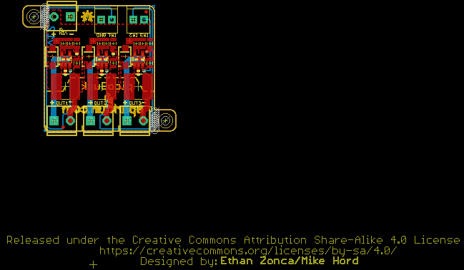
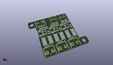
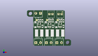
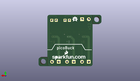
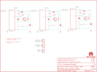

Contents
========

* [PRS11850 > PicoBuck](#prs11850--picobuck)
	* [Schematic](#schematic)
	* [PCB](#pcb)
	* [Interactive BOM](#interactive-bom)
	* [OOMP Parts](#oomp-parts)
	* [Images](#images)
	* [Tags](#tags)
  
![][im]
# PRS11850 > PicoBuck

- ID: PROJ-SPAR-11850-STAN-01
- Hex ID: PRS11850
- Name: Sparkfun
- Description: Sparkfun
- Long Link: [http://oom.lt/PROJ-SPAR-11850-STAN-01](http://oom.lt/PROJ-SPAR-11850-STAN-01)
- Short Link: [http://oom.lt/PRS11850](http://oom.lt/PRS11850)

## Schematic
  

## PCB
  

## Interactive BOM

- Interactive BOM page: [ibom.html](https://htmlpreview.github.io/?https://github.com/oomlout/oomlout_OOMP_projects/blob/main/PROJ-SPAR-11850-STAN-01/kicad/bom/ibom.html)

## OOMP Parts
  

|OOMP Parts|
| :---: |
|[CAPC-0805-X-UF1-V25  SMD (0805) 1 uF Capacitor (Ceramic) 25v  C1, C3, C5](https://github.com/oomlout/oomlout_OOMP_parts/tree/main/CAPC-0805-X-UF1-V25/)|
|[CAPC-0805-X-UF22D-V25  SMD (0805) 2.2 uF Capacitor (Ceramic) 25v  C2, C4, C6](https://github.com/oomlout/oomlout_OOMP_parts/tree/main/CAPC-0805-X-UF22D-V25/)|
|[TERS-35D-L-PI02-01  3.5 mm 2 Pin Blue Screw Terminal  CH1, CH2, CH3, JP2](https://github.com/oomlout/oomlout_OOMP_parts/tree/main/TERS-35D-L-PI02-01/)|
|DIOD-UNMATCHED-X-UNMATCHED-01 D1, D2, D3|
|[HEAD-I01-X-PI02-01  2.54 mm 2 Pin Header  JP3, JP4](https://github.com/oomlout/oomlout_OOMP_parts/tree/main/HEAD-I01-X-PI02-01/)|
|UNMATCHED-UNMATCHED-X-UNMATCHED-01 L1, L2, L3|
|RESE-0805-X-UNMATCHED-01 R1, R2, R3, R4, R5, R6|
|UNMATCHED-SO235-X-UNMATCHED-01 U1, U2, U3|

## Images
  
  

|kicadPcb3d|kicadPcb3dFront|kicadPcb3dBack|eagleImage|eagleSchemImage|
| :---: | :---: | :---: | :---: | :---: |
||||||

## Tags

- hexID: PRS11850
- oompType: PROJ
- oompSize: SPAR
- oompColor: 11850
- oompDesc: STAN
- oompIndex: 01
- oompName: PicoBuck
- sources: All source files from https://github.com/sparkfun/PicoBuck (source licence details in srcLicense.md)
- linkBuyPage: https://www.sparkfun.com/products/11850
- oompID: PROJ-SPAR-11850-STAN-01
- oompParts: C1,CAPC-0805-X-UF1-V25
- oompParts: C2,CAPC-0805-X-UF22D-V25
- oompParts: C3,CAPC-0805-X-UF1-V25
- oompParts: C4,CAPC-0805-X-UF22D-V25
- oompParts: C5,CAPC-0805-X-UF1-V25
- oompParts: C6,CAPC-0805-X-UF22D-V25
- oompParts: CH1,TERS-35D-L-PI02-01
- oompParts: CH2,TERS-35D-L-PI02-01
- oompParts: CH3,TERS-35D-L-PI02-01
- oompParts: D1,DIOD-UNMATCHED-X-UNMATCHED-01
- oompParts: D2,DIOD-UNMATCHED-X-UNMATCHED-01
- oompParts: D3,DIOD-UNMATCHED-X-UNMATCHED-01
- oompParts: JP2,TERS-35D-L-PI02-01
- oompParts: JP3,HEAD-I01-X-PI02-01
- oompParts: JP4,HEAD-I01-X-PI02-01
- oompParts: L1,UNMATCHED-UNMATCHED-X-UNMATCHED-01
- oompParts: L2,UNMATCHED-UNMATCHED-X-UNMATCHED-01
- oompParts: L3,UNMATCHED-UNMATCHED-X-UNMATCHED-01
- oompParts: R1,RESE-0805-X-UNMATCHED-01
- oompParts: R2,RESE-0805-X-UNMATCHED-01
- oompParts: R3,RESE-0805-X-UNMATCHED-01
- oompParts: R4,RESE-0805-X-UNMATCHED-01
- oompParts: R5,RESE-0805-X-UNMATCHED-01
- oompParts: R6,RESE-0805-X-UNMATCHED-01
- oompParts: U1,UNMATCHED-SO235-X-UNMATCHED-01
- oompParts: U2,UNMATCHED-SO235-X-UNMATCHED-01
- oompParts: U3,UNMATCHED-SO235-X-UNMATCHED-01
- rawParts: C1,1uF,1.0UF-25V-+80/-20(0805),0805,,CAP-11625,1.0uF,
- rawParts: C2,2.2uF,2.2UF-25V-+80/-20(0805),0805,,CAP-11624,2.2uF,
- rawParts: C3,1uF,1.0UF-25V-+80/-20(0805),0805,,CAP-11625,1.0uF,
- rawParts: C4,2.2uF,2.2UF-25V-+80/-20(0805),0805,,CAP-11624,2.2uF,
- rawParts: C5,1uF,1.0UF-25V-+80/-20(0805),0805,,CAP-11625,1.0uF,
- rawParts: C6,2.2uF,2.2UF-25V-+80/-20(0805),0805,,CAP-11624,2.2uF,
- rawParts: CH1,,CONN_023.5MM_LOCK,SCREWTERMINAL-3.5MM-2_LOCK,Multi connection point. Often used as Generic Header-pin footprint for 0.1 inch spaced/style header connections,CONN-08399,,
- rawParts: CH2,,CONN_023.5MM_LOCK,SCREWTERMINAL-3.5MM-2_LOCK,Multi connection point. Often used as Generic Header-pin footprint for 0.1 inch spaced/style header connections,CONN-08399,,
- rawParts: CH3,,CONN_023.5MM_LOCK,SCREWTERMINAL-3.5MM-2_LOCK,Multi connection point. Often used as Generic Header-pin footprint for 0.1 inch spaced/style header connections,CONN-08399,,
- rawParts: D1,MBRA140,DIODE-SCHOTTKY-MBRA140,SMA-DIODE,Schottky diodes in SFEs production catalog,DIO-08053,MBRA140,
- rawParts: D2,MBRA140,DIODE-SCHOTTKY-MBRA140,SMA-DIODE,Schottky diodes in SFEs production catalog,DIO-08053,MBRA140,
- rawParts: D3,MBRA140,DIODE-SCHOTTKY-MBRA140,SMA-DIODE,Schottky diodes in SFEs production catalog,DIO-08053,MBRA140,
- rawParts: FID1,FIDUCIALUFIDUCIAL,FIDUCIALUFIDUCIAL,MICRO-FIDUCIAL,Fiducial Alignment Points,,,
- rawParts: FID2,FIDUCIALUFIDUCIAL,FIDUCIALUFIDUCIAL,MICRO-FIDUCIAL,Fiducial Alignment Points,,,
- rawParts: FRAME1,FRAME-LETTER,FRAME-LETTER,CREATIVE_COMMONS,Schematic Frame,,,
- rawParts: JP2,,CONN_023.5MM_LOCK,SCREWTERMINAL-3.5MM-2_LOCK,Multi connection point. Often used as Generic Header-pin footprint for 0.1 inch spaced/style header connections,CONN-08399,,
- rawParts: JP3,M022.54MM_SCREWTERM,M022.54MM_SCREWTERM,1X02_2.54_SCREWTERM@1,Standard 2-pin 0.1 header. Use with,,,
- rawParts: JP4,M022.54MM_SCREWTERM,M022.54MM_SCREWTERM,1X02_2.54_SCREWTERM@1,Standard 2-pin 0.1 header. Use with,,,
- rawParts: L1,33µH/±20%/1.4A,INDUCTOR-SRN6045-33UH,SRN6045,Inductors,NDUC-11627,33µH/±20%/1.4A,
- rawParts: L2,33µH/±20%/1.4A,INDUCTOR-SRN6045-33UH,SRN6045,Inductors,NDUC-11627,33µH/±20%/1.4A,
- rawParts: L3,33µH/±20%/1.4A,INDUCTOR-SRN6045-33UH,SRN6045,Inductors,NDUC-11627,33µH/±20%/1.4A,
- rawParts: LOGO1,OSHW-LOGOS,OSHW-LOGOS,OSHW-LOGO-S,Open Source Hardware Logo This logo indicates the piece of hardware it is found on incorporates a OSHW license and/or adheres to the definition of open source hardware found here: http://freedomdefined.org/OSHW,,,
- rawParts: LOGO2,LOGO-SFENEW,LOGO-SFENEW,SFE-NEW-WEBLOGO,Spark Fun Electronics PCB Logo,,,
- rawParts: R1,0.3R,0.3OHM-1/8W-1%(0805),0805,,RES-11622,0.3,
- rawParts: R2,0.3R,0.3OHM-1/8W-1%(0805),0805,,RES-11622,0.3,
- rawParts: R3,0.3R,0.3OHM-1/8W-1%(0805),0805,,RES-11622,0.3,
- rawParts: R4,0.3R,0.3OHM-1/8W-1%(0805),0805,,RES-11622,0.3,
- rawParts: R5,0.3R,0.3OHM-1/8W-1%(0805),0805,,RES-11622,0.3,
- rawParts: R6,0.3R,0.3OHM-1/8W-1%(0805),0805,,RES-11622,0.3,
- rawParts: SJ1,JUMPER-SMT_2_NO_NO-SILK,JUMPER-SMT_2_NO_NO-SILK,SMT-JUMPER_2_NO_NO-SILK,Normally open jumper,,,
- rawParts: SJ2,JUMPER-SMT_2_NO_NO-SILK,JUMPER-SMT_2_NO_NO-SILK,SMT-JUMPER_2_NO_NO-SILK,Normally open jumper,,,
- rawParts: SJ3,JUMPER-SMT_2_NO_NO-SILK,JUMPER-SMT_2_NO_NO-SILK,SMT-JUMPER_2_NO_NO-SILK,Normally open jumper,,,
- rawParts: STANDOFF1,STAND-OFF,STAND-OFF,STAND-OFF,#4 Stand Off,,,
- rawParts: STANDOFF2,STAND-OFF,STAND-OFF,STAND-OFF,#4 Stand Off,,,
- rawParts: U1,AL8860,AL8860SOT23,SOT23-5,The AL8860 is a buck LED driver thats used on the PicoBuck and FemtoBuck products. Its a replacement for the AL8805 which has gone EOL.,IC-16593,,
- rawParts: U2,AL8860,AL8860SOT23,SOT23-5,The AL8860 is a buck LED driver thats used on the PicoBuck and FemtoBuck products. Its a replacement for the AL8805 which has gone EOL.,IC-16593,,
- rawParts: U3,AL8860,AL8860SOT23,SOT23-5,The AL8860 is a buck LED driver thats used on the PicoBuck and FemtoBuck products. Its a replacement for the AL8805 which has gone EOL.,IC-16593,,

[im]: kicadPcb3d_450.png
